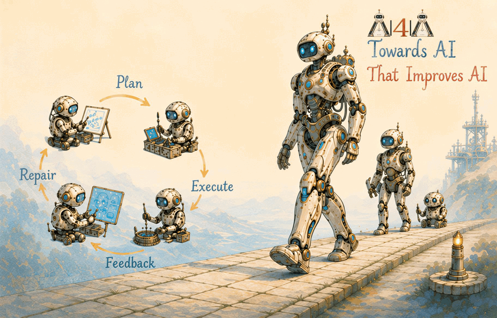
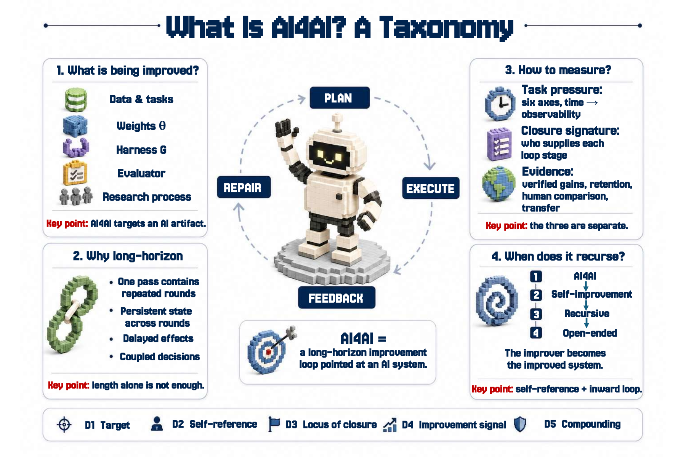
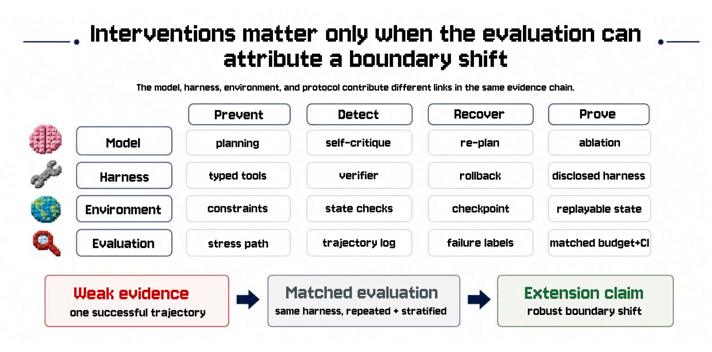
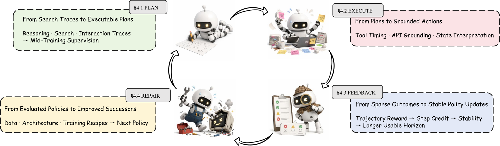
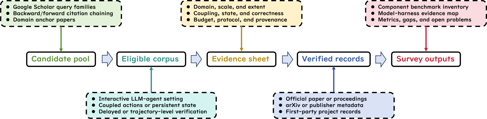

<div align="center">

<p>
  
</p>

<h1>🚀 Awesome AI4AI</h1>

<p><strong><em>AI4AI Survey: From Long-Horizon Agents to Recursive Self-Improvement</em></strong><br>
<sub>Definitions, Reliable Horizons, and Open Problems · 23 authors · 7 institutions</sub></p>

<p>
  Updated weekly with the month's top AI-for-AI papers, news, and blogs. <strong>Stay tuned 🔥</strong>
</p>

<p>
  <a href="assets/AI4AI-Survey.pdf"></a>
  <a href="https://www.preprints.org/manuscript/202608.2108/v1"></a>
  <a href="https://kaiwu5.github.io/Awesome-AI4AI/"></a>
  <a href="https://github.com/simple-agent-lab/RSIHub"></a>
  <a href="https://simpleagentlab.com/ai4ai/"></a>
  <a href="https://doi.org/10.5281/zenodo.22198847"></a>
</p>

</div>

<br>

## Why This Repo

<table>
<tr>
<td width="33%" align="center">
  <strong>🔄 Automatic rankings</strong><br>
  <sub>Citations, GitHub stars, and rankings refresh every Monday.</sub>
</td>
<td width="33%" align="center">
  <strong>🗞️ Weekly update</strong><br>
  <sub>The month's top papers and releases, re-ranked every week against primary sources.</sub>
</td>
<td width="33%" align="center">
  <strong>🧭 Survey-grounded map</strong><br>
  <sub>From long-horizon agents to recursive self-improvement.</sub>
</td>
</tr>
</table>

<p align="center">
  <strong>Star ⭐ to save the map · Watch 👀 for weekly updates · Share 🔁 with your lab</strong>
</p>

## What's New

- 📄 **2026-08-30 — [Companion survey now online.](https://www.preprints.org/manuscript/202608.2108/v1)** Read *AI4AI Survey: From Long-Horizon Agents to Recursive Self-Improvement—Definitions, Reliable Horizons, and Open Problems*.
- 🔄 **Every Monday — Automatic refresh.** Citations, GitHub stars, and recent-paper/yearly rankings update automatically.
- 🚀 **2026-08-30 — Latest weekly edition published.** The living catalog and source-verified news digest are up to date.

<details open markdown="1">
<summary><b>🗂️ Explore the full collection</b></summary>

- [📅 Weekly Update · Monthly Top 10](#-weekly-update--monthly-top-10)
- [📈 Live Rankings](#-live-rankings)
  - [🔥 Recent Papers by Average Monthly Citations](#-recent-papers-by-average-monthly-citations)
  - [🏆 Most-Cited Papers by Year](#-most-cited-papers-by-year)
- [🧪 Benchmarks](#-benchmarks)
- [🛠️ Harness Design](#-harness-design)
- [🧠 Model Design](#-model-design)
- [📚 How We Curate](#-how-we-curate)
- [📄 Citation](#-citation)
- [🤝 Contributing](#-contributing)

</details>

<br>

## 📅 Weekly Update · Monthly Top 10

> **Updated 2026-08-30** · The month's top stories, refreshed every Monday alongside citation rankings.
>
> **How we select:** The top stories from the trailing 30 days, scored on publisher authority, discussion volume, whether a concrete verifiable result is reported, whether it changes what agent builders do now, whether an artifact was released, and expected durability. Only primary sources are cited, and performance claims remain attributed to their publishers.

| Date · Type | News | Why it matters |
|:--|:--|:--|
| 2026‑08‑30<br><sub>Paper</sub> | [**AI4AI Survey: From Long-Horizon Agents to Recursive Self-Improvement—Definitions, Reliable Horizons, and Open Problems**](https://www.preprints.org/manuscript/202608.2108/v1)<br><sub>Preprints.org</sub> | Our companion survey is now publicly available, presenting a unified map from long-horizon agents to recursive self-improvement and organizing the field around benchmarks, harness design, and model-side interventions. |
| 2026‑08‑21<br><sub>Research release</sub> | [**NVIDIA AVO Reaches 100% on ARC-AGI-3, a General-Purpose Architecture for Long-Horizon Autonomous Agents**](https://developer.nvidia.com/blog/nvidia-avo-reaches-100-on-arc-agi-3-demonstrating-a-frontier-level-general-purpose-architecture-for-long-horizon-autonomous-agents/)<br><sub>NVIDIA</sub> | NVIDIA reports its AVO harness scored 100.00 RHAE across all 25 ARC-AGI-3 public environments and 183 levels using about 12 percent fewer actions than VISTA, and cautions that this covers the public set only rather than a controlled ablation. |
| 2026‑08‑20<br><sub>Paper</sub> | [**AI4AI-Bench: Benchmarking LLM Agents in Algorithmic Design for Recursive Self-Improvement**](https://arxiv.org/abs/2608.20318)<br><sub>arXiv</sub> | Agents are given four hours on a single B300 to rewrite training algorithms across ten frozen research repositories, graded by a hidden evaluator. The authors report a mean score of 0.166 across 29 configurations with the best system at 0.250, and note that most submissions never modify the learning procedure itself. |
| 2026‑08‑19<br><sub>Blog</sub> | [**Codex as a Platform: Build on the Open Agent Harness**](https://developers.openai.com/blog/codex-as-a-platform)<br><sub>OpenAI</sub> | OpenAI positions the open-source Codex harness as the reusable layer beneath its app, CLI, and IDE surfaces, and reports that retained reasoning plus context compaction lifted GPT-5.6 Sol on ARC-AGI-3 from 13.3 to 38.3 percent while cutting output tokens sixfold. |
| 2026‑08‑18<br><sub>Paper</sub> | [**Agent Lightning v1.0: Towards Harnessed Agentic RL**](https://arxiv.org/abs/2608.17528)<br><sub>Microsoft Research · arXiv</sub> | The authors name the paradigm of feeding the deploy-time harness into post-training as harnessed agentic RL and release a roughly 3,500-line framework, reporting Qwen3.5-9B improving from 41.8 to 56.4 percent on SWE-bench Verified with 6K examples. |
| 2026‑08‑18<br><sub>Research release</sub> | [**How Claude is Accelerating Protein Design and Analytical Chemistry**](https://www.anthropic.com/research/Claude-accelerates-protein-design)<br><sub>Anthropic</sub> | Anthropic says Claude ran largely autonomous binder-design campaigns from a roughly 30,000-token prompt with no further scientific guidance, producing externally validated binders against 14 of 15 targets at reported hit rates of 22.6 to 35.1 percent against a stated field norm of 10 to 15 percent. |
| 2026‑08‑14<br><sub>Model release</sub> | [**GLM-5.3: Frontier Coding with Emergent Cyber Capabilities**](https://z.ai/blog/glm-5.3)<br><sub>Z.ai</sub> | Z.ai says the unchanged GLM-5.2 base gained stronger long-horizon coding and cyber capabilities entirely through scaled post-training; weights are planned after two weeks of safety hardening. |
| 2026‑08‑13<br><sub>Model update</sub> | [**Introducing Gemini 3.7 Flash**](https://blog.google/innovation-and-ai/models-and-research/gemini-models/introducing-gemini-3-7-flash/)<br><sub>Google</sub> | Google positions 3.7 Flash as its coding-and-agents workhorse, reporting stronger multi-step planning, tool use, software engineering, and business-workflow performance. |
| 2026‑08‑13<br><sub>Model release</sub> | [**DeepSeek-V4-Pro GA Release**](https://api-docs.deepseek.com/news/news260813/)<br><sub>DeepSeek</sub> | DeepSeek's general-availability release emphasizes agent upgrades, low/high/max reasoning effort, native OpenAI Responses API support, and availability across its app, web interface, and API. |
| 2026‑08‑12<br><sub>Model release</sub> | [**Introducing Grok 4.6**](https://x.ai/news/grok-4-6)<br><sub>xAI</sub> | Grok 4.6 targets long-running agents and multi-step coding and knowledge work; xAI reports stronger sustained execution, self-testing, and verification after supplemental training and agentic RL. |

> **Want next month's news?** Watch the repository. Citation counts, rankings, and the month's top stories refresh every Monday. [Browse past editions →](highlights/README.md)

## 📈 Live Rankings

> Citation counts are current through **2026-08-25** from Semantic Scholar and OpenAlex. Rankings are discovery aids, not quality scores; audit evidence remains independent of popularity. GitHub stars are snapshots from **2026-08-25**. For papers indexed as multiple versions, retain the largest title-verified count reported by the configured sources. All yearly rankings use first public appearance year; a later venue year never moves a paper into a newer cohort.

### 🔥 Recent Papers by Average Monthly Citations

| Paper | Venue | Date | Citations | Avg. cites/month | Code |
|:--|:--:|:--:|:--:|:--:|:--:|
| [**AlphaEvolve: A coding agent for scientific and algorithmic discovery**](https://arxiv.org/abs/2506.13131) | arXiv | <nobr>2025-06</nobr> | 777 | **55.5** | — |
| [**Terminal-Bench: Benchmarking Agents on Hard, Realistic Tasks in Command Line Interfaces**](https://arxiv.org/abs/2601.11868) | arXiv | <nobr>2026-01</nobr> | 354 | **50.6** | [GitHub](https://github.com/harbor-framework/terminal-bench-1) · ★ 2,552 |
| [**A-MEM: Agentic Memory for LLM Agents**](https://arxiv.org/abs/2502.12110) | Advances in Neural Information Processing Systems | <nobr>2025-02</nobr> | 906 | **50.3** | [GitHub](https://github.com/WujiangXu/A-mem) · ★ 946 |
| [**Towards End-to-End Automation of AI Research**](https://doi.org/10.1038/s41586-026-10265-5) | Nature 2026 | <nobr>2026-03</nobr> | 211 | **42.2** | [GitHub](https://github.com/SakanaAI/AI-Scientist-v2) · ★ 7,048 |
| [**Mem0: Building Production-Ready AI Agents with Scalable Long-Term Memory**](https://doi.org/10.3233/faia251160) | European Conference on Artificial Intelligence (ECAI) | <nobr>2025-04</nobr> | 567 | **35.4** | [GitHub](https://github.com/mem0ai/mem0) · ★ 64,001 |
| [**Why Do Multi-Agent LLM Systems Fail?**](https://proceedings.neurips.cc/paper_files/paper/2025/hash/b1041e52d3be19f0a9bc491657488e4a-Abstract-Datasets_and_Benchmarks_Track.html) | Advances in Neural Information Processing Systems | <nobr>2025-03</nobr> | 535 | **31.5** | [GitHub](https://github.com/multi-agent-systems-failure-taxonomy/MAST) · ★ 410 |
| [**The Berkeley Function Calling Leaderboard (BFCL): From tool use to agentic evaluation of large language models**](https://proceedings.mlr.press/v267/patil25a.html) | Proceedings of the 42nd International Conference on Machine Learning | <nobr>2025</nobr> | 435 | **31.1** | [GitHub](https://github.com/ShishirPatil/gorilla) · ★ 13,007 |
| [**Memory in the Age of AI Agents**](https://arxiv.org/abs/2512.13564) | arXiv preprint arXiv:2512.13564 | <nobr>2025-12</nobr> | 245 | **30.6** | — |
| [**Meta-Harness: End-to-End Optimization of Model Harnesses**](https://arxiv.org/abs/2603.28052) | arXiv | <nobr>2026-03</nobr> | 141 | **28.2** | [GitHub](https://github.com/stanford-iris-lab/meta-harness-tbench2-artifact) · ★ 1,183 |
| [**Agentic Context Engineering: Evolving Contexts for Self-Improving Language Models**](https://arxiv.org/abs/2510.04618) | arXiv | <nobr>2025-10</nobr> | 266 | **26.6** | [GitHub](https://github.com/ace-agent/ace) · ★ 1,273 |

### 🏆 Most-Cited Papers by Year

<details open markdown="1">
<summary><b>Top 12 of 2026</b> by citations</summary>

| Paper | Date | Citations | Code |
|:--|:--:|:--:|:--:|
| [**Terminal-Bench: Benchmarking Agents on Hard, Realistic Tasks in Command Line Interfaces**](https://arxiv.org/abs/2601.11868)<br><sub>arXiv</sub> | <nobr>2026-01</nobr> | 354 | [GitHub](https://github.com/harbor-framework/terminal-bench-1) · ★ 2,552 |
| [**Towards End-to-End Automation of AI Research**](https://doi.org/10.1038/s41586-026-10265-5)<br><sub>Nature 2026</sub> | <nobr>2026-03</nobr> | 211 | [GitHub](https://github.com/SakanaAI/AI-Scientist-v2) · ★ 7,048 |
| [**Meta-Harness: End-to-End Optimization of Model Harnesses**](https://arxiv.org/abs/2603.28052)<br><sub>arXiv</sub> | <nobr>2026-03</nobr> | 141 | [GitHub](https://github.com/stanford-iris-lab/meta-harness-tbench2-artifact) · ★ 1,183 |
| [**Externalization in LLM Agents: A Unified Review of Memory, Skills, Protocols and Harness Engineering**](https://arxiv.org/abs/2604.08224)<br><sub>arXiv preprint arXiv:2604.08224</sub> | <nobr>2026-04</nobr> | 48 | — |
| [**Hindsight Credit Assignment for Long-Horizon LLM Agents**](https://arxiv.org/abs/2603.08754)<br><sub>arXiv preprint arXiv:2603.08754</sub> | <nobr>2026-03</nobr> | 35 | — |
| [**Natural-Language Agent Harnesses**](https://arxiv.org/abs/2603.25723)<br><sub>arXiv</sub> | <nobr>2026-03</nobr> | 34 | — |
| [**SWE-Pruner: Self-Adaptive Context Pruning for Coding Agents**](https://arxiv.org/abs/2601.16746)<br><sub>arXiv preprint arXiv:2601.16746</sub> | <nobr>2026-01</nobr> | 32 | [GitHub](https://github.com/Ayanami1314/swe-pruner) · ★ 314 |
| [**PostTrainBench: Can LLM Agents Automate LLM Post-Training?**](https://arxiv.org/abs/2603.08640)<br><sub>arXiv</sub> | <nobr>2026-03</nobr> | 29 | [GitHub](https://github.com/aisa-group/PostTrainBench) · ★ 531 |
| [**Dive into Claude Code: The Design Space of Today's and Future AI Agent Systems**](https://arxiv.org/abs/2604.14228)<br><sub>arXiv</sub> | <nobr>2026-04</nobr> | 28 | [GitHub](https://github.com/VILA-Lab/Dive-into-Claude-Code) · ★ 2,078 |
| [**SkillOS: Learning Skill Curation for Self-Evolving Agents**](https://arxiv.org/abs/2605.06614)<br><sub>arXiv</sub> | <nobr>2026-05</nobr> | 27 | — |
| [**FeatureBench: Benchmarking Agentic Coding for Complex Feature Development**](https://arxiv.org/abs/2602.10975)<br><sub>arXiv</sub> | <nobr>2026-02</nobr> | 26 | [GitHub](https://github.com/LiberCoders/FeatureBench) · ★ 87 |
| [**DeepPlanning: Benchmarking Long-Horizon Agentic Planning with Verifiable Constraints**](https://arxiv.org/abs/2601.18137)<br><sub>arXiv preprint arXiv:2601.18137</sub> | <nobr>2026-01</nobr> | 26 | — |

</details>

<details markdown="1">
<summary><b>Top 12 of 2025</b> by citations</summary>

| Paper | Date | Citations | Code |
|:--|:--:|:--:|:--:|
| [**A-MEM: Agentic Memory for LLM Agents**](https://arxiv.org/abs/2502.12110)<br><sub>Advances in Neural Information Processing Systems</sub> | <nobr>2025-02</nobr> | 906 | [GitHub](https://github.com/WujiangXu/A-mem) · ★ 946 |
| [**AlphaEvolve: A coding agent for scientific and algorithmic discovery**](https://arxiv.org/abs/2506.13131)<br><sub>arXiv</sub> | <nobr>2025-06</nobr> | 777 | — |
| [**Mem0: Building Production-Ready AI Agents with Scalable Long-Term Memory**](https://doi.org/10.3233/faia251160)<br><sub>European Conference on Artificial Intelligence (ECAI)</sub> | <nobr>2025-04</nobr> | 567 | [GitHub](https://github.com/mem0ai/mem0) · ★ 64,001 |
| [**Why Do Multi-Agent LLM Systems Fail?**](https://proceedings.neurips.cc/paper_files/paper/2025/hash/b1041e52d3be19f0a9bc491657488e4a-Abstract-Datasets_and_Benchmarks_Track.html)<br><sub>Advances in Neural Information Processing Systems</sub> | <nobr>2025-03</nobr> | 535 | [GitHub](https://github.com/multi-agent-systems-failure-taxonomy/MAST) · ★ 410 |
| [**The Berkeley Function Calling Leaderboard (BFCL): From tool use to agentic evaluation of large language models**](https://proceedings.mlr.press/v267/patil25a.html)<br><sub>Proceedings of the 42nd International Conference on Machine Learning</sub> | <nobr>2025</nobr> | 435 | [GitHub](https://github.com/ShishirPatil/gorilla) · ★ 13,007 |
| [**LLMs Get Lost In Multi-Turn Conversation**](https://arxiv.org/abs/2505.06120)<br><sub>International Conference on Learning Representations</sub> | <nobr>2025-05</nobr> | 398 | [GitHub](https://github.com/microsoft/lost_in_conversation) · ★ 296 |
| [**Group-in-Group Policy Optimization for LLM Agent Training**](https://arxiv.org/abs/2505.10978)<br><sub>Advances in Neural Information Processing Systems</sub> | <nobr>2025-05</nobr> | 375 | [GitHub](https://github.com/langfengQ/verl-agent) · ★ 2,250 |
| [**Agentic Context Engineering: Evolving Contexts for Self-Improving Language Models**](https://arxiv.org/abs/2510.04618)<br><sub>arXiv</sub> | <nobr>2025-10</nobr> | 266 | [GitHub](https://github.com/ace-agent/ace) · ★ 1,273 |
| [**PaperBench: Evaluating AI's ability to replicate AI research**](https://arxiv.org/abs/2504.01848)<br><sub>arXiv</sub> | <nobr>2025-04</nobr> | 249 | [GitHub](https://github.com/openai/frontier-evals) · ★ 1,288 |
| [**Memory in the Age of AI Agents**](https://arxiv.org/abs/2512.13564)<br><sub>arXiv preprint arXiv:2512.13564</sub> | <nobr>2025-12</nobr> | 245 | — |
| [**DeepResearch Bench: A Comprehensive Benchmark for Deep Research Agents**](https://arxiv.org/abs/2506.11763)<br><sub>arXiv preprint arXiv:2506.11763</sub> | <nobr>2025-06</nobr> | 212 | [GitHub](https://github.com/Ayanami0730/deep_research_bench) · ★ 816 |
| [**A Survey on Evaluation of LLM-based Agents**](https://arxiv.org/abs/2503.16416)<br><sub>Findings of the Association for Computational Linguistics: ACL 2026</sub> | <nobr>2025-03</nobr> | 212 | — |

</details>

<details markdown="1">
<summary><b>Top 12 of 2024</b> by citations</summary>

| Paper | Date | Citations | Code |
|:--|:--:|:--:|:--:|
| [**OSWorld: Benchmarking Multimodal Agents for Open-Ended Tasks in Real Computer Environments**](https://arxiv.org/abs/2404.07972)<br><sub>NeurIPS 2024</sub> | <nobr>2024-04</nobr> | 1056 | [GitHub](https://github.com/xlang-ai/OSWorld) · ★ 3,106 |
| [**τ-bench: A Benchmark for Tool-Agent-User Interaction in Real-World Domains**](https://arxiv.org/abs/2406.12045)<br><sub>arXiv</sub> | <nobr>2024-06</nobr> | 1005 | [GitHub](https://github.com/sierra-research/tau-bench) · ★ 1,403 |
| [**Self-rewarding language models**](https://proceedings.mlr.press/v235/yuan24d.html)<br><sub>arXiv</sub> | <nobr>2024-01</nobr> | 691 | — |
| [**Demystifying LLM-Based Software Engineering Agents**](https://doi.org/10.1145/3715754)<br><sub>Proceedings of the ACM on Software Engineering</sub> | <nobr>2024-07</nobr> | 465 | [GitHub](https://github.com/OpenAutoCoder/Agentless) · ★ 2,103 |
| [**TravelPlanner: A Benchmark for Real-World Planning with Language Agents**](https://arxiv.org/abs/2402.01622)<br><sub>International Conference on Machine Learning</sub> | <nobr>2024-02</nobr> | 454 | [GitHub](https://github.com/OSU-NLP-Group/TravelPlanner) · ★ 541 |
| [**WebVoyager: Building an End-to-End Web Agent with Large Multimodal Models**](https://arxiv.org/abs/2401.13919)<br><sub>Proceedings of the 62nd Annual Meeting of the Association for Computational Linguistics (Volume 1: Long Papers)</sub> | <nobr>2024-01</nobr> | 434 | [GitHub](https://github.com/MinorJerry/WebVoyager) · ★ 1,122 |
| [**AndroidWorld: A Dynamic Benchmarking Environment for Autonomous Agents**](https://arxiv.org/abs/2405.14573)<br><sub>International Conference on Learning Representations</sub> | <nobr>2024-05</nobr> | 405 | [GitHub](https://github.com/google-research/android_world) · ★ 857 |
| [**MLE-bench: Evaluating machine learning agents on machine learning engineering**](https://arxiv.org/abs/2410.07095)<br><sub>ICLR 2025</sub> | <nobr>2024-10</nobr> | 360 | [GitHub](https://github.com/openai/mle-bench) · ★ 1,716 |
| [**HippoRAG: Neurobiologically Inspired Long-Term Memory for Large Language Models**](https://arxiv.org/abs/2405.14831)<br><sub>Advances in Neural Information Processing Systems</sub> | <nobr>2024-05</nobr> | 328 | [GitHub](https://github.com/OSU-NLP-Group/HippoRAG) · ★ 3,963 |
| [**When Can LLMs Actually Correct Their Own Mistakes? A Critical Survey of Self-Correction of LLMs**](https://arxiv.org/abs/2406.01297)<br><sub>Transactions of the Association for Computational Linguistics</sub> | <nobr>2024-06</nobr> | 327 | — |
| [**WorkArena: How Capable are Web Agents at Solving Common Knowledge Work Tasks?**](https://proceedings.mlr.press/v235/drouin24a.html)<br><sub>Proceedings of the 41st International Conference on Machine Learning</sub> | <nobr>2024-03</nobr> | 320 | [GitHub](https://github.com/ServiceNow/WorkArena) · ★ 268 |
| [**AppWorld: A Controllable World of Apps and People for Benchmarking Interactive Coding Agents**](https://arxiv.org/abs/2407.18901)<br><sub>ACL 2024</sub> | <nobr>2024-07</nobr> | 286 | [GitHub](https://github.com/StonyBrookNLP/appworld) · ★ 490 |

</details>

<details markdown="1">
<summary><b>Top 12 of 2023</b> by citations</summary>

| Paper | Date | Citations | Code |
|:--|:--:|:--:|:--:|
| [**Generative Agents: Interactive Simulacra of Human Behavior**](https://arxiv.org/abs/2304.03442)<br><sub>Proceedings of the 36th annual acm symposium on user interface software and technology</sub> | <nobr>2023-04</nobr> | 5257 | [GitHub](https://github.com/joonspk-research/generative_agents) · ★ 21,984 |
| [**Toolformer: Language Models Can Teach Themselves to Use Tools**](https://arxiv.org/abs/2302.04761)<br><sub>Advances in Neural Information Processing Systems</sub> | <nobr>2023-02</nobr> | 5241 | — |
| [**Reflexion: language agents with verbal reinforcement learning**](https://arxiv.org/abs/2303.11366)<br><sub>NeurIPS 2023</sub> | <nobr>2023-03</nobr> | 4917 | [GitHub](https://github.com/noahshinn/reflexion) · ★ 3,241 |
| [**Tree of Thoughts: Deliberate Problem Solving with Large Language Models**](https://arxiv.org/abs/2305.10601)<br><sub>Advances in Neural Information Processing Systems</sub> | <nobr>2023-05</nobr> | 4728 | [GitHub](https://github.com/princeton-nlp/tree-of-thought-llm) · ★ 6,053 |
| [**Self-Refine: Iterative refinement with self-feedback**](https://arxiv.org/abs/2303.17651)<br><sub>NeurIPS 2023</sub> | <nobr>2023-03</nobr> | 4416 | [GitHub](https://github.com/madaan/self-refine) · ★ 818 |
| [**SWE-bench: Can Language Models Resolve Real-World GitHub Issues?**](https://arxiv.org/abs/2310.06770)<br><sub>ICLR 2024</sub> | <nobr>2023-10</nobr> | 3453 | [GitHub](https://github.com/SWE-bench/SWE-bench) · ★ 5,705 |
| [**Voyager: An Open-Ended Embodied Agent with Large Language Models**](https://arxiv.org/abs/2305.16291)<br><sub>Transactions on Machine Learning Research</sub> | <nobr>2023-05</nobr> | 2175 | [GitHub](https://github.com/MineDojo/Voyager) · ★ 7,157 |
| [**ToolLLM: Facilitating Large Language Models to Master 16000+ Real-world APIs**](https://arxiv.org/abs/2307.16789)<br><sub>International Conference on Learning Representations</sub> | <nobr>2023-07</nobr> | 2090 | [GitHub](https://github.com/OpenBMB/ToolBench) · ★ 5,734 |
| [**WebArena: A Realistic Web Environment for Building Autonomous Agents**](https://arxiv.org/abs/2307.13854)<br><sub>ICLR 2024</sub> | <nobr>2023-07</nobr> | 1858 | [GitHub](https://github.com/web-arena-x/webarena) · ★ 1,587 |
| [**Gorilla: Large Language Model Connected with Massive APIs**](https://arxiv.org/abs/2305.15334)<br><sub>Advances in Neural Information Processing Systems</sub> | <nobr>2023-05</nobr> | 1537 | [GitHub](https://github.com/ShishirPatil/gorilla) · ★ 13,007 |
| [**Mind2Web: Towards a Generalist Agent for the Web**](https://arxiv.org/abs/2306.06070)<br><sub>Advances in Neural Information Processing Systems</sub> | <nobr>2023-06</nobr> | 1370 | [GitHub](https://github.com/OSU-NLP-Group/Mind2Web) · ★ 1,021 |
| [**AgentBench: Evaluating LLMs as Agents**](https://arxiv.org/abs/2308.03688)<br><sub>International Conference on Learning Representations</sub> | <nobr>2023-08</nobr> | 1185 | [GitHub](https://github.com/THUDM/AgentBench) · ★ 3,691 |

</details>


## 🧪 Benchmarks

<p align="center">
  
</p>

> **111 papers** · Survey-curated collection, newest first. Cross-collection papers may appear in more than one section.

| Paper | Date | Citations | Code |
|:--|:--:|:--:|:--:|
| [**SWE-Bench ProMax: Benchmarking Agents on Large-Scale Multilingual Code Refactoring**](https://arxiv.org/abs/2608.09802)<br><sub>arXiv</sub> | <nobr>2026-08</nobr> | 3 | — |
| [**HarnessOpt-Bench: Evaluating LLMs at Harness Optimization**](https://arxiv.org/abs/2608.06301)<br><sub>arXiv preprint arXiv:2608.06301</sub> | <nobr>2026-08</nobr> | 0 | — |
| [**When History Lies: Evaluating and Improving Tool Use under Misleading Multi-Turn Histories**](https://arxiv.org/abs/2608.06057)<br><sub>arXiv preprint arXiv:2608.06057</sub> | <nobr>2026-08</nobr> | 0 | — |
| [**DeepSWE: Measuring Frontier Coding Agents on Original, Long-Horizon Engineering Tasks**](https://arxiv.org/abs/2607.07946)<br><sub>arXiv preprint arXiv:2607.07946</sub> | <nobr>2026-07</nobr> | 13 | [GitHub](https://github.com/datacurve-ai/deep-swe) · ★ 1,488 |
| [**ChainSWE: Benchmarking Coding Agents on Multi-Bug Software Maintenance**](https://arxiv.org/abs/2607.02606)<br><sub>arXiv preprint arXiv:2607.02606</sub> | <nobr>2026-07</nobr> | 1 | — |
| [**Kimi K3: Open Frontier Intelligence**](https://arxiv.org/abs/2607.24653)<br><sub>arXiv</sub> | <nobr>2026-07</nobr> | 8 | [GitHub](https://github.com/MoonshotAI/Kimi-K3) · ★ 8,617 |
| [**Can AI Agents Conduct Open-Ended AI Research? Early Evidence from Two Case Studies**](https://arxiv.org/abs/2607.27191)<br><sub>arXiv</sub> | <nobr>2026-07</nobr> | 3 | — |
| [**RSIBench-Data: Benchmarking Data-Centric Research for Recursive Self-Improvement**](https://arxiv.org/abs/2607.25886)<br><sub>arXiv</sub> | <nobr>2026-07</nobr> | 4 | [GitHub](https://github.com/evolvent-ai/RSIBench-Data) · ★ 135 |
| [**Do Agent Benchmarks Measure Capability? Protocol Validity in the Age of Agentic AI**](https://arxiv.org/abs/2607.22368)<br><sub>arXiv preprint arXiv:2607.22368</sub> | <nobr>2026-07</nobr> | 3 | — |
| [**Do Agent Optimizers Compound? A Continual-Learning Evaluation on Terminal-Bench 2.0**](https://arxiv.org/abs/2607.14004)<br><sub>arXiv preprint arXiv:2607.14004</sub> | <nobr>2026-07</nobr> | 0 | [GitHub](https://github.com/relai-ai/Continual-Learning-Terminal-Bench) · ★ 7 |
| [**Frontis-MA1: Training an AI4AI Model towards Recursive Self-Improvement in Machine Learning Engineering**](https://arxiv.org/abs/2607.28568)<br><sub>arXiv</sub> | <nobr>2026-07</nobr> | 2 | [GitHub](https://github.com/FrontisAI/OpenRSI) · ★ 568 |
| [**FrontierSWE**](https://frontierswe.com/blog)<br><sub>Proximal Blog</sub> | <nobr>2026</nobr> | — | [GitHub](https://github.com/Proximal-Labs/frontier-swe) · ★ 219 |
| [**WeaveBench: A Long-Horizon, Real-World Benchmark for Computer-Use Agents with Hybrid Interfaces**](https://arxiv.org/abs/2606.09426)<br><sub>arXiv preprint arXiv:2606.09426</sub> | <nobr>2026-06</nobr> | 4 | — |
| [**Do LLMs Catch Their Own Mistakes? A Comprehensive Benchmark for Reflective Tool Use LLMs**](https://aclanthology.org/2026.findings-acl.86/)<br><sub>Findings of the Association for Computational Linguistics: ACL 2026</sub> | <nobr>2026</nobr> | 0 | — |
| [**The Meta-Agent Challenge: Are Current Agents Capable of Autonomous Agent Development?**](https://arxiv.org/abs/2606.04455)<br><sub>arXiv preprint arXiv:2606.04455</sub> | <nobr>2026-06</nobr> | 2 | [GitHub](https://github.com/ant-research/meta-agent-challenge) · ★ 20 |
| [**SWE-Explore: Benchmarking How Coding Agents Explore Repositories**](https://arxiv.org/abs/2606.07297)<br><sub>arXiv</sub> | <nobr>2026-06</nobr> | 11 | [GitHub](https://github.com/Qiushao-E/SWE-Explore-Bench) · ★ 42 |
| [**SWE-InfraBench: Evaluating Language Models on Cloud Infrastructure Code**](https://arxiv.org/abs/2606.05249)<br><sub>arXiv</sub> | <nobr>2026-06</nobr> | 0 | — |
| [**SWE-Marathon: Can Agents Autonomously Complete Ultra-Long-Horizon Software Work?**](https://arxiv.org/abs/2606.07682)<br><sub>arXiv</sub> | <nobr>2026-06</nobr> | 6 | — |
| [**FARS: A Fully Automated Research System Deployed at Scale**](https://arxiv.org/abs/2606.31651)<br><sub>arXiv</sub> | <nobr>2026-06</nobr> | 3 | — |
| [**DeskCraft: Benchmarking Desktop Agents on Professional Workflows and Human-in-the-Loop Collaboration**](https://arxiv.org/abs/2606.03103)<br><sub>arXiv preprint arXiv:2606.03103</sub> | <nobr>2026-06</nobr> | 1 | [GitHub](https://github.com/mrwwk/DeskCraft) · ★ 91 |
| [**NatureBench: Can Coding Agents Match the Published SOTA of Nature-Family Papers?**](https://arxiv.org/abs/2606.24530)<br><sub>arXiv</sub> | <nobr>2026-06</nobr> | 1 | [GitHub](https://github.com/FrontisAI/NatureBench) · ★ 102 |
| [**OSWorld 2.0: Benchmarking Computer Use Agents on Long-Horizon Real-World Tasks**](https://arxiv.org/abs/2606.29537)<br><sub>arXiv</sub> | <nobr>2026-06</nobr> | 10 | [GitHub](https://github.com/xlang-ai/OSWorld-V2) · ★ 258 |
| [**MLS-Bench: A Holistic and Rigorous Assessment of AI Systems on Building Better AI**](https://arxiv.org/abs/2605.08678)<br><sub>arXiv preprint arXiv:2605.08678</sub> | <nobr>2026-05</nobr> | 6 | [GitHub](https://github.com/Imbernoulli/MLS-Bench) · ★ 105 |
| [**ProgramBench: Can Language Models Rebuild Programs From Scratch?**](https://arxiv.org/abs/2605.03546)<br><sub>arXiv</sub> | <nobr>2026-05</nobr> | 23 | [GitHub](https://github.com/facebookresearch/ProgramBench) · ★ 904 |
| [**RoadmapBench: Evaluating Long-Horizon Agentic Software Development Across Version Upgrades**](https://arxiv.org/abs/2605.15846)<br><sub>arXiv</sub> | <nobr>2026-05</nobr> | 2 | [GitHub](https://github.com/UniPat-AI/RoadmapBench) · ★ 14 |
| [**SWE Atlas: Benchmarking Coding Agents Beyond Issue Resolution**](https://arxiv.org/abs/2605.08366)<br><sub>arXiv</sub> | <nobr>2026-05</nobr> | 4 | [GitHub](https://github.com/scaleapi/SWE-Atlas) · ★ 70 |
| [**SWE-Chain: Benchmarking Coding Agents on Chained Release-Level Package Upgrades**](https://arxiv.org/abs/2605.14415)<br><sub>arXiv</sub> | <nobr>2026-05</nobr> | 4 | [GitHub](https://github.com/CUHK-ARISE/SWE-Chain) · ★ 14 |
| [**SWE-Cycle: Benchmarking Code Agents across the Complete Issue Resolution Cycle**](https://arxiv.org/abs/2605.13139)<br><sub>arXiv</sub> | <nobr>2026-05</nobr> | 2 | [GitHub](https://github.com/tubehao/SWE-Cycle) · ★ 0 |
| [**Breaking, Stale, or Missing? Benchmarking Coding Agents on Project-Level Test Evolution**](https://arxiv.org/abs/2605.06125)<br><sub>arXiv</sub> | <nobr>2026-05</nobr> | 1 | [GitHub](https://github.com/iSEngLab/TEBench) · ★ 5 |
| [**How Far Are We From True Auto-Research?**](https://arxiv.org/abs/2605.19156)<br><sub>arXiv</sub> | <nobr>2026-05</nobr> | 6 | — |
| [**Agent^2 RL-Bench: Can LLM Agents Engineer Agentic RL Post-Training?**](https://arxiv.org/abs/2604.10547)<br><sub>arXiv preprint arXiv:2604.10547</sub> | <nobr>2026-04</nobr> | 3 | [GitHub](https://github.com/microsoft/RD-Agent) · ★ 14,332 |
| [**Toward autonomous long-horizon engineering for ML research**](https://arxiv.org/abs/2604.13018)<br><sub>arXiv</sub> | <nobr>2026-04</nobr> | 8 | [GitHub](https://github.com/AweAI-Team/AiScientist) · ★ 145 |
| [**KnowU-Bench: Towards Interactive, Proactive, and Personalized Mobile Agent Evaluation**](https://arxiv.org/abs/2604.08455)<br><sub>arXiv preprint arXiv:2604.08455</sub> | <nobr>2026-04</nobr> | 16 | [GitHub](https://github.com/ZJU-REAL/KnowU-Bench) · ★ 75 |
| [**CI-Repair-Bench: A Repository-Aware Benchmark for Automated Patch Validation via CI Workflows**](https://arxiv.org/abs/2604.27148)<br><sub>arXiv</sub> | <nobr>2026-04</nobr> | 0 | [GitHub](https://github.com/RabeyaMuna/CI-REPAIR-BENCH) · ★ 1 |
| [**Evaluating LLM-Based 0-to-1 Software Generation in End-to-End CLI Tool Scenarios**](https://arxiv.org/abs/2604.06742)<br><sub>arXiv</sub> | <nobr>2026-04</nobr> | 1 | [GitHub](https://github.com/kinesiatricssxilm14/CLI-Tool-Bench) · ★ 2 |
| [**AutoSOTA: An End-to-End Automated Research System for State-of-the-Art AI Model Discovery**](https://arxiv.org/abs/2604.05550)<br><sub>arXiv</sub> | <nobr>2026-04</nobr> | 15 | [GitHub](https://github.com/tsinghua-fib-lab/AutoSOTA) · ★ 662 |
| [**The Long-Horizon Task Mirage? Diagnosing Where and Why Agentic Systems Break**](https://arxiv.org/abs/2604.11978)<br><sub>arXiv preprint arXiv:2604.11978</sub> | <nobr>2026-04</nobr> | 18 | — |
| [**SWE-Milestone: Evaluating AI Agents on Continuous Software Evolution**](https://arxiv.org/abs/2603.13428)<br><sub>International Conference on Machine Learning</sub> | <nobr>2026-03</nobr> | 6 | [GitHub](https://github.com/DeepCommit-ai/SWE-Milestone) · ★ 70 |
| [**Beyond pass@1: A Reliability Science Framework for Long-Horizon LLM Agents**](https://arxiv.org/abs/2603.29231)<br><sub>arXiv preprint arXiv:2603.29231</sub> | <nobr>2026-03</nobr> | 5 | — |
| [**Towards End-to-End Automation of AI Research**](https://doi.org/10.1038/s41586-026-10265-5)<br><sub>Nature 2026</sub> | <nobr>2026-03</nobr> | 211 | [GitHub](https://github.com/SakanaAI/AI-Scientist-v2) · ★ 7,048 |
| [**PostTrainBench: Can LLM Agents Automate LLM Post-Training?**](https://arxiv.org/abs/2603.08640)<br><sub>arXiv</sub> | <nobr>2026-03</nobr> | 29 | [GitHub](https://github.com/aisa-group/PostTrainBench) · ★ 531 |
| [**ReCUBE: Evaluating Repository-Level Context Utilization in Code Generation**](https://arxiv.org/abs/2603.25770)<br><sub>arXiv</sub> | <nobr>2026-03</nobr> | 1 | [GitHub](https://github.com/JiseungHong/ReCUBE) · ★ 1 |
| [**SWE-CI: Evaluating Agent Capabilities in Maintaining Codebases via Continuous Integration**](https://arxiv.org/abs/2603.03823)<br><sub>arXiv</sub> | <nobr>2026-03</nobr> | 15 | [GitHub](https://github.com/SKYLENAGE-AI/SWE-CI) · ★ 175 |
| [**FeatureBench: Benchmarking Agentic Coding for Complex Feature Development**](https://arxiv.org/abs/2602.10975)<br><sub>arXiv</sub> | <nobr>2026-02</nobr> | 26 | [GitHub](https://github.com/LiberCoders/FeatureBench) · ★ 87 |
| [**LongCLI-Bench: A Preliminary Benchmark and Study for Long-horizon Agentic Programming in Command-Line Interfaces**](https://arxiv.org/abs/2602.14337)<br><sub>arXiv</sub> | <nobr>2026-02</nobr> | 21 | [GitHub](https://github.com/finyorko/longcli-bench) · ★ 46 |
| [**AIRS-Bench: A Suite of Tasks for Frontier AI Research Science Agents**](https://arxiv.org/abs/2602.06855)<br><sub>arXiv</sub> | <nobr>2026-02</nobr> | 19 | [GitHub](https://github.com/facebookresearch/airs-bench) · ★ 111 |
| [**SWE-rebench V2: Language-Agnostic SWE Task Collection at Scale**](https://arxiv.org/abs/2602.23866)<br><sub>arXiv preprint arXiv:2602.23866</sub> | <nobr>2026-02</nobr> | 13 | — |
| [**LUMINA: Long-horizon Understanding for Multi-turn Interactive Agents**](https://aclanthology.org/2026.findings-acl.190/)<br><sub>Findings of the Association for Computational Linguistics: ACL 2026</sub> | <nobr>2026-01</nobr> | 0 | — |
| [**RepoGenesis: Benchmarking End-to-End Microservice Generation from Readme to Repository**](https://arxiv.org/abs/2601.13943)<br><sub>arXiv</sub> | <nobr>2026-01</nobr> | 6 | [GitHub](https://github.com/pzy2000/RepoGenesis) · ★ 101 |
| [**Terminal-Bench: Benchmarking Agents on Hard, Realistic Tasks in Command Line Interfaces**](https://arxiv.org/abs/2601.11868)<br><sub>arXiv</sub> | <nobr>2026-01</nobr> | 354 | [GitHub](https://github.com/harbor-framework/terminal-bench-1) · ★ 2,552 |
| [**ARC: Active and Reflection-driven Context Management for Long-Horizon Information Seeking Agents**](https://aclanthology.org/2026.findings-acl.930/)<br><sub>Findings of the Association for Computational Linguistics: ACL 2026</sub> | <nobr>2026-01</nobr> | 5 | — |
| [**DeepPlanning: Benchmarking Long-Horizon Agentic Planning with Verifiable Constraints**](https://arxiv.org/abs/2601.18137)<br><sub>arXiv preprint arXiv:2601.18137</sub> | <nobr>2026-01</nobr> | 26 | — |
| [**Toward ultra-long-horizon agentic science: Cognitive accumulation for machine learning engineering**](https://arxiv.org/abs/2601.10402)<br><sub>arXiv</sub> | <nobr>2026-01</nobr> | 22 | — |
| [**Towards a Science of Scaling Agent Systems**](https://arxiv.org/abs/2512.08296)<br><sub>arXiv</sub> | <nobr>2025-12</nobr> | 115 | [GitHub](https://github.com/ybkim95/agent-scaling) · ★ 42 |
| [**DoVer: Intervention-Driven Auto Debugging for LLM Multi-Agent Systems**](https://arxiv.org/abs/2512.06749)<br><sub>International Conference on Learning Representations</sub> | <nobr>2025-12</nobr> | 10 | [GitHub](https://github.com/microsoft/ACV) · ★ 39 |
| [**NL2Repo-Bench: Towards Long-Horizon Repository Generation Evaluation of Coding Agents**](https://arxiv.org/abs/2512.12730)<br><sub>arXiv</sub> | <nobr>2025-12</nobr> | 39 | [GitHub](https://github.com/multimodal-art-projection/NL2RepoBench) · ★ 162 |
| [**SWE-EVO: Benchmarking Coding Agents in Long-Horizon Software Evolution Scenarios**](https://arxiv.org/abs/2512.18470)<br><sub>arXiv</sub> | <nobr>2025-12</nobr> | 38 | [GitHub](https://github.com/SWE-EVO/SWE-EVO) · ★ 55 |
| [**Holistic Agent Leaderboard: The Missing Infrastructure for AI Agent Evaluation**](https://arxiv.org/abs/2510.11977)<br><sub>arXiv preprint arXiv:2510.11977</sub> | <nobr>2025-10</nobr> | 56 | [GitHub](https://github.com/princeton-pli/hal-harness) · ★ 311 |
| [**BuildBench: Benchmarking LLM Agents on Compiling Real-World Open-Source Software**](https://arxiv.org/abs/2509.25248)<br><sub>arXiv</sub> | <nobr>2025-09</nobr> | 1 | — |
| [**SWE-Bench Pro: Can AI Agents Solve Long-Horizon Software Engineering Tasks?**](https://arxiv.org/abs/2509.16941)<br><sub>arXiv</sub> | <nobr>2025-09</nobr> | 209 | [GitHub](https://github.com/scaleapi/SWE-bench_Pro-os) · ★ 509 |
| [**HeroBench: A Benchmark for Long-Horizon Planning and Structured Reasoning in Virtual Worlds**](https://arxiv.org/abs/2508.12782)<br><sub>arXiv preprint arXiv:2508.12782</sub> | <nobr>2025-08</nobr> | 6 | [GitHub](https://github.com/stefanrer/HeroBench) · ★ 14 |
| [**Hell or High Water: Evaluating Agentic Recovery from External Failures**](https://arxiv.org/abs/2508.11027)<br><sub>Second Conference on Language Modeling</sub> | <nobr>2025-08</nobr> | 4 | [GitHub](https://github.com/JHU-CLSP/hell-or-high-water) · ★ 5 |
| [**OdysseyBench: Evaluating LLM Agents on Long-Horizon Complex Office Application Workflows**](https://arxiv.org/abs/2508.09124)<br><sub>arXiv preprint arXiv:2508.09124</sub> | <nobr>2025-08</nobr> | 45 | [GitHub](https://github.com/microsoft/OdysseyBench) · ★ 14 |
| [**Evaluation and Benchmarking of LLM Agents: A Survey**](https://arxiv.org/abs/2507.21504)<br><sub>Proceedings of the 31st ACM SIGKDD Conference on Knowledge Discovery and Data Mining V.2</sub> | <nobr>2025-07</nobr> | 189 | [GitHub](https://github.com/SAP-samples/llm-agents-eval-tutorial) · ★ 21 |
| [**SWE-MERA: A Dynamic Benchmark for Agenticly Evaluating Large Language Models on Software Engineering Tasks**](https://arxiv.org/abs/2507.11059)<br><sub>Proceedings of the 2025 Conference on Empirical Methods in Natural Language Processing: System Demonstrations</sub> | <nobr>2025-07</nobr> | 5 | — |
| [**The Berkeley Function Calling Leaderboard (BFCL): From tool use to agentic evaluation of large language models**](https://proceedings.mlr.press/v267/patil25a.html)<br><sub>Proceedings of the 42nd International Conference on Machine Learning</sub> | <nobr>2025</nobr> | 435 | [GitHub](https://github.com/ShishirPatil/gorilla) · ★ 13,007 |
| [**DeepResearch Bench: A Comprehensive Benchmark for Deep Research Agents**](https://arxiv.org/abs/2506.11763)<br><sub>arXiv preprint arXiv:2506.11763</sub> | <nobr>2025-06</nobr> | 212 | [GitHub](https://github.com/Ayanami0730/deep_research_bench) · ★ 816 |
| [**Mind2Web 2: Evaluating Agentic Search with Agent-as-a-Judge**](https://arxiv.org/abs/2506.21506)<br><sub>arXiv preprint arXiv:2506.21506</sub> | <nobr>2025-06</nobr> | 68 | [GitHub](https://github.com/OSU-NLP-Group/Mind2Web-2) · ★ 114 |
| [**RoboCerebra: A Large-scale Benchmark for Long-horizon Robotic Manipulation Evaluation**](https://arxiv.org/abs/2506.06677)<br><sub>Advances in Neural Information Processing Systems</sub> | <nobr>2025-06</nobr> | 30 | [GitHub](https://github.com/buaa-colalab/RoboCerebra) · ★ 75 |
| [**ALE-Bench: A Benchmark for Long-Horizon Objective-Driven Algorithm Engineering**](https://arxiv.org/abs/2506.09050)<br><sub>Advances in Neural Information Processing Systems</sub> | <nobr>2025-06</nobr> | 28 | [GitHub](https://github.com/SakanaAI/ALE-Bench) · ★ 213 |
| [**ML-Master: Towards AI-for-AI via integration of exploration and reasoning**](https://arxiv.org/abs/2506.16499)<br><sub>arXiv</sub> | <nobr>2025-06</nobr> | 54 | [GitHub](https://github.com/sjtu-sai-agents/ML-Master) · ★ 447 |
| [**MLR-Bench: Evaluating AI Agents on Open-Ended Machine Learning Research**](https://arxiv.org/abs/2505.19955)<br><sub>arXiv preprint arXiv:2505.19955</sub> | <nobr>2025-05</nobr> | 49 | [GitHub](https://github.com/chchenhui/mlrbench) · ★ 34 |
| [**LLMs Get Lost In Multi-Turn Conversation**](https://arxiv.org/abs/2505.06120)<br><sub>International Conference on Learning Representations</sub> | <nobr>2025-05</nobr> | 398 | [GitHub](https://github.com/microsoft/lost_in_conversation) · ★ 296 |
| [**SWE-bench Goes Live!**](https://arxiv.org/abs/2505.23419)<br><sub>Advances in Neural Information Processing Systems</sub> | <nobr>2025-05</nobr> | 55 | [GitHub](https://github.com/microsoft/SWE-bench-Live) · ★ 226 |
| [**PaperBench: Evaluating AI's ability to replicate AI research**](https://arxiv.org/abs/2504.01848)<br><sub>arXiv</sub> | <nobr>2025-04</nobr> | 249 | [GitHub](https://github.com/openai/frontier-evals) · ★ 1,288 |
| [**Why Do Multi-Agent LLM Systems Fail?**](https://proceedings.neurips.cc/paper_files/paper/2025/hash/b1041e52d3be19f0a9bc491657488e4a-Abstract-Datasets_and_Benchmarks_Track.html)<br><sub>Advances in Neural Information Processing Systems</sub> | <nobr>2025-03</nobr> | 535 | [GitHub](https://github.com/multi-agent-systems-failure-taxonomy/MAST) · ★ 410 |
| [**A Survey on Evaluation of LLM-based Agents**](https://arxiv.org/abs/2503.16416)<br><sub>Findings of the Association for Computational Linguistics: ACL 2026</sub> | <nobr>2025-03</nobr> | 212 | — |
| [**Robotouille: An Asynchronous Planning Benchmark for LLM Agents**](https://arxiv.org/abs/2502.05227)<br><sub>International Conference on Learning Representations</sub> | <nobr>2025-02</nobr> | 37 | [GitHub](https://github.com/portal-cornell/robotouille) · ★ 46 |
| [**DI-BENCH: Benchmarking Large Language Models on Dependency Inference with Testable Repositories at Scale**](https://arxiv.org/abs/2501.13699)<br><sub>Findings of the Association for Computational Linguistics: ACL 2025</sub> | <nobr>2025-01</nobr> | 5 | [GitHub](https://github.com/microsoft/DI-Bench) · ★ 6 |
| [**TheAgentCompany: Benchmarking LLM Agents on Consequential Real World Tasks**](https://arxiv.org/abs/2412.14161)<br><sub>Advances in Neural Information Processing Systems (NeurIPS) Datasets and Benchmarks Track</sub> | <nobr>2024-12</nobr> | 283 | [GitHub](https://github.com/TheAgentCompany/TheAgentCompany) · ★ 770 |
| [**RE-Bench: Evaluating frontier AI R&D capabilities of language model agents against human experts**](https://arxiv.org/abs/2411.15114)<br><sub>arXiv</sub> | <nobr>2024-11</nobr> | 136 | [GitHub](https://github.com/METR/RE-Bench) · ★ 156 |
| [**MLE-bench: Evaluating machine learning agents on machine learning engineering**](https://arxiv.org/abs/2410.07095)<br><sub>ICLR 2025</sub> | <nobr>2024-10</nobr> | 360 | [GitHub](https://github.com/openai/mle-bench) · ★ 1,716 |
| [**Agent-as-a-Judge: Evaluate Agents with Agents**](https://arxiv.org/abs/2410.10934)<br><sub>Forty-second International Conference on Machine Learning</sub> | <nobr>2024-10</nobr> | 205 | [GitHub](https://github.com/metauto-ai/agent-as-a-judge) · ★ 821 |
| [**Windows Agent Arena: Evaluating Multi-Modal OS Agents at Scale**](https://arxiv.org/abs/2409.08264)<br><sub>International Conference on Machine Learning</sub> | <nobr>2024-09</nobr> | 194 | [GitHub](https://github.com/microsoft/WindowsAgentArena) · ★ 889 |
| [**ToolSandbox: A Stateful, Conversational, Interactive Evaluation Benchmark for LLM Tool Use Capabilities**](https://aclanthology.org/2025.findings-naacl.65/)<br><sub>Findings of the Association for Computational Linguistics: NAACL 2025</sub> | <nobr>2024-08</nobr> | 221 | [GitHub](https://github.com/apple/ToolSandbox) · ★ 279 |
| [**OfficeBench: Benchmarking Language Agents across Multiple Applications for Office Automation**](https://arxiv.org/abs/2407.19056)<br><sub>arXiv preprint arXiv:2407.19056</sub> | <nobr>2024-07</nobr> | 47 | [GitHub](https://github.com/zlwang-cs/OfficeBench) · ★ 42 |
| [**AppWorld: A Controllable World of Apps and People for Benchmarking Interactive Coding Agents**](https://arxiv.org/abs/2407.18901)<br><sub>ACL 2024</sub> | <nobr>2024-07</nobr> | 286 | [GitHub](https://github.com/StonyBrookNLP/appworld) · ★ 490 |
| [**Introducing SWE-bench Verified**](https://openai.com/index/introducing-swe-bench-verified/)<br><sub>—</sub> | <nobr>2024</nobr> | — | — |
| [**WebCanvas: Benchmarking Web Agents in Online Environments**](https://arxiv.org/abs/2406.12373)<br><sub>ICML 2024 Workshop on Agentic Markets</sub> | <nobr>2024-06</nobr> | 119 | [GitHub](https://github.com/iMeanAI/WebCanvas) · ★ 280 |
| [**τ-bench: A Benchmark for Tool-Agent-User Interaction in Real-World Domains**](https://arxiv.org/abs/2406.12045)<br><sub>arXiv</sub> | <nobr>2024-06</nobr> | 1005 | [GitHub](https://github.com/sierra-research/tau-bench) · ★ 1,403 |
| [**NATURAL PLAN: Benchmarking LLMs on Natural Language Planning**](https://arxiv.org/abs/2406.04520)<br><sub>arXiv preprint arXiv:2406.04520</sub> | <nobr>2024-06</nobr> | 137 | [GitHub](https://github.com/google-deepmind/natural-plan) · ★ 58 |
| [**AndroidWorld: A Dynamic Benchmarking Environment for Autonomous Agents**](https://arxiv.org/abs/2405.14573)<br><sub>International Conference on Learning Representations</sub> | <nobr>2024-05</nobr> | 405 | [GitHub](https://github.com/google-research/android_world) · ★ 857 |
| [**Benchmarking Mobile Device Control Agents across Diverse Configurations**](https://arxiv.org/abs/2404.16660)<br><sub>arXiv preprint arXiv:2404.16660</sub> | <nobr>2024-04</nobr> | 47 | [GitHub](https://github.com/jylee425/b-moca) · ★ 33 |
| [**OSWorld: Benchmarking Multimodal Agents for Open-Ended Tasks in Real Computer Environments**](https://arxiv.org/abs/2404.07972)<br><sub>NeurIPS 2024</sub> | <nobr>2024-04</nobr> | 1056 | [GitHub](https://github.com/xlang-ai/OSWorld) · ★ 3,106 |
| [**WorkArena: How Capable are Web Agents at Solving Common Knowledge Work Tasks?**](https://proceedings.mlr.press/v235/drouin24a.html)<br><sub>Proceedings of the 41st International Conference on Machine Learning</sub> | <nobr>2024-03</nobr> | 320 | [GitHub](https://github.com/ServiceNow/WorkArena) · ★ 268 |
| [**OmniACT: A Dataset and Benchmark for Enabling Multimodal Generalist Autonomous Agents for Desktop and Web**](https://arxiv.org/abs/2402.17553)<br><sub>Computer Vision -- ECCV 2024</sub> | <nobr>2024-02</nobr> | 167 | — |
| [**WebLINX: Real-World Website Navigation with Multi-Turn Dialogue**](https://arxiv.org/abs/2402.05930)<br><sub>International Conference on Machine Learning</sub> | <nobr>2024-02</nobr> | 182 | [GitHub](https://github.com/McGill-NLP/weblinx) · ★ 163 |
| [**TravelPlanner: A Benchmark for Real-World Planning with Language Agents**](https://arxiv.org/abs/2402.01622)<br><sub>International Conference on Machine Learning</sub> | <nobr>2024-02</nobr> | 454 | [GitHub](https://github.com/OSU-NLP-Group/TravelPlanner) · ★ 541 |
| [**WebVoyager: Building an End-to-End Web Agent with Large Multimodal Models**](https://arxiv.org/abs/2401.13919)<br><sub>Proceedings of the 62nd Annual Meeting of the Association for Computational Linguistics (Volume 1: Long Papers)</sub> | <nobr>2024-01</nobr> | 434 | [GitHub](https://github.com/MinorJerry/WebVoyager) · ★ 1,122 |
| [**VisualWebArena: Evaluating Multimodal Agents on Realistic Visual Web Tasks**](https://arxiv.org/abs/2401.13649)<br><sub>Proceedings of the 62nd Annual Meeting of the Association for Computational Linguistics (Volume 1: Long Papers)</sub> | <nobr>2024-01</nobr> | 0 | [GitHub](https://github.com/web-arena-x/visualwebarena) · ★ 485 |
| [**MinePlanner: A Benchmark for Long-Horizon Planning in Large Minecraft Worlds**](https://arxiv.org/abs/2312.12891)<br><sub>Proceedings of the 6th ICAPS Workshop on the International Planning Competition (WIPC)</sub> | <nobr>2023-12</nobr> | 8 | [GitHub](https://github.com/IretonLiu/mine-pddl) · ★ 23 |
| [**SWE-bench: Can Language Models Resolve Real-World GitHub Issues?**](https://arxiv.org/abs/2310.06770)<br><sub>ICLR 2024</sub> | <nobr>2023-10</nobr> | 3453 | [GitHub](https://github.com/SWE-bench/SWE-bench) · ★ 5,705 |
| [**AgentBench: Evaluating LLMs as Agents**](https://arxiv.org/abs/2308.03688)<br><sub>International Conference on Learning Representations</sub> | <nobr>2023-08</nobr> | 1185 | [GitHub](https://github.com/THUDM/AgentBench) · ★ 3,691 |
| [**ToolLLM: Facilitating Large Language Models to Master 16000+ Real-world APIs**](https://arxiv.org/abs/2307.16789)<br><sub>International Conference on Learning Representations</sub> | <nobr>2023-07</nobr> | 2090 | [GitHub](https://github.com/OpenBMB/ToolBench) · ★ 5,734 |
| [**WebArena: A Realistic Web Environment for Building Autonomous Agents**](https://arxiv.org/abs/2307.13854)<br><sub>ICLR 2024</sub> | <nobr>2023-07</nobr> | 1858 | [GitHub](https://github.com/web-arena-x/webarena) · ★ 1,587 |
| [**Mind2Web: Towards a Generalist Agent for the Web**](https://arxiv.org/abs/2306.06070)<br><sub>Advances in Neural Information Processing Systems</sub> | <nobr>2023-06</nobr> | 1370 | [GitHub](https://github.com/OSU-NLP-Group/Mind2Web) · ★ 1,021 |
| [**BEHAVIOR-1K: A benchmark for embodied AI with 1,000 everyday activities and realistic simulation**](https://proceedings.mlr.press/v205/li23a.html)<br><sub>Proceedings of The 6th Conference on Robot Learning</sub> | <nobr>2023</nobr> | 382 | [GitHub](https://github.com/StanfordVL/BEHAVIOR-1K) · ★ 1,657 |
| [**WebShop: Towards Scalable Real-World Web Interaction with Grounded Language Agents**](https://arxiv.org/abs/2207.01206)<br><sub>Advances in Neural Information Processing Systems</sub> | <nobr>2022-07</nobr> | 1309 | [GitHub](https://github.com/princeton-nlp/WebShop) · ★ 586 |
| [**WebGPT: Browser-assisted question-answering with human feedback**](https://arxiv.org/abs/2112.09332)<br><sub>arXiv preprint arXiv:2112.09332</sub> | <nobr>2021-12</nobr> | 2024 | — |
| [**ALFRED: A Benchmark for Interpreting Grounded Instructions for Everyday Tasks**](https://openaccess.thecvf.com/content_CVPR_2020/html/Shridhar_ALFRED_A_Benchmark_for_Interpreting_Grounded_Instructions_for_Everyday_Tasks_CVPR_2020_paper.html)<br><sub>Proceedings of the IEEE/CVF conference on computer vision and pattern recognition</sub> | <nobr>2019-12</nobr> | 1177 | [GitHub](https://github.com/askforalfred/alfred) · ★ 529 |
| [**World of Bits: An Open-Domain Platform for Web-Based Agents**](https://proceedings.mlr.press/v70/shi17a.html)<br><sub>Proceedings of the 34th International Conference on Machine Learning</sub> | <nobr>2017</nobr> | 352 | — |

## 🛠️ Harness Design

<p align="center">
  
</p>

> **98 papers** · Survey-curated collection, newest first. Cross-collection papers may appear in more than one section.

| Paper | Date | Citations | Code |
|:--|:--:|:--:|:--:|
| [**Recursive Self-Improvement in AI: From Bounded Self-Refinement to Autonomous Research Loops**](https://arxiv.org/abs/2607.07663)<br><sub>—</sub> | <nobr>2026-07</nobr> | 6 | — |
| [**Kimi K3: Open Frontier Intelligence**](https://arxiv.org/abs/2607.24653)<br><sub>arXiv</sub> | <nobr>2026-07</nobr> | 8 | [GitHub](https://github.com/MoonshotAI/Kimi-K3) · ★ 8,617 |
| [**Recursive harness self-improvement**](https://arxiv.org/abs/2607.15524)<br><sub>arXiv</sub> | <nobr>2026-07</nobr> | 6 | — |
| [**ACM: Agentic Context Management for Long Horizon Tasks**](https://arxiv.org/abs/2607.23809)<br><sub>arXiv</sub> | <nobr>2026-07</nobr> | 0 | [GitHub](https://github.com/lixiaochuan2020/agentic-context-management) · ★ 31 |
| [**CompactionRL: Reinforcement Learning with Context Compaction for Long-Horizon Agents**](https://arxiv.org/abs/2607.05378)<br><sub>arXiv</sub> | <nobr>2026-07</nobr> | 1 | — |
| [**Structured Feedback Improves Repair in an LLM Agent Loop**](https://arxiv.org/abs/2607.14167)<br><sub>arXiv</sub> | <nobr>2026-07</nobr> | 0 | — |
| [**Self-Improvements in Modern Agentic Systems: A Survey**](https://arxiv.org/abs/2607.13104)<br><sub>—</sub> | <nobr>2026-07</nobr> | 5 | [GitHub](https://github.com/selfimproving-agent/Awesome-Self-Improving-Agents) · ★ 406 |
| [**MetaSkill-Evolve: Recursive Self-Improvement of LLM Agents via Two-Timescale Meta-Skill Evolution**](https://arxiv.org/abs/2607.05297)<br><sub>arXiv</sub> | <nobr>2026-07</nobr> | 2 | — |
| [**Rethinking the Evaluation of Harness Evolution for Agents**](https://arxiv.org/abs/2607.12227)<br><sub>arXiv</sub> | <nobr>2026-07</nobr> | 9 | [GitHub](https://github.com/rethinking-harness-evolution/code) · ★ 27 |
| [**Frontis-MA1: Training an AI4AI Model towards Recursive Self-Improvement in Machine Learning Engineering**](https://arxiv.org/abs/2607.28568)<br><sub>arXiv</sub> | <nobr>2026-07</nobr> | 2 | [GitHub](https://github.com/FrontisAI/OpenRSI) · ★ 568 |
| [**HarnessX: A Composable, Adaptive, and Evolvable Agent Harness Foundry**](https://arxiv.org/abs/2606.14249)<br><sub>arXiv</sub> | <nobr>2026-06</nobr> | 15 | — |
| [**The Past Is Prologue: A Plug-in Controller for Selective Updates in Sequentially Evolving LLM Memory**](https://arxiv.org/abs/2606.31121)<br><sub>arXiv</sub> | <nobr>2026-06</nobr> | 1 | — |
| [**From Question Answering to Task Completion: A Survey on Agent System and Harness Design**](https://arxiv.org/abs/2606.20683)<br><sub>arXiv</sub> | <nobr>2026-06</nobr> | 3 | — |
| [**Agent Harness for Large Language Model Agents: A Survey**](https://doi.org/10.20944/preprints202604.0428.v3)<br><sub>Preprints</sub> | <nobr>2026</nobr> | 1 | [GitHub](https://github.com/Gloriaameng/Awesome-Agent-Harness) · ★ 332 |
| [**Scaffold Effects on GAIA: A Controlled Comparison**](https://arxiv.org/abs/2606.08529)<br><sub>arXiv</sub> | <nobr>2026-06</nobr> | 0 | — |
| [**Context Compression for LLM Agents: A Survey of Methods, Failure Modes, and Evaluation**](https://doi.org/10.20944/preprints202605.2065.v1)<br><sub>Preprints</sub> | <nobr>2026</nobr> | 0 | — |
| [**The Verification Horizon: No Silver Bullet for Coding Agent Rewards**](https://arxiv.org/abs/2606.26300)<br><sub>arXiv</sub> | <nobr>2026-06</nobr> | 3 | — |
| [**Self-Harness: Harnesses That Improve Themselves**](https://arxiv.org/abs/2606.09498)<br><sub>arXiv</sub> | <nobr>2026-06</nobr> | 24 | [GitHub](https://github.com/qzzqzzb/Self-Harness) · ★ 82 |
| [**Stop Comparing LLM Agents Without Disclosing the Harness**](https://openreview.net/forum?id=ffKHSraOIK)<br><sub>Second Workshop on Agents in the Wild: Safety, Security, and Beyond</sub> | <nobr>2026</nobr> | 8 | — |
| [**Are We Ready For An Agent-Native Memory System?**](https://arxiv.org/abs/2606.24775)<br><sub>arXiv</sub> | <nobr>2026-06</nobr> | 7 | [GitHub](https://github.com/OpenDataBox/MemoryData) · ★ 139 |
| [**MOSS: Self-Evolution through Source-Level Rewriting in Autonomous Agent Systems**](https://arxiv.org/abs/2605.22794)<br><sub>arXiv</sub> | <nobr>2026-05</nobr> | 5 | [GitHub](https://github.com/hkgai-official/Moss) · ★ 21 |
| [**Ask Early, Ask Late, Ask Right: When Does Clarification Timing Matter for Long-Horizon Agents?**](https://arxiv.org/abs/2605.07937)<br><sub>arXiv</sub> | <nobr>2026-05</nobr> | 2 | — |
| [**From Raw Experience to Skill Consumption: A Systematic Study of Model-Generated Agent Skills**](https://arxiv.org/abs/2605.23899)<br><sub>arXiv</sub> | <nobr>2026-05</nobr> | 13 | — |
| [**Code as Agent Harness**](https://arxiv.org/abs/2605.18747)<br><sub>arXiv</sub> | <nobr>2026-05</nobr> | 18 | [GitHub](https://github.com/YennNing/Awesome-Code-as-Agent-Harness-Papers) · ★ 655 |
| [**SkillOS: Learning Skill Curation for Self-Evolving Agents**](https://arxiv.org/abs/2605.06614)<br><sub>arXiv</sub> | <nobr>2026-05</nobr> | 27 | — |
| [**Adapting the Interface, Not the Model: Runtime Harness Adaptation for Deterministic LLM Agents**](https://arxiv.org/abs/2605.22166)<br><sub>arXiv</sub> | <nobr>2026-05</nobr> | 15 | [GitHub](https://github.com/Tianshi-Xu/Life-Harness) · ★ 215 |
| [**LoopTrap: Termination Poisoning Attacks on LLM Agents**](https://arxiv.org/abs/2605.05846)<br><sub>arXiv</sub> | <nobr>2026-05</nobr> | 1 | — |
| [**Learning Agent-Compatible Context Management for Long-Horizon Tasks**](https://arxiv.org/abs/2605.30785)<br><sub>arXiv</sub> | <nobr>2026-05</nobr> | 3 | — |
| [**SpecBench: Measuring Reward Hacking in Long-Horizon Coding Agents**](https://arxiv.org/abs/2605.21384)<br><sub>arXiv</sub> | <nobr>2026-05</nobr> | 11 | [GitHub](https://github.com/WecoAI/SpecBench) · ★ 12 |
| [**Toward autonomous long-horizon engineering for ML research**](https://arxiv.org/abs/2604.13018)<br><sub>arXiv</sub> | <nobr>2026-04</nobr> | 8 | [GitHub](https://github.com/AweAI-Team/AiScientist) · ★ 145 |
| [**Squeez: Task-Conditioned Tool-Output Pruning for Coding Agents**](https://arxiv.org/abs/2604.04979)<br><sub>arXiv preprint arXiv:2604.04979</sub> | <nobr>2026-04</nobr> | 2 | [GitHub](https://github.com/KRLabsOrg/squeez) · ★ 23 |
| [**Dive into Claude Code: The Design Space of Today's and Future AI Agent Systems**](https://arxiv.org/abs/2604.14228)<br><sub>arXiv</sub> | <nobr>2026-04</nobr> | 28 | [GitHub](https://github.com/VILA-Lab/Dive-into-Claude-Code) · ★ 2,078 |
| [**Escher-Loop: Mutual Evolution by Closed-Loop Self-Referential Optimization**](https://arxiv.org/abs/2604.23472)<br><sub>arXiv</sub> | <nobr>2026-04</nobr> | 5 | [GitHub](https://github.com/scaling-group/escher-loop) · ★ 7 |
| [**Reinforced Agent: Inference-Time Feedback for Tool-Calling Agents**](https://aclanthology.org/2026.gem-main.13/)<br><sub>Proceedings of the Fifth Workshop on Generation, Evaluation and Metrics (GEM)</sub> | <nobr>2026-04</nobr> | 3 | — |
| [**From Agent Loops to Structured Graphs:A Scheduler-Theoretic Framework for LLM Agent Execution**](https://arxiv.org/abs/2604.11378)<br><sub>arXiv</sub> | <nobr>2026-04</nobr> | 2 | — |
| [**ContextBudget: Budget-Aware Context Management for Long-Horizon Search Agents**](https://arxiv.org/abs/2604.01664)<br><sub>arXiv preprint arXiv:2604.01664</sub> | <nobr>2026-04</nobr> | 9 | [GitHub](https://github.com/yw-0311/ContextBudget) · ★ 7 |
| [**ContextWeaver: Selective and Dependency-Structured Memory Construction for LLM Agents**](https://arxiv.org/abs/2604.23069)<br><sub>arXiv preprint arXiv:2604.23069</sub> | <nobr>2026-04</nobr> | 2 | — |
| [**Externalization in LLM Agents: A Unified Review of Memory, Skills, Protocols and Harness Engineering**](https://arxiv.org/abs/2604.08224)<br><sub>arXiv preprint arXiv:2604.08224</sub> | <nobr>2026-04</nobr> | 48 | — |
| [**Meta-Harness: End-to-End Optimization of Model Harnesses**](https://arxiv.org/abs/2603.28052)<br><sub>arXiv</sub> | <nobr>2026-03</nobr> | 141 | [GitHub](https://github.com/stanford-iris-lab/meta-harness-tbench2-artifact) · ★ 1,183 |
| [**Natural-Language Agent Harnesses**](https://arxiv.org/abs/2603.25723)<br><sub>arXiv</sub> | <nobr>2026-03</nobr> | 34 | — |
| [**Bilevel Autoresearch: Meta-Autoresearching Itself**](https://arxiv.org/abs/2603.23420)<br><sub>arXiv</sub> | <nobr>2026-03</nobr> | 4 | [GitHub](https://github.com/EdwardOptimization/Bilevel-Autoresearch) · ★ 180 |
| [**Schema First Tool APIs for LLM Agents: A Controlled Study of Tool Misuse, Recovery, and Budgeted Performance**](https://arxiv.org/abs/2603.13404)<br><sub>arXiv</sub> | <nobr>2026-03</nobr> | 3 | [GitHub](https://github.com/akgitrepos/schema-first-tool-apis-experiments) · ★ 0 |
| [**DARWIN: Dynamic Agentically Rewriting Self-Improving Network**](https://arxiv.org/abs/2602.05848)<br><sub>arXiv</sub> | <nobr>2026-02</nobr> | 1 | [GitHub](https://github.com/henryyjiang/DARWIN) · ★ 0 |
| [**SWE-Pruner: Self-Adaptive Context Pruning for Coding Agents**](https://arxiv.org/abs/2601.16746)<br><sub>arXiv preprint arXiv:2601.16746</sub> | <nobr>2026-01</nobr> | 32 | [GitHub](https://github.com/Ayanami1314/swe-pruner) · ★ 314 |
| [**Beyond Static Summarization: Proactive Memory Extraction for LLM Agents**](https://arxiv.org/abs/2601.04463)<br><sub>arXiv preprint arXiv:2601.04463</sub> | <nobr>2026-01</nobr> | 14 | — |
| [**Memory in the Age of AI Agents**](https://arxiv.org/abs/2512.13564)<br><sub>arXiv preprint arXiv:2512.13564</sub> | <nobr>2025-12</nobr> | 245 | — |
| [**Step-DeepResearch Technical Report**](https://arxiv.org/abs/2512.20491)<br><sub>arXiv preprint arXiv:2512.20491</sub> | <nobr>2025-12</nobr> | 12 | [GitHub](https://github.com/stepfun-ai/StepDeepResearch) · ★ 571 |
| [**Towards a Science of Scaling Agent Systems**](https://arxiv.org/abs/2512.08296)<br><sub>arXiv</sub> | <nobr>2025-12</nobr> | 115 | [GitHub](https://github.com/ybkim95/agent-scaling) · ★ 42 |
| [**DoVer: Intervention-Driven Auto Debugging for LLM Multi-Agent Systems**](https://arxiv.org/abs/2512.06749)<br><sub>International Conference on Learning Representations</sub> | <nobr>2025-12</nobr> | 10 | [GitHub](https://github.com/microsoft/ACV) · ★ 39 |
| [**PARC: An Autonomous Self-Reflective Coding Agent for Robust Execution of Long-Horizon Tasks**](https://arxiv.org/abs/2512.03549)<br><sub>arXiv</sub> | <nobr>2025-12</nobr> | 3 | — |
| [**Solving a Million-Step LLM Task with Zero Errors**](https://arxiv.org/abs/2511.09030)<br><sub>arXiv preprint arXiv:2511.09030</sub> | <nobr>2025-11</nobr> | 22 | [GitHub](https://github.com/cognizant-ai-lab/neuro-san-benchmarking) · ★ 46 |
| [**LongCodeZip: Compress Long Context for Code Language Models**](https://doi.org/10.1109/ase63991.2025.00020)<br><sub>2025 40th IEEE/ACM International Conference on Automated Software Engineering (ASE)</sub> | <nobr>2025-10</nobr> | 42 | [GitHub](https://github.com/YerbaPage/LongCodeZip) · ★ 164 |
| [**ACON: Optimizing Context Compression for Long-horizon LLM Agents**](https://arxiv.org/abs/2510.00615)<br><sub>arXiv preprint arXiv:2510.00615</sub> | <nobr>2025-10</nobr> | 84 | [GitHub](https://github.com/microsoft/acon) · ★ 106 |
| [**Scaling Long-Horizon LLM Agent via Context-Folding**](https://arxiv.org/abs/2510.11967)<br><sub>arXiv preprint arXiv:2510.11967</sub> | <nobr>2025-10</nobr> | 105 | [GitHub](https://github.com/sunnweiwei/FoldAgent) · ★ 185 |
| [**AgentFold: Long-Horizon Web Agents with Proactive Context Management**](https://arxiv.org/abs/2510.24699)<br><sub>arXiv preprint arXiv:2510.24699</sub> | <nobr>2025-10</nobr> | 69 | [GitHub](https://github.com/Alibaba-NLP/DeepResearch) · ★ 19,873 |
| [**Agentic Context Engineering: Evolving Contexts for Self-Improving Language Models**](https://arxiv.org/abs/2510.04618)<br><sub>arXiv</sub> | <nobr>2025-10</nobr> | 266 | [GitHub](https://github.com/ace-agent/ace) · ★ 1,273 |
| [**WebWeaver: Structuring Web-Scale Evidence with Dynamic Outlines for Open-Ended Deep Research**](https://arxiv.org/abs/2509.13312)<br><sub>arXiv preprint arXiv:2509.13312</sub> | <nobr>2025-09</nobr> | 41 | [GitHub](https://github.com/Alibaba-NLP/DeepResearch) · ★ 19,873 |
| [**ReSum: Unlocking Long-Horizon Search Intelligence via Context Summarization**](https://arxiv.org/abs/2509.13313)<br><sub>arXiv preprint arXiv:2509.13313</sub> | <nobr>2025-09</nobr> | 101 | [GitHub](https://github.com/Alibaba-NLP/DeepResearch) · ★ 19,873 |
| [**Reducing Cost of LLM Agents with Trajectory Reduction**](https://arxiv.org/abs/2509.23586)<br><sub>Proceedings of the ACM on Software Engineering</sub> | <nobr>2025-09</nobr> | 33 | — |
| [**Where LLM Agents Fail and How They can Learn From Failures**](https://arxiv.org/abs/2509.25370)<br><sub>arXiv</sub> | <nobr>2025-09</nobr> | 102 | [GitHub](https://github.com/ulab-uiuc/AgentDebug) · ★ 101 |
| [**Memp: Exploring Agent Procedural Memory**](https://aclanthology.org/2026.findings-acl.866/)<br><sub>Findings of the Association for Computational Linguistics: ACL 2026</sub> | <nobr>2025-08</nobr> | 62 | [GitHub](https://github.com/zjunlp/MemP) · ★ 35 |
| [**The Complexity Trap: Simple Observation Masking Is as Efficient as LLM Summarization for Agent Context Management**](https://arxiv.org/abs/2508.21433)<br><sub>arXiv preprint arXiv:2508.21433</sub> | <nobr>2025-08</nobr> | 23 | — |
| [**Magentic-UI: Towards Human-in-the-loop Agentic Systems**](https://arxiv.org/abs/2507.22358)<br><sub>arXiv</sub> | <nobr>2025-07</nobr> | 48 | [GitHub](https://github.com/microsoft/magentic-ui) · ★ 10,075 |
| [**ReVeal: Self-Evolving Code Agents via Reliable Self-Verification**](https://arxiv.org/abs/2506.11442)<br><sub>The Fourteenth International Conference on Learning Representations</sub> | <nobr>2025-06</nobr> | 12 | — |
| [**SWE-Dev: Building Software Engineering Agents with Training and Inference Scaling**](https://aclanthology.org/2025.findings-acl.193/)<br><sub>Findings of the Association for Computational Linguistics: ACL 2025</sub> | <nobr>2025-06</nobr> | 24 | [GitHub](https://github.com/THUDM/SWE-Dev) · ★ 65 |
| [**MEM1: Learning to Synergize Memory and Reasoning for Efficient Long-Horizon Agents**](https://arxiv.org/abs/2506.15841)<br><sub>arXiv preprint arXiv:2506.15841</sub> | <nobr>2025-06</nobr> | 190 | [GitHub](https://github.com/MIT-MI/MEM1) · ★ 331 |
| [**Runaway is Ashamed, But Helpful: On the Early-Exit Behavior of Large Language Model-based Agents in Embodied Environments**](https://aclanthology.org/2025.findings-emnlp.1304/)<br><sub>Findings of the Association for Computational Linguistics: EMNLP 2025</sub> | <nobr>2025-05</nobr> | 7 | [GitHub](https://github.com/Coldmist-Lu/AgentExit) · ★ 2 |
| [**Is there a half-life for the success rates of AI agents?**](https://arxiv.org/abs/2505.05115)<br><sub>arXiv preprint arXiv:2505.05115</sub> | <nobr>2025-05</nobr> | 5 | — |
| [**Darwin Godel Machine: Open-ended evolution of self-improving agents**](https://openreview.net/forum?id=pUpzQZTvGY)<br><sub>arXiv</sub> | <nobr>2025-05</nobr> | 193 | [GitHub](https://github.com/jennyzzt/dgm) · ★ 2,250 |
| [**Mem0: Building Production-Ready AI Agents with Scalable Long-Term Memory**](https://doi.org/10.3233/faia251160)<br><sub>European Conference on Artificial Intelligence (ECAI)</sub> | <nobr>2025-04</nobr> | 567 | [GitHub](https://github.com/mem0ai/mem0) · ★ 64,001 |
| [**Process Reward Models That Think**](https://arxiv.org/abs/2504.16828)<br><sub>Transactions on Machine Learning Research</sub> | <nobr>2025-04</nobr> | 103 | [GitHub](https://github.com/mukhal/ThinkPRM) · ★ 91 |
| [**Why Do Multi-Agent LLM Systems Fail?**](https://proceedings.neurips.cc/paper_files/paper/2025/hash/b1041e52d3be19f0a9bc491657488e4a-Abstract-Datasets_and_Benchmarks_Track.html)<br><sub>Advances in Neural Information Processing Systems</sub> | <nobr>2025-03</nobr> | 535 | [GitHub](https://github.com/multi-agent-systems-failure-taxonomy/MAST) · ★ 410 |
| [**Learning to Contextualize Web Pages for Enhanced Decision Making by LLM Agents**](https://arxiv.org/abs/2503.10689)<br><sub>The Thirteenth International Conference on Learning Representations</sub> | <nobr>2025-03</nobr> | 21 | [GitHub](https://github.com/dgjun32/lcow_iclr2025) · ★ 6 |
| [**Process Reward Models for LLM Agents: Practical Framework and Directions**](https://arxiv.org/abs/2502.10325)<br><sub>arXiv</sub> | <nobr>2025-02</nobr> | 79 | [GitHub](https://github.com/sanjibanc/agent_prm) · ★ 59 |
| [**A-MEM: Agentic Memory for LLM Agents**](https://arxiv.org/abs/2502.12110)<br><sub>Advances in Neural Information Processing Systems</sub> | <nobr>2025-02</nobr> | 906 | [GitHub](https://github.com/WujiangXu/A-mem) · ★ 946 |
| [**Practical Considerations for Agentic LLM Systems**](https://arxiv.org/abs/2412.04093)<br><sub>arXiv</sub> | <nobr>2024-12</nobr> | 16 | — |
| [**Godel Agent: A self-referential agent framework for recursive self-improvement**](https://aclanthology.org/2025.acl-long.1354/)<br><sub>arXiv</sub> | <nobr>2024-10</nobr> | 21 | [GitHub](https://github.com/Arvid-pku/Godel_Agent) · ★ 212 |
| [**Agent-as-a-Judge: Evaluate Agents with Agents**](https://arxiv.org/abs/2410.10934)<br><sub>Forty-second International Conference on Machine Learning</sub> | <nobr>2024-10</nobr> | 205 | [GitHub](https://github.com/metauto-ai/agent-as-a-judge) · ★ 821 |
| [**Agent Workflow Memory**](https://arxiv.org/abs/2409.07429)<br><sub>Forty-second International Conference on Machine Learning</sub> | <nobr>2024-09</nobr> | 240 | [GitHub](https://github.com/zorazrw/agent-workflow-memory) · ★ 461 |
| [**Automated design of agentic systems**](https://arxiv.org/abs/2408.08435)<br><sub>ICLR 2025</sub> | <nobr>2024-08</nobr> | 282 | [GitHub](https://github.com/ShengranHu/ADAS) · ★ 1,631 |
| [**LLM Critics Help Catch LLM Bugs**](https://arxiv.org/abs/2407.00215)<br><sub>arXiv preprint arXiv:2407.00215</sub> | <nobr>2024-07</nobr> | 161 | — |
| [**Demystifying LLM-Based Software Engineering Agents**](https://doi.org/10.1145/3715754)<br><sub>Proceedings of the ACM on Software Engineering</sub> | <nobr>2024-07</nobr> | 465 | [GitHub](https://github.com/OpenAutoCoder/Agentless) · ★ 2,103 |
| [**When Can LLMs Actually Correct Their Own Mistakes? A Critical Survey of Self-Correction of LLMs**](https://arxiv.org/abs/2406.01297)<br><sub>Transactions of the Association for Computational Linguistics</sub> | <nobr>2024-06</nobr> | 327 | — |
| [**HippoRAG: Neurobiologically Inspired Long-Term Memory for Large Language Models**](https://arxiv.org/abs/2405.14831)<br><sub>Advances in Neural Information Processing Systems</sub> | <nobr>2024-05</nobr> | 328 | [GitHub](https://github.com/OSU-NLP-Group/HippoRAG) · ★ 3,963 |
| [**JARVIS-1: Open-World Multi-Task Agents With Memory-Augmented Multimodal Language Models**](https://doi.ieeecomputersociety.org/10.1109/TPAMI.2024.3511593)<br><sub>IEEE Transactions on Pattern Analysis & Machine Intelligence</sub> | <nobr>2023-11</nobr> | 206 | [GitHub](https://github.com/CraftJarvis/JARVIS-1) · ★ 410 |
| [**Large Language Models Cannot Self-Correct Reasoning Yet**](https://arxiv.org/abs/2310.01798)<br><sub>International Conference on Learning Representations</sub> | <nobr>2023-10</nobr> | 1135 | — |
| [**MemGPT: Towards LLMs as Operating Systems**](https://arxiv.org/abs/2310.08560)<br><sub>arXiv preprint arXiv:2310.08560</sub> | <nobr>2023-10</nobr> | 1162 | [GitHub](https://github.com/letta-ai/letta) · ★ 24,432 |
| [**Self-Taught Optimizer (STOP): Recursively self-improving code generation**](https://arxiv.org/abs/2310.02304)<br><sub>Conference on Language Modeling</sub> | <nobr>2023-10</nobr> | 126 | [GitHub](https://github.com/microsoft/stop) · ★ 52 |
| [**Language Agent Tree Search Unifies Reasoning Acting and Planning in Language Models**](https://arxiv.org/abs/2310.04406)<br><sub>International Conference on Machine Learning</sub> | <nobr>2023-10</nobr> | 608 | [GitHub](https://github.com/lapisrocks/LanguageAgentTreeSearch) · ★ 854 |
| [**Cognitive Architectures for Language Agents**](https://arxiv.org/abs/2309.02427)<br><sub>Transactions on Machine Learning Research</sub> | <nobr>2023-09</nobr> | 485 | — |
| [**ExpeL: LLM Agents Are Experiential Learners**](https://arxiv.org/abs/2308.10144)<br><sub>AAAI 2024</sub> | <nobr>2023-08</nobr> | 825 | [GitHub](https://github.com/LeapLabTHU/ExpeL) · ★ 237 |
| [**CRITIC: Large Language Models Can Self-Correct with Tool-Interactive Critiquing**](https://arxiv.org/abs/2305.11738)<br><sub>International Conference on Learning Representations</sub> | <nobr>2023-05</nobr> | 863 | [GitHub](https://github.com/microsoft/ProphetNet) · ★ 746 |
| [**AdaPlanner: Adaptive Planning from Feedback with Language Models**](https://arxiv.org/abs/2305.16653)<br><sub>Advances in Neural Information Processing Systems</sub> | <nobr>2023-05</nobr> | 247 | [GitHub](https://github.com/haotiansun14/AdaPlanner) · ★ 127 |
| [**Voyager: An Open-Ended Embodied Agent with Large Language Models**](https://arxiv.org/abs/2305.16291)<br><sub>Transactions on Machine Learning Research</sub> | <nobr>2023-05</nobr> | 2175 | [GitHub](https://github.com/MineDojo/Voyager) · ★ 7,157 |
| [**Generative Agents: Interactive Simulacra of Human Behavior**](https://arxiv.org/abs/2304.03442)<br><sub>Proceedings of the 36th annual acm symposium on user interface software and technology</sub> | <nobr>2023-04</nobr> | 5257 | [GitHub](https://github.com/joonspk-research/generative_agents) · ★ 21,984 |
| [**Self-Refine: Iterative refinement with self-feedback**](https://arxiv.org/abs/2303.17651)<br><sub>NeurIPS 2023</sub> | <nobr>2023-03</nobr> | 4416 | [GitHub](https://github.com/madaan/self-refine) · ★ 818 |
| [**Reflexion: language agents with verbal reinforcement learning**](https://arxiv.org/abs/2303.11366)<br><sub>NeurIPS 2023</sub> | <nobr>2023-03</nobr> | 4917 | [GitHub](https://github.com/noahshinn/reflexion) · ★ 3,241 |
| [**ReAct: Synergizing Reasoning and Acting in Language Models**](https://arxiv.org/abs/2210.03629)<br><sub>International Conference on Learning Representations (ICLR)</sub> | <nobr>2022-10</nobr> | 10470 | [GitHub](https://github.com/ysymyth/ReAct) · ★ 4,120 |

## 🧠 Model Design

<p align="center">
  
</p>

> **26 papers** · Survey-curated collection, newest first. Cross-collection papers may appear in more than one section.

| Paper | Date | Citations | Code |
|:--|:--:|:--:|:--:|
| [**Single-Rollout Asynchronous Optimization for Agentic Reinforcement Learning**](https://arxiv.org/abs/2607.07508)<br><sub>arXiv preprint arXiv:2607.07508</sub> | <nobr>2026-07</nobr> | 7 | — |
| [**Kimi K3: Open Frontier Intelligence**](https://arxiv.org/abs/2607.24653)<br><sub>arXiv</sub> | <nobr>2026-07</nobr> | 8 | [GitHub](https://github.com/MoonshotAI/Kimi-K3) · ★ 8,617 |
| [**Frontis-MA1: Training an AI4AI Model towards Recursive Self-Improvement in Machine Learning Engineering**](https://arxiv.org/abs/2607.28568)<br><sub>arXiv</sub> | <nobr>2026-07</nobr> | 2 | [GitHub](https://github.com/FrontisAI/OpenRSI) · ★ 568 |
| [**Autodata: An Agentic Data Scientist to Create High Quality Synthetic Data**](https://arxiv.org/abs/2606.25996)<br><sub>arXiv</sub> | <nobr>2026-06</nobr> | 6 | — |
| [**TREX: Automating LLM Fine-tuning via Agent-Driven Tree-based Exploration**](https://arxiv.org/abs/2604.14116)<br><sub>arXiv preprint arXiv:2604.14116</sub> | <nobr>2026-04</nobr> | 1 | — |
| [**CAPO: Critic-Guided Action-Aligned Policy Optimization for Advancing LLM Agent Capabilities**](https://arxiv.org/abs/2604.18401)<br><sub>arXiv preprint arXiv:2604.18401</sub> | <nobr>2026-04</nobr> | 8 | [GitHub](https://github.com/AgentR1/Agent-R1) · ★ 1,629 |
| [**PostTrainBench: Can LLM Agents Automate LLM Post-Training?**](https://arxiv.org/abs/2603.08640)<br><sub>arXiv</sub> | <nobr>2026-03</nobr> | 29 | [GitHub](https://github.com/aisa-group/PostTrainBench) · ★ 531 |
| [**Hindsight Credit Assignment for Long-Horizon LLM Agents**](https://arxiv.org/abs/2603.08754)<br><sub>arXiv preprint arXiv:2603.08754</sub> | <nobr>2026-03</nobr> | 35 | — |
| [**ASI-Evolve: AI Accelerates AI**](https://arxiv.org/abs/2603.29640)<br><sub>arXiv</sub> | <nobr>2026-03</nobr> | 5 | [GitHub](https://github.com/GAIR-NLP/ASI-Evolve) · ★ 848 |
| [**Towards Execution-Grounded Automated AI Research**](https://arxiv.org/abs/2601.14525)<br><sub>arXiv</sub> | <nobr>2026-01</nobr> | 12 | [GitHub](https://github.com/NoviScl/Automated-AI-Researcher) · ★ 81 |
| [**IterResearch: Rethinking Long-Horizon Agents with Interaction Scaling**](https://arxiv.org/abs/2511.07327)<br><sub>arXiv preprint arXiv:2511.07327</sub> | <nobr>2025-11</nobr> | 17 | [GitHub](https://github.com/Alibaba-NLP/DeepResearch) · ★ 19,873 |
| [**Stabilizing Off-Policy Training for Long-Horizon LLM Agent via Turn-Level Importance Sampling and Clipping-Triggered Normalization**](https://arxiv.org/abs/2511.20718)<br><sub>arXiv preprint arXiv:2511.20718</sub> | <nobr>2025-11</nobr> | 4 | [GitHub](https://github.com/Cloud0723/SORL) · ★ 0 |
| [**SALT: Step-level Advantage Assignment for Long-horizon Agents via Trajectory Graph**](https://arxiv.org/abs/2510.20022)<br><sub>Findings of the Association for Computational Linguistics: EACL 2026</sub> | <nobr>2025-10</nobr> | 16 | — |
| [**AgentGym-RL: Training LLM Agents for Long-Horizon Decision Making through Multi-Turn Reinforcement Learning**](https://arxiv.org/abs/2509.08755)<br><sub>arXiv preprint arXiv:2509.08755</sub> | <nobr>2025-09</nobr> | 64 | [GitHub](https://github.com/WooooDyy/AgentGym-RL) · ★ 852 |
| [**AlphaEvolve: A coding agent for scientific and algorithmic discovery**](https://arxiv.org/abs/2506.13131)<br><sub>arXiv</sub> | <nobr>2025-06</nobr> | 777 | — |
| [**Group-in-Group Policy Optimization for LLM Agent Training**](https://arxiv.org/abs/2505.10978)<br><sub>Advances in Neural Information Processing Systems</sub> | <nobr>2025-05</nobr> | 375 | [GitHub](https://github.com/langfengQ/verl-agent) · ★ 2,250 |
| [**Plan-and-Act: Improving Planning of Agents for Long-Horizon Tasks**](https://arxiv.org/abs/2503.09572)<br><sub>International Conference on Machine Learning</sub> | <nobr>2025-03</nobr> | 197 | [GitHub](https://github.com/SqueezeAILab/plan-and-act) · ★ 45 |
| [**Reinforcement Learning for Long-Horizon Interactive LLM Agents**](https://arxiv.org/abs/2502.01600)<br><sub>arXiv preprint arXiv:2502.01600</sub> | <nobr>2025-02</nobr> | 99 | — |
| [**Self-rewarding language models**](https://proceedings.mlr.press/v235/yuan24d.html)<br><sub>arXiv</sub> | <nobr>2024-01</nobr> | 691 | — |
| [**Language Agent Tree Search Unifies Reasoning Acting and Planning in Language Models**](https://arxiv.org/abs/2310.04406)<br><sub>International Conference on Machine Learning</sub> | <nobr>2023-10</nobr> | 608 | [GitHub](https://github.com/lapisrocks/LanguageAgentTreeSearch) · ★ 854 |
| [**Gorilla: Large Language Model Connected with Massive APIs**](https://arxiv.org/abs/2305.15334)<br><sub>Advances in Neural Information Processing Systems</sub> | <nobr>2023-05</nobr> | 1537 | [GitHub](https://github.com/ShishirPatil/gorilla) · ★ 13,007 |
| [**Tree of Thoughts: Deliberate Problem Solving with Large Language Models**](https://arxiv.org/abs/2305.10601)<br><sub>Advances in Neural Information Processing Systems</sub> | <nobr>2023-05</nobr> | 4728 | [GitHub](https://github.com/princeton-nlp/tree-of-thought-llm) · ★ 6,053 |
| [**Toolformer: Language Models Can Teach Themselves to Use Tools**](https://arxiv.org/abs/2302.04761)<br><sub>Advances in Neural Information Processing Systems</sub> | <nobr>2023-02</nobr> | 5241 | — |
| [**ReAct: Synergizing Reasoning and Acting in Language Models**](https://arxiv.org/abs/2210.03629)<br><sub>International Conference on Learning Representations (ICLR)</sub> | <nobr>2022-10</nobr> | 10470 | [GitHub](https://github.com/ysymyth/ReAct) · ★ 4,120 |
| [**STaR: Bootstrapping reasoning with reasoning**](https://proceedings.neurips.cc/paper_files/paper/2022/hash/639a9a172c044fbb64175b5fad42e9a5-Abstract-Conference.html)<br><sub>NeurIPS 2022</sub> | <nobr>2022-03</nobr> | 1035 | — |
| [**Chain-Of-Thought Prompting Elicits Reasoning in Large Language Models**](https://arxiv.org/abs/2201.11903)<br><sub>Advances in Neural Information Processing Systems</sub> | <nobr>2022-01</nobr> | 21268 | [GitHub](https://github.com/jasonwei20/chain-of-thought-prompting) · ★ 41 |

## 📚 How We Curate

<p align="center">
  
</p>

1. **Discover:** survey searches, backward/forward citation chaining, and community suggestions.
2. **Verify:** exact title and identifier checks against primary scholarly sources.
3. **Classify:** Benchmarks, Harness Design, and Model Design, allowing justified overlap.
4. **Audit when evidence permits:** stage ownership plus independent G/R/H/T coordinates.
5. **Refresh weekly:** citation counts and rankings every Monday, alongside the month's top papers, releases, blogs, and research news.

## 📄 Citation

If this map or its evidence audit helps your work, please cite the companion survey:

<details markdown="1">
<summary><b>Copy BibTeX</b></summary>

```bibtex
@misc{wu2026eveai4ai,
  title   = {{AI4AI} Survey: From Long-Horizon Agents to Recursive Self-Improvement---Definitions, Reliable Horizons, and Open Problems},
  author  = {Wu, Kai and Lyu, Hao and Luo, Zhen and Wang, Chaofan and
             Ye, Siyu and Lin, Jinghao and Ji, Xiaozhong and Jiang, Boyuan and
             Wang, Shengzhi and Wang, Zihan and Ye, Yiwen and Wang, Hao and
             Wang, Zimu and Liu, Wenzhe and Wang, Ruobing and Cai, Kai and
             Xiong, Mingliang and Fang, Wen and Liu, Mingqing and
             Zhang, Yifan and Yang, Lei and Hu, Xiaobin and Liu, Qingwen},
  howpublished = {Preprints.org},
  year    = {2026},
  doi     = {10.5281/zenodo.22198847},
  url     = {https://doi.org/10.5281/zenodo.22198847}
}
```

</details>

## 🤝 Contributing

> **Have something to add?** Missing a paper, official code link, or stronger
> primary-source evidence? Open a pull request or use the
> **[paper-suggestion form](https://github.com/KaiWU5/Awesome-AI4AI/issues/new?template=add-paper.yml)**.
> **[Read the contribution guide →](CONTRIBUTING.md)**
