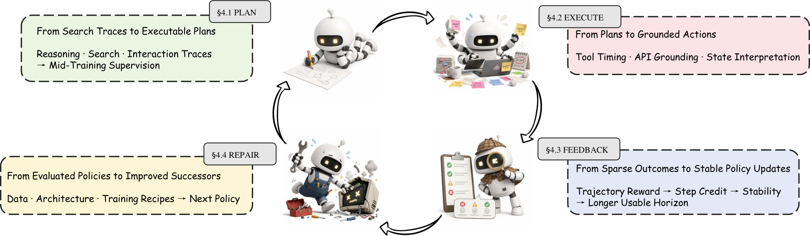

<div align="center">

<p>
  
</p>

<h1>🚀 Awesome AI4AI</h1>

<h3>🔄 Updated weekly — until humanity achieves AI4AI.</h3>

<p><strong>Follow the journey: <a href="https://github.com/KaiWU5/Awesome-AI4AI">Star ⭐</a> · <a href="https://github.com/KaiWU5/Awesome-AI4AI/subscription">Watch 👀 for weekly updates</a> · <a href="#weekly-news">Read this week's picks →</a></strong></p>

<p><strong><em>AI4AI Survey: From Long-Horizon Agents to Recursive Self-Improvement</em></strong><br>
<sub>Definitions, Reliable Horizons, and Open Problems · 23 authors · 7 institutions</sub></p>

<p>
  Top AI-for-AI papers, releases, and blogs — curated every week. <strong>Stay tuned 🔥</strong>
</p>

<p><strong>Living catalog: 1885 papers</strong> · 836 benchmarks · 1217 harness studies · 437 model studies<br><sub>Collections overlap. The original survey covers 223 papers.</sub></p>

<p>
  <a href="assets/AI4AI-Survey.pdf"></a>
  <a href="https://www.preprints.org/manuscript/202608.2108/v1"></a>
  <a href="https://kaiwu5.github.io/Awesome-AI4AI/"></a>
  <a href="https://github.com/simple-agent-lab/RSIHub"></a>
  <a href="https://simpleagentlab.com/ai4ai/"></a>
  <a href="https://doi.org/10.20944/preprints202608.2108.v1"></a>
</p>

</div>

<br>

## Why This Repo

<table>
<tr>
<td width="33%" align="center">
  <strong>🔄 Refreshed rankings</strong><br>
  <sub>Citations, GitHub stars, and rankings refresh with maintainer updates.</sub>
</td>
<td width="33%" align="center">
  <strong>🗞️ Weekly update</strong><br>
  <sub>New papers added to the catalog, plus source-verified papers and releases selected every week.</sub>
</td>
<td width="33%" align="center">
  <strong>🧭 Survey-grounded map</strong><br>
  <sub>From long-horizon agents to recursive self-improvement.</sub>
</td>
</tr>
</table>

<p align="center">
  <strong>Star ⭐ to save the map · Watch 👀 for weekly updates · Share 🔁 with your lab</strong>
</p>

## What's New

- 📚 **2026-11-23 — 423 papers added.** Expanded Benchmarks, Harness Design, and Model Design with verified new and previously missed papers; rebuilt the full catalog and both ranking families.
- 🚀 **2026-11-16 — Latest weekly edition published.** Read the source-verified news digest below.
- 🤝 **2026-10-26 — Community contributions integrated.** Added ReCreate, Meta-Team, Agon, EvoRepair, and Harness Engineering for Language Agents to Harness Design, and PerspectiveGap to Benchmarks. Related Lists now links to three complementary community resources.
- 📄 **2026-08-30 — [Companion survey now online.](https://www.preprints.org/manuscript/202608.2108/v1)** Read *AI4AI Survey: From Long-Horizon Agents to Recursive Self-Improvement—Definitions, Reliable Horizons, and Open Problems*.
- 🔄 **Maintainer refresh.** Citations, GitHub stars, and recent-paper/yearly rankings are rebuilt from the catalog.

<details open markdown="1">
<summary><b>🗂️ Explore the full collection</b></summary>

- [📅 Weekly News · Top 10](#weekly-news)
- [📈 Live Rankings](#-live-rankings)
  - [Top Ranking Papers by Average Monthly Citations](#top-ranking-papers-by-average-monthly-citations)
  - [🏆 Most-Cited Papers by Year](#-most-cited-papers-by-year)
- [🧪 Benchmarks](#-benchmarks)
- [🛠️ Harness Design](#-harness-design)
- [🧠 Model Design](#-model-design)
- [📚 How We Curate](#-how-we-curate)
- [🔗 Related Lists](#-related-lists)
- [📄 Citation](#-citation)
- [🤝 Contributing](#-contributing)

</details>

<br>

<a id="monthly-news"></a>
<a id="weekly-news"></a>

## 📅 Weekly News · Top 10

> **Updated 2026-11-16** · Weekly news picks, refreshed every Monday alongside citation rankings.
>
> **How we select:** The top stories from the trailing 30 days, scored on publisher authority, discussion volume, whether a concrete verifiable result is reported, whether it changes what agent builders do now, whether an artifact was released, and expected durability. Only primary sources are cited, and performance claims remain attributed to their publishers.

| Date · Type | News | Why it matters |
|:--|:--|:--|
| 2026‑11‑16<br><sub>Model release</sub> | [**Qwen4-Max: Your new teammate has arrived**](https://www.alibabacloud.com/en/press-room/alibaba-unveils-qwen4-max)<br><sub>Alibaba / Qwen</sub> | Alibaba releases its 2.4T-parameter multimodal flagship with a 1M-token context window. On its proprietary Work360 benchmark, Alibaba reports 35% fewer tokens and about 60% lower cost per task than Qwen3.8-Max at High effort. |
| 2026‑11‑13<br><sub>Paper</sub> | [**ModHarness-RL: Recasting Harnesses as Learnable and Evolving Programs for Agentic RL**](https://arxiv.org/abs/2611.18533)<br><sub>He et al. · arXiv</sub> | The authors learn and evolve executable compression and steering programs alongside agentic RL, validating candidates by execution and trajectory replay. On CodeSearch, ALFWorld and BIRD SQL with 1.5B–8B models, they report better held-out performance than fixed harnesses in most settings. |
| 2026‑11‑13<br><sub>Paper</sub> | [**AutoRL: A Multi-Agent System towards Autonomous Reinforcement Learning**](https://arxiv.org/abs/2611.17790)<br><sub>Tang et al. · arXiv</sub> | The authors automate ongoing RL supervision with training-state perceptors, diagnostic proposers and an orchestrator that applies hot updates or resumes checkpoints. Experiments on Qwen3 and LongCat-Flash-Lite outperform static recipes and a general agent; unattended supervision is distinguished from discovering fundamental new methods. |
| 2026‑11‑12<br><sub>Paper</sub> | [**Singularity-Bench: Can Agents Build Agents?**](https://arxiv.org/abs/2611.16591)<br><sub>Zhou et al. · arXiv</sub> | The authors benchmark six AI-development tasks from pre-training through cluster orchestration against human-built systems on identical hardware. Across 11 agents, their best configuration scores a 1.25 Singularity-Index; Breakwater blocks all reward-hacking attacks tested, without establishing that unrestricted recursive improvement has been achieved. |
| 2026‑11‑12<br><sub>Paper</sub> | [**Discovering Effective Agent Memory Designs through Program Evolution**](https://arxiv.org/abs/2611.17068)<br><sub>Ding et al. · arXiv</sub> | The authors release MAPE, which evolves whole memory programs through diagnosis and proposal. On LoCoMo and LongMemEval they report up to 12 percentage points higher accuracy at 35% of baseline serving cost, and show that transplanting an evolved composition module improves five existing memory systems. |
| 2026‑11‑09<br><sub>Model release</sub> | [**Introducing Claude Fable 5.2 and Claude Mythos 5.2**](https://www.anthropic.com/claude-fable-and-mythos-5-2)<br><sub>Anthropic</sub> | Anthropic reports 49.1% on FrontierCode 2.0 and 74.6% on Terminal-Bench-Science for Fable 5.2, plus a 30-hour formalization of Fermat’s Last Theorem. Fable is broadly available with cyber/bio safeguards; Mythos, the same underlying model with different safeguards, requires verified access. |
| 2026‑11‑05<br><sub>Model release</sub> | [**GPT-6 Cyber: Advancing the frontier of aligned cybersecurity agents**](https://openai.com/index/introducing-gpt-6-cyber/)<br><sub>OpenAI</sub> | OpenAI introduces a cyber-specialized GPT-6 Astra variant for approved Daybreak Red customers in the API and Codex. It reports 48.5% on ExploitGym versus 32.1% for GPT-5.6 Cyber, and 99.93% scope adherence without its deployment prompt. |
| 2026‑11‑04<br><sub>Paper</sub> | [**EnzymeRSI: A dual-loop recursive self-improvement system for enzyme design**](https://arxiv.org/abs/2611.06321)<br><sub>Genoria AI Team et al. · arXiv</sub> | The authors evolve both harness assets and enzyme-design algorithms. They report 10 of 32 non-pre-specified luciferase candidates with at least twice wild-type activity, plus prospective A3A and polymerase tests; physical-loop results are distinguished from development-set optimization. |
| 2026‑10‑29<br><sub>Open-weight release</sub> | [**Mistral Large 4 (Le Chonk) is now open weight**](https://mistral.ai/news/mistral-large-4-oss/)<br><sub>Mistral AI</sub> | Mistral releases the improved 1T-parameter multimodal flagship weights under its Ecosystem Open-Weight license. It reports 41% on Terminal-Bench 4.0 and 48% on the Coding Agent Index, with 47% fewer tokens than GLM-5.3 on the latter. |
| 2026‑10‑28<br><sub>Model release</sub> | [**Gemini 4 Carbon: our next frontier model**](https://blog.google/innovation-and-ai/models-and-research/gemini-models/introducing-gemini-4-carbon/)<br><sub>Google DeepMind</sub> | Google reports 88.2% on SEC-bench Pro for its long-horizon engineering and cybersecurity model. After the October 28 preview, the official November 10 update confirms access for paying developers and enterprises via the API and a rollout to Google AI Ultra users; this item retains the original announcement date. |

> **Want next week's news?** Watch the repository. Citation counts, rankings, and the weekly news picks are published with maintainer updates. [Browse past editions →](highlights/README.md)

## 📈 Live Rankings

> Last complete citation snapshot: **2026-10-17**, using Semantic Scholar and OpenAlex. Rankings are discovery aids, not quality scores; audit evidence remains independent of popularity. Last complete GitHub stars snapshot: **2026-11-08**. For papers indexed as multiple versions, retain the largest title-verified count reported by the configured sources. All yearly rankings use first public appearance year; a later venue year never moves a paper into a newer cohort.

> **Latest metric check: 2026-11-23.** Title-verified citations for 1821/1901 catalog records; 17 records retain prior verified counts and 63 records remain without a verified index count. GitHub stars refreshed for 491 records across 486 repositories. 3 configured GitHub repositories could not be refreshed; previous star counts are retained. Complete snapshot dates advance only when every relevant record is verified.

### Top Ranking Papers by Average Monthly Citations

| Paper | Venue | Date | Citations | Avg. cites/month | Code |
|:--|:--:|:--:|:--:|:--:|:--:|
| [**Kimi K3: Open Frontier Intelligence**](https://arxiv.org/abs/2607.24653) | arXiv | <nobr>2026-07</nobr> | 531 | **177.0** | [GitHub](https://github.com/MoonshotAI/Kimi-K3) · ★ 9,114 |
| [**AlphaEvolve: A coding agent for scientific and algorithmic discovery**](https://arxiv.org/abs/2506.13131) | arXiv | <nobr>2025-06</nobr> | 1656 | **103.5** | — |
| [**Terminal-Bench: Benchmarking Agents on Hard, Realistic Tasks in Command Line Interfaces**](https://arxiv.org/abs/2601.11868) | arXiv | <nobr>2026-01</nobr> | 777 | **86.3** | [GitHub](https://github.com/harbor-framework/terminal-bench-1) · ★ 2,624 |
| [**Towards End-to-End Automation of AI Research**](https://doi.org/10.1038/s41586-026-10265-5) | Nature 2026 | <nobr>2026-03</nobr> | 577 | **82.4** | [GitHub](https://github.com/SakanaAI/AI-Scientist-v2) · ★ 7,547 |
| [**Mem0: Building Production-Ready AI Agents with Scalable Long-Term Memory**](https://doi.org/10.3233/faia251160) | European Conference on Artificial Intelligence (ECAI) | <nobr>2025-04</nobr> | 1347 | **74.8** | [GitHub](https://github.com/mem0ai/mem0) · ★ 69,374 |
| [**Meta-Harness: End-to-End Optimization of Model Harnesses**](https://arxiv.org/abs/2603.28052) | arXiv | <nobr>2026-03</nobr> | 450 | **64.3** | [GitHub](https://github.com/stanford-iris-lab/meta-harness-tbench2-artifact) · ★ 1,255 |
| [**Agentic Context Engineering: Evolving Contexts for Self-Improving Language Models**](https://arxiv.org/abs/2510.04618) | arXiv | <nobr>2025-10</nobr> | 576 | **48.0** | [GitHub](https://github.com/ace-agent/ace) · ★ 1,471 |
| [**RRSI: Regularized Recursive Self-Improvement of Agent Harnesses**](https://arxiv.org/abs/2609.24972) | arXiv | <nobr>2026-09</nobr> | 47 | **47.0** | [GitHub](https://github.com/google-research/rrsi) · ★ 1,814 |
| [**Memory in the Age of AI Agents**](https://arxiv.org/abs/2512.13564) | arXiv preprint arXiv:2512.13564 | <nobr>2025-12</nobr> | 439 | **43.9** | — |
| [**DeepSWE: Measuring Frontier Coding Agents on Original, Long-Horizon Engineering Tasks**](https://arxiv.org/abs/2607.07946) | arXiv preprint arXiv:2607.07946 | <nobr>2026-07</nobr> | 121 | **40.3** | [GitHub](https://github.com/datacurve-ai/deep-swe) · ★ 1,925 |

### 🏆 Most-Cited Papers by Year

<details open markdown="1">
<summary><b>Top 12 of 2026</b> by citations</summary>

| Paper | Date | Citations | Code |
|:--|:--:|:--:|:--:|
| [**Terminal-Bench: Benchmarking Agents on Hard, Realistic Tasks in Command Line Interfaces**](https://arxiv.org/abs/2601.11868)<br><sub>arXiv</sub> | <nobr>2026-01</nobr> | 777 | [GitHub](https://github.com/harbor-framework/terminal-bench-1) · ★ 2,624 |
| [**Towards End-to-End Automation of AI Research**](https://doi.org/10.1038/s41586-026-10265-5)<br><sub>Nature 2026</sub> | <nobr>2026-03</nobr> | 577 | [GitHub](https://github.com/SakanaAI/AI-Scientist-v2) · ★ 7,547 |
| [**Kimi K3: Open Frontier Intelligence**](https://arxiv.org/abs/2607.24653)<br><sub>arXiv</sub> | <nobr>2026-07</nobr> | 531 | [GitHub](https://github.com/MoonshotAI/Kimi-K3) · ★ 9,114 |
| [**Meta-Harness: End-to-End Optimization of Model Harnesses**](https://arxiv.org/abs/2603.28052)<br><sub>arXiv</sub> | <nobr>2026-03</nobr> | 450 | [GitHub](https://github.com/stanford-iris-lab/meta-harness-tbench2-artifact) · ★ 1,255 |
| [**Self-Harness: Harnesses That Improve Themselves**](https://arxiv.org/abs/2606.09498)<br><sub>arXiv</sub> | <nobr>2026-06</nobr> | 148 | [GitHub](https://github.com/qzzqzzb/Self-Harness) · ★ 148 |
| [**Externalization in LLM Agents: A Unified Review of Memory, Skills, Protocols and Harness Engineering**](https://arxiv.org/abs/2604.08224)<br><sub>arXiv preprint arXiv:2604.08224</sub> | <nobr>2026-04</nobr> | 126 | — |
| [**DeepSWE: Measuring Frontier Coding Agents on Original, Long-Horizon Engineering Tasks**](https://arxiv.org/abs/2607.07946)<br><sub>arXiv preprint arXiv:2607.07946</sub> | <nobr>2026-07</nobr> | 121 | [GitHub](https://github.com/datacurve-ai/deep-swe) · ★ 1,925 |
| [**Code as Agent Harness**](https://arxiv.org/abs/2605.18747)<br><sub>arXiv</sub> | <nobr>2026-05</nobr> | 107 | [GitHub](https://github.com/YennNing/Awesome-Code-as-Agent-Harness-Papers) · ★ 784 |
| [**PostTrainBench: Can LLM Agents Automate LLM Post-Training?**](https://arxiv.org/abs/2603.08640)<br><sub>arXiv</sub> | <nobr>2026-03</nobr> | 105 | [GitHub](https://github.com/aisa-group/PostTrainBench) · ★ 627 |
| [**SkillOS: Learning Skill Curation for Self-Evolving Agents**](https://arxiv.org/abs/2605.06614)<br><sub>arXiv</sub> | <nobr>2026-05</nobr> | 93 | — |
| [**Natural-Language Agent Harnesses**](https://arxiv.org/abs/2603.25723)<br><sub>arXiv</sub> | <nobr>2026-03</nobr> | 88 | — |
| [**ProgramBench: Can Language Models Rebuild Programs From Scratch?**](https://arxiv.org/abs/2605.03546)<br><sub>arXiv</sub> | <nobr>2026-05</nobr> | 85 | [GitHub](https://github.com/facebookresearch/ProgramBench) · ★ 986 |

</details>

<details markdown="1">
<summary><b>Top 12 of 2025</b> by citations</summary>

| Paper | Date | Citations | Code |
|:--|:--:|:--:|:--:|
| [**AlphaEvolve: A coding agent for scientific and algorithmic discovery**](https://arxiv.org/abs/2506.13131)<br><sub>arXiv</sub> | <nobr>2025-06</nobr> | 1656 | — |
| [**A-MEM: Agentic Memory for LLM Agents**](https://arxiv.org/abs/2502.12110)<br><sub>Advances in Neural Information Processing Systems</sub> | <nobr>2025-02</nobr> | 1457 | [GitHub](https://github.com/WujiangXu/A-mem) · ★ 1,018 |
| [**Mem0: Building Production-Ready AI Agents with Scalable Long-Term Memory**](https://doi.org/10.3233/faia251160)<br><sub>European Conference on Artificial Intelligence (ECAI)</sub> | <nobr>2025-04</nobr> | 1347 | [GitHub](https://github.com/mem0ai/mem0) · ★ 69,374 |
| [**Why Do Multi-Agent LLM Systems Fail?**](https://proceedings.neurips.cc/paper_files/paper/2025/hash/b1041e52d3be19f0a9bc491657488e4a-Abstract-Datasets_and_Benchmarks_Track.html)<br><sub>Advances in Neural Information Processing Systems</sub> | <nobr>2025-03</nobr> | 916 | [GitHub](https://github.com/multi-agent-systems-failure-taxonomy/MAST) · ★ 441 |
| [**Group-in-Group Policy Optimization for LLM Agent Training**](https://arxiv.org/abs/2505.10978)<br><sub>Advances in Neural Information Processing Systems</sub> | <nobr>2025-05</nobr> | 642 | [GitHub](https://github.com/langfengQ/verl-agent) · ★ 2,457 |
| [**The Berkeley Function Calling Leaderboard (BFCL): From tool use to agentic evaluation of large language models**](https://proceedings.mlr.press/v267/patil25a.html)<br><sub>Proceedings of the 42nd International Conference on Machine Learning</sub> | <nobr>2025</nobr> | 634 | [GitHub](https://github.com/ShishirPatil/gorilla) · ★ 13,085 |
| [**LLMs Get Lost In Multi-Turn Conversation**](https://arxiv.org/abs/2505.06120)<br><sub>International Conference on Learning Representations</sub> | <nobr>2025-05</nobr> | 606 | [GitHub](https://github.com/microsoft/lost_in_conversation) · ★ 311 |
| [**Agentic Context Engineering: Evolving Contexts for Self-Improving Language Models**](https://arxiv.org/abs/2510.04618)<br><sub>arXiv</sub> | <nobr>2025-10</nobr> | 576 | [GitHub](https://github.com/ace-agent/ace) · ★ 1,471 |
| [**Darwin Godel Machine: Open-ended evolution of self-improving agents**](https://openreview.net/forum?id=pUpzQZTvGY)<br><sub>arXiv</sub> | <nobr>2025-05</nobr> | 539 | [GitHub](https://github.com/jennyzzt/dgm) · ★ 2,539 |
| [**SWE-Bench Pro: Can AI Agents Solve Long-Horizon Software Engineering Tasks?**](https://arxiv.org/abs/2509.16941)<br><sub>arXiv</sub> | <nobr>2025-09</nobr> | 442 | [GitHub](https://github.com/scaleapi/SWE-bench_Pro-os) · ★ 570 |
| [**Memory in the Age of AI Agents**](https://arxiv.org/abs/2512.13564)<br><sub>arXiv preprint arXiv:2512.13564</sub> | <nobr>2025-12</nobr> | 439 | — |
| [**PaperBench: Evaluating AI's ability to replicate AI research**](https://arxiv.org/abs/2504.01848)<br><sub>arXiv</sub> | <nobr>2025-04</nobr> | 412 | [GitHub](https://github.com/openai/frontier-evals) · ★ 1,347 |

</details>

<details markdown="1">
<summary><b>Top 12 of 2024</b> by citations</summary>

| Paper | Date | Citations | Code |
|:--|:--:|:--:|:--:|
| [**τ-bench: A Benchmark for Tool-Agent-User Interaction in Real-World Domains**](https://arxiv.org/abs/2406.12045)<br><sub>arXiv</sub> | <nobr>2024-06</nobr> | 1844 | [GitHub](https://github.com/sierra-research/tau-bench) · ★ 1,516 |
| [**OSWorld: Benchmarking Multimodal Agents for Open-Ended Tasks in Real Computer Environments**](https://arxiv.org/abs/2404.07972)<br><sub>NeurIPS 2024</sub> | <nobr>2024-04</nobr> | 1555 | [GitHub](https://github.com/xlang-ai/OSWorld) · ★ 3,277 |
| [**HippoRAG: Neurobiologically Inspired Long-Term Memory for Large Language Models**](https://arxiv.org/abs/2405.14831)<br><sub>Advances in Neural Information Processing Systems</sub> | <nobr>2024-05</nobr> | 1185 | [GitHub](https://github.com/OSU-NLP-Group/HippoRAG) · ★ 4,139 |
| [**VisualWebArena: Evaluating Multimodal Agents on Realistic Visual Web Tasks**](https://arxiv.org/abs/2401.13649)<br><sub>Proceedings of the 62nd Annual Meeting of the Association for Computational Linguistics (Volume 1: Long Papers)</sub> | <nobr>2024-01</nobr> | 926 | [GitHub](https://github.com/web-arena-x/visualwebarena) · ★ 489 |
| [**WebVoyager: Building an End-to-End Web Agent with Large Multimodal Models**](https://arxiv.org/abs/2401.13919)<br><sub>Proceedings of the 62nd Annual Meeting of the Association for Computational Linguistics (Volume 1: Long Papers)</sub> | <nobr>2024-01</nobr> | 893 | [GitHub](https://github.com/MinorJerry/WebVoyager) · ★ 1,129 |
| [**Demystifying LLM-Based Software Engineering Agents**](https://doi.org/10.1145/3715754)<br><sub>Proceedings of the ACM on Software Engineering</sub> | <nobr>2024-07</nobr> | 876 | [GitHub](https://github.com/OpenAutoCoder/Agentless) · ★ 2,138 |
| [**Self-rewarding language models**](https://proceedings.mlr.press/v235/yuan24d.html)<br><sub>arXiv</sub> | <nobr>2024-01</nobr> | 819 | — |
| [**MLE-bench: Evaluating machine learning agents on machine learning engineering**](https://arxiv.org/abs/2410.07095)<br><sub>ICLR 2025</sub> | <nobr>2024-10</nobr> | 633 | [GitHub](https://github.com/openai/mle-bench) · ★ 1,803 |
| [**AndroidWorld: A Dynamic Benchmarking Environment for Autonomous Agents**](https://arxiv.org/abs/2405.14573)<br><sub>International Conference on Learning Representations</sub> | <nobr>2024-05</nobr> | 549 | [GitHub](https://github.com/google-research/android_world) · ★ 1,021 |
| [**AppWorld: A Controllable World of Apps and People for Benchmarking Interactive Coding Agents**](https://arxiv.org/abs/2407.18901)<br><sub>ACL 2024</sub> | <nobr>2024-07</nobr> | 546 | [GitHub](https://github.com/StonyBrookNLP/appworld) · ★ 557 |
| [**TravelPlanner: A Benchmark for Real-World Planning with Language Agents**](https://arxiv.org/abs/2402.01622)<br><sub>International Conference on Machine Learning</sub> | <nobr>2024-02</nobr> | 544 | [GitHub](https://github.com/OSU-NLP-Group/TravelPlanner) · ★ 574 |
| [**Automated design of agentic systems**](https://arxiv.org/abs/2408.08435)<br><sub>ICLR 2025</sub> | <nobr>2024-08</nobr> | 540 | [GitHub](https://github.com/ShengranHu/ADAS) · ★ 1,670 |

</details>

<details markdown="1">
<summary><b>Top 12 of 2023</b> by citations</summary>

| Paper | Date | Citations | Code |
|:--|:--:|:--:|:--:|
| [**Generative Agents: Interactive Simulacra of Human Behavior**](https://arxiv.org/abs/2304.03442)<br><sub>Proceedings of the 36th annual acm symposium on user interface software and technology</sub> | <nobr>2023-04</nobr> | 8273 | [GitHub](https://github.com/joonspk-research/generative_agents) · ★ 22,405 |
| [**Reflexion: language agents with verbal reinforcement learning**](https://arxiv.org/abs/2303.11366)<br><sub>NeurIPS 2023</sub> | <nobr>2023-03</nobr> | 6890 | [GitHub](https://github.com/noahshinn/reflexion) · ★ 3,439 |
| [**Toolformer: Language Models Can Teach Themselves to Use Tools**](https://arxiv.org/abs/2302.04761)<br><sub>Advances in Neural Information Processing Systems</sub> | <nobr>2023-02</nobr> | 6837 | — |
| [**Self-Refine: Iterative refinement with self-feedback**](https://arxiv.org/abs/2303.17651)<br><sub>NeurIPS 2023</sub> | <nobr>2023-03</nobr> | 6446 | [GitHub](https://github.com/madaan/self-refine) · ★ 854 |
| [**Tree of Thoughts: Deliberate Problem Solving with Large Language Models**](https://arxiv.org/abs/2305.10601)<br><sub>Advances in Neural Information Processing Systems</sub> | <nobr>2023-05</nobr> | 5420 | [GitHub](https://github.com/princeton-nlp/tree-of-thought-llm) · ★ 6,087 |
| [**SWE-bench: Can Language Models Resolve Real-World GitHub Issues?**](https://arxiv.org/abs/2310.06770)<br><sub>ICLR 2024</sub> | <nobr>2023-10</nobr> | 5058 | [GitHub](https://github.com/SWE-bench/SWE-bench) · ★ 6,234 |
| [**Voyager: An Open-Ended Embodied Agent with Large Language Models**](https://arxiv.org/abs/2305.16291)<br><sub>Transactions on Machine Learning Research</sub> | <nobr>2023-05</nobr> | 2932 | [GitHub](https://github.com/MineDojo/Voyager) · ★ 7,340 |
| [**ToolLLM: Facilitating Large Language Models to Master 16000+ Real-world APIs**](https://arxiv.org/abs/2307.16789)<br><sub>International Conference on Learning Representations</sub> | <nobr>2023-07</nobr> | 2675 | [GitHub](https://github.com/OpenBMB/ToolBench) · ★ 5,774 |
| [**WebArena: A Realistic Web Environment for Building Autonomous Agents**](https://arxiv.org/abs/2307.13854)<br><sub>ICLR 2024</sub> | <nobr>2023-07</nobr> | 2566 | [GitHub](https://github.com/web-arena-x/webarena) · ★ 1,647 |
| [**AgentBench: Evaluating LLMs as Agents**](https://arxiv.org/abs/2308.03688)<br><sub>International Conference on Learning Representations</sub> | <nobr>2023-08</nobr> | 2503 | [GitHub](https://github.com/THUDM/AgentBench) · ★ 3,831 |
| [**MemGPT: Towards LLMs as Operating Systems**](https://arxiv.org/abs/2310.08560)<br><sub>arXiv preprint arXiv:2310.08560</sub> | <nobr>2023-10</nobr> | 1931 | [GitHub](https://github.com/letta-ai/letta) · ★ 25,520 |
| [**Gorilla: Large Language Model Connected with Massive APIs**](https://arxiv.org/abs/2305.15334)<br><sub>Advances in Neural Information Processing Systems</sub> | <nobr>2023-05</nobr> | 1907 | [GitHub](https://github.com/ShishirPatil/gorilla) · ★ 13,085 |

</details>


## 🧪 Benchmarks

<p align="center">
  
</p>

> **836 papers** · Survey-curated collection, newest first. Cross-collection papers may appear in more than one section.

| Paper | Date | Citations | Code |
|:--|:--:|:--:|:--:|
| [**Benchmarks' Last Exam**](https://arxiv.org/abs/2611.27622)<br><sub>arXiv</sub> | <nobr>2026-11</nobr> | — | [GitHub](https://github.com/ZekkiCat/Benchmarks-Last-Exam) · ★ 17 |
| [**$\gamma$-Scape: An Agent-Centric World for Mobile Embodied Intelligence**](https://arxiv.org/abs/2611.27306)<br><sub>arXiv</sub> | <nobr>2026-11</nobr> | — | — |
| [**CoEvoBench: Can LLMs Drive Recursive Co-Evolution of Agentic Systems?**](https://arxiv.org/abs/2611.27116)<br><sub>arXiv</sub> | <nobr>2026-11</nobr> | — | [GitHub](https://github.com/AlibabaResearch/CoEvoBench) · ★ 4 |
| [**Actions Speak Louder than Words: Stateful Privacy Sniffing of LLM Agents via Behavioral Covert Channels in Web Interactions**](https://arxiv.org/abs/2611.27046)<br><sub>arXiv</sub> | <nobr>2026-11</nobr> | — | — |
| [**CodeReviewBench: An Automated Benchmark for Evaluating the Software Factory**](https://arxiv.org/abs/2611.26942)<br><sub>arXiv</sub> | <nobr>2026-11</nobr> | — | — |
| [**TEA-Bench-BR: Can Coding Agents Turn a Branching Clinical Specification into Correct Code?**](https://arxiv.org/abs/2611.27895)<br><sub>arXiv</sub> | <nobr>2026-11</nobr> | — | — |
| [**Who Grades the Agent? Privilege Separation for Coding-Agent Benchmarks**](https://arxiv.org/abs/2611.27860)<br><sub>arXiv</sub> | <nobr>2026-11</nobr> | — | — |
| [**Potential emergence in LLM agents: a statistical physics perspective**](https://arxiv.org/abs/2611.27618)<br><sub>arXiv</sub> | <nobr>2026-11</nobr> | — | — |
| [**Do Senior Agents Do Their Job? Measuring Role Integrity in How LLM Agents Use Subordinate Material**](https://arxiv.org/abs/2611.27139)<br><sub>arXiv</sub> | <nobr>2026-11</nobr> | — | [GitHub](https://github.com/jxtse/ri-bench) · ★ 0 |
| [**Schema-Validated LLM Workflows: A Benchmark Protocol and Comparative Evaluation Across Six Python Implementations**](https://arxiv.org/abs/2611.27106)<br><sub>arXiv</sub> | <nobr>2026-11</nobr> | — | [GitHub](https://github.com/ULDataProfessor/schema-validated-llm-workflows) · ★ 0 |
| [**Separating Automation Gains from Agent Contributions in AI-Assisted Model Validation**](https://arxiv.org/abs/2611.27094)<br><sub>arXiv</sub> | <nobr>2026-11</nobr> | — | — |
| [**Exercised, Rarely Recovered: What Public Reports Say About Recovery in 50 AI Agent Harnesses and Runtimes**](https://arxiv.org/abs/2611.27090)<br><sub>arXiv</sub> | <nobr>2026-11</nobr> | — | — |
| [**AutoOntologyBench: A Task-Grounded Benchmark for Agentic Knowledge Engineering**](https://arxiv.org/abs/2611.27734)<br><sub>arXiv</sub> | <nobr>2026-11</nobr> | — | [GitHub](https://github.com/VinyehShaw/AutoOntologyBench) · ★ 0 |
| [**Mem-X: A Memory-Dependent Cross-Episode Benchmark for Vision-and-Language Navigation**](https://arxiv.org/abs/2611.27166)<br><sub>arXiv</sub> | <nobr>2026-11</nobr> | — | [GitHub](https://github.com/NJU-R-L-Group-Embodied-Lab/Mem-X) · ★ 2 |
| [**Analysis of Multi-Client Inference Techniques for Vision-Language-Action Models**](https://arxiv.org/abs/2611.26944)<br><sub>arXiv</sub> | <nobr>2026-11</nobr> | — | — |
| [**AstronautBench: Measuring Agent Self-Improvement Across Episodes Through Knowledge, Evidence, and Progress**](https://arxiv.org/abs/2611.26910)<br><sub>arXiv</sub> | <nobr>2026-11</nobr> | — | — |
| [**ProbeAgent: Principled Diagnosis of Agent Failures in Verifiable Environments**](https://arxiv.org/abs/2611.26897)<br><sub>arXiv</sub> | <nobr>2026-11</nobr> | — | — |
| [**What Helps Language-Model Agents Review Violent Video? A Controlled Comparison with a Human Evidence Reference**](https://arxiv.org/abs/2611.26776)<br><sub>arXiv</sub> | <nobr>2026-11</nobr> | — | [GitHub](https://github.com/amine0110/evidence-graph-agents) · ★ 0 |
| [**ClosureBench: A Benchmark for Reasoning under Closure Assumptions**](https://arxiv.org/abs/2611.26335)<br><sub>arXiv</sub> | <nobr>2026-11</nobr> | 0 | — |
| [**TwinLab-Bench: Evaluating AI Scientists in Agentic Twins of Real Labs**](https://arxiv.org/abs/2611.26248)<br><sub>arXiv</sub> | <nobr>2026-11</nobr> | 0 | [GitHub](https://github.com/ZJUSCL/TwinLab-Bench) · ★ 6 |
| [**The FrontierOR Challenge: Agentic Algorithm Design for Operations Research**](https://arxiv.org/abs/2611.26171)<br><sub>arXiv</sub> | <nobr>2026-11</nobr> | 0 | — |
| [**When Agents Play Differently: Localizing Human--Agent Behavioral Divergence with Conditional Distributional Testing**](https://arxiv.org/abs/2611.26012)<br><sub>arXiv</sub> | <nobr>2026-11</nobr> | 0 | — |
| [**AI agents can redesign engineering parts with more than a thousand CAD parameters and nonlinear simulations**](https://arxiv.org/abs/2611.26003)<br><sub>arXiv</sub> | <nobr>2026-11</nobr> | 0 | — |
| [**Validation-driven Deployment of LLM Inference Platforms for Agentic Workloads**](https://arxiv.org/abs/2611.25905)<br><sub>arXiv</sub> | <nobr>2026-11</nobr> | 0 | — |
| [**CompAct-Bench: A Benchmark for Working-Context Compaction in Long-Horizon Agent Tasks**](https://arxiv.org/abs/2611.25673)<br><sub>arXiv</sub> | <nobr>2026-11</nobr> | 0 | — |
| [**SiliconGym: A Versatile Reinforcement Learning Environment for Agentic EDA**](https://arxiv.org/abs/2611.25658)<br><sub>arXiv</sub> | <nobr>2026-11</nobr> | 0 | — |
| [**How Feedback-Free Self-Evolution Reshapes Agent Skills: A Systematic Study**](https://arxiv.org/abs/2611.25534)<br><sub>arXiv</sub> | <nobr>2026-11</nobr> | 0 | [GitHub](https://github.com/LitaoGuo/How-Self-Evolution-Reshapes-Skills) · ★ 1 |
| [**When Should a Voice Agent Speak? End-of-Turn Detection in Turkish**](https://arxiv.org/abs/2611.25489)<br><sub>arXiv</sub> | <nobr>2026-11</nobr> | 0 | — |
| [**AppSci-Bench: Can LLMs Build AI Agents and Make Them Better?**](https://arxiv.org/abs/2611.25360)<br><sub>arXiv</sub> | <nobr>2026-11</nobr> | 0 | [GitHub](https://github.com/sanjari-orb/appsci-bench) · ★ 3 |
| [**Pandora's Toolbox Or Why Agent Safety Cannot Be Verified**](https://arxiv.org/abs/2611.25325)<br><sub>arXiv</sub> | <nobr>2026-11</nobr> | 0 | — |
| [**Replication of Agentic Security Events: Audit and Investigation (ROGUE-AI)**](https://arxiv.org/abs/2611.26553)<br><sub>arXiv</sub> | <nobr>2026-11</nobr> | 0 | [Project](https://rogue-ai.surge.sh) |
| [**Backtracking Agent Applications Security Incidents**](https://arxiv.org/abs/2611.26525)<br><sub>arXiv</sub> | <nobr>2026-11</nobr> | 0 | — |
| [**Mind2Act World: A Diagnostic Benchmark for Embodied Mind, Physical Action, and Mind-Action Composition in Robotic Manipulation**](https://arxiv.org/abs/2611.26444)<br><sub>arXiv</sub> | <nobr>2026-11</nobr> | 0 | — |
| [**LINEAGE: A Benchmark for Empirical Lineage Retrieval in AI Scientific Literature**](https://arxiv.org/abs/2611.25845)<br><sub>arXiv</sub> | <nobr>2026-11</nobr> | 0 | — |
| [**Harnessing Medical Visual-Language Models with Agentic Evidence Management**](https://arxiv.org/abs/2611.25840)<br><sub>arXiv</sub> | <nobr>2026-11</nobr> | 0 | — |
| [**Characterizing and Detecting Unfaithful Work Reports by Coding Agents**](https://arxiv.org/abs/2611.25760)<br><sub>arXiv</sub> | <nobr>2026-11</nobr> | 0 | — |
| [**AutoRAGBench: A Benchmark for LLM Agents Automating RAG System Development**](https://arxiv.org/abs/2611.25582)<br><sub>arXiv</sub> | <nobr>2026-11</nobr> | 0 | — |
| [**From FIPS to FPGA with LLM Agents: Measuring What Tests and Reviews Miss in Post-Quantum Cryptographic Hardware**](https://arxiv.org/abs/2611.25339)<br><sub>arXiv</sub> | <nobr>2026-11</nobr> | 0 | — |
| [**How Long Will My Language Model Run? A Benchmark for Pre-Execution Runtime Prediction**](https://arxiv.org/abs/2611.26875)<br><sub>arXiv</sub> | <nobr>2026-11</nobr> | — | — |
| [**SkillPrivus: Uncovering PRIVacy of USe Harms in Agentic Skills**](https://arxiv.org/abs/2611.26747)<br><sub>arXiv</sub> | <nobr>2026-11</nobr> | — | — |
| [**AgentRoboCritic: Understanding the Capability of Frontier Agents on Direct Robot Control**](https://arxiv.org/abs/2611.26613)<br><sub>arXiv</sub> | <nobr>2026-11</nobr> | 0 | [GitHub](https://github.com/cxcscmu/AgentRoboCritic) · ★ 4 |
| [**PhyDEX: A Benchmark for Physical Reasoning in Vision-Language-Action Models via Dynamic Extrinsic Dexterity**](https://arxiv.org/abs/2611.26565)<br><sub>arXiv</sub> | <nobr>2026-11</nobr> | 0 | — |
| [**Agentic Scaling of Embodied Tasks in Simulation for Synthetic Data Collection and Policy Evaluation**](https://arxiv.org/abs/2611.26046)<br><sub>arXiv</sub> | <nobr>2026-11</nobr> | 0 | [Project](https://huggingface.co/datasets/jimmy-zhou/AgenticTask-Kitchen-50) |
| [**MKA: Evaluating Multimodal Knowledge Agents on end-to-end professional tasks**](https://arxiv.org/abs/2611.25228)<br><sub>arXiv</sub> | <nobr>2026-11</nobr> | 0 | — |
| [**DVBench: End-to-End Benchmark for Real-World UVM Design Verification Agents**](https://arxiv.org/abs/2611.25066)<br><sub>arXiv</sub> | <nobr>2026-11</nobr> | 0 | — |
| [**Local AI Agents in Power Electronics Simulation: Deployment, Measurements and Costs**](https://arxiv.org/abs/2611.24880)<br><sub>arXiv</sub> | <nobr>2026-11</nobr> | 0 | — |
| [**Choosing What to Observe: Budget-Paired Counterfactual Audits for Credible Evaluation of Visual Agents**](https://arxiv.org/abs/2611.24867)<br><sub>arXiv</sub> | <nobr>2026-11</nobr> | 0 | — |
| [**Benchmarking LLM abilities on postdoc-level natural science problems**](https://arxiv.org/abs/2611.24321)<br><sub>arXiv</sub> | <nobr>2026-11</nobr> | 0 | — |
| [**3D GameDev Arena: Benchmarking Coding Agents That Plan, Build, and Playtest extreme Long-Horizon Browser Games**](https://arxiv.org/abs/2611.24073)<br><sub>arXiv</sub> | <nobr>2026-11</nobr> | 0 | — |
| [**A Capability Framework for Evaluating Agentic AI Platforms in Regulated Enterprises**](https://arxiv.org/abs/2611.24039)<br><sub>arXiv</sub> | <nobr>2026-11</nobr> | 0 | — |
| [**RoboBuilder: Agentic Robot Co-Design with Real-world Video Feedback in the Loop**](https://arxiv.org/abs/2611.23855)<br><sub>arXiv</sub> | <nobr>2026-11</nobr> | 0 | [GitHub](https://github.com/ghadinehme/RoboBuilder) · ★ 1 |
| [**Openhagen Worlds: Calibrated Environments for Measuring and Training Scientific Discovery Agents**](https://arxiv.org/abs/2611.24711)<br><sub>arXiv</sub> | <nobr>2026-11</nobr> | 0 | [Project](https://eval.openhagen.ai) |
| [**Probing agent overeagerness in realistic settings with continuation audits**](https://arxiv.org/abs/2611.24491)<br><sub>arXiv</sub> | <nobr>2026-11</nobr> | 0 | — |
| [**PIPETTE: Prompt Injection Purple-Teaming for Robust LLM Agents**](https://arxiv.org/abs/2611.24362)<br><sub>arXiv</sub> | <nobr>2026-11</nobr> | 0 | — |
| [**AutoPI: Taxonomy-Guided Adaptive Red Teaming for Prompt Injection in LLM Agents**](https://arxiv.org/abs/2611.24313)<br><sub>arXiv</sub> | <nobr>2026-11</nobr> | 0 | [GitHub](https://github.com/stevendamianakis/autopi) · ★ 6 |
| [**VideoACE: Benchmarking Agentic Video Understanding through High-Frame-Rate Actions**](https://arxiv.org/abs/2611.24184)<br><sub>arXiv</sub> | <nobr>2026-11</nobr> | 0 | — |
| [**How Complete Must an Environment Be to Train a Capable GUI Agent?**](https://arxiv.org/abs/2611.23946)<br><sub>arXiv</sub> | <nobr>2026-11</nobr> | 0 | — |
| [**Safe Personal RSI: Evaluating and Repairing Personal-Agent Updates**](https://arxiv.org/abs/2611.23651)<br><sub>arXiv</sub> | <nobr>2026-11</nobr> | 0 | — |
| [**Teaching VLMs What to Say, Not How to Reason: Rethinking Counterfactual Reasoning in Autonomous Driving**](https://arxiv.org/abs/2611.24376)<br><sub>arXiv</sub> | <nobr>2026-11</nobr> | 0 | [GitHub](https://github.com/OPhD-hahao/Rethink-CF) · ★ 3 |
| [**Assessing Vision-Language Models for Early Prediction of Unsafe Situations in Robotics**](https://arxiv.org/abs/2611.24146)<br><sub>arXiv</sub> | <nobr>2026-11</nobr> | 0 | — |
| [**ExecGap: Exploiting Command-Execution Gap for Patch Attacks on Vision-Language-Action Models**](https://arxiv.org/abs/2611.23714)<br><sub>arXiv</sub> | <nobr>2026-11</nobr> | 0 | — |
| [**Diagnostic Accuracy and Navigation Behavior of Vision-Language Model Agents Reading Emergency CT and MRI Examinations**](https://arxiv.org/abs/2611.23480)<br><sub>arXiv</sub> | <nobr>2026-11</nobr> | 0 | — |
| [**Where the Tokens Go: Heat, Entropy and Error in Agentic Coding**](https://arxiv.org/abs/2611.23375)<br><sub>arXiv</sub> | <nobr>2026-11</nobr> | 0 | — |
| [**MANGO Arena: Same Seeds, Different Chains Evaluating LLM Agents in a Disrupted Supply Chain**](https://arxiv.org/abs/2611.23613)<br><sub>arXiv</sub> | <nobr>2026-11</nobr> | 0 | — |
| [**Idempotency Is Not Recovery: A Fault-Injection Study of Language-Model Agent Tool Actions**](https://arxiv.org/abs/2611.23353)<br><sub>arXiv</sub> | <nobr>2026-11</nobr> | 0 | — |
| [**The Resolution Hypothesis: Agent Evolution's Key Is Identifying Improvements**](https://arxiv.org/abs/2611.23068)<br><sub>arXiv</sub> | <nobr>2026-11</nobr> | 0 | [Project](https://lineshogan.github.io/resolution-hypothesis/) |
| [**Values Shape What Self-Improving Coding Agents Build**](https://arxiv.org/abs/2611.23067)<br><sub>arXiv</sub> | <nobr>2026-11</nobr> | 0 | — |
| [**ForecastGym: A Live, Controlled, and Replayable Benchmark for Forecasting Agents**](https://arxiv.org/abs/2611.23045)<br><sub>arXiv</sub> | <nobr>2026-11</nobr> | 0 | — |
| [**RagHarnessDebugger: Jev-Guided Agentic RAG in Contract Inference Repair Auditing**](https://arxiv.org/abs/2611.22991)<br><sub>arXiv</sub> | <nobr>2026-11</nobr> | 0 | — |
| [**VITAL: A Framework for Validating Agentic AI in Pharmaceutical Drug Development and Clinical Trial Operations**](https://arxiv.org/abs/2611.22973)<br><sub>arXiv</sub> | <nobr>2026-11</nobr> | 0 | — |
| [**Done, But Still Working: Anytime Evaluation of When Coding Agents Should Stop**](https://arxiv.org/abs/2611.22901)<br><sub>arXiv</sub> | <nobr>2026-11</nobr> | 0 | — |
| [**Verifying Agents in Rubric-Graded Environments**](https://arxiv.org/abs/2611.22841)<br><sub>arXiv</sub> | <nobr>2026-11</nobr> | 2 | — |
| [**CrossEnv: Synthesizing Verifiable Cross-Environment Tasks for Long-Horizon Agent Training**](https://arxiv.org/abs/2611.22777)<br><sub>arXiv</sub> | <nobr>2026-11</nobr> | 0 | — |
| [**When Agent Skills Go Stale: Runtime Behavior and Selective Maintenance in Evolving Environments**](https://arxiv.org/abs/2611.22525)<br><sub>arXiv</sub> | <nobr>2026-11</nobr> | 0 | — |
| [**SciWorkBench: A Benchmark for Real Scientific Workflows**](https://arxiv.org/abs/2611.22490)<br><sub>arXiv</sub> | <nobr>2026-11</nobr> | 0 | — |
| [**Reliable Evaluation of AI Agents for Investment Research: A Framework for Performance and Validity Assessment**](https://arxiv.org/abs/2611.22338)<br><sub>arXiv</sub> | <nobr>2026-11</nobr> | 0 | — |
| [**Learning to Edit IFC Building Models: Verifiable Checkers as the Training Signal for Dependency-Aware Editing Agents**](https://arxiv.org/abs/2611.22307)<br><sub>arXiv</sub> | <nobr>2026-11</nobr> | 0 | — |
| [**Multi-Agent Memory Inconsistency: Where Factual Conflicts Disappear in LLM Agents**](https://arxiv.org/abs/2611.22245)<br><sub>arXiv</sub> | <nobr>2026-11</nobr> | 0 | — |
| [**Context Has a Price: Adding and Removing Context for LLM Coding Agents under Prefix Caching**](https://arxiv.org/abs/2611.22238)<br><sub>arXiv</sub> | <nobr>2026-11</nobr> | 0 | — |
| [**RAG in a Trenchcoat: When Minimal Memory Is Enough for Agentic Systems, and When It Isn't**](https://arxiv.org/abs/2611.22179)<br><sub>arXiv</sub> | <nobr>2026-11</nobr> | 0 | — |
| [**The Only Edge Was Memorized in Training: LLM Trading Agents Around Earnings and Bad News**](https://arxiv.org/abs/2611.22177)<br><sub>arXiv</sub> | <nobr>2026-11</nobr> | 0 | — |
| [**Not All Evidence Is Admissible: Evidence Governance for Tool-Augmented Medical Agents**](https://arxiv.org/abs/2611.22169)<br><sub>arXiv</sub> | <nobr>2026-11</nobr> | 0 | — |
| [**ATLAS-Finance: Benchmarking AI Agents in Realistic Banking Environments**](https://arxiv.org/abs/2611.22085)<br><sub>arXiv</sub> | <nobr>2026-11</nobr> | 0 | — |
| [**Thinking Harder Doesn't Lead to Better Choices: Reasoning Effort Increases the Confidence but Not the Correctness of LLM Shopping Agents**](https://arxiv.org/abs/2611.22033)<br><sub>arXiv</sub> | <nobr>2026-11</nobr> | 0 | — |
| [**SkillBuffBench: Measuring What Agent Skills Contribute across Harnesses, Models, Skill Access Modes and Memory**](https://arxiv.org/abs/2611.22017)<br><sub>arXiv</sub> | <nobr>2026-11</nobr> | 0 | — |
| [**Higher-Scoring Coding Models Did Not Get More Work Done**](https://arxiv.org/abs/2611.23216)<br><sub>arXiv</sub> | <nobr>2026-11</nobr> | 0 | — |
| [**Inference after coding agents**](https://arxiv.org/abs/2611.23174)<br><sub>arXiv</sub> | <nobr>2026-11</nobr> | 0 | — |
| [**How Web Research Agents Interpret User Priorities**](https://arxiv.org/abs/2611.22989)<br><sub>arXiv</sub> | <nobr>2026-11</nobr> | 0 | — |
| [**SEAM: Computer-Use Agents Know the Harm Between Screens, and Commit It Anyway**](https://arxiv.org/abs/2611.22971)<br><sub>arXiv</sub> | <nobr>2026-11</nobr> | 0 | [GitHub](https://github.com/Yuxuan2003/SEAM) · ★ 2 |
| [**Stopping Is Not the Limit: Understanding and Eliciting Agent Capability in Long-Horizon Vulnerability Exploitation**](https://arxiv.org/abs/2611.22888)<br><sub>arXiv</sub> | <nobr>2026-11</nobr> | 0 | — |
| [**NexSight: Verifiable Tasks for Fine-Grained Agentic Long-Video Understanding**](https://arxiv.org/abs/2611.22790)<br><sub>arXiv</sub> | <nobr>2026-11</nobr> | 0 | — |
| [**Agent Trajectories as Evidence for Software Quality Assurance**](https://arxiv.org/abs/2611.22323)<br><sub>arXiv</sub> | <nobr>2026-11</nobr> | 0 | — |
| [**OfficePrism: Benchmarking Agents on Single-Domain Operations Across Enterprise Business Functions**](https://arxiv.org/abs/2611.22262)<br><sub>arXiv</sub> | <nobr>2026-11</nobr> | 0 | — |
| [**RoboTeam: Benchmarking Vision-Based Multi-Agent Control of Many Robot Arms in Real Time**](https://arxiv.org/abs/2611.22138)<br><sub>arXiv</sub> | <nobr>2026-11</nobr> | 0 | — |
| [**When Passing Checks Do Not Establish Completion: Evidence Interpretation in Coding Agents**](https://arxiv.org/abs/2611.22835)<br><sub>arXiv</sub> | <nobr>2026-11</nobr> | 0 | — |
| [**Where Does Hindsight Enter Clinical Agent Benchmarks? An Audit of Simulators and Case Construction**](https://arxiv.org/abs/2611.22241)<br><sub>arXiv</sub> | <nobr>2026-11</nobr> | 0 | — |
| [**Surfacing Disagreement Beats Resolving It: A Gated Ablation Study of Provenance-Weighted Memory for Multi-Agent Debate**](https://arxiv.org/abs/2611.22461)<br><sub>arXiv</sub> | <nobr>2026-11</nobr> | 0 | — |
| [**VoxelSBFL: Voxel-Level Spectrum-Based Failure Prediction for Vision-Language-Action Models**](https://arxiv.org/abs/2611.22453)<br><sub>arXiv</sub> | <nobr>2026-11</nobr> | 0 | — |
| [**Network-Exposed Configuration Attacks on LLM-Controlled Social Robots**](https://arxiv.org/abs/2611.22761)<br><sub>arXiv</sub> | <nobr>2026-11</nobr> | 0 | [GitHub](https://github.com/akingbolastanley1998-byte/reachy-personality-injection) · ★ 0 |
| [**DiagTrace: An Interactive Benchmark for Clinical Decision Making**](https://arxiv.org/abs/2611.22009)<br><sub>arXiv</sub> | <nobr>2026-11</nobr> | 0 | — |
| [**Eight in Ten LLMs Leak System-Prompt Secrets: Nevan, an Agentic Capture-the-Flag Study**](https://arxiv.org/abs/2611.21956)<br><sub>arXiv</sub> | <nobr>2026-11</nobr> | 0 | — |
| [**EmbedGym: Letting Coding Agents Develop and Debug Embedded Firmware Without Physical Hardware**](https://arxiv.org/abs/2611.21845)<br><sub>arXiv</sub> | <nobr>2026-11</nobr> | 0 | — |
| [**Can Coding Agents Write and Transpile Unit Tests**](https://arxiv.org/abs/2611.21797)<br><sub>arXiv</sub> | <nobr>2026-11</nobr> | 0 | — |
| [**Revisiting the Survival of Agent-Attributed Code: How Measurement Choices Decide the Verdict**](https://arxiv.org/abs/2611.21784)<br><sub>arXiv</sub> | <nobr>2026-11</nobr> | 0 | — |
| [**Bookkeeping Is Not Judgement: EJBench, an Engineering Judgement Benchmark Built from a Conjugate Heat Transfer Design Campaign**](https://arxiv.org/abs/2611.21707)<br><sub>arXiv</sub> | <nobr>2026-11</nobr> | 0 | — |
| [**SciResearch-Eval: Evaluating Scientific Judgment in Autonomous Experimental Agents**](https://arxiv.org/abs/2611.21541)<br><sub>arXiv</sub> | <nobr>2026-11</nobr> | 0 | [GitHub](https://github.com/Btwestyo/sciresearch-eval) · ★ 0 |
| [**Safe Resemblance, Silent Propagation: Limits of Text-Similarity Guardrails for AI Agent Safety**](https://arxiv.org/abs/2611.21520)<br><sub>arXiv</sub> | <nobr>2026-11</nobr> | 0 | — |
| [**Harness Leverage Across Model Size: A Ladder of Five Local Agent Harnesses from 0.75B to 4.7B**](https://arxiv.org/abs/2611.21407)<br><sub>arXiv</sub> | <nobr>2026-11</nobr> | 0 | — |
| [**Benchleaking Is Accelerating: Benchmark contamination has worsened sharply in the past month -- from post-training down to pre-training base models**](https://arxiv.org/abs/2611.21315)<br><sub>arXiv</sub> | <nobr>2026-11</nobr> | 0 | [GitHub](https://github.com/GAIR-NLP/Benchleaking) · ★ 2 |
| [**CAE-Bench: Benchmarking AI Agents for Reusable CAE Solver Development**](https://arxiv.org/abs/2611.21273)<br><sub>arXiv</sub> | <nobr>2026-11</nobr> | 0 | — |
| [**Language-model agents' beliefs can be manipulated via truthful evidence in open channel**](https://arxiv.org/abs/2611.21235)<br><sub>arXiv</sub> | <nobr>2026-11</nobr> | 0 | — |
| [**Accelerate Bench: Evaluating Agents for Application-Level Program Optimization**](https://arxiv.org/abs/2611.20882)<br><sub>arXiv</sub> | <nobr>2026-11</nobr> | 0 | [GitHub](https://github.com/AdAstraAbyssoque/accelerate-bench) · ★ 5 |
| [**DetourBench: Trajectory-Level Evaluation of Interactive Agents with Exact Minimum-Action Bounds**](https://arxiv.org/abs/2611.20844)<br><sub>arXiv</sub> | <nobr>2026-11</nobr> | 0 | [GitHub](https://github.com/DatagridsAI/DetourBench) · ★ 1 |
| [**AgentFaultBench: State-Verified Evaluation of Tool-Fault Recovery**](https://arxiv.org/abs/2611.20711)<br><sub>arXiv</sub> | <nobr>2026-11</nobr> | 0 | — |
| [**VAHBench: A Harness Benchmark for Agentic Long-Video Generation**](https://arxiv.org/abs/2611.20535)<br><sub>arXiv</sub> | <nobr>2026-11</nobr> | 0 | — |
| [**EVIDENT: Evaluating Evidence Grounding in GUI Agents**](https://arxiv.org/abs/2611.20488)<br><sub>arXiv</sub> | <nobr>2026-11</nobr> | 0 | — |
| [**FinVerify: A Verification Framework for Financial Agents**](https://arxiv.org/abs/2611.20423)<br><sub>arXiv</sub> | <nobr>2026-11</nobr> | 0 | — |
| [**When Tool Names Are Not Identities: Measuring Provider Misbinding in MCP-Based AI Agents**](https://arxiv.org/abs/2611.21577)<br><sub>arXiv</sub> | <nobr>2026-11</nobr> | 0 | — |
| [**Scientific Coding with Large Language Models: Evidence from Finite Element Analysis**](https://arxiv.org/abs/2611.21176)<br><sub>arXiv</sub> | <nobr>2026-11</nobr> | 0 | — |
| [**SWE-WhatIf: Simulating Real Users of Coding Agents from Recorded Session**](https://arxiv.org/abs/2611.21095)<br><sub>arXiv</sub> | <nobr>2026-11</nobr> | 0 | — |
| [**Experience Rot: Experienced Agents Fail Where Novices Succeed**](https://arxiv.org/abs/2611.20922)<br><sub>arXiv</sub> | <nobr>2026-11</nobr> | 0 | — |
| [**Re-Reading Is Not Free: Token Traces and Cache-Aware Energy Estimation for LLM Agents in Software Engineering**](https://arxiv.org/abs/2611.20873)<br><sub>arXiv</sub> | <nobr>2026-11</nobr> | 0 | — |
| [**Instrumenting Failure: Scoring Language Model Agents at Every Decision Node in Imperfect-Information Games**](https://arxiv.org/abs/2611.20644)<br><sub>arXiv</sub> | <nobr>2026-11</nobr> | 0 | [GitHub](https://github.com/mkingopng/instrumenting-failure) · ★ 0 |
| [**Corrupting Ties: Investigating Robustness to Bias Injection Across Multi-Agent Network Topologies**](https://arxiv.org/abs/2611.21804)<br><sub>arXiv</sub> | <nobr>2026-11</nobr> | 0 | — |
| [**From Repositories to Training Environments: Scaling Long-Horizon Coding Agents with Environment Evolution Loop**](https://arxiv.org/abs/2611.21152)<br><sub>arXiv</sub> | <nobr>2026-11</nobr> | 0 | — |
| [**MemDoctor: Stage-wise Error Attribution and Repair for MLLM Agent Memory**](https://arxiv.org/abs/2611.21019)<br><sub>arXiv</sub> | <nobr>2026-11</nobr> | 0 | — |
| [**Navital Gym: Rule-Graded Agent Environments for Indian Workflows**](https://arxiv.org/abs/2611.20924)<br><sub>arXiv</sub> | <nobr>2026-11</nobr> | 0 | [GitHub](https://github.com/Navitallabs/navital-gym) · ★ 3 |
| [**Invariant-Aware Harness Enforcement to Protect LLM Agents from Silent API Failures**](https://arxiv.org/abs/2611.20595)<br><sub>arXiv</sub> | <nobr>2026-11</nobr> | 0 | [GitHub](https://github.com/Sajib-006/silentguard) · ★ 1 |
| [**A Crowd-Audited Atlas of Implicit Bias in LLM-Powered Agents**](https://arxiv.org/abs/2611.21376)<br><sub>arXiv</sub> | <nobr>2026-11</nobr> | 0 | — |
| [**Instructions Before Actions: Prospective and Retrospective Language Supervision for Driving Vision-Language-Action Data**](https://arxiv.org/abs/2611.20631)<br><sub>arXiv</sub> | <nobr>2026-11</nobr> | 0 | — |
| [**HydroMind: A Checkable Agent for Autonomous Hydrological Research**](https://arxiv.org/abs/2611.23323)<br><sub>arXiv</sub> | <nobr>2026-11</nobr> | 0 | — |
| [**HEAMS: Holistic Evaluation of Agent Memory Systems**](https://arxiv.org/abs/2611.20144)<br><sub>arXiv</sub> | <nobr>2026-11</nobr> | 0 | [GitHub](https://github.com/milatechtransfer/heams) · ★ 7 |
| [**Interactive Structured Environment Scaling for Large Language Model Agentic Reasoning**](https://arxiv.org/abs/2611.19871)<br><sub>arXiv</sub> | <nobr>2026-11</nobr> | 0 | — |
| [**When Facts Change, Which Decisions Break? Dependency-Aware Context Graphs for Agents**](https://arxiv.org/abs/2611.19859)<br><sub>arXiv</sub> | <nobr>2026-11</nobr> | 0 | — |
| [**SWE-CoWork: Benchmarking Coding Agents as Digital Employees in Organizations**](https://arxiv.org/abs/2611.20218)<br><sub>arXiv</sub> | <nobr>2026-11</nobr> | 0 | — |
| [**Security of Deep Research Agents: Attack Surface, Defenses, Benchmarks, and Agenda Seeding against Research Planning**](https://arxiv.org/abs/2611.20045)<br><sub>arXiv</sub> | <nobr>2026-11</nobr> | 0 | — |
| [**Recovery Gone Too Far: Understanding and Repairing Risky Fallback in LLM Agents**](https://arxiv.org/abs/2611.19886)<br><sub>arXiv</sub> | <nobr>2026-11</nobr> | 0 | — |
| [**StaleBench: Isolating Stale Retrieval in Agent Memory, and Pricing the Fix**](https://arxiv.org/abs/2611.19752)<br><sub>arXiv</sub> | <nobr>2026-11</nobr> | 0 | [GitHub](https://github.com/thenexuslab/stalebench-release) · ★ 0 |
| [**A Hierarchical Statistical Framework for Evaluating Agent Reliability**](https://arxiv.org/abs/2611.19614)<br><sub>arXiv</sub> | <nobr>2026-11</nobr> | 0 | — |
| [**Behavioral Assurance for Socially Deployed AI Agents**](https://arxiv.org/abs/2611.19564)<br><sub>arXiv</sub> | <nobr>2026-11</nobr> | 0 | — |
| [**LLM Trading Agents Earn Beta, Not Alpha: A Look-Ahead-Free Benchmark**](https://arxiv.org/abs/2611.19530)<br><sub>arXiv</sub> | <nobr>2026-11</nobr> | 1 | [GitHub](https://github.com/jackson-cmd/risk-aware-trading-agents) · ★ 447 |
| [**Does a completed simulation run mean a usable urban wind result for AI agents?**](https://arxiv.org/abs/2611.19385)<br><sub>arXiv</sub> | <nobr>2026-11</nobr> | 0 | — |
| [**One Run Is Not Enough: Reminding a small Gemma 4 coding agent of its last finding made no measurable difference in a paired test**](https://arxiv.org/abs/2611.19359)<br><sub>arXiv</sub> | <nobr>2026-11</nobr> | 0 | [GitHub](https://github.com/renorai/gemma4-memory-study) · ★ 0 |
| [**Macro Control and Capability Evaluation of Black-Box World Models: A Two-Regime Framework for LLM-Agent Markets**](https://arxiv.org/abs/2611.19311)<br><sub>arXiv</sub> | <nobr>2026-11</nobr> | 0 | — |
| [**Agentic On-Policy Distillation Implicitly Reshapes LLMs' ReAct Patterns**](https://arxiv.org/abs/2611.19244)<br><sub>arXiv</sub> | <nobr>2026-11</nobr> | 0 | — |
| [**Auditable Authorization for LLM Agents: Empirical Evidence Across Model, Harness, and Workflow Layers**](https://arxiv.org/abs/2611.19237)<br><sub>arXiv</sub> | <nobr>2026-11</nobr> | 1 | — |
| [**Can an Agent Rethink What It Knows? Selective Scene Memory Updates in a Changing World**](https://arxiv.org/abs/2611.19227)<br><sub>arXiv</sub> | <nobr>2026-11</nobr> | 0 | — |
| [**VAST: Compiling Grounded Vulnerability Scenarios into Verifiable, Multi-Step Environments for Evaluating LLM Red-Team Agents**](https://arxiv.org/abs/2611.19465)<br><sub>arXiv</sub> | <nobr>2026-11</nobr> | 0 | — |
| [**HospitalBench: Diagnosing Where and Why Embodied Agents Fail on Long Hospital Task Chains**](https://arxiv.org/abs/2611.19274)<br><sub>arXiv</sub> | <nobr>2026-11</nobr> | 0 | — |
| [**Beyond Plain MCP: Do Decision Models and Code Mode Make Tool Use Cheaper and Faster?**](https://arxiv.org/abs/2611.19123)<br><sub>arXiv</sub> | <nobr>2026-11</nobr> | 0 | [GitHub](https://github.com/abhishek085/mcp-decision-layer) · ★ 0 |
| [**Latency, Speech Recognition and Turn-Taking in Voice Agents for Spanish Phone Negotiation: An Externally Measured Comparison of Pipecat, LiveKit and GPT-Live**](https://arxiv.org/abs/2611.19118)<br><sub>arXiv</sub> | <nobr>2026-11</nobr> | 0 | [GitHub](https://github.com/AILabFr8tech/voice-negotiation-agents) · ★ 0 |
| [**Can Agentic LLMs Write Task-Based Parallel Code? A Study of OpenMP Tasking, HPX, StarPU and TTG**](https://arxiv.org/abs/2611.19105)<br><sub>arXiv</sub> | <nobr>2026-11</nobr> | 0 | — |
| [**Omni-Workspace: Benchmarking Omni-Modal AI Assistants on Multimodal Workspace Tasks**](https://arxiv.org/abs/2611.19202)<br><sub>arXiv</sub> | <nobr>2026-11</nobr> | 0 | — |
| [**Can Mechanistic Interpretability Help Explain LLM Agent Failures? A Case Study on Web Element Hallucination**](https://arxiv.org/abs/2611.18514)<br><sub>arXiv</sub> | <nobr>2026-11</nobr> | 0 | — |
| [**Smart Home Agents Make Capable but Unpredictable Grid Operators**](https://arxiv.org/abs/2611.18395)<br><sub>arXiv</sub> | <nobr>2026-11</nobr> | 0 | — |
| [**Do Machines Learn Deviance From Their Peers? A Randomized Test of Differential Association With AI Agents**](https://arxiv.org/abs/2611.18098)<br><sub>arXiv</sub> | <nobr>2026-11</nobr> | 0 | — |
| [**WebArena-Pro: A Heterogeneous, Multimodal, Reproducible Benchmark for Web Agents**](https://arxiv.org/abs/2611.17955)<br><sub>arXiv</sub> | <nobr>2026-11</nobr> | 0 | [GitHub](https://github.com/McGill-NLP/webarena-pro) · ★ 15 |
| [**OutfitterBench: Evaluating LLM Agents on Long-Horizon Resource Allocation and Commitment Coordination**](https://arxiv.org/abs/2611.17933)<br><sub>arXiv</sub> | <nobr>2026-11</nobr> | 0 | [GitHub](https://github.com/adminblackjack/OutfitterBench) · ★ 5 |
| [**Can Agents Keep Up with Time? An Empirical Analysis of Temporal Adaptation After a Conversational Hiatus**](https://arxiv.org/abs/2611.17806)<br><sub>arXiv</sub> | <nobr>2026-11</nobr> | 0 | [GitHub](https://github.com/Adoreu2/session-rekindling-benchmark) · ★ 0 |
| [**What LLM Agents See and What Users Say**](https://arxiv.org/abs/2611.17639)<br><sub>arXiv</sub> | <nobr>2026-11</nobr> | 0 | — |
| [**Generated Evaluation Suites as Diversity-Driven Search for Real Agent Regressions**](https://arxiv.org/abs/2611.17632)<br><sub>arXiv</sub> | <nobr>2026-11</nobr> | 0 | — |
| [**More Agents, More Samples, or More Thinking? Untangling Coordination, Ensembling, and Test-Time Compute in Multi-Agent LLMs**](https://arxiv.org/abs/2611.17610)<br><sub>arXiv</sub> | <nobr>2026-11</nobr> | 0 | [GitHub](https://github.com/mahmoudsajjadi/pace) · ★ 3 |
| [**TradeGauntlet: Evaluating Compliance Controls for Autonomous Trading Agents**](https://arxiv.org/abs/2611.18493)<br><sub>arXiv</sub> | <nobr>2026-11</nobr> | 0 | [GitHub](https://github.com/tokencraftdata/agentic-compliance) · ★ 0 |
| [**Do Verifier Judgments Survive Abstraction? Measuring Verification Transport for LLM Agent Evaluation**](https://arxiv.org/abs/2611.18471)<br><sub>arXiv</sub> | <nobr>2026-11</nobr> | 0 | — |
| [**Can You Trust Your Finance Agent? Drift, Diagnosis and Auditable Intervention on One Shipped Financial Research Agent**](https://arxiv.org/abs/2611.17939)<br><sub>arXiv</sub> | <nobr>2026-11</nobr> | 0 | — |
| [**MineralExp: Benchmarking LLM Agents for Experimental Design in Real-World Mineral Exploration**](https://arxiv.org/abs/2611.17931)<br><sub>arXiv</sub> | <nobr>2026-11</nobr> | 0 | — |
| [**Securing Multi-Agent Systems by Design**](https://arxiv.org/abs/2611.17883)<br><sub>arXiv</sub> | <nobr>2026-11</nobr> | 0 | — |
| [**Agent-as-a-Judge**](https://arxiv.org/abs/2611.18067)<br><sub>arXiv</sub> | <nobr>2026-11</nobr> | 36 | [GitHub](https://github.com/ModalityDance/Awesome-Agent-as-a-Judge) · ★ 159 |
| [**HerAgent: A Block-Level Checkpointing Harness for Coding-Agent Environment Setup**](https://arxiv.org/abs/2611.18443)<br><sub>arXiv</sub> | <nobr>2026-11</nobr> | 0 | [GitHub](https://github.com/BeeuniLab/pheragent) · ★ 1 |
| [**MemeEconomy: Do LLM Agents Trade Ethics for Survival?**](https://arxiv.org/abs/2611.18908)<br><sub>arXiv</sub> | <nobr>2026-11</nobr> | 0 | [Project](https://syed-nazmus-sakib.github.io/MemeEconomy/) |
| [**Benchmark Factory: Agentic Benchmark Creation via Dataset Curation and Label-Free Quality Anchors**](https://arxiv.org/abs/2611.18890)<br><sub>arXiv</sub> | <nobr>2026-11</nobr> | 0 | — |
| [**We Have All the Cards: Securing Agent Cards at the Operational Trust Boundary of the Agent2Agent Protocol**](https://arxiv.org/abs/2611.18887)<br><sub>arXiv</sub> | <nobr>2026-11</nobr> | 0 | — |
| [**Verifiable pXRD: Hill-climbing pXRD structure determination with LLM agents**](https://arxiv.org/abs/2611.17539)<br><sub>arXiv</sub> | <nobr>2026-11</nobr> | 0 | — |
| [**A Push Down the Mountain: Framing Effects and Internal State Interventions on Collusive Behavior in a Long-Horizon LLM Agent**](https://arxiv.org/abs/2611.17515)<br><sub>arXiv</sub> | <nobr>2026-11</nobr> | 0 | [GitHub](https://github.com/harrisonm23-byte/HuggingFaceML1) · ★ 0 |
| [**Only as Safe as the Weakest Agent: A Break That Appears Only When the System Is Multi-Agent**](https://arxiv.org/abs/2611.17520)<br><sub>arXiv</sub> | <nobr>2026-11</nobr> | 0 | — |
| [**Interpreting Coding Agents Through Their Behavioral Trajectories**](https://arxiv.org/abs/2611.17440)<br><sub>arXiv</sub> | <nobr>2026-11</nobr> | 0 | [GitHub](https://github.com/SWE-rebench/trajectory-analyzer) · ★ 1 |
| [**Time-Consistent Evaluation of Hierarchical Code Graphs for SWE Agents**](https://arxiv.org/abs/2611.17388)<br><sub>arXiv</sub> | <nobr>2026-11</nobr> | 0 | — |
| [**AgentSSL: Can MLE Agents Leverage Unlabeled Data?**](https://arxiv.org/abs/2611.17323)<br><sub>arXiv</sub> | <nobr>2026-11</nobr> | 0 | [GitHub](https://github.com/akanksha-sarkar/AgentSSL) · ★ 0 |
| [**LiveGeo: Benchmarking Geographic Agents in Continuously Evolving Worlds**](https://arxiv.org/abs/2611.17267)<br><sub>arXiv</sub> | <nobr>2026-11</nobr> | 0 | — |
| [**Actor, Judge, or Teacher? Understanding Decision Models in Long-Horizon Agents**](https://arxiv.org/abs/2611.17167)<br><sub>arXiv</sub> | <nobr>2026-11</nobr> | 1 | [GitHub](https://github.com/ZJU-REAL/decision-agents) · ★ 50 |
| [**AnalogLayoutWorld: An Open Benchmark for Agentic Analog Layout Design**](https://arxiv.org/abs/2611.16991)<br><sub>arXiv</sub> | <nobr>2026-11</nobr> | 0 | — |
| [**Scale-Induced Semantic Shift in Visual Prompt Injection Against VLMs and Web Agents**](https://arxiv.org/abs/2611.16744)<br><sub>arXiv</sub> | <nobr>2026-11</nobr> | 0 | — |
| [**Singularity-Bench: Can Agents Build Agents?**](https://arxiv.org/abs/2611.16591)<br><sub>arXiv</sub> | <nobr>2026-11</nobr> | 0 | [GitHub](https://github.com/Infini-AI-Lab/singularity-bench) · ★ 19 |
| [**AstroMemBench: A Benchmark for Memory Systems in Embodied Spacecraft Agents**](https://arxiv.org/abs/2611.16590)<br><sub>arXiv</sub> | <nobr>2026-11</nobr> | 0 | [GitHub](https://github.com/flyingView/AstroMemBench-v1) · ★ 1 |
| [**ReA-Bench: Benchmarking Responsible Agent Auditing**](https://arxiv.org/abs/2611.16493)<br><sub>arXiv</sub> | <nobr>2026-11</nobr> | 0 | — |
| [**Contain, Conform, Compare (Extended Version): A Red-Teamed Evaluation Kit for Small Coding Agents and the Full Record of Its Experiments**](https://arxiv.org/abs/2611.16485)<br><sub>arXiv</sub> | <nobr>2026-11</nobr> | 0 | [GitHub](https://github.com/MinhThanghus/drydock-eval) · ★ 3 |
| [**How Should Planning Agents ReSHAPE Their Search Space?**](https://arxiv.org/abs/2611.16466)<br><sub>arXiv</sub> | <nobr>2026-11</nobr> | 0 | — |
| [**MobileProbe: Adaptive Security Evaluation of Mobile Agents via Trajectory-Aware Injection**](https://arxiv.org/abs/2611.16693)<br><sub>arXiv</sub> | <nobr>2026-11</nobr> | 0 | — |
| [**Eliciting and Mitigating Specification Satisficing in Coding Agents**](https://arxiv.org/abs/2611.16289)<br><sub>arXiv</sub> | <nobr>2026-11</nobr> | 0 | — |
| [**SwarmSafe-Delta: Isolating Message Effects on LLM Agent Safety**](https://arxiv.org/abs/2611.16123)<br><sub>arXiv</sub> | <nobr>2026-11</nobr> | 0 | — |
| [**Unfinished-Bench: Measuring Rule Violations by Persistent Agents in Realistic Work Environments**](https://arxiv.org/abs/2611.17460)<br><sub>arXiv</sub> | <nobr>2026-11</nobr> | 0 | [GitHub](https://github.com/naver-ai/unfinished-bench) · ★ 1 |
| [**HEIR: Harness Egocentric Intent for Human-Robot Interactions**](https://arxiv.org/abs/2611.17238)<br><sub>arXiv</sub> | <nobr>2026-11</nobr> | 0 | — |
| [**Reward-Driven Collider Physics Challenges for Self-Improving Agentic AI via Reinforcement Learning**](https://arxiv.org/abs/2611.15885)<br><sub>arXiv</sub> | <nobr>2026-11</nobr> | 0 | — |
| [**Before AI Agents Negotiate for Us: A Competitive Tournament of Rule-Based, Search, Optimization, Learned, and Language-Model Negotiators Under Scarcity**](https://arxiv.org/abs/2611.15838)<br><sub>arXiv</sub> | <nobr>2026-11</nobr> | 0 | [GitHub](https://github.com/AILabFr8tech/wehaveadeal) · ★ 0 |
| [**NIBench: benchmarking autonomous AI agents for execution, skill evolution and scientific judgment in neuroimaging**](https://arxiv.org/abs/2611.15831)<br><sub>arXiv</sub> | <nobr>2026-11</nobr> | 0 | — |
| [**Read and Ignore: What Self-Directed LLM Agents Do in Public Service Scenarios**](https://arxiv.org/abs/2611.15460)<br><sub>arXiv</sub> | <nobr>2026-11</nobr> | 0 | — |
| [**guardscope: Measuring Which Actions Runtime Controls Check in LLM Agent Systems**](https://arxiv.org/abs/2611.15223)<br><sub>arXiv</sub> | <nobr>2026-11</nobr> | 0 | [GitHub](https://github.com/VulcanLab/guardscope) · ★ 1 |
| [**WordInferBench: Can Agents Infer How to Edit from Word Document Context?**](https://arxiv.org/abs/2611.15189)<br><sub>arXiv</sub> | <nobr>2026-11</nobr> | 0 | — |
| [**Termination Lag: Coding Agents Solve Early but Stop Late**](https://arxiv.org/abs/2611.14960)<br><sub>arXiv</sub> | <nobr>2026-11</nobr> | 0 | — |
| [**RSI-PDEbench: A Benchmark for Self-Improving Agents in PDE Solving**](https://arxiv.org/abs/2611.14949)<br><sub>arXiv</sub> | <nobr>2026-11</nobr> | 0 | — |
| [**Trained on What Screen Readers Cannot Read: Accessibility Debt in the GUI Corpora Behind Computer-Use Agents**](https://arxiv.org/abs/2611.16107)<br><sub>arXiv</sub> | <nobr>2026-11</nobr> | 0 | — |
| [**JustRUA: A Controlled Study of GPT-6 Robot-Use Agents**](https://arxiv.org/abs/2611.16009)<br><sub>arXiv</sub> | <nobr>2026-11</nobr> | 0 | [GitHub](https://github.com/ZefanW/JustRUA) · ★ 7 |
| [**VibePrevisBench: Evaluating Agentic Coding for 4D Scene Generation in Blender**](https://arxiv.org/abs/2611.15789)<br><sub>arXiv</sub> | <nobr>2026-11</nobr> | 0 | [GitHub](https://github.com/vibeprevisbench/vibeprevisbench) · ★ 26 |
| [**GHAgentCI: A Dataset of Coding-Agent Invocations in CI Workflow Histories**](https://arxiv.org/abs/2611.15522)<br><sub>arXiv</sub> | <nobr>2026-11</nobr> | 0 | — |
| [**DecArena: Evaluating Large-Scale Decentralized Multi-Agent Collaboration**](https://arxiv.org/abs/2611.15521)<br><sub>arXiv</sub> | <nobr>2026-11</nobr> | 0 | — |
| [**Lazare, veni foras: Reprogramming Dormant Neurons to Backdoor AI Agents**](https://arxiv.org/abs/2611.15118)<br><sub>arXiv</sub> | <nobr>2026-11</nobr> | 1 | — |
| [**Understanding the Effects of Multi-Agent Deliberation for Human-AI Decision-Making**](https://arxiv.org/abs/2611.14901)<br><sub>arXiv</sub> | <nobr>2026-11</nobr> | 0 | — |
| [**When Safety Becomes an Attack Surface: Manipulating Abstention in Tool-Using AI Agents**](https://arxiv.org/abs/2611.14864)<br><sub>arXiv</sub> | <nobr>2026-11</nobr> | 1 | — |
| [**Can Agents Relive Past Experiences? Diagnosing Event-Affect Decoupling in Affective-Episodic Retrospection**](https://arxiv.org/abs/2611.15655)<br><sub>arXiv</sub> | <nobr>2026-11</nobr> | 0 | [Project](https://anonymous.4open.science/r/A412/) |
| [**CoLFA: Collaboration-Guided Lightweight Failure Attribution for LLM-Based Multi-Agent Systems**](https://arxiv.org/abs/2611.14980)<br><sub>arXiv</sub> | <nobr>2026-11</nobr> | 0 | — |
| [**ToolTurns: Benchmarking LLM Agents in Multi-Turn Dialogue**](https://arxiv.org/abs/2611.14925)<br><sub>arXiv</sub> | <nobr>2026-11</nobr> | 0 | — |
| [**Repository-Grounded Rubrics for Execution-Free Evaluation of Coding Agents**](https://arxiv.org/abs/2611.23309)<br><sub>arXiv</sub> | <nobr>2026-11</nobr> | 0 | [GitHub](https://github.com/faros-ai/repository-grounded-rubrics) · ★ 0 |
| [**SynthCorp: A Platform for Creating Benchmarks for Data Agents**](https://arxiv.org/abs/2611.14765)<br><sub>arXiv</sub> | <nobr>2026-11</nobr> | 0 | — |
| [**Cleaning an Agent's History Hurts When the World Still Holds the Error**](https://arxiv.org/abs/2611.14654)<br><sub>arXiv</sub> | <nobr>2026-11</nobr> | 0 | — |
| [**OverServe: Resource Amplification Attacks on SaaS Agents via Tool--Prompt Co-Design**](https://arxiv.org/abs/2611.14808)<br><sub>arXiv</sub> | <nobr>2026-11</nobr> | 0 | — |
| [**When Evaluators of AI Agents Disagree: An Empirical Study of Native Scoring, LLM Judges, and Commit-Boundary Checks on tau2-bench**](https://arxiv.org/abs/2611.14581)<br><sub>arXiv</sub> | <nobr>2026-11</nobr> | 0 | — |
| [**Comparative Analysis of Agent Evaluation Frameworks: Stability, Detection, and Discovery in Enterprise Analytics Agents**](https://arxiv.org/abs/2611.14493)<br><sub>arXiv</sub> | <nobr>2026-11</nobr> | 0 | — |
| [**A Cross-Scenario Survey and Analysis of Self-Evolving Multimodal Agents**](https://arxiv.org/abs/2611.14256)<br><sub>arXiv</sub> | <nobr>2026-11</nobr> | 0 | — |
| [**Toward Autonomous RTL and Synthesis Optimization: Benchmarking and Self-Improving Agents**](https://arxiv.org/abs/2611.13713)<br><sub>arXiv</sub> | <nobr>2026-11</nobr> | 1 | — |
| [**Agent Benchmarks Stop Ranking Before They Run Out of Tasks**](https://arxiv.org/abs/2611.13541)<br><sub>arXiv</sub> | <nobr>2026-11</nobr> | 0 | — |
| [**Bursts That Outlast Themselves: Persistent Degradation in Prefix-Cached Agent Serving**](https://arxiv.org/abs/2611.13412)<br><sub>arXiv</sub> | <nobr>2026-11</nobr> | 0 | — |
| [**ARE-bench: Benchmarking Agents' Research Ability in Real-World Researcher Sessions and Workspaces**](https://arxiv.org/abs/2611.14364)<br><sub>arXiv</sub> | <nobr>2026-11</nobr> | 0 | — |
| [**BioMem: Agentic Memory for Biomedical LLM Agents**](https://arxiv.org/abs/2611.13426)<br><sub>arXiv</sub> | <nobr>2026-11</nobr> | 0 | — |
| [**Is Your Robot's Memory Just a Clock? Temporal Shortcuts in Memory-Augmented VLA Policies**](https://arxiv.org/abs/2611.14488)<br><sub>arXiv</sub> | <nobr>2026-11</nobr> | 0 | — |
| [**LEASH: Stay Safe in Agentic Robotics**](https://arxiv.org/abs/2611.14115)<br><sub>arXiv</sub> | <nobr>2026-11</nobr> | 0 | — |
| [**Dependency Fabrication in Repository Deployment Agents**](https://arxiv.org/abs/2611.23305)<br><sub>arXiv</sub> | <nobr>2026-11</nobr> | 0 | — |
| [**No finite rulebook can certify every safe program: an impossibility theorem for gatekeeping AI agents**](https://arxiv.org/abs/2611.13367)<br><sub>arXiv</sub> | <nobr>2026-11</nobr> | 0 | — |
| [**Do AI Agents need Preventive Care? An Epidemiologic Cohort Design for Agentic AI**](https://arxiv.org/abs/2611.13333)<br><sub>arXiv</sub> | <nobr>2026-11</nobr> | 0 | — |
| [**Dependable Long-Horizon LLM Agents: A Trajectory-Centered Empirical Study of Where Errors Enter and Which Controls Reach Them**](https://arxiv.org/abs/2611.13254)<br><sub>arXiv</sub> | <nobr>2026-11</nobr> | 0 | — |
| [**ExpertCrowd-SWE: Measuring Frontier Coding Agents on Expert-Authored Engineering Tasks in Unfamiliar Codebases**](https://arxiv.org/abs/2611.13246)<br><sub>arXiv</sub> | <nobr>2026-11</nobr> | 0 | [Project](https://huggingface.co/datasets/ExpertCrowd/ec-swe) |
| [**From Questions to Decisions: Benchmarking How LLM Agents Acquire Decision-Relevant Information from Human Beings**](https://arxiv.org/abs/2611.13015)<br><sub>arXiv</sub> | <nobr>2026-11</nobr> | 0 | — |
| [**AgentScript-Eval: Benchmarking LLMs and Agents for Code Generation in an Enterprise DSL**](https://arxiv.org/abs/2611.13183)<br><sub>arXiv</sub> | <nobr>2026-11</nobr> | 0 | — |
| [**Compile-Gated Lean Proof Refactoring with Enterprise Agent Practices: A Model per Step under a US\$3 Cap, Followed by Programmatic Rewrite Rules**](https://arxiv.org/abs/2611.13011)<br><sub>arXiv</sub> | <nobr>2026-11</nobr> | 0 | — |
| [**AutoBuddy: Evaluating Proactive, Always-On Agents on Task Discovery and Execution in a Simulated Workplace**](https://arxiv.org/abs/2611.12393)<br><sub>arXiv</sub> | <nobr>2026-11</nobr> | 0 | — |
| [**Detecting Shadow AI: Unsanctioned LLM Agents on Enterprise Endpoints: A Taxonomy, an Open Detector and a Controlled Evaluation**](https://arxiv.org/abs/2611.12377)<br><sub>arXiv</sub> | <nobr>2026-11</nobr> | 0 | [GitHub](https://github.com/jeremy1392/IntuneAgentDetector) · ★ 0 |
| [**AMSchem: Automated Schematic Visualization of AMS Circuits via Verifiable Agentic Generation**](https://arxiv.org/abs/2611.12333)<br><sub>arXiv</sub> | <nobr>2026-11</nobr> | 0 | [Project](https://www.amschem.com/benchmark) |
| [**Toward Sustainable Agentic AI: Carbon Tradeoffs Across Iterative Self-Refinement and Tool-Augmented Coding**](https://arxiv.org/abs/2611.12128)<br><sub>arXiv</sub> | <nobr>2026-11</nobr> | 0 | — |
| [**Joi-Bench-Task: Benchmarking Task Coordination in Full-duplex Voice Agents through Interactive Simulation**](https://arxiv.org/abs/2611.12118)<br><sub>arXiv</sub> | <nobr>2026-11</nobr> | 0 | — |
| [**Evaluating AI Agents for Industrial-Level Chip Floorplanning: A Framework and Empirical Study**](https://arxiv.org/abs/2611.12048)<br><sub>arXiv</sub> | <nobr>2026-11</nobr> | 0 | — |
| [**Benchmarking language models and agents for scientific reasoning in evolving materials laboratories**](https://arxiv.org/abs/2611.12014)<br><sub>arXiv</sub> | <nobr>2026-11</nobr> | 0 | — |
| [**Infrathon: Benchmarking Language Agents for Real-World, Long-Horizon AI Infra Optimization**](https://arxiv.org/abs/2611.11995)<br><sub>arXiv</sub> | <nobr>2026-11</nobr> | 0 | — |
| [**LEGION: Benchmarking Language Agents on Sparse-Signal Investigation Under Adversarial Noise**](https://arxiv.org/abs/2611.11896)<br><sub>arXiv</sub> | <nobr>2026-11</nobr> | 0 | — |
| [**Correct Answers from Insufficient Histories: A Controlled Study of Agent Memory Evaluation**](https://arxiv.org/abs/2611.11840)<br><sub>arXiv</sub> | <nobr>2026-11</nobr> | 0 | — |
| [**Multi-Agent Screening: What Agreement and Acceptance Cannot Tell You**](https://arxiv.org/abs/2611.12705)<br><sub>arXiv</sub> | <nobr>2026-11</nobr> | 0 | — |
| [**Say Shibboleth: Fingerprinting the LLMs and Harnesses Behind Agentic Attacks**](https://arxiv.org/abs/2611.12386)<br><sub>arXiv</sub> | <nobr>2026-11</nobr> | 0 | — |
| [**Harness Matters: Measuring and Dissecting Security Resilience in Web Agents**](https://arxiv.org/abs/2611.11971)<br><sub>arXiv</sub> | <nobr>2026-11</nobr> | 0 | — |
| [**Publications as benchmarks: auditing AI agents on spatial transcriptomics alignment**](https://arxiv.org/abs/2611.11796)<br><sub>arXiv</sub> | <nobr>2026-11</nobr> | 0 | — |
| [**WorkflowArena: Benchmarking Executable Workflow Orchestration in LLM-Based Multi-Agent Systems**](https://arxiv.org/abs/2611.12856)<br><sub>arXiv</sub> | <nobr>2026-11</nobr> | 0 | [Project](https://lab.einsia.ai/workflowarena) |
| [**Unprompted coordination through shared memory in LLM agents: a locked two-implementation replication and extension**](https://arxiv.org/abs/2611.12412)<br><sub>arXiv</sub> | <nobr>2026-11</nobr> | 0 | — |
| [**Third Eye: Beyond Immediate Gains in Recursive Self-Improvement**](https://arxiv.org/abs/2611.12988)<br><sub>arXiv</sub> | <nobr>2026-11</nobr> | 0 | — |
| [**ICLayout-Bench: Benchmarking LLM Agents for Custom Circuit Layout Design**](https://arxiv.org/abs/2611.12982)<br><sub>arXiv</sub> | <nobr>2026-11</nobr> | 1 | [GitHub](https://github.com/lizhangmai/ICLayout-Bench) · ★ 8 |
| [**Same Error, Different Recovery: How Delivery Changes LLM Agent Behavior**](https://arxiv.org/abs/2611.11581)<br><sub>arXiv</sub> | <nobr>2026-11</nobr> | 0 | — |
| [**Safeguarding Agentic AI in Radiology Workflows: A Multimodel Evaluation of Rule-based and Large Language Model-based Verification**](https://arxiv.org/abs/2611.11541)<br><sub>arXiv</sub> | <nobr>2026-11</nobr> | 0 | [GitHub](https://github.com/ibrarad/radiology-agent-safeguards) · ★ 0 |
| [**A Physical Testbed for Self-Driving Laboratories: Comparing Bayesian and Agentic Optimization in a Minimal Closed-Loop Color Formulation Task**](https://arxiv.org/abs/2611.11690)<br><sub>arXiv</sub> | <nobr>2026-11</nobr> | 0 | — |
| [**Treating the Model as an Untrusted Component: Deterministic Policy Enforcement, Human Approval and Taint Tracking Against Prompt Injection in Tool-Using Agents, with Validation on Open-Weights Models**](https://arxiv.org/abs/2611.11571)<br><sub>arXiv</sub> | <nobr>2026-11</nobr> | 0 | [GitHub](https://github.com/nawaralseelawi/untrusted-model-agentsec) · ★ 0 |
| [**On the Relative Security of Prompt Injection: Mechanised Definitions, Defences and Verdicts for LLM Agents**](https://arxiv.org/abs/2611.11506)<br><sub>arXiv</sub> | <nobr>2026-11</nobr> | 0 | — |
| [**How to "train" a surgeon? Benchmarking generalist agents in surgical scene understanding**](https://arxiv.org/abs/2611.11437)<br><sub>arXiv</sub> | <nobr>2026-11</nobr> | 0 | [Project](https://vitagent.github.io/) |
| [**Agent Self-Improvement with Frozen Weights: The Added Value and Limits of Failure Traces**](https://arxiv.org/abs/2611.11342)<br><sub>arXiv</sub> | <nobr>2026-11</nobr> | 0 | [GitHub](https://github.com/hopit-ai/harness-mistakes-artifacts) · ★ 1 |
| [**ScrapeBench: Evaluating Legal Compliance of AI Agents in Website Scraping**](https://arxiv.org/abs/2611.11306)<br><sub>arXiv</sub> | <nobr>2026-11</nobr> | 1 | — |
| [**ErosionBench: Probing Alignment Decay in Enterprise Multi-Agent Systems**](https://arxiv.org/abs/2611.11266)<br><sub>arXiv</sub> | <nobr>2026-11</nobr> | 0 | — |
| [**Replay Fidelity in LLM Agent Evaluation: Randomness, Hidden State, and Test Oracles in AppWorld**](https://arxiv.org/abs/2611.11216)<br><sub>arXiv</sub> | <nobr>2026-11</nobr> | 0 | — |
| [**BuySideFlow: A Point-in-Time Benchmark for LLM Agents in Investment Research**](https://arxiv.org/abs/2611.12966)<br><sub>arXiv</sub> | <nobr>2026-11</nobr> | 0 | — |
| [**Agent Architecture Cost-Success Trade-offs: A Controlled Evaluation across Enterprise-Style SOPs**](https://arxiv.org/abs/2611.12953)<br><sub>arXiv</sub> | <nobr>2026-11</nobr> | 0 | — |
| [**DFT-Agent Bench: Scaffold Effects and Execution Provenance in Autonomous DFT**](https://arxiv.org/abs/2611.10629)<br><sub>arXiv</sub> | <nobr>2026-11</nobr> | 0 | [Project](https://anonymous.4open.science/r/231e31re91287h/README.md) |
| [**Towards Identity-Preserving LLM Agents under Model Transition**](https://arxiv.org/abs/2611.10628)<br><sub>arXiv</sub> | <nobr>2026-11</nobr> | 0 | — |
| [**Agentic discrete-event simulation for manufacturing system design: an open 3D simulator, a benchmark and an industrial case**](https://arxiv.org/abs/2611.10602)<br><sub>arXiv</sub> | <nobr>2026-11</nobr> | 0 | [GitHub](https://github.com/simulean/SimuLean) · ★ 3 |
| [**InfoOrgBench: Can Agents Turn Scattered Information into Coherent Hierarchies?**](https://arxiv.org/abs/2611.10600)<br><sub>arXiv</sub> | <nobr>2026-11</nobr> | 0 | — |
| [**Sampling Is Not Curiosity: Why LLM Agents Should Investigate**](https://arxiv.org/abs/2611.10501)<br><sub>arXiv</sub> | <nobr>2026-11</nobr> | 0 | — |
| [**Represented but Not Used: Value-Policy Dissociation in LLM Agents**](https://arxiv.org/abs/2611.10457)<br><sub>arXiv</sub> | <nobr>2026-11</nobr> | 0 | — |
| [**TurnFlow: Benchmarking User-State Reasoning in Multi-Turn LLM Agents via Scene-Guided User Simulation**](https://arxiv.org/abs/2611.10412)<br><sub>arXiv</sub> | <nobr>2026-11</nobr> | 0 | — |
| [**Trustworthy Recursive Self-Improvement with Statistical Guarantees**](https://arxiv.org/abs/2611.10787)<br><sub>arXiv</sub> | <nobr>2026-11</nobr> | 1 | — |
| [**CyberBinGym: Can AI Agents Turn Binary Patches into Real Exploits?**](https://arxiv.org/abs/2611.10723)<br><sub>arXiv</sub> | <nobr>2026-11</nobr> | 0 | — |
| [**What Do Collusion Probes Read? Three Pitfalls in Evaluating Multi-Agent Collusion Monitors**](https://arxiv.org/abs/2611.10620)<br><sub>arXiv</sub> | <nobr>2026-11</nobr> | 0 | [GitHub](https://github.com/mainul3195/collusion-probe-pitfalls) · ★ 0 |
| [**When Experience Becomes a Backdoor: Poisoning Self-Evolving LLM Agents via Failure-Aware Task Optimization**](https://arxiv.org/abs/2611.10542)<br><sub>arXiv</sub> | <nobr>2026-11</nobr> | 0 | [GitHub](https://github.com/ventr1c/BadEvolve) · ★ 0 |
| [**EarthRecord: From Pixels to Land Change with Multimodal Agents over Four Decades of Satellite Imagery**](https://arxiv.org/abs/2611.12934)<br><sub>arXiv</sub> | <nobr>2026-11</nobr> | 0 | [GitHub](https://github.com/ranranrannervous/EarthRecord) · ★ 3 |
| [**Knowing When to Intervene: Causal Evaluation of AI Agents**](https://arxiv.org/abs/2611.09792)<br><sub>arXiv</sub> | <nobr>2026-11</nobr> | 0 | — |
| [**ABHBench: Evaluating Moral Decision-Making of Foundation Models from an Agentic Perspective**](https://arxiv.org/abs/2611.09326)<br><sub>arXiv</sub> | <nobr>2026-11</nobr> | 0 | — |
| [**Nudging Decision Models: Do Digital Nudges Steer Fast, Generation-Free AI Agents?**](https://arxiv.org/abs/2611.09264)<br><sub>arXiv</sub> | <nobr>2026-11</nobr> | 0 | — |
| [**Flex-RSI: Benchmarking Recursive Self-Improvement of Frontier Agents**](https://arxiv.org/abs/2611.08946)<br><sub>arXiv</sub> | <nobr>2026-11</nobr> | 2 | [GitHub](https://github.com/flex-rsi/rsi-bench) · ★ 13 |
| [**I Think, Therefore I Attack: Evaluating Thought Injection Attacks on Reasoning Agents**](https://arxiv.org/abs/2611.08811)<br><sub>arXiv</sub> | <nobr>2026-11</nobr> | 0 | — |
| [**When Instruction Files Go Stale: Documentation Debt and Hidden Cost in Coding Agents**](https://arxiv.org/abs/2611.09802)<br><sub>arXiv</sub> | <nobr>2026-11</nobr> | 0 | — |
| [**Language as Trait, Politeness as Strategy: Controlled Tests of Linguistic Effects in LLM Social-Deduction Agents**](https://arxiv.org/abs/2611.09768)<br><sub>arXiv</sub> | <nobr>2026-11</nobr> | 0 | — |
| [**MemoryDojo: Benchmarking Poisoning Through LLM Agent Memory**](https://arxiv.org/abs/2611.09721)<br><sub>arXiv</sub> | <nobr>2026-11</nobr> | 0 | — |
| [**How Much Conversation History Does an AI Agent Need?**](https://arxiv.org/abs/2611.09662)<br><sub>arXiv</sub> | <nobr>2026-11</nobr> | 0 | — |
| [**When Routine Operations Break Architectural Pattern Relationships in LLM Agent Harnesses**](https://arxiv.org/abs/2611.09088)<br><sub>arXiv</sub> | <nobr>2026-11</nobr> | 0 | — |
| [**ToolDex: An Ego-Exo Human Demonstration Dataset for Creative Physical Tool Use**](https://arxiv.org/abs/2611.09036)<br><sub>arXiv</sub> | <nobr>2026-11</nobr> | 0 | [Project](https://tooluse-dataset.github.io/) |
| [**A Controlled Study of Models, Skills, Feedback, and Curriculum in Agentic Robotics**](https://arxiv.org/abs/2611.09030)<br><sub>arXiv</sub> | <nobr>2026-11</nobr> | 0 | — |
| [**Phantom Consensus: Measuring Social Reasoning in Multi-Agent LLM Decision-Making**](https://arxiv.org/abs/2611.08971)<br><sub>arXiv</sub> | <nobr>2026-11</nobr> | 0 | — |
| [**DRAFT-Bench: Evaluating Frontier Agents Across the Professional Design Lifecycle**](https://arxiv.org/abs/2611.08933)<br><sub>arXiv</sub> | <nobr>2026-11</nobr> | 0 | — |
| [**PACE: Keeping the Right Tokens in the KV Cache Is Not Enough for Long-Horizon LLM Agents**](https://arxiv.org/abs/2611.10240)<br><sub>arXiv</sub> | <nobr>2026-11</nobr> | 0 | — |
| [**Benchmarking Speaker Embedders in the Sub-Second Regime for Real-Time Voice AI Agents**](https://arxiv.org/abs/2611.09516)<br><sub>arXiv</sub> | <nobr>2026-11</nobr> | 0 | — |
| [**Enhancing Local and Global Structure in Compressed AI Agent Memory**](https://arxiv.org/abs/2611.08341)<br><sub>arXiv</sub> | <nobr>2026-11</nobr> | 0 | — |
| [**Learning the Task or Learning the Verifier? Rethinking Criteria Exposure in Embodied Self-Improvement**](https://arxiv.org/abs/2611.08318)<br><sub>arXiv</sub> | <nobr>2026-11</nobr> | 2 | [Project](https://dagroup-pku.github.io/PyRUA-Lean/RSIJudge) |
| [**MCPHallu: Benchmarking Reasoning, Execution, and Memory Hallucinations in MCP Agents**](https://arxiv.org/abs/2611.07689)<br><sub>arXiv</sub> | <nobr>2026-11</nobr> | 0 | [GitHub](https://github.com/J1zz/mcp_hallu) · ★ 5 |
| [**Who Should Know What? Empirical Information Design for Multi-Agent LLM Economies**](https://arxiv.org/abs/2611.07667)<br><sub>arXiv</sub> | <nobr>2026-11</nobr> | 0 | — |
| [**PharmAgents2: Towards Autonomous End-to-End Drug Discovery**](https://arxiv.org/abs/2611.07653)<br><sub>arXiv</sub> | <nobr>2026-11</nobr> | 0 | — |
| [**Beneath the Surface: What We Overlook When We Talk About Agent Evolution**](https://arxiv.org/abs/2611.07624)<br><sub>arXiv</sub> | <nobr>2026-11</nobr> | 1 | — |
| [**DelegateEval: Evaluating Platforms for Personal External Service Agents**](https://arxiv.org/abs/2611.07508)<br><sub>arXiv</sub> | <nobr>2026-11</nobr> | 0 | — |
| [**FINCOSMOS: An Open-World Evaluation Paradigm for Agents in Finance**](https://arxiv.org/abs/2611.07464)<br><sub>arXiv</sub> | <nobr>2026-11</nobr> | 0 | — |
| [**The Memory Trap: Language Agents Overgeneralize from Benign Interactions**](https://arxiv.org/abs/2611.07554)<br><sub>arXiv</sub> | <nobr>2026-11</nobr> | 1 | — |
| [**Signed but Not Safe: Requirement Integrity in Multi-Agent LLM Handoffs**](https://arxiv.org/abs/2611.07483)<br><sub>arXiv</sub> | <nobr>2026-11</nobr> | 0 | — |
| [**How Should Agents See Code? Rethinking Code Representations for Agentic Software Engineering**](https://arxiv.org/abs/2611.07286)<br><sub>arXiv</sub> | <nobr>2026-11</nobr> | 1 | — |
| [**Multimodal-SEA: Benchmarking AI Agent Security under Multimodal Social Engineering Attacks**](https://arxiv.org/abs/2611.08281)<br><sub>arXiv</sub> | <nobr>2026-11</nobr> | 0 | — |
| [**Terminal-style Mathematical Modeling Bench: The First Agentic and Verifiable Benchmark for Mathematical Modeling**](https://arxiv.org/abs/2611.08237)<br><sub>arXiv</sub> | <nobr>2026-11</nobr> | 0 | [GitHub](https://github.com/wxj630/terminal-bench-math-modeling) · ★ 5 |
| [**From Twisted Facts to Rogue Agents: Can LLMs Reliably Detect Multi-Dimensional Hallucinations?**](https://arxiv.org/abs/2611.08231)<br><sub>arXiv</sub> | <nobr>2026-11</nobr> | 0 | — |
| [**SPRING-5: Measuring Tool Documentation Repair for LLM Agents by Efficiency**](https://arxiv.org/abs/2611.10040)<br><sub>arXiv</sub> | <nobr>2026-11</nobr> | 0 | — |
| [**Toward Safety-Aware AI Agents in Realistic Social Engineering Attack Scenarios**](https://arxiv.org/abs/2611.10037)<br><sub>arXiv</sub> | <nobr>2026-11</nobr> | 0 | — |
| [**MetaPI: Constructing Prompt Injection Benchmarks from LLM Agent Benchmark**](https://arxiv.org/abs/2611.10026)<br><sub>arXiv</sub> | <nobr>2026-11</nobr> | 0 | — |
| [**Debate to Deceive: Poisoning LLM's Fact-Checking via Game-Theoretic Multi-Agent Debate**](https://arxiv.org/abs/2611.08756)<br><sub>arXiv</sub> | <nobr>2026-11</nobr> | 0 | — |
| [**When Verification Is Not Agreement: Cross-Agent LLM-to-Dafny Formalization**](https://arxiv.org/abs/2611.07073)<br><sub>arXiv</sub> | <nobr>2026-11</nobr> | 0 | — |
| [**Closed-Loop Agent Evaluation: Layered Measurement and Self-Calibration**](https://arxiv.org/abs/2611.07051)<br><sub>arXiv</sub> | <nobr>2026-11</nobr> | 0 | — |
| [**Trust Responsive Runtime Authorization for Agentic AI with Empirical Characterization of Policy Behavior and Parameter Sensitivity**](https://arxiv.org/abs/2611.06996)<br><sub>arXiv</sub> | <nobr>2026-11</nobr> | 0 | — |
| [**Autonomous AI Agents Systematically Diverge From Human Preferences in Proof Formalization**](https://arxiv.org/abs/2611.06995)<br><sub>arXiv</sub> | <nobr>2026-11</nobr> | 0 | — |
| [**The Two-Ledger Model: Transaction-Grain Cost Accounting for Multi-Agent AI Systems Across Clouds, Models, and Systems of Record**](https://arxiv.org/abs/2611.06989)<br><sub>arXiv</sub> | <nobr>2026-11</nobr> | 0 | [GitHub](https://github.com/curiosityexplorer/two-ledger-model) · ★ 0 |
| [**Multi-step SWE: Can Coding Agents Keep Building on Their Own Code Over Long Horizons?**](https://arxiv.org/abs/2611.07166)<br><sub>arXiv</sub> | <nobr>2026-11</nobr> | 0 | [Project](https://multistepswe.com) |
| [**More Agents, More Reliable? System-Level Reliability of Multi-Agent LLMs under Operational-Profile Uncertainty**](https://arxiv.org/abs/2611.07140)<br><sub>arXiv</sub> | <nobr>2026-11</nobr> | 0 | — |
| [**FrontierPhysics: Evaluating Agents for End-to-End Physics Research**](https://arxiv.org/abs/2611.06910)<br><sub>arXiv</sub> | <nobr>2026-11</nobr> | 0 | — |
| [**CompressionBench: How can your coding agents compress LLMs?**](https://arxiv.org/abs/2611.06858)<br><sub>arXiv</sub> | <nobr>2026-11</nobr> | 0 | — |
| [**ServerBench: How can your coding agents design specialized LLM serving systems?**](https://arxiv.org/abs/2611.06841)<br><sub>arXiv</sub> | <nobr>2026-11</nobr> | 0 | — |
| [**Task-Efficient Agent Evaluation Using Cached Traces**](https://arxiv.org/abs/2611.06803)<br><sub>arXiv</sub> | <nobr>2026-11</nobr> | 0 | — |
| [**LifeVal: Evaluating AI Model Performance on Personalized Agentic Consumer Tasks**](https://arxiv.org/abs/2611.06687)<br><sub>arXiv</sub> | <nobr>2026-11</nobr> | 0 | — |
| [**Where Search Agents Go Off the Rails: Graph-Grounded Step-Level Verification**](https://arxiv.org/abs/2611.06662)<br><sub>arXiv</sub> | <nobr>2026-11</nobr> | 0 | — |
| [**FlyHash for LLM Agent Memory: An Empirical Validation and a New Application**](https://arxiv.org/abs/2611.05791)<br><sub>arXiv</sub> | <nobr>2026-11</nobr> | 0 | [GitHub](https://github.com/mohanji/flyhash-agent-memory) · ★ 1 |
| [**AgentTrustCI: Build-Time Policy, Grounding, and Trajectory Tests for Java LLM Agents**](https://arxiv.org/abs/2611.06674)<br><sub>arXiv</sub> | <nobr>2026-11</nobr> | 1 | — |
| [**Zero-Shot Coordination among LLM Agents**](https://arxiv.org/abs/2611.06409)<br><sub>arXiv</sub> | <nobr>2026-11</nobr> | 2 | [GitHub](https://github.com/ahayler/zsc-llm-agents) · ★ 8 |
| [**The Harness Is the Model: Agent Scaffolding Changes a Fixed LLM's Compliance with Banking Conduct Rules, Unevenly Across Models**](https://arxiv.org/abs/2611.06116)<br><sub>arXiv</sub> | <nobr>2026-11</nobr> | 1 | [GitHub](https://github.com/mhuyut/harness-is-the-model) · ★ 0 |
| [**How Do AI Agents Waste Your Money?**](https://arxiv.org/abs/2611.07238)<br><sub>arXiv</sub> | <nobr>2026-11</nobr> | 0 | — |
| [**{\tau}-bench-LILT: Evaluating Conversational Agents on Realistic Multilingual Tool-Use Tasks**](https://arxiv.org/abs/2611.07203)<br><sub>arXiv</sub> | <nobr>2026-11</nobr> | 0 | [GitHub](https://github.com/lilt/tau-bench-lilt) · ★ 5 |
| [**When Do Summaries Become Instructions? Unsupported Policy in LLM Agents' Self-Written Handoff Summaries**](https://arxiv.org/abs/2611.06545)<br><sub>arXiv</sub> | <nobr>2026-11</nobr> | 0 | [GitHub](https://github.com/Chuw1/handoff-audit) · ★ 0 |
| [**Twists and Turns: A Graph-Based Benchmark and Framework for Long-Term Memory in Exploration Tasks**](https://arxiv.org/abs/2611.06414)<br><sub>arXiv</sub> | <nobr>2026-11</nobr> | 0 | [GitHub](https://github.com/mbzuai-nlp/LExMem) · ★ 0 |
| [**TandemBench: Benchmarking Decision Models for Multi-Agent Collaboration**](https://arxiv.org/abs/2611.05827)<br><sub>arXiv</sub> | <nobr>2026-11</nobr> | 0 | [GitHub](https://github.com/lililibaohang/TandemBench) · ★ 1 |
| [**A Framework for Context Enrichment and Selective Robustness in LLM Social Agents**](https://arxiv.org/abs/2611.06914)<br><sub>arXiv</sub> | <nobr>2026-11</nobr> | 0 | — |
| [**What Does Multi-Turn Reinforcement Learning Really Improve in LLM Agents?**](https://arxiv.org/abs/2611.06483)<br><sub>arXiv</sub> | <nobr>2026-11</nobr> | 0 | [Project](https://rethinking-agentic-rl.github.io/) |
| [**Welfare Regard in Multi-Agent Systems**](https://arxiv.org/abs/2611.10017)<br><sub>arXiv</sub> | <nobr>2026-11</nobr> | 0 | — |
| [**When Code Works but the License Doesn't: Evaluating License Constraint Handling in Coding Agents**](https://arxiv.org/abs/2611.23299)<br><sub>arXiv</sub> | <nobr>2026-11</nobr> | 0 | — |
| [**PAYWORTHY: Can LLMs Predict Which Freelance Jobs an AI Agent Will Complete?**](https://arxiv.org/abs/2611.05759)<br><sub>arXiv</sub> | <nobr>2026-11</nobr> | 0 | — |
| [**PersonaCodeBench: Evaluating Coding Agents in Persona-driven Human-Interactive Sessions**](https://arxiv.org/abs/2611.05739)<br><sub>arXiv</sub> | <nobr>2026-11</nobr> | 0 | — |
| [**How Do Artificial Agents Make Decisions in Light of Visual Data?**](https://arxiv.org/abs/2611.05671)<br><sub>arXiv</sub> | <nobr>2026-11</nobr> | 0 | — |
| [**Grounded but Not Immune: Confirmation Bias in Agent-as-a-judge**](https://arxiv.org/abs/2611.05662)<br><sub>arXiv</sub> | <nobr>2026-11</nobr> | 0 | — |
| [**Attributing Agent Failures to Their History Needs an Executed Counterfactual: Toward a Reporting Standard**](https://arxiv.org/abs/2611.05650)<br><sub>arXiv</sub> | <nobr>2026-11</nobr> | 2 | — |
| [**SlackBench: Benchmarking Agents on Collaborative Projects Grounded in Real Code Repositories**](https://arxiv.org/abs/2611.05512)<br><sub>arXiv</sub> | <nobr>2026-11</nobr> | 1 | [Project](https://huggingface.co/datasets/HuanzhiMao/SlackBench) |
| [**Towards Robust Long-Lived Agents: Benchmarking Experience Lifecycles in Evolving Environments**](https://arxiv.org/abs/2611.05450)<br><sub>arXiv</sub> | <nobr>2026-11</nobr> | 0 | — |
| [**From AutoResearch to Continual AutoResearch: Do Agents Learn Across Tasks?**](https://arxiv.org/abs/2611.05108)<br><sub>arXiv</sub> | <nobr>2026-11</nobr> | 0 | — |
| [**Artifact-to-Capability: Diagnosing Breaks in Capability Formation of Self-Evolving Agents in a Controlled Environment**](https://arxiv.org/abs/2611.04952)<br><sub>arXiv</sub> | <nobr>2026-11</nobr> | 0 | — |
| [**ScamWorld: An Interactive Environment for Evaluating Web Agents Against Online Fraud**](https://arxiv.org/abs/2611.04879)<br><sub>arXiv</sub> | <nobr>2026-11</nobr> | 0 | [GitHub](https://github.com/wuyoscar/scamworld-bench) · ★ 9 |
| [**AgenticFinBench: Benchmarking Financial Agents on Diverse Tasks from Real-World Requests**](https://arxiv.org/abs/2611.04813)<br><sub>arXiv</sub> | <nobr>2026-11</nobr> | 0 | — |
| [**Inter-Agent Influence: Evaluating Persuasion, Deception, and Coercion in Multi-Agent Systems**](https://arxiv.org/abs/2611.04556)<br><sub>arXiv</sub> | <nobr>2026-11</nobr> | 0 | [GitHub](https://github.com/Cooperative-AI-Foundation/inter-agent-influence) · ★ 6 |
| [**Signals: Continuous Diagnostics of AI Agents**](https://arxiv.org/abs/2611.04507)<br><sub>arXiv</sub> | <nobr>2026-11</nobr> | 0 | — |
| [**Silent Instrument Errors Reorder Agent Leaderboards**](https://arxiv.org/abs/2611.04399)<br><sub>arXiv</sub> | <nobr>2026-11</nobr> | 0 | [GitHub](https://github.com/YangzeLiu/eval-instrument-disclosure) · ★ 0 |
| [**DualWorldBench: Can Agents Plan Deliveries across Symbolic and Grounded Worlds?**](https://arxiv.org/abs/2611.04228)<br><sub>arXiv</sub> | <nobr>2026-11</nobr> | 0 | [Project](https://dualworld.netlify.app/) |
| [**Toward User-Centered Agentic Recommendation: When Does Platform Competition Benefit Users?**](https://arxiv.org/abs/2611.04203)<br><sub>arXiv</sub> | <nobr>2026-11</nobr> | 0 | — |
| [**OperAItor: An Agentic Framework for Fault-Tolerant Operation of Chemical Processes**](https://arxiv.org/abs/2611.05179)<br><sub>arXiv</sub> | <nobr>2026-11</nobr> | 0 | — |
| [**VisSearch-Bench: Evaluating Long Horizon Visual Search in Multimodal Agents**](https://arxiv.org/abs/2611.04894)<br><sub>arXiv</sub> | <nobr>2026-11</nobr> | 0 | — |
| [**$\tau$-Rec-Books: A Disclosure-Controlled Benchmark for Requirement Elicitation in Agentic Recommender Systems**](https://arxiv.org/abs/2611.04459)<br><sub>arXiv</sub> | <nobr>2026-11</nobr> | 0 | [GitHub](https://github.com/nbharaths/tau-rec) · ★ 8 |
| [**Voluntary Servitude: Weaponized Safety Warning Mechanisms for Controlling AI Agents**](https://arxiv.org/abs/2611.04393)<br><sub>arXiv</sub> | <nobr>2026-11</nobr> | 0 | — |
| [**When Debate Amplifies Risk: Social-Bias Vulnerabilities in Multi-Agent Safety Deliberation**](https://arxiv.org/abs/2611.04289)<br><sub>arXiv</sub> | <nobr>2026-11</nobr> | 0 | — |
| [**When the Consumer Is an Agent: Execution-Grounded Service-Level Agreements**](https://arxiv.org/abs/2611.04182)<br><sub>arXiv</sub> | <nobr>2026-11</nobr> | 1 | — |
| [**Prospective Memory for Proactive LLM Agents**](https://arxiv.org/abs/2611.05731)<br><sub>arXiv</sub> | <nobr>2026-11</nobr> | 0 | — |
| [**Cognitive Bias Signatures in Search-Equipped LLM Agents: A Stage-Resolved Analysis**](https://arxiv.org/abs/2611.05720)<br><sub>arXiv</sub> | <nobr>2026-11</nobr> | 0 | — |
| [**ToolSpace: Scaling Tool-Centric Environment Synthesis for Long-Horizon Agents**](https://arxiv.org/abs/2611.05036)<br><sub>arXiv</sub> | <nobr>2026-11</nobr> | 1 | — |
| [**Verifier strength does not buy discovery quality: a pre-registered two-domain test of LLM-based automated research, with post-hoc evidence pointing to proposer-pool composition**](https://arxiv.org/abs/2611.04420)<br><sub>arXiv</sub> | <nobr>2026-11</nobr> | 0 | — |
| [**DeliverBench: Benchmarking AI Agents on Delivering Realistic Multi-Stage Professional Projects**](https://arxiv.org/abs/2611.03412)<br><sub>arXiv</sub> | <nobr>2026-11</nobr> | 1 | — |
| [**Can We Stop the Backtest Yet? Anytime-Valid Promotion Tests for Adaptive Financial Research Agents**](https://arxiv.org/abs/2611.03384)<br><sub>arXiv</sub> | <nobr>2026-11</nobr> | 0 | — |
| [**ScienceCUA: Resource-to-Skill Construction and Execution-Guided Skill Evolution for Scientific Computer Use Agents**](https://arxiv.org/abs/2611.03238)<br><sub>arXiv</sub> | <nobr>2026-11</nobr> | 0 | — |
| [**SelfImprove-Bench: Evaluating Generalization in Self-Improving Agents**](https://arxiv.org/abs/2611.02797)<br><sub>arXiv</sub> | <nobr>2026-11</nobr> | 2 | [GitHub](https://github.com/theseus-labs-rsi/SelfImprove-Bench) · ★ 6 |
| [**GeoGuesser Bench: Benchmarking Vision-Language Agents on Interactive Geolocation**](https://arxiv.org/abs/2611.02698)<br><sub>arXiv</sub> | <nobr>2026-11</nobr> | 0 | — |
| [**Benchmark of THReD: Evaluating an LLM Agent and Its Preprocessing Tools for Turning Electronic Health Records into AI-Ready Datasets**](https://arxiv.org/abs/2611.02484)<br><sub>arXiv</sub> | <nobr>2026-11</nobr> | 0 | — |
| [**Do Agents Still Follow the Rules? Benchmarking Rule Compliance under Agent Context Compaction**](https://arxiv.org/abs/2611.03223)<br><sub>arXiv</sub> | <nobr>2026-11</nobr> | 0 | — |
| [**WebHarbor: Docking Real Websites for Evolving GUI Agent Environments**](https://arxiv.org/abs/2611.03634)<br><sub>arXiv</sub> | <nobr>2026-11</nobr> | 1 | [GitHub](https://github.com/aiming-lab/WebHarbor) · ★ 79 |
| [**DiabAgent: Toward Agentic Physiological Control**](https://arxiv.org/abs/2611.03601)<br><sub>arXiv</sub> | <nobr>2026-11</nobr> | 0 | — |
| [**Four Bridges: Measuring Deception Propensity in a Multi-Agent Game**](https://arxiv.org/abs/2611.03600)<br><sub>arXiv</sub> | <nobr>2026-11</nobr> | 0 | — |
| [**Top-$k$ Retrieval Leaves Memory Value Undetermined**](https://arxiv.org/abs/2611.03289)<br><sub>arXiv</sub> | <nobr>2026-11</nobr> | 0 | — |
| [**RxnMiner: A Multimodal Agent for Structured Reaction Data Extraction from Chemistry Figures**](https://arxiv.org/abs/2611.02826)<br><sub>arXiv</sub> | <nobr>2026-11</nobr> | 0 | [GitHub](https://github.com/rxnminer/RxnMiner) · ★ 6 |
| [**Predictive Safety Guardrails Do Not Always Make LLM Agents Safer**](https://arxiv.org/abs/2611.02815)<br><sub>arXiv</sub> | <nobr>2026-11</nobr> | 1 | — |
| [**Parametric CAD Bench v3: Evaluating Agentic Parametric CAD Authoring from Text and Engineering Drawings**](https://arxiv.org/abs/2611.02659)<br><sub>arXiv</sub> | <nobr>2026-11</nobr> | 1 | [GitHub](https://github.com/gNucleus-AI/freecad-validator) · ★ 22 |
| [**Measuring AI Agents as Teammates with Collaborative Intelligence**](https://arxiv.org/abs/2611.02633)<br><sub>arXiv</sub> | <nobr>2026-11</nobr> | 1 | [Project](https://zou-group.github.io/collaborative-intelligence) |
| [**EEFA: A Framework for the Ethical Evaluation of AI Agents**](https://arxiv.org/abs/2611.02561)<br><sub>arXiv</sub> | <nobr>2026-11</nobr> | 0 | — |
| [**MAGAR: Multimodal Agents for GUI-Based 3D Mechanical Assembly and Minimal Rework**](https://arxiv.org/abs/2611.02472)<br><sub>arXiv</sub> | <nobr>2026-11</nobr> | 0 | — |
| [**Accessed, never disclosed: Silent access to protected health information by medical artificial intelligence agents**](https://arxiv.org/abs/2611.02319)<br><sub>arXiv</sub> | <nobr>2026-11</nobr> | 0 | — |
| [**MCP Tool Poisoning in Agentic AI Frameworks: A Cross-Framework Measurement Study**](https://arxiv.org/abs/2611.03555)<br><sub>arXiv</sub> | <nobr>2026-11</nobr> | 1 | — |
| [**Can LLM Agents Be Forward-Deployed Engineers? Requirement Discovery and Delivery for Enterprise Text-to-SQL**](https://arxiv.org/abs/2611.03551)<br><sub>arXiv</sub> | <nobr>2026-11</nobr> | 0 | — |
| [**Can Coding Agents Sustain Continual Evolution without Forgetting?**](https://arxiv.org/abs/2611.03219)<br><sub>arXiv</sub> | <nobr>2026-11</nobr> | 2 | [GitHub](https://github.com/THU-Agent/continual-harness-evolution) · ★ 9 |
| [**Beyond Accuracy: How Quantization Affects Coding Agents**](https://arxiv.org/abs/2611.02368)<br><sub>arXiv</sub> | <nobr>2026-11</nobr> | 1 | — |
| [**MemShift: Separating Detection from Repair in LLM-Derived Personal Memory**](https://arxiv.org/abs/2611.02338)<br><sub>arXiv</sub> | <nobr>2026-11</nobr> | 0 | [GitHub](https://github.com/zichuanxu/memshift) · ★ 0 |
| [**VeriHarm-Bench: Measuring Harmful Success in LLM Coding Agents Verifiably**](https://arxiv.org/abs/2611.03575)<br><sub>arXiv</sub> | <nobr>2026-11</nobr> | 0 | — |
| [**ACTOR: Action-Centered Temporal Organization for Literary Role-Playing Agents**](https://arxiv.org/abs/2611.03184)<br><sub>arXiv</sub> | <nobr>2026-11</nobr> | 0 | [GitHub](https://github.com/SilentStar233/ACTOR) · ★ 5 |
| [**What Is This Memory Useful For? Measuring Task-Conditioned Utility in Long-Term Agent Memory**](https://arxiv.org/abs/2611.03930)<br><sub>arXiv</sub> | <nobr>2026-11</nobr> | 0 | [Project](https://chihhsuan-yang.github.io/AAMAS2027-ConditionalMemory/) |
| [**Performance, Scalability and Maintenance: An Experimental Study of RPA vs. Autonomous Agents in the Healthcare Domain**](https://arxiv.org/abs/2611.03853)<br><sub>arXiv</sub> | <nobr>2026-11</nobr> | 0 | — |
| [**VagueBench: Benchmarking the Robustness of Embodied Agents on Ambient Context Illusions**](https://arxiv.org/abs/2611.03765)<br><sub>arXiv</sub> | <nobr>2026-11</nobr> | 0 | — |
| [**Why Pay for Long Reasoning When Rewrite Do Trick? Causal Effects of Reasoning History Compaction on Future Generation and Agent Cost**](https://arxiv.org/abs/2611.03852)<br><sub>arXiv</sub> | <nobr>2026-11</nobr> | 0 | — |
| [**The Web Doesn't Sit Still: Adversarial Self-Evolving Attacks on Search Agents**](https://arxiv.org/abs/2611.03754)<br><sub>arXiv</sub> | <nobr>2026-11</nobr> | 0 | — |
| [**SLATE: A Large-Scale Benchmark for Long-Horizon API Selection in E-commerce Tool Use**](https://arxiv.org/abs/2611.03982)<br><sub>arXiv</sub> | <nobr>2026-11</nobr> | 1 | [Project](https://geshijoker.github.io/slate/) |
| [**Peer Memory Changes Who LLM Agents Consult Without a Detected Gain in Answer Accuracy**](https://arxiv.org/abs/2611.09990)<br><sub>arXiv</sub> | <nobr>2026-11</nobr> | 0 | — |
| [**From Tool State to Scientific Action: Auditing Decision Provenance in Biomedical Research Agents**](https://arxiv.org/abs/2611.01527)<br><sub>arXiv</sub> | <nobr>2026-11</nobr> | 0 | — |
| [**CONFIRM: Governing Scientific Reporting for Trustworthy Agentic Neuroimaging**](https://arxiv.org/abs/2611.01449)<br><sub>arXiv</sub> | <nobr>2026-11</nobr> | 0 | — |
| [**LegoEnv: Self-Evolving Agentic Environments via Modular Recombination**](https://arxiv.org/abs/2611.01834)<br><sub>arXiv</sub> | <nobr>2026-11</nobr> | 0 | — |
| [**MAC-Bench: Benchmarking Multi-Agent Collaboration via Interconnected Tasks**](https://arxiv.org/abs/2611.01728)<br><sub>arXiv</sub> | <nobr>2026-11</nobr> | 0 | — |
| [**TriPhysBench: Evaluating Physical Intelligence for Embodied Agents**](https://arxiv.org/abs/2611.01934)<br><sub>arXiv</sub> | <nobr>2026-11</nobr> | 0 | — |
| [**Delivered, Not Used: Evaluating Agent Memory at Its Point of Use**](https://arxiv.org/abs/2611.01718)<br><sub>arXiv</sub> | <nobr>2026-11</nobr> | 0 | — |
| [**Just-in-Time Skill Retrieval via Long-Horizon State Tracking**](https://arxiv.org/abs/2611.01701)<br><sub>arXiv</sub> | <nobr>2026-11</nobr> | 0 | — |
| [**MemHarmBench: Evaluating Cross-Session Prompt Injection in Memory-Persistent AI Agents**](https://arxiv.org/abs/2611.01700)<br><sub>arXiv</sub> | <nobr>2026-11</nobr> | 0 | [GitHub](https://github.com/Kirito14IT/MemHarmBench) · ★ 6 |
| [**Do Embodied VLMs Actually Use Their Scene-Graph Memory?**](https://arxiv.org/abs/2611.02056)<br><sub>arXiv</sub> | <nobr>2026-11</nobr> | 0 | — |
| [**Beyond Prompt Injection: The Tool Update Gap in LLM Agent Security**](https://arxiv.org/abs/2611.01976)<br><sub>arXiv</sub> | <nobr>2026-11</nobr> | 0 | — |
| [**Better Answers, Weaker Evidence Control: Evidence Bypass in On-Policy Distillation**](https://arxiv.org/abs/2611.01967)<br><sub>arXiv</sub> | <nobr>2026-11</nobr> | 0 | [GitHub](https://github.com/RuoranXu/EP-OPD) · ★ 3 |
| [**Launder-Bench: Can Repository-Level Agentic Code Laundering Be Detected?**](https://arxiv.org/abs/2611.01966)<br><sub>arXiv</sub> | <nobr>2026-11</nobr> | 0 | — |
| [**Step-Zero Attack: Agent Safety Before Observability**](https://arxiv.org/abs/2611.01953)<br><sub>arXiv</sub> | <nobr>2026-11</nobr> | 0 | — |
| [**RECEIPT: Measuring and Repairing the Return Assumption of LLM Agents in Web Service Operations**](https://arxiv.org/abs/2611.01930)<br><sub>arXiv</sub> | <nobr>2026-11</nobr> | 0 | — |
| [**AgenticMobility: An Open-Source Platform for Multi-AI-Agent Mobility Dynamics**](https://arxiv.org/abs/2611.01918)<br><sub>arXiv</sub> | <nobr>2026-11</nobr> | 0 | — |
| [**An auditable agentic pipeline for variant-to-gene prioritisation, validated against orthogonal functional evidence**](https://arxiv.org/abs/2611.01461)<br><sub>arXiv</sub> | <nobr>2026-11</nobr> | 0 | — |
| [**Can Large Language Model Agents Learn by Watching Tutorial Videos?**](https://arxiv.org/abs/2611.01460)<br><sub>arXiv</sub> | <nobr>2026-11</nobr> | 0 | — |
| [**Decision Models as Policy Gates for Coding Agents: Explicit Policy Boundaries Improve Detection and Reduce False Alarms**](https://arxiv.org/abs/2611.02155)<br><sub>arXiv</sub> | <nobr>2026-11</nobr> | 0 | [GitHub](https://github.com/agentapprove/decision-policy-rules) · ★ 1 |
| [**Multi-Agent Collusion and the J-Space**](https://arxiv.org/abs/2611.02153)<br><sub>arXiv</sub> | <nobr>2026-11</nobr> | 0 | — |
| [**Switch-SWE: Do Coding Agents Hold Focus When Switching Between Unfinished Tasks?**](https://arxiv.org/abs/2611.02017)<br><sub>arXiv</sub> | <nobr>2026-11</nobr> | 0 | [GitHub](https://github.com/Miraclecsc/Switch-SWE) · ★ 26 |
| [**Decision-Centric Research: A Calibrated Decision Model and Benchmark for Scientific Agents**](https://arxiv.org/abs/2611.00774)<br><sub>arXiv</sub> | <nobr>2026-10</nobr> | 0 | — |
| [**Designing Informative Actions: Action Construction for Long-Horizon Research Agents**](https://arxiv.org/abs/2611.00773)<br><sub>arXiv</sub> | <nobr>2026-10</nobr> | 0 | — |
| [**When LLMs Modify Themselves: Convergence, Values, and Stopping in Iterative Self-Improvement**](https://arxiv.org/abs/2611.01304)<br><sub>arXiv</sub> | <nobr>2026-10</nobr> | 0 | — |
| [**CivicBench: A Benchmark and Memory Framework for Web-Based Civic Data Analytics**](https://arxiv.org/abs/2611.01145)<br><sub>arXiv</sub> | <nobr>2026-10</nobr> | 0 | — |
| [**Can Agentic AI Undermine Its Own Assurance Loop? Closed-Loop Dependency Assurance for Cognitive Network Digital Twins**](https://arxiv.org/abs/2611.00838)<br><sub>arXiv</sub> | <nobr>2026-10</nobr> | 0 | — |
| [**The Verifier Is Part of the Simulator: Evidence-View Gaming in Agentic Equation Discovery**](https://arxiv.org/abs/2611.01334)<br><sub>arXiv</sub> | <nobr>2026-10</nobr> | 1 | [GitHub](https://github.com/oroikono/kagamaya) · ★ 2 |
| [**CuriousTogether: Implications of Curiosity and Cultural Grounding in Multi-Agent LLM Interactions**](https://arxiv.org/abs/2611.01301)<br><sub>arXiv</sub> | <nobr>2026-10</nobr> | 0 | — |
| [**Toward Bounding Coding-Agent Autonomy in Software Maintenance: A Pilot Study of Boundary Contracts**](https://arxiv.org/abs/2611.01265)<br><sub>arXiv</sub> | <nobr>2026-10</nobr> | 0 | — |
| [**Dependable Agents Need Hard and Fuzzy Rules**](https://arxiv.org/abs/2611.01043)<br><sub>arXiv</sub> | <nobr>2026-10</nobr> | 0 | — |
| [**AStockArena: Beyond Returns, Can We Entrust Real Capital to the Decisions of Financial Agents?**](https://arxiv.org/abs/2611.00515)<br><sub>arXiv</sub> | <nobr>2026-10</nobr> | 0 | — |
| [**Do Social Influence Pressures Move LLM Agents? Evidence from Delegated Audit Judgment**](https://arxiv.org/abs/2611.00508)<br><sub>arXiv</sub> | <nobr>2026-10</nobr> | 0 | — |
| [**CompSkill: Compiling Execution Experience for Skill Retrieval**](https://arxiv.org/abs/2611.01115)<br><sub>arXiv</sub> | <nobr>2026-10</nobr> | 0 | [GitHub](https://github.com/satoshinji2992/CompSkill) · ★ 2 |
| [**When 200 OK Is Not an Answer: Silent Fetch Failures in Agentic Web Content Acquisition**](https://arxiv.org/abs/2611.00884)<br><sub>arXiv</sub> | <nobr>2026-10</nobr> | 0 | — |
| [**MemU-Bench: Benchmarking GUI Agents on Long-Horizon User Interactions**](https://arxiv.org/abs/2611.00191)<br><sub>arXiv</sub> | <nobr>2026-10</nobr> | 0 | — |
| [**TradeWar: A Benchmark for Execution-Grounded Trade Negotiation with Adaptive LLM Agents**](https://arxiv.org/abs/2610.42004)<br><sub>arXiv</sub> | <nobr>2026-10</nobr> | 0 | — |
| [**ANGLER: Verifier-Grounded Benchmarking with an Adaptive Attacker for Web Agents**](https://arxiv.org/abs/2610.41272)<br><sub>arXiv</sub> | <nobr>2026-10</nobr> | 0 | — |
| [**Dependence-Aware Risk Assessment and Optimal Design of AI-Agent Safeguard Systems**](https://arxiv.org/abs/2611.00386)<br><sub>arXiv</sub> | <nobr>2026-10</nobr> | 0 | — |
| [**Decentralized Multi-Agent Coordination and Communication in Shared Codebases**](https://arxiv.org/abs/2611.00314)<br><sub>arXiv</sub> | <nobr>2026-10</nobr> | 1 | [Project](https://lingyunxiao18.github.io/ParallACT/) |
| [**Fidelity Collapses with Table Size, Not Turn Count: Delivery Architecture in a Deployed Tool-Using Agent**](https://arxiv.org/abs/2611.00442)<br><sub>arXiv</sub> | <nobr>2026-10</nobr> | 0 | — |
| [**When AI Agents Act on Our Behalf: A Taxonomy of Human-Agent Interaction Failure**](https://arxiv.org/abs/2611.00291)<br><sub>arXiv</sub> | <nobr>2026-10</nobr> | 0 | — |
| [**Real Computation or Merely Naming? A Pre-Registered Mechanism Audit of 25 Cognitive-Architecture Modules in an LLM-Based Agent System**](https://arxiv.org/abs/2610.41604)<br><sub>arXiv</sub> | <nobr>2026-10</nobr> | 1 | — |
| [**Cross-Interface Authorization for AI Computer-Use Agents**](https://arxiv.org/abs/2610.41397)<br><sub>arXiv</sub> | <nobr>2026-10</nobr> | 0 | — |
| [**Operon-S1: a fast decision controller for long-horizon biomedical agents**](https://arxiv.org/abs/2610.41350)<br><sub>arXiv</sub> | <nobr>2026-10</nobr> | 1 | — |
| [**ImplicitHop: Evaluating knowledge integration across context and memory**](https://arxiv.org/abs/2610.41169)<br><sub>arXiv</sub> | <nobr>2026-10</nobr> | 0 | — |
| [**Confident Fools or Careful Searchers? A Behavioural Study of When LLMs Search Beyond Their Static Internal Memory**](https://arxiv.org/abs/2610.41124)<br><sub>arXiv</sub> | <nobr>2026-10</nobr> | 0 | — |
| [**KEEPER: Learning Control-Sufficient Textual Memory for Long-Horizon LLM Agents**](https://arxiv.org/abs/2610.41482)<br><sub>arXiv</sub> | <nobr>2026-10</nobr> | 0 | — |
| [**BlindToChange: AI Agents Can Find Changes When Asked But Do They Look When Needed?**](https://arxiv.org/abs/2610.41435)<br><sub>arXiv</sub> | <nobr>2026-10</nobr> | 0 | — |
| [**Lineage Is Memory: Parent Inheritance and Feedback Disclosure in Short-Budget LLM-Guided Optimization**](https://arxiv.org/abs/2610.41157)<br><sub>arXiv</sub> | <nobr>2026-10</nobr> | 0 | [GitHub](https://github.com/shangliy/lineage-is-memory) · ★ 1 |
| [**When Disclosure Is Compulsory: Evaluating Ride-Hailing Rebalancing Policies with Self-Interested LLM Driver Agents**](https://arxiv.org/abs/2610.41132)<br><sub>arXiv</sub> | <nobr>2026-10</nobr> | 0 | — |
| [**TraceSpec: Understanding and Improving Speculative Decoding for LLM Agents**](https://arxiv.org/abs/2610.41177)<br><sub>arXiv</sub> | <nobr>2026-10</nobr> | 0 | — |
| [**Completeness and Cost of Retrieval Structures for Multi-Tool Requests in LLM Agents**](https://arxiv.org/abs/2610.41905)<br><sub>arXiv</sub> | <nobr>2026-10</nobr> | 0 | — |
| [**How Much Can Tool Calls Reveal About You? Privacy Leakage from Tool-Call Traces**](https://arxiv.org/abs/2610.41885)<br><sub>arXiv</sub> | <nobr>2026-10</nobr> | 0 | [GitHub](https://github.com/AI45Lab/PrivacyTrace) · ★ 2 |
| [**Benchmarking Forecasting Agents on Yesterday's Tomorrows**](https://arxiv.org/abs/2610.40940)<br><sub>arXiv</sub> | <nobr>2026-10</nobr> | 0 | — |
| [**More Rules, Longer Lists? Benchmarking Self-Evolving Agents on a Hidden-Rule Curriculum**](https://arxiv.org/abs/2610.40758)<br><sub>arXiv</sub> | <nobr>2026-10</nobr> | 0 | — |
| [**DynaRev: Benchmarking Web Agents under Dynamic Goal Revision**](https://arxiv.org/abs/2610.40133)<br><sub>arXiv</sub> | <nobr>2026-10</nobr> | 1 | [GitHub](https://github.com/zsq259/DynaRev) · ★ 0 |
| [**Bank-World: A Benchmark for Evaluating Agents on Banking Workflows**](https://arxiv.org/abs/2610.39733)<br><sub>arXiv</sub> | <nobr>2026-10</nobr> | 0 | — |
| [**From Intent to Improvement: Agentic Dataset Search for Better Model Training**](https://arxiv.org/abs/2610.39608)<br><sub>arXiv</sub> | <nobr>2026-10</nobr> | 0 | [GitHub](https://github.com/nju-websoft/AgenticDS) · ★ 2 |
| [**ATLAS-Bench: An Agentic Tool-Use Benchmark for Local Area Search**](https://arxiv.org/abs/2610.39438)<br><sub>arXiv</sub> | <nobr>2026-10</nobr> | 0 | — |
| [**AgentDecept: Benchmarking Deceptive Behavior in Tool-Using LLM Agents under Pressure**](https://arxiv.org/abs/2610.39377)<br><sub>arXiv</sub> | <nobr>2026-10</nobr> | 0 | — |
| [**Well-Specified and Well-Tested? Assessing SWE-bench-Style Datasets with a Self-Evolving Agent**](https://arxiv.org/abs/2610.39417)<br><sub>arXiv</sub> | <nobr>2026-10</nobr> | 0 | — |
| [**Appreciation Teaches Unauthorized Execution: Self-Evolution Degrades the Robustness of Personal Agents to Indirect Prompt Injection**](https://arxiv.org/abs/2610.39122)<br><sub>arXiv</sub> | <nobr>2026-10</nobr> | 0 | [GitHub](https://github.com/SaFo-Lab/Evolve-IPI) · ★ 3 |
| [**rTaste: Do Research Agents Have Taste? Evaluating Early Stage Research Judgment**](https://arxiv.org/abs/2610.40488)<br><sub>arXiv</sub> | <nobr>2026-10</nobr> | 0 | [GitHub](https://github.com/ArtKanke/rTaste) · ★ 3 |
| [**How Specific Do I Need to Be? Effects of User Query Underspecification on Deep Research Agents**](https://arxiv.org/abs/2610.39413)<br><sub>arXiv</sub> | <nobr>2026-10</nobr> | 0 | — |
| [**Kerkoporta: Injecting Structured-Output Backdoors in Reasoning Coding Agents**](https://arxiv.org/abs/2611.00138)<br><sub>arXiv</sub> | <nobr>2026-10</nobr> | 1 | — |
| [**BABA-Bench: Evaluating Long-Horizon Patient-Advocacy Agents**](https://arxiv.org/abs/2610.41076)<br><sub>arXiv</sub> | <nobr>2026-10</nobr> | 0 | — |
| [**ReplayRCA: Measuring Post-hoc Diagnosis and Live Oversight of Agent Failures by Counterfactual Replay**](https://arxiv.org/abs/2610.41025)<br><sub>arXiv</sub> | <nobr>2026-10</nobr> | 1 | [GitHub](https://github.com/jeremy1392/RCAreplay) · ★ 1 |
| [**P-ContextBench: From Personal Fact Recall to Personalized Agent Behavior**](https://arxiv.org/abs/2610.40959)<br><sub>arXiv</sub> | <nobr>2026-10</nobr> | 0 | — |
| [**Does Recursive Knowledge Construction Help Agents Verify Consensus Claims in Science?**](https://arxiv.org/abs/2610.40906)<br><sub>arXiv</sub> | <nobr>2026-10</nobr> | 0 | — |
| [**"Shall We Approve?" Consequence-Aware Approval for Autonomous Coding Agents**](https://arxiv.org/abs/2610.40753)<br><sub>arXiv</sub> | <nobr>2026-10</nobr> | 0 | — |
| [**Characterizing LLM Agent Behaviors in Module Shadowing Environments**](https://arxiv.org/abs/2610.40716)<br><sub>arXiv</sub> | <nobr>2026-10</nobr> | 0 | — |
| [**PrivacyFlow: Privacy in AI Agents through Information Flow Analysis and Consequence-Aware Risk Management**](https://arxiv.org/abs/2610.40714)<br><sub>arXiv</sub> | <nobr>2026-10</nobr> | 0 | — |
| [**Pre-Crime for Agents, at the Last Second: Probing When a Recruited Agent Gives In**](https://arxiv.org/abs/2610.40588)<br><sub>arXiv</sub> | <nobr>2026-10</nobr> | 0 | [GitHub](https://github.com/leonidas1712/precrime-agents) · ★ 2 |
| [**VeriCUA: Verification as Agentic Exploration for Computer-Using Agents**](https://arxiv.org/abs/2610.40578)<br><sub>arXiv</sub> | <nobr>2026-10</nobr> | 1 | — |
| [**Prefix Executability: Evaluating Tool-Using Agents Beyond Final Success**](https://arxiv.org/abs/2610.40444)<br><sub>arXiv</sub> | <nobr>2026-10</nobr> | 0 | — |
| [**EnvOS: Auditing Computer-Use Agents When the World Moves On : Phenomenon-Based Task Construction, Certification, and Evidence-Based Evaluation**](https://arxiv.org/abs/2610.40246)<br><sub>arXiv</sub> | <nobr>2026-10</nobr> | 0 | — |
| [**Finding Is Not Returning, Returning Is Not Reconstructing: A Multi-Dimensional Evaluation of Agent Social Re-entry**](https://arxiv.org/abs/2610.39781)<br><sub>arXiv</sub> | <nobr>2026-10</nobr> | 0 | — |
| [**Before the Next Rollout: Diagnosing Skill Utility Shifts from Policy Updates**](https://arxiv.org/abs/2610.39358)<br><sub>arXiv</sub> | <nobr>2026-10</nobr> | 0 | — |
| [**What Does "Now" Mean to Your Computer-Use Agent? Stale Screenshots, Page Loads, and Which Check to Run Before a Click**](https://arxiv.org/abs/2610.39282)<br><sub>arXiv</sub> | <nobr>2026-10</nobr> | 0 | [GitHub](https://github.com/multimodal-ai-engineering/preflight-bench) · ★ 1 |
| [**When to Assist and What to Suggest: Joint Gating and Memory-Grounded Hint Generation in One Compact Decoder**](https://arxiv.org/abs/2610.40611)<br><sub>arXiv</sub> | <nobr>2026-10</nobr> | 0 | — |
| [**Gym-Anything for Robotics: Scaling physical simulations with digital agents**](https://arxiv.org/abs/2610.40565)<br><sub>arXiv</sub> | <nobr>2026-10</nobr> | 3 | [Project](https://gym-anything.github.io/robotics) |
| [**Practical Assessment of Agentic Systems in Acoustics**](https://arxiv.org/abs/2610.39685)<br><sub>arXiv</sub> | <nobr>2026-10</nobr> | 0 | — |
| [**Judging Before Propagation: Task-Graph Contextual Integrity for Multi-Agent Privacy**](https://arxiv.org/abs/2610.39532)<br><sub>arXiv</sub> | <nobr>2026-10</nobr> | 0 | — |
| [**Soei: Structured Observability of Evidence and Intent for Multi-Agent AI Software Engineering**](https://arxiv.org/abs/2610.39468)<br><sub>arXiv</sub> | <nobr>2026-10</nobr> | 0 | — |
| [**Clean Sheets and Checkpoints: Evidence Complexity for Certifying Sequential Agent Risk**](https://arxiv.org/abs/2610.39124)<br><sub>arXiv</sub> | <nobr>2026-10</nobr> | 0 | — |
| [**HERA: Assessing an Autonomous Agent for Quantum Device Measurement**](https://arxiv.org/abs/2610.39074)<br><sub>arXiv</sub> | <nobr>2026-10</nobr> | 0 | [GitHub](https://github.com/sharpelab/hera-paper-data) · ★ 0 |
| [**HALO: Human-Grounded Granular Evaluation of Proactive Agents**](https://arxiv.org/abs/2610.39086)<br><sub>arXiv</sub> | <nobr>2026-10</nobr> | 0 | — |
| [**AgentHeal: Evaluating Goal-Preserving Resource Recovery of Web Agents under Access Barriers**](https://arxiv.org/abs/2610.39234)<br><sub>arXiv</sub> | <nobr>2026-10</nobr> | 0 | [GitHub](https://github.com/Lzzzzzzzzzzy/AgentHeal) · ★ 2 |
| [**Training LLM Agents to Automate LLM Post-Training with RSI-Dojo**](https://arxiv.org/abs/2611.03698)<br><sub>arXiv</sub> | <nobr>2026-10</nobr> | 1 | — |
| [**SideTaskBench: Measuring Unauthorized Side-Task Delivery in Coding Agents**](https://arxiv.org/abs/2611.14548)<br><sub>arXiv</sub> | <nobr>2026-10</nobr> | 0 | [GitHub](https://github.com/xywen97/SideTaskBench) · ★ 1 |
| [**Aligning Autoresearch: Co-Improvement between Agents and Humans**](https://arxiv.org/abs/2610.38882)<br><sub>arXiv</sub> | <nobr>2026-10</nobr> | 0 | — |
| [**Beyond fabrication: Misattributed numbers in papers written by AI research agents**](https://arxiv.org/abs/2610.38691)<br><sub>arXiv</sub> | <nobr>2026-10</nobr> | 0 | [GitHub](https://github.com/mos3b-faqeeh/agent-integrity-analysis) · ★ 1 |
| [**An Alignment Benchmark for Enterprise Agents on Era by Eon**](https://arxiv.org/abs/2610.38544)<br><sub>arXiv</sub> | <nobr>2026-10</nobr> | 0 | — |
| [**Masked Erosion: How Acceptance Gates Lose Redundant Safeguards in Self-Improving Agents**](https://arxiv.org/abs/2610.38392)<br><sub>arXiv</sub> | <nobr>2026-10</nobr> | 0 | — |
| [**DecompGym: Benchmarking LLM Agents on Designing Decomposition Algorithms**](https://arxiv.org/abs/2610.38175)<br><sub>arXiv</sub> | <nobr>2026-10</nobr> | 1 | [GitHub](https://github.com/SIKAI-C/DecompGym) · ★ 3 |
| [**SkillCT: A Multidimensional Benchmark and Execution-Free Baseline for Agent Skill Assessment**](https://arxiv.org/abs/2610.38147)<br><sub>arXiv</sub> | <nobr>2026-10</nobr> | 0 | — |
| [**How Deterministic SAST and AI Security Agents Divide the Work: Coverage, Harness Policy and Cost in Snyk VulnBench 2.0**](https://arxiv.org/abs/2610.38617)<br><sub>arXiv</sub> | <nobr>2026-10</nobr> | 0 | [GitHub](https://github.com/snyk-labs/snyk-vulnbench) · ★ 11 |
| [**EPSBench: Benchmarking LLM Agents for Earnings Forecasting**](https://arxiv.org/abs/2610.38293)<br><sub>arXiv</sub> | <nobr>2026-10</nobr> | 0 | — |
| [**TreasuryQA Bench: Can AI Agents Work an Archive of Scanned Financial Records?**](https://arxiv.org/abs/2610.38924)<br><sub>arXiv</sub> | <nobr>2026-10</nobr> | 0 | — |
| [**Where You Inject Matters: The Trust Region Effect in LLM Agents**](https://arxiv.org/abs/2610.38867)<br><sub>arXiv</sub> | <nobr>2026-10</nobr> | 0 | — |
| [**Investor's Last Exam: Can AI Agents Do Equity Investment Without Seeing the Future?**](https://arxiv.org/abs/2610.38342)<br><sub>arXiv</sub> | <nobr>2026-10</nobr> | 0 | — |
| [**Disparity Laundering: Consensus Without Fairness in Clinical Multi-Agent Systems**](https://arxiv.org/abs/2610.38215)<br><sub>arXiv</sub> | <nobr>2026-10</nobr> | 0 | [GitHub](https://github.com/wangxiaoyang0412/disparity-laundering) · ★ 0 |
| [**Distilling the Shape of Uncertainty: What On-Policy Distillation Learns and How to Predict It**](https://arxiv.org/abs/2610.39020)<br><sub>arXiv</sub> | <nobr>2026-10</nobr> | 0 | [GitHub](https://github.com/maybenotime/opd-esc) · ★ 1 |
| [**WeVisCut: The Whole Editing Room in One Agent From Narration to Long-Form Video**](https://arxiv.org/abs/2610.38352)<br><sub>arXiv</sub> | <nobr>2026-10</nobr> | 1 | — |
| [**Vendster: An Evaluation Arena to Investigate How Forecasting Tool Quality Affects LLM Agent Behaviors in Buyer-Vendor Negotiation**](https://arxiv.org/abs/2610.38292)<br><sub>arXiv</sub> | <nobr>2026-10</nobr> | 0 | [GitHub](https://github.com/amazon-science/Vendster) · ★ 1 |
| [**Precedent or Intent? What Coding Agents Follow When Evolving Existing Code**](https://arxiv.org/abs/2610.38244)<br><sub>arXiv</sub> | <nobr>2026-10</nobr> | 0 | — |
| [**Is it my preference? Role Grounding Attack against Agent's Memory via Social Interaction**](https://arxiv.org/abs/2610.38209)<br><sub>arXiv</sub> | <nobr>2026-10</nobr> | 0 | — |
| [**Repairs for Whom? Evaluator-Executor Mismatch in Selecting Repairs for Failed LLM Agents**](https://arxiv.org/abs/2610.38610)<br><sub>arXiv</sub> | <nobr>2026-10</nobr> | 0 | — |
| [**LiveSearch: Questions as Executable Verifier Code for a Live Benchmark of Professional-Source Financial Search Agents**](https://arxiv.org/abs/2610.37166)<br><sub>arXiv</sub> | <nobr>2026-10</nobr> | 0 | — |
| [**OpenGray: a benchmark for evaluating the decisions of radiotherapy planning agents**](https://arxiv.org/abs/2610.37081)<br><sub>arXiv</sub> | <nobr>2026-10</nobr> | 2 | — |
| [**AutoVend: Benchmarking LLM Agents on Long-Horizon Autonomous Vending Operations**](https://arxiv.org/abs/2610.36980)<br><sub>arXiv</sub> | <nobr>2026-10</nobr> | 0 | — |
| [**RubricAtlas: Mining Type-Level Rubrics from Expert Reports to Evaluate Deep Research Agents**](https://arxiv.org/abs/2610.36878)<br><sub>arXiv</sub> | <nobr>2026-10</nobr> | 0 | — |
| [**CogArena: Benchmarking Multimodal Agents on Interactive Behavioral Experiments**](https://arxiv.org/abs/2610.36484)<br><sub>arXiv</sub> | <nobr>2026-10</nobr> | 0 | [GitHub](https://github.com/kiante-fernandez/CogArena) · ★ 3 |
| [**FeatureArc: Benchmarking Coding Agents on Evolving Features**](https://arxiv.org/abs/2610.37434)<br><sub>arXiv</sub> | <nobr>2026-10</nobr> | 0 | — |
| [**Benchmarking LLM Agents for Behaviorally Adequate Test Generation from Software Requirements**](https://arxiv.org/abs/2610.36584)<br><sub>arXiv</sub> | <nobr>2026-10</nobr> | 0 | — |
| [**NextEval: An Agent-Based Solver and Benchmark for Derivative-Free Optimization**](https://arxiv.org/abs/2610.36553)<br><sub>arXiv</sub> | <nobr>2026-10</nobr> | 1 | — |
| [**Agentic Backdoors via Pretraining Poisoning**](https://arxiv.org/abs/2610.37741)<br><sub>arXiv</sub> | <nobr>2026-10</nobr> | 1 | [GitHub](https://github.com/safety-research/agentic-backdoor) · ★ 19 |
| [**Benchmarking Task Takeover Across Agent Handoffs**](https://arxiv.org/abs/2610.36523)<br><sub>arXiv</sub> | <nobr>2026-10</nobr> | 1 | — |
| [**Your Policy Is Secretly a Harness: The Decision Geometry of Agent Interfaces**](https://arxiv.org/abs/2610.37255)<br><sub>arXiv</sub> | <nobr>2026-10</nobr> | 0 | [GitHub](https://github.com/2020-qqtcg/HRP) · ★ 1 |
| [**SciGame: Let Agents Play the Scientific Discovery Games in the Real and Counterfactual World**](https://arxiv.org/abs/2610.37919)<br><sub>arXiv</sub> | <nobr>2026-10</nobr> | 0 | — |
| [**FilingLoop: Evaluating and Evolving LLM Agents for Corporate Disclosure Review and Revision**](https://arxiv.org/abs/2610.37905)<br><sub>arXiv</sub> | <nobr>2026-10</nobr> | 0 | — |
| [**Evaluating and improving AI agents for sequencing protocol understanding**](https://arxiv.org/abs/2610.37851)<br><sub>arXiv</sub> | <nobr>2026-10</nobr> | 0 | — |
| [**Detecting Covert Collusion between AI Agents through Partner-Outsider Positive Listening**](https://arxiv.org/abs/2610.37849)<br><sub>arXiv</sub> | <nobr>2026-10</nobr> | 0 | — |
| [**Measuring Where Intent Gets Lost in Agentic Smart Contract Synthesis**](https://arxiv.org/abs/2610.37830)<br><sub>arXiv</sub> | <nobr>2026-10</nobr> | 0 | — |
| [**What Does an Ontology Catch? Curated, LLM-Generated and Data-Derived Ontologies as Checkers of LLM Agents over Knowledge Graphs**](https://arxiv.org/abs/2610.37809)<br><sub>arXiv</sub> | <nobr>2026-10</nobr> | 0 | — |
| [**WebAnything: From the Wild Web to Scalable Agent Environments**](https://arxiv.org/abs/2610.37786)<br><sub>arXiv</sub> | <nobr>2026-10</nobr> | 1 | [GitHub](https://github.com/china-qijizhifeng/Web-Anything) · ★ 10 |
| [**Scan Before You Install: Detecting and Mitigating Local and Composite Vulnerabilities in Skills**](https://arxiv.org/abs/2610.37901)<br><sub>arXiv</sub> | <nobr>2026-10</nobr> | 1 | — |
| [**Poisoned Skills: Propagating Jailbreaks Through Agent Markdown Files**](https://arxiv.org/abs/2610.37738)<br><sub>arXiv</sub> | <nobr>2026-10</nobr> | 0 | — |
| [**When Skills Tell Agents Not to Ask: A Large-Scale Study of Oversight Directives in Agent Skills**](https://arxiv.org/abs/2610.37734)<br><sub>arXiv</sub> | <nobr>2026-10</nobr> | 0 | — |
| [**Rare, Relevant, and Still Wrong: How Memory Fails LLM Group Decisions**](https://arxiv.org/abs/2610.37624)<br><sub>arXiv</sub> | <nobr>2026-10</nobr> | 0 | — |
| [**TeamGym: A Gym for Team Decision-Making by AI Agents with Distributed Information**](https://arxiv.org/abs/2610.37571)<br><sub>arXiv</sub> | <nobr>2026-10</nobr> | 0 | — |
| [**Concordat: Typed Sessions for LLM Agents**](https://arxiv.org/abs/2610.37461)<br><sub>arXiv</sub> | <nobr>2026-10</nobr> | 0 | [GitHub](https://github.com/miladsikaroudi/concordat) · ★ 2 |
| [**M4Bench: Evaluating Procedural Specification for Clinical EHR Derivation Agents**](https://arxiv.org/abs/2610.37459)<br><sub>arXiv</sub> | <nobr>2026-10</nobr> | 0 | [GitHub](https://github.com/hannesill/m4) · ★ 51 |
| [**Does Your Generalist Skill Optimizer Really Incentivize Agentic Tasks? Rethinking Skill Optimization via Bipartite Attribution**](https://arxiv.org/abs/2610.37201)<br><sub>arXiv</sub> | <nobr>2026-10</nobr> | 0 | [GitHub](https://github.com/valleysprings/BiPA) · ★ 4 |
| [**God Does Not Play Dice: Enforcing Batch Invariance in Agentic Kernel Generation**](https://arxiv.org/abs/2610.36623)<br><sub>arXiv</sub> | <nobr>2026-10</nobr> | 0 | — |
| [**InfraDev: Can Coding Agents Develop AI Infrastructure, and How Can We Tell?**](https://arxiv.org/abs/2610.36589)<br><sub>arXiv</sub> | <nobr>2026-10</nobr> | 0 | — |
| [**CASEL: Consequence-Aware Selective Execution for Reliable Long-Horizon Tool-Using Agents**](https://arxiv.org/abs/2610.36570)<br><sub>arXiv</sub> | <nobr>2026-10</nobr> | 0 | — |
| [**Monitor Accuracy Isn't the Answer: A Decision-Value Framework for Evaluating AI Agent Restart Monitors**](https://arxiv.org/abs/2610.36544)<br><sub>arXiv</sub> | <nobr>2026-10</nobr> | 1 | — |
| [**When to Intervene? An Empirical Study of Errors and Self-Recovery in LLM Agents**](https://arxiv.org/abs/2610.36471)<br><sub>arXiv</sub> | <nobr>2026-10</nobr> | 1 | [Project](https://method-notes.github.io/ReCoF/) |
| [**Correction or Manipulation? Measuring Epistemic Vigilance in LLM Agents Under User Pressure**](https://arxiv.org/abs/2610.36453)<br><sub>arXiv</sub> | <nobr>2026-10</nobr> | 0 | — |
| [**Your Agent Acts Differently When You're Around: How User Presence Changes Agent Behavior in Negotiation**](https://arxiv.org/abs/2610.36435)<br><sub>arXiv</sub> | <nobr>2026-10</nobr> | 0 | — |
| [**Gym-Anything-RT: Scaling Real-Time Environments for Vision-Language Agents**](https://arxiv.org/abs/2610.37567)<br><sub>arXiv</sub> | <nobr>2026-10</nobr> | 6 | — |
| [**Test-Time Communication in Trading Agent Swarms**](https://arxiv.org/abs/2610.37448)<br><sub>arXiv</sub> | <nobr>2026-10</nobr> | 0 | — |
| [**Where Should the Evaluation Budget Go in LLM-Driven Agent Scaffold Evolution?**](https://arxiv.org/abs/2610.37276)<br><sub>arXiv</sub> | <nobr>2026-10</nobr> | 1 | — |
| [**Blindfold: Keeping the Audit Coin Secret from LLM Agents**](https://arxiv.org/abs/2610.37055)<br><sub>arXiv</sub> | <nobr>2026-10</nobr> | 0 | — |
| [**Beyond QASecClaw: Agent Scaling, Verifier Feedback, and Evidence Reliability in Software Assurance**](https://arxiv.org/abs/2610.36947)<br><sub>arXiv</sub> | <nobr>2026-10</nobr> | 0 | — |
| [**FIDES-Live: Evaluating Behavioral Concordance in Sequential Trading Agents**](https://arxiv.org/abs/2610.36476)<br><sub>arXiv</sub> | <nobr>2026-10</nobr> | 0 | — |
| [**Words or Deeds? How LLMs Predict Users' Decisions in Human-Agent Dialogue**](https://arxiv.org/abs/2610.36813)<br><sub>arXiv</sub> | <nobr>2026-10</nobr> | 0 | — |
| [**kw-bench: Breaking Frontier Harnesses on Real-World Tasks**](https://arxiv.org/abs/2610.36405)<br><sub>arXiv</sub> | <nobr>2026-10</nobr> | 0 | [GitHub](https://github.com/GSequist/kw-bench) · ★ 1 |
| [**Context Is a Pipeline, Not a Window: Information Attrition in LLM Agent Harnesses**](https://arxiv.org/abs/2610.36114)<br><sub>arXiv</sub> | <nobr>2026-10</nobr> | 0 | — |
| [**Free to Look, Free to Reason: Simple LLM Harnesses Outdiagnose Hand-Crafted Root Cause Analysis Agents**](https://arxiv.org/abs/2610.35767)<br><sub>arXiv</sub> | <nobr>2026-10</nobr> | 0 | — |
| [**Omni-InteractScope: Benchmarking Proactive and Agentic Interaction in Continuous Omnimodal Streams**](https://arxiv.org/abs/2610.35439)<br><sub>arXiv</sub> | <nobr>2026-10</nobr> | 0 | — |
| [**RSIV-Harness: A Recursive Self-Improvement Harness Framework for Open-Domain Conversational Text-to-Visualization**](https://arxiv.org/abs/2610.35316)<br><sub>arXiv</sub> | <nobr>2026-10</nobr> | 0 | — |
| [**PatentAgentBench: Benchmarking LLM Agents with Professional Patent Task Suites**](https://arxiv.org/abs/2610.35031)<br><sub>arXiv</sub> | <nobr>2026-10</nobr> | 0 | — |
| [**ClinVerse: A Realistic Multi-Agent Diagnostic Environment for Training and Evaluating Medical Agents**](https://arxiv.org/abs/2610.34878)<br><sub>arXiv</sub> | <nobr>2026-10</nobr> | 0 | — |
| [**The Right Fact, the Wrong Decision: SciValidityBench for Scientific Agent Memory**](https://arxiv.org/abs/2610.34767)<br><sub>arXiv</sub> | <nobr>2026-10</nobr> | 0 | — |
| [**SearchHorizonBench: A Benchmark for Search Value in AI Agents**](https://arxiv.org/abs/2610.34714)<br><sub>arXiv</sub> | <nobr>2026-10</nobr> | 0 | — |
| [**SlowLab: Benchmarking Autonomous AI Agents on a Year of Experiments They Cannot Undo**](https://arxiv.org/abs/2610.34644)<br><sub>arXiv</sub> | <nobr>2026-10</nobr> | 0 | [GitHub](https://github.com/dingningpei/slowlab-benchmark) · ★ 0 |
| [**Profiling a Frontier Agent with EBench: From Direct Control to Harness with Policy**](https://arxiv.org/abs/2610.35832)<br><sub>arXiv</sub> | <nobr>2026-10</nobr> | 4 | [Project](https://internrobotics.github.io/EBench-Astra-Tech-Report/) |
| [**SkillLifeBench: Benchmarking Security Across the Lifecycle of Agent Skills**](https://arxiv.org/abs/2610.35215)<br><sub>arXiv</sub> | <nobr>2026-10</nobr> | 0 | [GitHub](https://github.com/Tasselszcx/SkillLifeBench) · ★ 1 |
| [**How Do Coding-Agent Harnesses Self-Evolve? An Empirical Study of Retrospective Adaptation**](https://arxiv.org/abs/2610.34938)<br><sub>arXiv</sub> | <nobr>2026-10</nobr> | 0 | — |
| [**The Physical Cost of Context: Quality-Constrained Resource Accounting for Coding Agents**](https://arxiv.org/abs/2610.34763)<br><sub>arXiv</sub> | <nobr>2026-10</nobr> | 1 | — |
| [**Quantifying Claim Smoothing by LLM Research Agents**](https://arxiv.org/abs/2610.35793)<br><sub>arXiv</sub> | <nobr>2026-10</nobr> | 0 | [GitHub](https://github.com/tiasa2/SmoothScore) · ★ 0 |
| [**iPrefBench: A User-Centric Benchmark for Personalized Mobile Use Agents**](https://arxiv.org/abs/2610.34735)<br><sub>arXiv</sub> | <nobr>2026-10</nobr> | 1 | — |
| [**When Retrieval Is Not Enough: Obsolete Facts in Agent Memory**](https://arxiv.org/abs/2610.36308)<br><sub>arXiv</sub> | <nobr>2026-10</nobr> | 0 | — |
| [**Agent or Human? Detecting Commits by AI Coding Agents in the Absence of Authorship Signatures**](https://arxiv.org/abs/2610.36229)<br><sub>arXiv</sub> | <nobr>2026-10</nobr> | 0 | — |
| [**Replication or Corroboration? An Axiomatic Framework for Evidential Dependence in Multi-Agent Debate**](https://arxiv.org/abs/2610.36151)<br><sub>arXiv</sub> | <nobr>2026-10</nobr> | 0 | — |
| [**Log-To-Leak: Prompt Injection Attacks on Tool-Using LLM Agents via the Model Context Protocol**](https://arxiv.org/abs/2610.36108)<br><sub>arXiv</sub> | <nobr>2026-10</nobr> | 9 | — |
| [**Do Coding Agents Still Need a Debugger? Frontier-Model-Based Fault Localization at the Accuracy Ceiling**](https://arxiv.org/abs/2610.36015)<br><sub>arXiv</sub> | <nobr>2026-10</nobr> | 0 | — |
| [**PROBE: Frontier Coding Agents Find Different Bugs Than Maintainers Fix**](https://arxiv.org/abs/2610.35987)<br><sub>arXiv</sub> | <nobr>2026-10</nobr> | 0 | — |
| [**Generation and Verification: Human-Agent Collaboration for Safety-Critical Automotive Software Engineering**](https://arxiv.org/abs/2610.35982)<br><sub>arXiv</sub> | <nobr>2026-10</nobr> | 0 | — |
| [**UnityBench-Mini3D: Evaluating LLM Agents for 3D Game Development in Unity**](https://arxiv.org/abs/2610.35980)<br><sub>arXiv</sub> | <nobr>2026-10</nobr> | 1 | — |
| [**A Unified Arena for LLM Agents across Diverse Eurogame**](https://arxiv.org/abs/2610.35773)<br><sub>arXiv</sub> | <nobr>2026-10</nobr> | 0 | — |
| [**AgenticCity-Bench: Longitudinal Multimodal Observations of Urban Dynamics with Agentic Reasoning**](https://arxiv.org/abs/2610.35293)<br><sub>arXiv</sub> | <nobr>2026-10</nobr> | 1 | [Project](https://anonymous.4open.science/r/AgenticCity-Bench) |
| [**Proof-of-Agentness: Towards Verifying Agents on the Web**](https://arxiv.org/abs/2610.35288)<br><sub>arXiv</sub> | <nobr>2026-10</nobr> | 0 | — |
| [**LongSearchEval: Evaluating Long-Horizon Web Search Capabilities of Large Language Models via a Trajectory-Aware Agent Framework with Failure-Node Localization**](https://arxiv.org/abs/2610.35150)<br><sub>arXiv</sub> | <nobr>2026-10</nobr> | 0 | — |
| [**Co-Design Bench: Multimodal Collaborative Coding Evaluation for Agentic Models**](https://arxiv.org/abs/2610.35138)<br><sub>arXiv</sub> | <nobr>2026-10</nobr> | 0 | [Project](https://codesignbench.github.io/) |
| [**Collective Emergent Alignment: Measuring and Amplifying Interaction-Induced Reasoning Alignment in Multi-Agent LLMs**](https://arxiv.org/abs/2610.34836)<br><sub>arXiv</sub> | <nobr>2026-10</nobr> | 0 | — |
| [**Scope-Gap Injection: Exploiting Evaluator Channel Blind Spots in the OpenClaw Agent Security Competition**](https://arxiv.org/abs/2610.34777)<br><sub>arXiv</sub> | <nobr>2026-10</nobr> | 0 | — |
| [**The Agent in the Middle: How AI-Mediated Access Reshapes Web Vulnerability Exploitation**](https://arxiv.org/abs/2610.35541)<br><sub>arXiv</sub> | <nobr>2026-10</nobr> | 0 | — |
| [**The Hidden Costs of Forgetting: A Study of Trajectory Deletion in Software Engineering Agents**](https://arxiv.org/abs/2610.35496)<br><sub>arXiv</sub> | <nobr>2026-10</nobr> | 0 | — |
| [**V$^3$AST-Bench: Verifiable, Valid, and Versatile Safety Evaluation for Coding Agents**](https://arxiv.org/abs/2610.35188)<br><sub>arXiv</sub> | <nobr>2026-10</nobr> | 0 | [GitHub](https://github.com/Alibaba-AAIG/VAST-Bench) · ★ 8 |
| [**CoSA: The Conflict of Skills Attack in Real-World LLM Agent Ecosystems**](https://arxiv.org/abs/2610.35082)<br><sub>arXiv</sub> | <nobr>2026-10</nobr> | 0 | — |
| [**NumTrace: Auditing the Number Provenance of Financial Analyst Agents**](https://arxiv.org/abs/2610.34887)<br><sub>arXiv</sub> | <nobr>2026-10</nobr> | 1 | — |
| [**Adaptive Retrieval, Selective Answers: Evaluating Conformal Factuality in Agentic RAG**](https://arxiv.org/abs/2610.34872)<br><sub>arXiv</sub> | <nobr>2026-10</nobr> | 0 | [GitHub](https://github.com/aimalrehman92/conformal-rag-agentic) · ★ 0 |
| [**Silent and Costly: Characterizing and Detecting Prompt-Caching Mis-Integration in LLM Agents**](https://arxiv.org/abs/2610.34817)<br><sub>arXiv</sub> | <nobr>2026-10</nobr> | 0 | — |
| [**Babysitting AI Agents: A User-Centered Taxonomy and Study of Agentic Delegation Failures**](https://arxiv.org/abs/2610.34748)<br><sub>arXiv</sub> | <nobr>2026-10</nobr> | 0 | — |
| [**RobotAgentBench: Towards Open-world Robot Autonomy**](https://arxiv.org/abs/2610.34649)<br><sub>arXiv</sub> | <nobr>2026-10</nobr> | 2 | [Project](https://aetherlabsai.github.io/RobotAgentBench/) |
| [**From Questions to Queries to Insights: A Schema-Grounded Agentic Workflow for Natural-Language Crash Data Analysis**](https://arxiv.org/abs/2610.35054)<br><sub>arXiv</sub> | <nobr>2026-10</nobr> | 0 | — |
| [**Semantic Atoms for Scalable Text Analysis in Data Analytics in the Era of LLM-Based Agents**](https://arxiv.org/abs/2610.34860)<br><sub>arXiv</sub> | <nobr>2026-10</nobr> | 0 | — |
| [**BehaviorMem: Building and Evaluating User Memory from Real-World E-Commerce Behavior Streams**](https://arxiv.org/abs/2610.34790)<br><sub>arXiv</sub> | <nobr>2026-10</nobr> | 0 | — |
| [**Rethinking Verification in Agent Harnesses**](https://arxiv.org/abs/2610.34577)<br><sub>arXiv</sub> | <nobr>2026-10</nobr> | 0 | — |
| [**R2A-Sales: A Policy-Atom-Matched Benchmark for Rule-to-Action Gaps in Goal-Directed Sales Agents**](https://arxiv.org/abs/2610.34185)<br><sub>arXiv</sub> | <nobr>2026-10</nobr> | 0 | — |
| [**AgentProofBench: Benchmarking Reusable Verifiers for Web Agents**](https://arxiv.org/abs/2610.34634)<br><sub>arXiv</sub> | <nobr>2026-10</nobr> | 0 | — |
| [**SentryBench: A Cost-Sensitive Benchmark for Adversarial Robustness of Tool-Using LLM Agents in Public-Safety Deployments**](https://arxiv.org/abs/2610.34535)<br><sub>arXiv</sub> | <nobr>2026-10</nobr> | 0 | — |
| [**Continual Learning Exam: Benchmarking Long-Horizon RSI and Experiential Learning in LLM Agents**](https://arxiv.org/abs/2610.33956)<br><sub>arXiv</sub> | <nobr>2026-10</nobr> | 3 | [Project](https://haoyu-zhao.github.io/CLE/index.html) |
| [**The Coordination Tax and the Heterogeneity Dividend: Break-Even Conditions for Multi-Agent LLM Pipelines**](https://arxiv.org/abs/2610.37700)<br><sub>arXiv</sub> | <nobr>2026-10</nobr> | 1 | — |
| [**What Effort Level Should I Choose? On the Economics of Reasoning Effort in LLM Agents**](https://arxiv.org/abs/2610.34491)<br><sub>arXiv</sub> | <nobr>2026-10</nobr> | 0 | — |
| [**CTXAgent - Self-Controlled Context Management of LLM Agents**](https://arxiv.org/abs/2610.34425)<br><sub>arXiv</sub> | <nobr>2026-10</nobr> | 1 | — |
| [**Matched Capabilities, Different Behaviors: A Controlled Study of MCP and CLI Interfaces for Language Agents**](https://arxiv.org/abs/2610.34298)<br><sub>arXiv</sub> | <nobr>2026-10</nobr> | 0 | — |
| [**Task Success Is Not Enough: Side-effect-Aware Evaluation of Tool-Using Language Model Agents**](https://arxiv.org/abs/2610.34167)<br><sub>arXiv</sub> | <nobr>2026-10</nobr> | 0 | [GitHub](https://github.com/hjj194/sabench-artifact) · ★ 3 |
| [**LLM WikiLeaks: Uncovering URL-Based Capability Extension and Security Circumvention in Agentic Message Boards**](https://arxiv.org/abs/2610.34542)<br><sub>arXiv</sub> | <nobr>2026-10</nobr> | 0 | — |
| [**The Price of Scale in Proactive Memory Recall**](https://arxiv.org/abs/2610.34507)<br><sub>arXiv</sub> | <nobr>2026-10</nobr> | 0 | [GitHub](https://github.com/RiverChenStillCompiling/price-of-scale) · ★ 0 |
| [**ParetoRSI-Gym: Can AI Agents Improve Language Models Across Multiple Domains?**](https://arxiv.org/abs/2610.34386)<br><sub>arXiv</sub> | <nobr>2026-10</nobr> | 0 | — |
| [**Outcome-Aware Agents: When Does Causal Structure Help a Forward Model Foresee the Consequences of Actions?**](https://arxiv.org/abs/2610.34385)<br><sub>arXiv</sub> | <nobr>2026-10</nobr> | 0 | [GitHub](https://github.com/mplusm/AC-LSCM-Outcome-Aware-Research-Paper) · ★ 0 |
| [**AndroidFlux: Evaluating and Reward Modeling Failure Recovery Capabilities in Mobile Use Multimodal Agents**](https://arxiv.org/abs/2610.34384)<br><sub>arXiv</sub> | <nobr>2026-10</nobr> | 1 | — |
| [**SEEK: Skill Extraction with Evolving Knowledge against Frontier Science Agents**](https://arxiv.org/abs/2610.34365)<br><sub>arXiv</sub> | <nobr>2026-10</nobr> | 0 | — |
| [**NameTrap: Steering AI Coding Agents Toward Security Vulnerabilities via Variable Names**](https://arxiv.org/abs/2610.34253)<br><sub>arXiv</sub> | <nobr>2026-10</nobr> | 0 | — |
| [**$\Delta\tau$-Bench: Pushing Agents Toward a Moving Capability**](https://arxiv.org/abs/2610.34238)<br><sub>arXiv</sub> | <nobr>2026-10</nobr> | 0 | — |
| [**Memory Tax: Dissecting the Net Value of Agent Memory**](https://arxiv.org/abs/2610.34073)<br><sub>arXiv</sub> | <nobr>2026-10</nobr> | 1 | [Project](https://hexuan21.github.io/MemoryTax/) |
| [**How Do Small Coding Agents Use Code Graphs and Embeddings?**](https://arxiv.org/abs/2610.33958)<br><sub>arXiv</sub> | <nobr>2026-10</nobr> | 0 | — |
| [**LOLPlay: Benchmarking Real-Time Visual Agents in League of Legends**](https://arxiv.org/abs/2611.03685)<br><sub>arXiv</sub> | <nobr>2026-10</nobr> | 1 | — |
| [**Build, Don't Play: Self-Improving LLM Research Agents Develop a Hearthstone Battlegrounds AI That Rivals Top Players**](https://arxiv.org/abs/2610.33845)<br><sub>arXiv</sub> | <nobr>2026-10</nobr> | 1 | [GitHub](https://github.com/MCG-NJU/AutoTavern) · ★ 304 |
| [**PACE: Research Proving Agent for Adaptive Conjecture Exploration**](https://arxiv.org/abs/2610.33690)<br><sub>arXiv</sub> | <nobr>2026-10</nobr> | 0 | — |
| [**SkillShift-Bench: Benchmarking Skill Learning under Environment Evolution for Web Agents**](https://arxiv.org/abs/2610.33528)<br><sub>arXiv</sub> | <nobr>2026-10</nobr> | 0 | [Project](https://skillshift-bench.github.io/) |
| [**Build or Adopt? Custom-Built vs. General-Purpose LLM Agent Harnesses for Automotive GUI Testing**](https://arxiv.org/abs/2610.33636)<br><sub>arXiv</sub> | <nobr>2026-10</nobr> | 0 | — |
| [**RSI Arena: Towards Recursive Self-Improvement with Human Feedback**](https://arxiv.org/abs/2610.33624)<br><sub>arXiv</sub> | <nobr>2026-10</nobr> | 2 | [Project](https://rsiarena.org) |
| [**ReGE: Stronger Agents through Experience Synthesis**](https://arxiv.org/abs/2610.33861)<br><sub>arXiv</sub> | <nobr>2026-10</nobr> | 0 | — |
| [**FraudSociety: A Generative Agent-Based Society for the Financial-Fraud Economy**](https://arxiv.org/abs/2610.33536)<br><sub>arXiv</sub> | <nobr>2026-10</nobr> | 0 | — |
| [**ConMem: Counterfactual Multi-Scenario Probing for Resolving LLM Memory Misalignment**](https://arxiv.org/abs/2610.33432)<br><sub>arXiv</sub> | <nobr>2026-10</nobr> | 0 | — |
| [**AgentOrch: How Close Can Global Orchestration Come to Step-by-Step Interaction?**](https://arxiv.org/abs/2610.33375)<br><sub>arXiv</sub> | <nobr>2026-10</nobr> | 0 | — |
| [**Memory or a Clock? Auditing a Memory Advantage in XLand-MiniGrid with Seeds, Maps and Evaluation Noise Apart**](https://arxiv.org/abs/2610.33816)<br><sub>arXiv</sub> | <nobr>2026-10</nobr> | 0 | [GitHub](https://github.com/Effiani-Core/memory-or-clock) · ★ 0 |
| [**Strategic Calibration in LLM Multi-Agent Systems: Audited Pivot Scoring for Truthful Elicitation**](https://arxiv.org/abs/2610.33728)<br><sub>arXiv</sub> | <nobr>2026-10</nobr> | 0 | — |
| [**ProbeID: Verifying MCP Tool Identity for LLM Agents under Registry Drift**](https://arxiv.org/abs/2610.33633)<br><sub>arXiv</sub> | <nobr>2026-10</nobr> | 0 | — |
| [**Can Agentic Code Review Catch Vulnerabilities Before They Are Merged?**](https://arxiv.org/abs/2610.33509)<br><sub>arXiv</sub> | <nobr>2026-10</nobr> | 1 | [GitHub](https://github.com/secprbench/secprbench) · ★ 8 |
| [**Novel or Not? PatEx-Gym: Agentic Prior-Art Search for Novelty Assessment in Patent Examination**](https://arxiv.org/abs/2610.33503)<br><sub>arXiv</sub> | <nobr>2026-10</nobr> | 0 | — |
| [**When Single Agent Is Enough: Rethinking Multi-Agent Systems for Automated Code Review**](https://arxiv.org/abs/2611.23283)<br><sub>arXiv</sub> | <nobr>2026-10</nobr> | 0 | — |
| [**Estimation of Propagated Risk in LLM-based Multi-Agent Systems**](https://arxiv.org/abs/2610.33282)<br><sub>arXiv</sub> | <nobr>2026-10</nobr> | 1 | — |
| [**AOS-Bench: Can LLM Agents Manage Dynamic Workloads?**](https://arxiv.org/abs/2610.33178)<br><sub>arXiv</sub> | <nobr>2026-10</nobr> | 0 | — |
| [**Responsibility Boundaries for Agentic Systems: A Comparative Evaluation of Probabilistic Agentic Programming**](https://arxiv.org/abs/2610.33312)<br><sub>arXiv</sub> | <nobr>2026-10</nobr> | 0 | — |
| [**Position, Role or Label? A Controlled Study of Instruction Conflicts in LLM Agents**](https://arxiv.org/abs/2610.33201)<br><sub>arXiv</sub> | <nobr>2026-10</nobr> | 3 | [GitHub](https://github.com/anishh15/WhoWins) · ★ 2 |
| [**RIDAR: Safeguarding Research Integrity in Autonomous Research Agents via Automated Detection and Runtime Intervention**](https://arxiv.org/abs/2610.31372)<br><sub>arXiv</sub> | <nobr>2026-10</nobr> | 0 | — |
| [**AgentPhishing: A Benchmark of LLM Email Agents Under Adaptive Attack**](https://arxiv.org/abs/2610.31404)<br><sub>arXiv</sub> | <nobr>2026-10</nobr> | 0 | — |
| [**What the Specification Did Not Say: Specification-Oracle Gaps in Test-Graded Coding-Agent Benchmarks**](https://arxiv.org/abs/2610.30635)<br><sub>arXiv</sub> | <nobr>2026-10</nobr> | 0 | — |
| [**Beyond Watching and Searching: Benchmarking Agents for Video-centered Deep Research Reports**](https://arxiv.org/abs/2610.31158)<br><sub>arXiv</sub> | <nobr>2026-10</nobr> | 0 | [GitHub](https://github.com/Multimedia-Semantic-Analytics-Lab/OmniDR-Bench) · ★ 14 |
| [**EpiSEM-Bench: Evaluating Safety and Evidence Recovery in LLM Agents under Missing Evidence**](https://arxiv.org/abs/2610.31650)<br><sub>arXiv</sub> | <nobr>2026-10</nobr> | 2 | — |
| [**Simulated Control Evals**](https://arxiv.org/abs/2610.31593)<br><sub>arXiv</sub> | <nobr>2026-10</nobr> | 0 | — |
| [**Can LLMs Improve Their Own Harness? A Controlled Study on ARC-AGI-3**](https://arxiv.org/abs/2610.30499)<br><sub>arXiv</sub> | <nobr>2026-10</nobr> | 1 | — |
| [**From Prose to Properties: Testing Research Claims with ARATest for Agent-Native Science**](https://arxiv.org/abs/2610.30495)<br><sub>arXiv</sub> | <nobr>2026-10</nobr> | 0 | [GitHub](https://github.com/ARA-Labs/aratest) · ★ 7 |
| [**Why Bother Me Again? Benchmarking Personal Agent Memory for Interaction Preferences**](https://arxiv.org/abs/2610.30485)<br><sub>arXiv</sub> | <nobr>2026-10</nobr> | 1 | — |
| [**GAV: A scientific experimentation environment for PDE agents**](https://arxiv.org/abs/2610.30292)<br><sub>arXiv</sub> | <nobr>2026-10</nobr> | 0 | [GitHub](https://github.com/PotatoJnny/PDE-GAV) · ★ 7 |
| [**Real PMIDs, Wrong Papers: Harness Design for Biomedical Claim-Verification Agents**](https://arxiv.org/abs/2610.29812)<br><sub>arXiv</sub> | <nobr>2026-10</nobr> | 0 | [GitHub](https://github.com/saqlain2204/real-pmids-wrong-papers) · ★ 3 |
| [**PreCoMem: Predictive Cognitive Memory for Self-Evolving Long-Term Dialogue Agents**](https://arxiv.org/abs/2610.29467)<br><sub>arXiv</sub> | <nobr>2026-10</nobr> | 0 | [GitHub](https://github.com/ZhongWishing/PreCoMem) · ★ 3 |
| [**GenXR-Bench: Benchmarking Coding Agents for Interactive XR Development**](https://arxiv.org/abs/2610.29014)<br><sub>arXiv</sub> | <nobr>2026-10</nobr> | 1 | [GitHub](https://github.com/whuang37/genxr-bench) · ★ 0 |
| [**Quant-Arena: Benchmarking LLM Agents for Quantitative Trading Research**](https://arxiv.org/abs/2610.30113)<br><sub>arXiv</sub> | <nobr>2026-10</nobr> | 0 | — |
| [**MOSAIC: An Omni-Modal Benchmark for Long-Term Memory and Cross-Modal Reasoning in Conversational Agents**](https://arxiv.org/abs/2610.29249)<br><sub>arXiv</sub> | <nobr>2026-10</nobr> | 0 | — |
| [**IFC-MCQ: Automatically Generating Multiple-Choice Benchmarks for Evaluating LLM Agents on IFC Data Retrieval**](https://arxiv.org/abs/2610.30533)<br><sub>arXiv</sub> | <nobr>2026-10</nobr> | 0 | — |
| [**AgentPolicyForge: From Executable Environments to Policy Benchmarks and Adaptive Guards**](https://arxiv.org/abs/2610.28989)<br><sub>arXiv</sub> | <nobr>2026-10</nobr> | 0 | — |
| [**RSI Control: Can AI Models Perform Covert Sabotage in the Self-Improvement Process?**](https://arxiv.org/abs/2610.27735)<br><sub>arXiv</sub> | <nobr>2026-10</nobr> | 1 | — |
| [**CUA-Recovery: Benchmarking Error Recovery in Long-Horizon Computer-Use Agents**](https://arxiv.org/abs/2610.27645)<br><sub>arXiv</sub> | <nobr>2026-10</nobr> | 1 | [GitHub](https://github.com/xu-hu-2002/CUA-Recovery) · ★ 2 |
| [**DuplexLedger: Benchmarking Transactional Memory in Full-Duplex Speech Agents**](https://arxiv.org/abs/2610.27581)<br><sub>arXiv</sub> | <nobr>2026-10</nobr> | 0 | [GitHub](https://github.com/lyx-researcher/DuplexLedger) · ★ 6 |
| [**Act on Your Behalf, Beyond Your Authorization: Benchmarking LLM Agent Authorization Alignment**](https://arxiv.org/abs/2610.27548)<br><sub>arXiv</sub> | <nobr>2026-10</nobr> | 4 | [GitHub](https://github.com/PEACH-Research-Lab/AuthorizationBench) · ★ 7 |
| [**MemDev-Bench: Does Memory Help Code Agents?Benchmarking Memory Systems over Real Repository Histories**](https://arxiv.org/abs/2610.27524)<br><sub>arXiv</sub> | <nobr>2026-10</nobr> | 0 | — |
| [**Recoverability and Verifier Strength: Two Measured Preconditions for Unattended Agent Self-Improvement**](https://arxiv.org/abs/2610.27465)<br><sub>arXiv</sub> | <nobr>2026-10</nobr> | 0 | — |
| [**After the Attacker Leaves: Benchmarking Carryover Attacks on LLM Agents**](https://arxiv.org/abs/2610.28425)<br><sub>arXiv</sub> | <nobr>2026-10</nobr> | 0 | — |
| [**Auditing the Product, Not the Recursion: The Evaluation Evidence Behind Recursive Self-Improvement Claims**](https://arxiv.org/abs/2610.27610)<br><sub>arXiv</sub> | <nobr>2026-10</nobr> | 2 | — |
| [**Is Anyone Enforcing the Cartel? What Reinforcement Learning Teaches LLM Agents in Markets**](https://arxiv.org/abs/2610.28787)<br><sub>arXiv</sub> | <nobr>2026-10</nobr> | 0 | — |
| [**CAPSafe: A Benchmark for Contextual Action and Plan Safety Reasoning in Embodied Agents**](https://arxiv.org/abs/2610.28381)<br><sub>arXiv</sub> | <nobr>2026-10</nobr> | 0 | — |
| [**A Concurrent Structured Record Mirrored the Prose It Accompanied: A Pre-Registered Conceptual Replication and Extension of the Hide Pending Tool Call Scenario**](https://arxiv.org/abs/2611.23274)<br><sub>arXiv</sub> | <nobr>2026-10</nobr> | 0 | [GitHub](https://github.com/NicolasRocchia/disensor-hide-pending) · ★ 0 |
| [**VerifierBench: Benchmarking the Generation of Executable Verifiers for LLM Agents**](https://arxiv.org/abs/2610.28679)<br><sub>arXiv</sub> | <nobr>2026-10</nobr> | 2 | — |
| [**ReuF2F: Benchmarking Coding Agents on Formalized Undergraduate Research Problems**](https://arxiv.org/abs/2610.27046)<br><sub>arXiv</sub> | <nobr>2026-10</nobr> | 1 | [GitHub](https://github.com/cmu-l3/reuF2F) · ★ 25 |
| [**LoWAgent: A Low-Resource Multilingual Benchmark for Web Agents**](https://arxiv.org/abs/2610.27205)<br><sub>arXiv</sub> | <nobr>2026-10</nobr> | 1 | — |
| [**When the harness decides success: state that cannot be re-observed**](https://arxiv.org/abs/2610.26632)<br><sub>arXiv</sub> | <nobr>2026-10</nobr> | 0 | [GitHub](https://github.com/raimondasl/persistgym) · ★ 0 |
| [**VibeTraining-Bench: Data-Trainer-Harness Co-Design for Iterative System Improvement**](https://arxiv.org/abs/2610.26342)<br><sub>arXiv</sub> | <nobr>2026-10</nobr> | 1 | [GitHub](https://github.com/D2I-ai/VibeTraining-Bench) · ★ 6 |
| [**Reliable Before Profitable: QuantHarness for Governing Financial Strategy Development with LLM Agents**](https://arxiv.org/abs/2610.26101)<br><sub>arXiv</sub> | <nobr>2026-10</nobr> | 0 | — |
| [**CXBench: A Benchmark for Process-Compliant LLM Agents in Regulated Customer-Experience Workflows**](https://arxiv.org/abs/2610.25954)<br><sub>arXiv</sub> | <nobr>2026-10</nobr> | 2 | — |
| [**When Should AI Chime In? Benchmarking Timely Contribution of Proactive Agents in Multi-Party Chat**](https://arxiv.org/abs/2610.25896)<br><sub>arXiv</sub> | <nobr>2026-10</nobr> | 0 | — |
| [**Are Self-Evolving Agents Continual Learners?**](https://arxiv.org/abs/2610.25858)<br><sub>arXiv</sub> | <nobr>2026-10</nobr> | 5 | — |
| [**RefCraft: Benchmarking Visual-Reference-Conditioned Agentic Generation through Web Development**](https://arxiv.org/abs/2610.26826)<br><sub>arXiv</sub> | <nobr>2026-10</nobr> | 0 | — |
| [**AdaExploreBench: Benchmarking LLM Agents for Proactive Exploration and Test-time Adaptation in Evolving Environments**](https://arxiv.org/abs/2610.25950)<br><sub>arXiv</sub> | <nobr>2026-10</nobr> | 0 | — |
| [**RealControlBench: A Benchmark for Interpretability-Informed Fine-Grained Control of LLMs and Agents**](https://arxiv.org/abs/2610.27295)<br><sub>arXiv</sub> | <nobr>2026-10</nobr> | 0 | — |
| [**What Can't Jev Decide? Probing the Limits of One-Pass Decision Models**](https://arxiv.org/abs/2610.24929)<br><sub>arXiv</sub> | <nobr>2026-10</nobr> | 1 | — |
| [**BrandEval: A Two-Track Multi-Agent Benchmark for Risk-Sensitive LLM Crisis Communication**](https://arxiv.org/abs/2610.25208)<br><sub>arXiv</sub> | <nobr>2026-10</nobr> | 0 | [GitHub](https://github.com/htgan-ai/BrandEval) · ★ 1 |
| [**MemDerive: A Diagnostic Benchmark for Agent Memory over Evolving Data**](https://arxiv.org/abs/2610.25373)<br><sub>arXiv</sub> | <nobr>2026-10</nobr> | 0 | — |
| [**Auto-MD-bench: Evaluating Autoresearch Agents for Real-World Medical Tasks**](https://arxiv.org/abs/2610.25069)<br><sub>arXiv</sub> | <nobr>2026-10</nobr> | 0 | [GitHub](https://github.com/Edwin0080/Auto-MD-bench) · ★ 3 |
| [**MemBubble: Benchmarking How Agent Memory Shapes LLM Response Diversity**](https://arxiv.org/abs/2610.25127)<br><sub>arXiv</sub> | <nobr>2026-10</nobr> | 0 | — |
| [**Who Convinced Whom? Tracing How LLMs Change Their Minds in Multi-Agent Systems**](https://arxiv.org/abs/2610.35930)<br><sub>arXiv</sub> | <nobr>2026-10</nobr> | 0 | — |
| [**HSPR: Recovering Software-Agent Benchmark Scores via Hierarchical Posterior Inference**](https://arxiv.org/abs/2610.24611)<br><sub>arXiv</sub> | <nobr>2026-10</nobr> | 0 | — |
| [**OR-License: Evaluating LLM Agents as Real-World Operations Research Practitioners**](https://arxiv.org/abs/2610.24087)<br><sub>arXiv</sub> | <nobr>2026-10</nobr> | 0 | [GitHub](https://github.com/NineAbyss/OR-License) · ★ 147 |
| [**WebCoder: Scaling General Frontend Development with Artifact-Grounded Agentic Reinforcement Learning**](https://arxiv.org/abs/2610.23104)<br><sub>arXiv</sub> | <nobr>2026-10</nobr> | 0 | — |
| [**From Approval to Abuse: Privilege Escalation Attacks on Harness-Protected Coding Agents**](https://arxiv.org/abs/2610.22987)<br><sub>arXiv</sub> | <nobr>2026-10</nobr> | 1 | — |
| [**MS-Eval: Benchmarking Sub-Agent Delegation and Orchestration in MCP-Intensive Working Scenarios**](https://arxiv.org/abs/2610.22869)<br><sub>arXiv</sub> | <nobr>2026-10</nobr> | 0 | — |
| [**PersonaCUABench: Benchmarking Computer-Use Agents Serving Diverse Personas**](https://arxiv.org/abs/2610.22990)<br><sub>arXiv</sub> | <nobr>2026-10</nobr> | 3 | [GitHub](https://github.com/MatrAIx-ai/PersonaCUABench) · ★ 2 |
| [**Self-Evolving Agents Can Repair Failures but Struggle to Generalize from Them**](https://arxiv.org/abs/2610.22984)<br><sub>arXiv</sub> | <nobr>2026-10</nobr> | 2 | — |
| [**ToolBottleneckBench: Measuring Tool-Agent Performance under Controlled Pressures and Fixed Harness Budgets**](https://arxiv.org/abs/2610.21098)<br><sub>arXiv</sub> | <nobr>2026-10</nobr> | 0 | [GitHub](https://github.com/zichuanxu/tool-bottleneck-bench) · ★ 0 |
| [**Harness-Delta Attribution: Dissecting Gains From Harness Evolution**](https://arxiv.org/abs/2610.22466)<br><sub>arXiv</sub> | <nobr>2026-10</nobr> | 2 | — |
| [**AuditKIT: A Unified Evaluation Spine for Benchmarking, Judging, and Comparing Large Language Models and Agentic Systems**](https://arxiv.org/abs/2610.22511)<br><sub>arXiv</sub> | <nobr>2026-10</nobr> | 0 | [GitHub](https://github.com/Lexsi-Labs/AuditKIT) · ★ 20 |
| [**From Research Goals to Scientific Closure: Evaluating Agents Through Evidence-Supported Physics Research**](https://arxiv.org/abs/2610.21767)<br><sub>arXiv</sub> | <nobr>2026-10</nobr> | 0 | — |
| [**Skip the Compressor: Coding Agents Fix More Issues When They Pick Whole Files**](https://arxiv.org/abs/2610.21073)<br><sub>arXiv</sub> | <nobr>2026-10</nobr> | 0 | — |
| [**MedToolFault and MedGuard: evaluating and improving clinical agent reliability**](https://arxiv.org/abs/2611.09942)<br><sub>arXiv</sub> | <nobr>2026-10</nobr> | 0 | — |
| [**Consistency Is Not Correction: Separating Confidence, Abstention, and Recovery in LLM Agents**](https://arxiv.org/abs/2611.21651)<br><sub>arXiv</sub> | <nobr>2026-10</nobr> | 0 | — |
| [**Doc2Harness: Benchmarking LLMs on Long-Horizon Harness Engineering of Coding Agents**](https://arxiv.org/abs/2610.20344)<br><sub>arXiv</sub> | <nobr>2026-10</nobr> | 0 | — |
| [**Can an LLM dream? Testing the overfitted brain hypothesis on an agent with text memory**](https://arxiv.org/abs/2611.21648)<br><sub>arXiv</sub> | <nobr>2026-10</nobr> | 0 | [GitHub](https://github.com/EricJujianZou/llm-dream) · ★ 1 |
| [**Agents Cannot Hand Over What They Have Not Yet Understood**](https://arxiv.org/abs/2611.18642)<br><sub>arXiv</sub> | <nobr>2026-10</nobr> | 0 | — |
| [**SynthDCB: World Distillation for Scalable Device Control Benchmarking**](https://arxiv.org/abs/2611.18639)<br><sub>arXiv</sub> | <nobr>2026-10</nobr> | 0 | [GitHub](https://github.com/X-LANCE/SynthDCB) · ★ 12 |
| [**SEAR: Self-Evolving Agentic Robotics**](https://arxiv.org/abs/2610.18792)<br><sub>arXiv</sub> | <nobr>2026-10</nobr> | 8 | — |
| [**Lessons from Luck: Do LLM-Written Lessons Carry Chance into an Agent's Next Decision?**](https://arxiv.org/abs/2610.33029)<br><sub>arXiv</sub> | <nobr>2026-10</nobr> | 0 | — |
| [**Exposure Is Not Commitment: Double-Stratified Evaluation of Latent Monitors for Tool-Using Agents**](https://arxiv.org/abs/2610.37679)<br><sub>arXiv</sub> | <nobr>2026-10</nobr> | 0 | [GitHub](https://github.com/rishabhsinha17/latent-state-auditing) · ★ 0 |
| [**Recursive Semantic Divergence for LLM Agent Consistency**](https://arxiv.org/abs/2610.33012)<br><sub>arXiv</sub> | <nobr>2026-10</nobr> | 1 | [GitHub](https://github.com/AgentConsistency/RSD-agent-consistency) · ★ 0 |
| [**When Agents Collude: Weak-to-Strong On-Policy Distillation for Mitigating Strategic Deception in Multi-Agent Systems**](https://arxiv.org/abs/2610.33011)<br><sub>arXiv</sub> | <nobr>2026-10</nobr> | 0 | [Project](https://agent-pact-deception.github.io/) |
| [**Agent Plasticity: Measuring Self-Improvement Through Experience**](https://arxiv.org/abs/2610.08902)<br><sub>arXiv</sub> | <nobr>2026-10</nobr> | 5 | — |
| [**GeoNatureAgent (GNA): A Framework and Benchmark for Pre-Production Evaluation of Tool-Using Agents on Geospatial and Environmental Tasks**](https://arxiv.org/abs/2610.09112)<br><sub>arXiv</sub> | <nobr>2026-10</nobr> | 0 | — |
| [**AutoSciBench: Autonomous Benchmark Generation for Evaluating Scientific Agents**](https://arxiv.org/abs/2610.05140)<br><sub>arXiv</sub> | <nobr>2026-10</nobr> | 0 | — |
| [**Complex Agents, Shallow Tests: Demystifying and Enhancing Test Adequacy of Agent Harness in the Wild**](https://arxiv.org/abs/2610.04921)<br><sub>arXiv</sub> | <nobr>2026-10</nobr> | 1 | — |
| [**Probe the Harness: Setup Checks for Stale-Data RL Comparisons in Language Models**](https://arxiv.org/abs/2610.02911)<br><sub>arXiv</sub> | <nobr>2026-10</nobr> | 0 | — |
| [**ReFract: Benchmarking Perspective Awareness in Language Model Agents with Text World Models**](https://arxiv.org/abs/2610.03356)<br><sub>arXiv</sub> | <nobr>2026-10</nobr> | 0 | — |
| [**Safety Must Survive Self-Improvement: Why Failures Persist and How Agents Recover**](https://arxiv.org/abs/2610.01073)<br><sub>arXiv</sub> | <nobr>2026-10</nobr> | 2 | — |
| [**Auditing Web Agent Evaluation on WebArena-Lite: Human Review of Outcomes and Trajectories**](https://arxiv.org/abs/2610.01491)<br><sub>arXiv</sub> | <nobr>2026-10</nobr> | 0 | — |
| [**Harnessing LLMs as Agents: What Does It Cost?**](https://arxiv.org/abs/2610.02488)<br><sub>arXiv</sub> | <nobr>2026-10</nobr> | 2 | — |
| [**Agent Error Dataset: Scaling 50,000 Error--Diagnosis Pairs for Failure Analysis and Error-Aware Post-Training**](https://arxiv.org/abs/2609.40111)<br><sub>arXiv</sub> | <nobr>2026-09</nobr> | 4 | — |
| [**CompMat-Bench: Benchmarking AI Agents for Computational Materials Science**](https://arxiv.org/abs/2610.00636)<br><sub>arXiv</sub> | <nobr>2026-09</nobr> | 1 | — |
| [**EurekaBench: Measuring Agentic Ability to Discover New Scientific Insights**](https://arxiv.org/abs/2610.00492)<br><sub>arXiv</sub> | <nobr>2026-09</nobr> | 3 | — |
| [**Harness Evolution as Learning: Approximation, Generalization, and Optimization Limits of Self-Improving Personal Agents**](https://arxiv.org/abs/2609.36892)<br><sub>arXiv</sub> | <nobr>2026-09</nobr> | 3 | — |
| [**LLM Agents Can Easily Tamper With Their Own Traces**](https://arxiv.org/abs/2609.30266)<br><sub>arXiv</sub> | <nobr>2026-09</nobr> | 2 | — |
| [**What Moves the Ceiling on Automated Audit: from General Code to Scientific Code, Results and Data**](https://arxiv.org/abs/2611.23250)<br><sub>arXiv</sub> | <nobr>2026-09</nobr> | 0 | — |
| [**Total Cost of Agency: Exact Attribution of Memory Injection Cost in Multi-Agent LLM Workflows**](https://arxiv.org/abs/2609.23790)<br><sub>arXiv</sub> | <nobr>2026-09</nobr> | 0 | [GitHub](https://github.com/vsingh45/tca-compiler) · ★ 0 |
| [**Bridging Static and Agentic RAG for Taiwanese Historical Question Answering**](https://arxiv.org/abs/2609.23056)<br><sub>arXiv</sub> | <nobr>2026-09</nobr> | 0 | — |
| [**Fragmented Markers, Mixed Results: A Systematic Review of AI Coding Assistants and Developer Productivity**](https://arxiv.org/abs/2611.21632)<br><sub>arXiv</sub> | <nobr>2026-09</nobr> | 1 | — |
| [**Who May Overrule the Agent? Evidence-Gated Authority in LLM Review Institutions**](https://arxiv.org/abs/2611.05390)<br><sub>arXiv</sub> | <nobr>2026-09</nobr> | 0 | [GitHub](https://github.com/tofuadmiral/institutional-representation-abm) · ★ 0 |
| [**SWE-Bench Pro Verified: A Reliable Benchmark for Software Engineering Agents**](https://arxiv.org/abs/2609.08149)<br><sub>arXiv</sub> | <nobr>2026-09</nobr> | 12 | — |
| [**When Helpful Agents Cause Financial Harm: Evaluating LLM Agent Safety in Executable Economic Worlds**](https://arxiv.org/abs/2611.18612)<br><sub>arXiv</sub> | <nobr>2026-09</nobr> | 0 | — |
| [**$\tau^\tau$-Bench: An Environment for End-To-End, Realistic Agent Construction**](https://arxiv.org/abs/2609.04611)<br><sub>arXiv</sub> | <nobr>2026-09</nobr> | 4 | — |
| [**EvoHarnessBench: Can Your Agents Keep Pace with an Evolving Harness?**](https://arxiv.org/abs/2609.04280)<br><sub>arXiv</sub> | <nobr>2026-09</nobr> | 11 | — |
| [**HarnessDev: Can LLMs Create and Evolve Their Own Agent Harness?**](https://arxiv.org/abs/2609.01437)<br><sub>arXiv</sub> | <nobr>2026-09</nobr> | 21 | — |
| [**E-Commerce Bench: Evaluating LLM Agents on Long-Horizon Autonomous Business Operation**](https://arxiv.org/abs/2608.30730)<br><sub>arXiv</sub> | <nobr>2026-08</nobr> | 10 | [GitHub](https://github.com/QwenLM/E-CommerceBench) · ★ 131 |
| [**Auditing Harness Tampering in Self-Improving Agents**](https://arxiv.org/abs/2609.00069)<br><sub>arXiv</sub> | <nobr>2026-08</nobr> | 10 | — |
| [**When Should LLM Agents Forget? Memory Filtering Under Query-Critical Resolver Errors**](https://arxiv.org/abs/2611.17338)<br><sub>arXiv</sub> | <nobr>2026-08</nobr> | 0 | — |
| [**SWE Refactor Bench: Can Coding Agents Complete a Long-Horizon, Whole-Repository Stack Migration?**](https://arxiv.org/abs/2608.23564)<br><sub>arXiv</sub> | <nobr>2026-08</nobr> | 9 | — |
| [**AI4AI-Bench: Benchmarking LLM Agents in Algorithmic Design for Recursive Self-Improvement**](https://arxiv.org/abs/2608.20318)<br><sub>arXiv</sub> | <nobr>2026-08</nobr> | 23 | — |
| [**PAST-Bench: Benchmarking the Foundations of Recursive Self-Improvement in Personal Agents**](https://arxiv.org/abs/2608.04003)<br><sub>arXiv</sub> | <nobr>2026-08</nobr> | 19 | [GitHub](https://github.com/Gen-Verse/PAST-Bench) · ★ 39 |
| [**SWE-Bench ProMax: Benchmarking Agents on Large-Scale Multilingual Code Refactoring**](https://arxiv.org/abs/2608.09802)<br><sub>arXiv</sub> | <nobr>2026-08</nobr> | 17 | — |
| [**HarnessOpt-Bench: Evaluating LLMs at Harness Optimization**](https://arxiv.org/abs/2608.06301)<br><sub>arXiv preprint arXiv:2608.06301</sub> | <nobr>2026-08</nobr> | 13 | — |
| [**When History Lies: Evaluating and Improving Tool Use under Misleading Multi-Turn Histories**](https://arxiv.org/abs/2608.06057)<br><sub>arXiv preprint arXiv:2608.06057</sub> | <nobr>2026-08</nobr> | 0 | — |
| [**DeepSWE: Measuring Frontier Coding Agents on Original, Long-Horizon Engineering Tasks**](https://arxiv.org/abs/2607.07946)<br><sub>arXiv preprint arXiv:2607.07946</sub> | <nobr>2026-07</nobr> | 121 | [GitHub](https://github.com/datacurve-ai/deep-swe) · ★ 1,925 |
| [**ChainSWE: Benchmarking Coding Agents on Multi-Bug Software Maintenance**](https://arxiv.org/abs/2607.02606)<br><sub>arXiv preprint arXiv:2607.02606</sub> | <nobr>2026-07</nobr> | 16 | — |
| [**Kimi K3: Open Frontier Intelligence**](https://arxiv.org/abs/2607.24653)<br><sub>arXiv</sub> | <nobr>2026-07</nobr> | 531 | [GitHub](https://github.com/MoonshotAI/Kimi-K3) · ★ 9,114 |
| [**Can AI Agents Conduct Open-Ended AI Research? Early Evidence from Two Case Studies**](https://arxiv.org/abs/2607.27191)<br><sub>arXiv</sub> | <nobr>2026-07</nobr> | 25 | — |
| [**RSIBench-Data: Benchmarking Data-Centric Research for Recursive Self-Improvement**](https://arxiv.org/abs/2607.25886)<br><sub>arXiv</sub> | <nobr>2026-07</nobr> | 39 | [GitHub](https://github.com/evolvent-ai/RSIBench-Data) · ★ 184 |
| [**Do Agent Benchmarks Measure Capability? Protocol Validity in the Age of Agentic AI**](https://arxiv.org/abs/2607.22368)<br><sub>arXiv preprint arXiv:2607.22368</sub> | <nobr>2026-07</nobr> | 9 | — |
| [**Do Agent Optimizers Compound? A Continual-Learning Evaluation on Terminal-Bench 2.0**](https://arxiv.org/abs/2607.14004)<br><sub>arXiv preprint arXiv:2607.14004</sub> | <nobr>2026-07</nobr> | 9 | [GitHub](https://github.com/relai-ai/Continual-Learning-Terminal-Bench) · ★ 8 |
| [**Frontis-MA1: Training an AI4AI Model towards Recursive Self-Improvement in Machine Learning Engineering**](https://arxiv.org/abs/2607.28568)<br><sub>arXiv</sub> | <nobr>2026-07</nobr> | 20 | [GitHub](https://github.com/FrontisAI/OpenRSI) · ★ 922 |
| [**PerspectiveGap: A Benchmark for Multi-Agent Orchestration Prompting**](https://arxiv.org/abs/2606.08878)<br><sub>arXiv</sub> | <nobr>2026-06</nobr> | 11 | [GitHub](https://github.com/WhymustIhaveaname/PerspectiveGap) · ★ 5 |
| [**FrontierSWE**](https://frontierswe.com/blog)<br><sub>Proximal Blog</sub> | <nobr>2026</nobr> | — | [GitHub](https://github.com/Proximal-Labs/frontier-swe) · ★ 238 |
| [**WeaveBench: A Long-Horizon, Real-World Benchmark for Computer-Use Agents with Hybrid Interfaces**](https://arxiv.org/abs/2606.09426)<br><sub>arXiv preprint arXiv:2606.09426</sub> | <nobr>2026-06</nobr> | 20 | — |
| [**Do LLMs Catch Their Own Mistakes? A Comprehensive Benchmark for Reflective Tool Use LLMs**](https://aclanthology.org/2026.findings-acl.86/)<br><sub>Findings of the Association for Computational Linguistics: ACL 2026</sub> | <nobr>2026</nobr> | 4 | — |
| [**The Meta-Agent Challenge: Are Current Agents Capable of Autonomous Agent Development?**](https://arxiv.org/abs/2606.04455)<br><sub>arXiv preprint arXiv:2606.04455</sub> | <nobr>2026-06</nobr> | 10 | [GitHub](https://github.com/ant-research/meta-agent-challenge) · ★ 25 |
| [**SWE-Explore: Benchmarking How Coding Agents Explore Repositories**](https://arxiv.org/abs/2606.07297)<br><sub>arXiv</sub> | <nobr>2026-06</nobr> | 39 | [GitHub](https://github.com/Qiushao-E/SWE-Explore-Bench) · ★ 44 |
| [**SWE-InfraBench: Evaluating Language Models on Cloud Infrastructure Code**](https://arxiv.org/abs/2606.05249)<br><sub>arXiv</sub> | <nobr>2026-06</nobr> | 2 | — |
| [**SWE-Marathon: Can Agents Autonomously Complete Ultra-Long-Horizon Software Work?**](https://arxiv.org/abs/2606.07682)<br><sub>arXiv</sub> | <nobr>2026-06</nobr> | 36 | — |
| [**FARS: A Fully Automated Research System Deployed at Scale**](https://arxiv.org/abs/2606.31651)<br><sub>arXiv</sub> | <nobr>2026-06</nobr> | 12 | — |
| [**DeskCraft: Benchmarking Desktop Agents on Professional Workflows and Human-in-the-Loop Collaboration**](https://arxiv.org/abs/2606.03103)<br><sub>arXiv preprint arXiv:2606.03103</sub> | <nobr>2026-06</nobr> | 9 | [GitHub](https://github.com/mrwwk/DeskCraft) · ★ 90 |
| [**NatureBench: Can Coding Agents Match the Published SOTA of Nature-Family Papers?**](https://arxiv.org/abs/2606.24530)<br><sub>arXiv</sub> | <nobr>2026-06</nobr> | 22 | [GitHub](https://github.com/FrontisAI/NatureBench) · ★ 143 |
| [**OSWorld 2.0: Benchmarking Computer Use Agents on Long-Horizon Real-World Tasks**](https://arxiv.org/abs/2606.29537)<br><sub>arXiv</sub> | <nobr>2026-06</nobr> | 84 | [GitHub](https://github.com/xlang-ai/OSWorld-V2) · ★ 430 |
| [**MLS-Bench: A Holistic and Rigorous Assessment of AI Systems on Building Better AI**](https://arxiv.org/abs/2605.08678)<br><sub>arXiv preprint arXiv:2605.08678</sub> | <nobr>2026-05</nobr> | 40 | [GitHub](https://github.com/Imbernoulli/MLS-Bench) · ★ 132 |
| [**ProgramBench: Can Language Models Rebuild Programs From Scratch?**](https://arxiv.org/abs/2605.03546)<br><sub>arXiv</sub> | <nobr>2026-05</nobr> | 85 | [GitHub](https://github.com/facebookresearch/ProgramBench) · ★ 986 |
| [**RoadmapBench: Evaluating Long-Horizon Agentic Software Development Across Version Upgrades**](https://arxiv.org/abs/2605.15846)<br><sub>arXiv</sub> | <nobr>2026-05</nobr> | 9 | [GitHub](https://github.com/UniPat-AI/RoadmapBench) · ★ 18 |
| [**SWE Atlas: Benchmarking Coding Agents Beyond Issue Resolution**](https://arxiv.org/abs/2605.08366)<br><sub>arXiv</sub> | <nobr>2026-05</nobr> | 15 | [GitHub](https://github.com/scaleapi/SWE-Atlas) · ★ 95 |
| [**SWE-Chain: Benchmarking Coding Agents on Chained Release-Level Package Upgrades**](https://arxiv.org/abs/2605.14415)<br><sub>arXiv</sub> | <nobr>2026-05</nobr> | 19 | [GitHub](https://github.com/CUHK-ARISE/SWE-Chain) · ★ 17 |
| [**SWE-Cycle: Benchmarking Code Agents across the Complete Issue Resolution Cycle**](https://arxiv.org/abs/2605.13139)<br><sub>arXiv</sub> | <nobr>2026-05</nobr> | 7 | [GitHub](https://github.com/tubehao/SWE-Cycle) · ★ 0 |
| [**Breaking, Stale, or Missing? Benchmarking Coding Agents on Project-Level Test Evolution**](https://arxiv.org/abs/2605.06125)<br><sub>arXiv</sub> | <nobr>2026-05</nobr> | 4 | [GitHub](https://github.com/iSEngLab/TEBench) · ★ 5 |
| [**How Far Are We From True Auto-Research?**](https://arxiv.org/abs/2605.19156)<br><sub>arXiv</sub> | <nobr>2026-05</nobr> | 16 | — |
| [**Agent^2 RL-Bench: Can LLM Agents Engineer Agentic RL Post-Training?**](https://arxiv.org/abs/2604.10547)<br><sub>arXiv preprint arXiv:2604.10547</sub> | <nobr>2026-04</nobr> | 23 | [GitHub](https://github.com/microsoft/RD-Agent) · ★ 15,466 |
| [**Toward autonomous long-horizon engineering for ML research**](https://arxiv.org/abs/2604.13018)<br><sub>arXiv</sub> | <nobr>2026-04</nobr> | 22 | [GitHub](https://github.com/AweAI-Team/AiScientist) · ★ 147 |
| [**KnowU-Bench: Towards Interactive, Proactive, and Personalized Mobile Agent Evaluation**](https://arxiv.org/abs/2604.08455)<br><sub>arXiv preprint arXiv:2604.08455</sub> | <nobr>2026-04</nobr> | 29 | [GitHub](https://github.com/ZJU-REAL/KnowU-Bench) · ★ 83 |
| [**CI-Repair-Bench: A Repository-Aware Benchmark for Automated Patch Validation via CI Workflows**](https://arxiv.org/abs/2604.27148)<br><sub>arXiv</sub> | <nobr>2026-04</nobr> | 2 | [GitHub](https://github.com/RabeyaMuna/CI-REPAIR-BENCH) · ★ 1 |
| [**Evaluating LLM-Based 0-to-1 Software Generation in End-to-End CLI Tool Scenarios**](https://arxiv.org/abs/2604.06742)<br><sub>arXiv</sub> | <nobr>2026-04</nobr> | 6 | [GitHub](https://github.com/kinesiatricssxilm14/CLI-Tool-Bench) · ★ 2 |
| [**AutoSOTA: An End-to-End Automated Research System for State-of-the-Art AI Model Discovery**](https://arxiv.org/abs/2604.05550)<br><sub>arXiv</sub> | <nobr>2026-04</nobr> | 34 | [GitHub](https://github.com/tsinghua-fib-lab/AutoSOTA) · ★ 706 |
| [**The Long-Horizon Task Mirage? Diagnosing Where and Why Agentic Systems Break**](https://arxiv.org/abs/2604.11978)<br><sub>arXiv preprint arXiv:2604.11978</sub> | <nobr>2026-04</nobr> | 37 | — |
| [**SWE-Milestone: Evaluating AI Agents on Continuous Software Evolution**](https://arxiv.org/abs/2603.13428)<br><sub>International Conference on Machine Learning</sub> | <nobr>2026-03</nobr> | 32 | [GitHub](https://github.com/DeepCommit-ai/SWE-Milestone) · ★ 84 |
| [**Beyond pass@1: A Reliability Science Framework for Long-Horizon LLM Agents**](https://arxiv.org/abs/2603.29231)<br><sub>arXiv preprint arXiv:2603.29231</sub> | <nobr>2026-03</nobr> | 14 | — |
| [**Towards End-to-End Automation of AI Research**](https://doi.org/10.1038/s41586-026-10265-5)<br><sub>Nature 2026</sub> | <nobr>2026-03</nobr> | 577 | [GitHub](https://github.com/SakanaAI/AI-Scientist-v2) · ★ 7,547 |
| [**PostTrainBench: Can LLM Agents Automate LLM Post-Training?**](https://arxiv.org/abs/2603.08640)<br><sub>arXiv</sub> | <nobr>2026-03</nobr> | 105 | [GitHub](https://github.com/aisa-group/PostTrainBench) · ★ 627 |
| [**ReCUBE: Evaluating Repository-Level Context Utilization in Code Generation**](https://arxiv.org/abs/2603.25770)<br><sub>arXiv</sub> | <nobr>2026-03</nobr> | 1 | [GitHub](https://github.com/JiseungHong/ReCUBE) · ★ 1 |
| [**SWE-CI: Evaluating Agent Capabilities in Maintaining Codebases via Continuous Integration**](https://arxiv.org/abs/2603.03823)<br><sub>arXiv</sub> | <nobr>2026-03</nobr> | 39 | [GitHub](https://github.com/SKYLENAGE-AI/SWE-CI) · ★ 185 |
| [**FeatureBench: Benchmarking Agentic Coding for Complex Feature Development**](https://arxiv.org/abs/2602.10975)<br><sub>arXiv</sub> | <nobr>2026-02</nobr> | 55 | [GitHub](https://github.com/LiberCoders/FeatureBench) · ★ 105 |
| [**LongCLI-Bench: A Preliminary Benchmark and Study for Long-horizon Agentic Programming in Command-Line Interfaces**](https://arxiv.org/abs/2602.14337)<br><sub>arXiv</sub> | <nobr>2026-02</nobr> | 39 | [GitHub](https://github.com/finyorko/longcli-bench) · ★ 49 |
| [**AIRS-Bench: A Suite of Tasks for Frontier AI Research Science Agents**](https://arxiv.org/abs/2602.06855)<br><sub>arXiv</sub> | <nobr>2026-02</nobr> | 57 | [GitHub](https://github.com/facebookresearch/airs-bench) · ★ 127 |
| [**SWE-rebench V2: Language-Agnostic SWE Task Collection at Scale**](https://arxiv.org/abs/2602.23866)<br><sub>arXiv preprint arXiv:2602.23866</sub> | <nobr>2026-02</nobr> | 43 | — |
| [**LUMINA: Long-horizon Understanding for Multi-turn Interactive Agents**](https://aclanthology.org/2026.findings-acl.190/)<br><sub>Findings of the Association for Computational Linguistics: ACL 2026</sub> | <nobr>2026-01</nobr> | 4 | — |
| [**RepoGenesis: Benchmarking End-to-End Microservice Generation from Readme to Repository**](https://arxiv.org/abs/2601.13943)<br><sub>arXiv</sub> | <nobr>2026-01</nobr> | 16 | [GitHub](https://github.com/pzy2000/RepoGenesis) · ★ 102 |
| [**Terminal-Bench: Benchmarking Agents on Hard, Realistic Tasks in Command Line Interfaces**](https://arxiv.org/abs/2601.11868)<br><sub>arXiv</sub> | <nobr>2026-01</nobr> | 777 | [GitHub](https://github.com/harbor-framework/terminal-bench-1) · ★ 2,624 |
| [**ARC: Active and Reflection-driven Context Management for Long-Horizon Information Seeking Agents**](https://aclanthology.org/2026.findings-acl.930/)<br><sub>Findings of the Association for Computational Linguistics: ACL 2026</sub> | <nobr>2026-01</nobr> | 12 | — |
| [**DeepPlanning: Benchmarking Long-Horizon Agentic Planning with Verifiable Constraints**](https://arxiv.org/abs/2601.18137)<br><sub>arXiv preprint arXiv:2601.18137</sub> | <nobr>2026-01</nobr> | 53 | — |
| [**Toward ultra-long-horizon agentic science: Cognitive accumulation for machine learning engineering**](https://arxiv.org/abs/2601.10402)<br><sub>arXiv</sub> | <nobr>2026-01</nobr> | 32 | — |
| [**Towards a Science of Scaling Agent Systems**](https://arxiv.org/abs/2512.08296)<br><sub>arXiv</sub> | <nobr>2025-12</nobr> | 251 | [GitHub](https://github.com/ybkim95/agent-scaling) · ★ 63 |
| [**DoVer: Intervention-Driven Auto Debugging for LLM Multi-Agent Systems**](https://arxiv.org/abs/2512.06749)<br><sub>International Conference on Learning Representations</sub> | <nobr>2025-12</nobr> | 44 | [GitHub](https://github.com/microsoft/ACV) · ★ 44 |
| [**NL2Repo-Bench: Towards Long-Horizon Repository Generation Evaluation of Coding Agents**](https://arxiv.org/abs/2512.12730)<br><sub>arXiv</sub> | <nobr>2025-12</nobr> | 91 | [GitHub](https://github.com/multimodal-art-projection/NL2RepoBench) · ★ 194 |
| [**SWE-EVO: Benchmarking Coding Agents in Long-Horizon Software Evolution Scenarios**](https://arxiv.org/abs/2512.18470)<br><sub>arXiv</sub> | <nobr>2025-12</nobr> | 83 | [GitHub](https://github.com/SWE-EVO/SWE-EVO) · ★ 63 |
| [**Holistic Agent Leaderboard: The Missing Infrastructure for AI Agent Evaluation**](https://arxiv.org/abs/2510.11977)<br><sub>arXiv preprint arXiv:2510.11977</sub> | <nobr>2025-10</nobr> | 130 | [GitHub](https://github.com/princeton-pli/hal-harness) · ★ 308 |
| [**BuildBench: Benchmarking LLM Agents on Compiling Real-World Open-Source Software**](https://arxiv.org/abs/2509.25248)<br><sub>arXiv</sub> | <nobr>2025-09</nobr> | 7 | — |
| [**SWE-Bench Pro: Can AI Agents Solve Long-Horizon Software Engineering Tasks?**](https://arxiv.org/abs/2509.16941)<br><sub>arXiv</sub> | <nobr>2025-09</nobr> | 442 | [GitHub](https://github.com/scaleapi/SWE-bench_Pro-os) · ★ 570 |
| [**HeroBench: A Benchmark for Long-Horizon Planning and Structured Reasoning in Virtual Worlds**](https://arxiv.org/abs/2508.12782)<br><sub>arXiv preprint arXiv:2508.12782</sub> | <nobr>2025-08</nobr> | 7 | [GitHub](https://github.com/stefanrer/HeroBench) · ★ 15 |
| [**Hell or High Water: Evaluating Agentic Recovery from External Failures**](https://arxiv.org/abs/2508.11027)<br><sub>Second Conference on Language Modeling</sub> | <nobr>2025-08</nobr> | 13 | [GitHub](https://github.com/JHU-CLSP/hell-or-high-water) · ★ 5 |
| [**OdysseyBench: Evaluating LLM Agents on Long-Horizon Complex Office Application Workflows**](https://arxiv.org/abs/2508.09124)<br><sub>arXiv preprint arXiv:2508.09124</sub> | <nobr>2025-08</nobr> | 69 | [GitHub](https://github.com/microsoft/OdysseyBench) · ★ 21 |
| [**Evaluation and Benchmarking of LLM Agents: A Survey**](https://arxiv.org/abs/2507.21504)<br><sub>Proceedings of the 31st ACM SIGKDD Conference on Knowledge Discovery and Data Mining V.2</sub> | <nobr>2025-07</nobr> | 257 | [GitHub](https://github.com/SAP-samples/llm-agents-eval-tutorial) · ★ 22 |
| [**SWE-MERA: A Dynamic Benchmark for Agenticly Evaluating Large Language Models on Software Engineering Tasks**](https://arxiv.org/abs/2507.11059)<br><sub>Proceedings of the 2025 Conference on Empirical Methods in Natural Language Processing: System Demonstrations</sub> | <nobr>2025-07</nobr> | 15 | — |
| [**The Berkeley Function Calling Leaderboard (BFCL): From tool use to agentic evaluation of large language models**](https://proceedings.mlr.press/v267/patil25a.html)<br><sub>Proceedings of the 42nd International Conference on Machine Learning</sub> | <nobr>2025</nobr> | 634 | [GitHub](https://github.com/ShishirPatil/gorilla) · ★ 13,085 |
| [**DeepResearch Bench: A Comprehensive Benchmark for Deep Research Agents**](https://arxiv.org/abs/2506.11763)<br><sub>arXiv preprint arXiv:2506.11763</sub> | <nobr>2025-06</nobr> | 297 | [GitHub](https://github.com/Ayanami0730/deep_research_bench) · ★ 854 |
| [**Mind2Web 2: Evaluating Agentic Search with Agent-as-a-Judge**](https://arxiv.org/abs/2506.21506)<br><sub>arXiv preprint arXiv:2506.21506</sub> | <nobr>2025-06</nobr> | 131 | [GitHub](https://github.com/OSU-NLP-Group/Mind2Web-2) · ★ 115 |
| [**RoboCerebra: A Large-scale Benchmark for Long-horizon Robotic Manipulation Evaluation**](https://arxiv.org/abs/2506.06677)<br><sub>Advances in Neural Information Processing Systems</sub> | <nobr>2025-06</nobr> | 54 | [GitHub](https://github.com/buaa-colalab/RoboCerebra) · ★ 80 |
| [**ALE-Bench: A Benchmark for Long-Horizon Objective-Driven Algorithm Engineering**](https://arxiv.org/abs/2506.09050)<br><sub>Advances in Neural Information Processing Systems</sub> | <nobr>2025-06</nobr> | 59 | [GitHub](https://github.com/SakanaAI/ALE-Bench) · ★ 237 |
| [**ML-Master: Towards AI-for-AI via integration of exploration and reasoning**](https://arxiv.org/abs/2506.16499)<br><sub>arXiv</sub> | <nobr>2025-06</nobr> | 93 | [GitHub](https://github.com/sjtu-sai-agents/ML-Master) · ★ 458 |
| [**MLR-Bench: Evaluating AI Agents on Open-Ended Machine Learning Research**](https://arxiv.org/abs/2505.19955)<br><sub>arXiv preprint arXiv:2505.19955</sub> | <nobr>2025-05</nobr> | 106 | [GitHub](https://github.com/chchenhui/mlrbench) · ★ 38 |
| [**LLMs Get Lost In Multi-Turn Conversation**](https://arxiv.org/abs/2505.06120)<br><sub>International Conference on Learning Representations</sub> | <nobr>2025-05</nobr> | 606 | [GitHub](https://github.com/microsoft/lost_in_conversation) · ★ 311 |
| [**SWE-bench Goes Live!**](https://arxiv.org/abs/2505.23419)<br><sub>Advances in Neural Information Processing Systems</sub> | <nobr>2025-05</nobr> | 151 | [GitHub](https://github.com/microsoft/SWE-bench-Live) · ★ 264 |
| [**PaperBench: Evaluating AI's ability to replicate AI research**](https://arxiv.org/abs/2504.01848)<br><sub>arXiv</sub> | <nobr>2025-04</nobr> | 412 | [GitHub](https://github.com/openai/frontier-evals) · ★ 1,347 |
| [**Why Do Multi-Agent LLM Systems Fail?**](https://proceedings.neurips.cc/paper_files/paper/2025/hash/b1041e52d3be19f0a9bc491657488e4a-Abstract-Datasets_and_Benchmarks_Track.html)<br><sub>Advances in Neural Information Processing Systems</sub> | <nobr>2025-03</nobr> | 916 | [GitHub](https://github.com/multi-agent-systems-failure-taxonomy/MAST) · ★ 441 |
| [**A Survey on Evaluation of LLM-based Agents**](https://arxiv.org/abs/2503.16416)<br><sub>Findings of the Association for Computational Linguistics: ACL 2026</sub> | <nobr>2025-03</nobr> | 325 | — |
| [**Robotouille: An Asynchronous Planning Benchmark for LLM Agents**](https://arxiv.org/abs/2502.05227)<br><sub>International Conference on Learning Representations</sub> | <nobr>2025-02</nobr> | 48 | [GitHub](https://github.com/portal-cornell/robotouille) · ★ 50 |
| [**DI-BENCH: Benchmarking Large Language Models on Dependency Inference with Testable Repositories at Scale**](https://arxiv.org/abs/2501.13699)<br><sub>Findings of the Association for Computational Linguistics: ACL 2025</sub> | <nobr>2025-01</nobr> | 10 | [GitHub](https://github.com/microsoft/DI-Bench) · ★ 8 |
| [**TheAgentCompany: Benchmarking LLM Agents on Consequential Real World Tasks**](https://arxiv.org/abs/2412.14161)<br><sub>Advances in Neural Information Processing Systems (NeurIPS) Datasets and Benchmarks Track</sub> | <nobr>2024-12</nobr> | 420 | [GitHub](https://github.com/TheAgentCompany/TheAgentCompany) · ★ 823 |
| [**RE-Bench: Evaluating frontier AI R&D capabilities of language model agents against human experts**](https://arxiv.org/abs/2411.15114)<br><sub>arXiv</sub> | <nobr>2024-11</nobr> | 233 | [GitHub](https://github.com/METR/RE-Bench) · ★ 171 |
| [**MLE-bench: Evaluating machine learning agents on machine learning engineering**](https://arxiv.org/abs/2410.07095)<br><sub>ICLR 2025</sub> | <nobr>2024-10</nobr> | 633 | [GitHub](https://github.com/openai/mle-bench) · ★ 1,803 |
| [**Agent-as-a-Judge: Evaluate Agents with Agents**](https://arxiv.org/abs/2410.10934)<br><sub>Forty-second International Conference on Machine Learning</sub> | <nobr>2024-10</nobr> | 313 | [GitHub](https://github.com/metauto-ai/agent-as-a-judge) · ★ 851 |
| [**Windows Agent Arena: Evaluating Multi-Modal OS Agents at Scale**](https://arxiv.org/abs/2409.08264)<br><sub>International Conference on Machine Learning</sub> | <nobr>2024-09</nobr> | 239 | [GitHub](https://github.com/microsoft/WindowsAgentArena) · ★ 918 |
| [**ToolSandbox: A Stateful, Conversational, Interactive Evaluation Benchmark for LLM Tool Use Capabilities**](https://aclanthology.org/2025.findings-naacl.65/)<br><sub>Findings of the Association for Computational Linguistics: NAACL 2025</sub> | <nobr>2024-08</nobr> | 413 | [GitHub](https://github.com/apple-aiml-research/ToolSandbox) · ★ 295 |
| [**MIRAI: Evaluating LLM Agents for Event Forecasting**](https://arxiv.org/abs/2407.01231)<br><sub>arXiv</sub> | <nobr>2024-07</nobr> | 52 | [GitHub](https://github.com/yecchen/MIRAI) · ★ 117 |
| [**OfficeBench: Benchmarking Language Agents across Multiple Applications for Office Automation**](https://arxiv.org/abs/2407.19056)<br><sub>arXiv preprint arXiv:2407.19056</sub> | <nobr>2024-07</nobr> | 89 | [GitHub](https://github.com/zlwang-cs/OfficeBench) · ★ 49 |
| [**AppWorld: A Controllable World of Apps and People for Benchmarking Interactive Coding Agents**](https://arxiv.org/abs/2407.18901)<br><sub>ACL 2024</sub> | <nobr>2024-07</nobr> | 546 | [GitHub](https://github.com/StonyBrookNLP/appworld) · ★ 557 |
| [**Introducing SWE-bench Verified**](https://openai.com/index/introducing-swe-bench-verified/)<br><sub>—</sub> | <nobr>2024</nobr> | — | — |
| [**WebCanvas: Benchmarking Web Agents in Online Environments**](https://arxiv.org/abs/2406.12373)<br><sub>ICML 2024 Workshop on Agentic Markets</sub> | <nobr>2024-06</nobr> | 144 | [GitHub](https://github.com/iMeanAI/WebCanvas) · ★ 281 |
| [**τ-bench: A Benchmark for Tool-Agent-User Interaction in Real-World Domains**](https://arxiv.org/abs/2406.12045)<br><sub>arXiv</sub> | <nobr>2024-06</nobr> | 1844 | [GitHub](https://github.com/sierra-research/tau-bench) · ★ 1,516 |
| [**NATURAL PLAN: Benchmarking LLMs on Natural Language Planning**](https://arxiv.org/abs/2406.04520)<br><sub>arXiv preprint arXiv:2406.04520</sub> | <nobr>2024-06</nobr> | 157 | [GitHub](https://github.com/google-deepmind/natural-plan) · ★ 61 |
| [**AndroidWorld: A Dynamic Benchmarking Environment for Autonomous Agents**](https://arxiv.org/abs/2405.14573)<br><sub>International Conference on Learning Representations</sub> | <nobr>2024-05</nobr> | 549 | [GitHub](https://github.com/google-research/android_world) · ★ 1,021 |
| [**Benchmarking Mobile Device Control Agents across Diverse Configurations**](https://arxiv.org/abs/2404.16660)<br><sub>arXiv preprint arXiv:2404.16660</sub> | <nobr>2024-04</nobr> | 58 | [GitHub](https://github.com/jylee425/b-moca) · ★ 33 |
| [**OSWorld: Benchmarking Multimodal Agents for Open-Ended Tasks in Real Computer Environments**](https://arxiv.org/abs/2404.07972)<br><sub>NeurIPS 2024</sub> | <nobr>2024-04</nobr> | 1555 | [GitHub](https://github.com/xlang-ai/OSWorld) · ★ 3,277 |
| [**WorkArena: How Capable are Web Agents at Solving Common Knowledge Work Tasks?**](https://proceedings.mlr.press/v235/drouin24a.html)<br><sub>Proceedings of the 41st International Conference on Machine Learning</sub> | <nobr>2024-03</nobr> | 455 | [GitHub](https://github.com/ServiceNow/WorkArena) · ★ 281 |
| [**OmniACT: A Dataset and Benchmark for Enabling Multimodal Generalist Autonomous Agents for Desktop and Web**](https://arxiv.org/abs/2402.17553)<br><sub>Computer Vision -- ECCV 2024</sub> | <nobr>2024-02</nobr> | 196 | — |
| [**WebLINX: Real-World Website Navigation with Multi-Turn Dialogue**](https://arxiv.org/abs/2402.05930)<br><sub>International Conference on Machine Learning</sub> | <nobr>2024-02</nobr> | 210 | [GitHub](https://github.com/McGill-NLP/weblinx) · ★ 165 |
| [**TravelPlanner: A Benchmark for Real-World Planning with Language Agents**](https://arxiv.org/abs/2402.01622)<br><sub>International Conference on Machine Learning</sub> | <nobr>2024-02</nobr> | 544 | [GitHub](https://github.com/OSU-NLP-Group/TravelPlanner) · ★ 574 |
| [**WebVoyager: Building an End-to-End Web Agent with Large Multimodal Models**](https://arxiv.org/abs/2401.13919)<br><sub>Proceedings of the 62nd Annual Meeting of the Association for Computational Linguistics (Volume 1: Long Papers)</sub> | <nobr>2024-01</nobr> | 893 | [GitHub](https://github.com/MinorJerry/WebVoyager) · ★ 1,129 |
| [**VisualWebArena: Evaluating Multimodal Agents on Realistic Visual Web Tasks**](https://arxiv.org/abs/2401.13649)<br><sub>Proceedings of the 62nd Annual Meeting of the Association for Computational Linguistics (Volume 1: Long Papers)</sub> | <nobr>2024-01</nobr> | 926 | [GitHub](https://github.com/web-arena-x/visualwebarena) · ★ 489 |
| [**MinePlanner: A Benchmark for Long-Horizon Planning in Large Minecraft Worlds**](https://arxiv.org/abs/2312.12891)<br><sub>Proceedings of the 6th ICAPS Workshop on the International Planning Competition (WIPC)</sub> | <nobr>2023-12</nobr> | 10 | [GitHub](https://github.com/IretonLiu/mine-pddl) · ★ 23 |
| [**SWE-bench: Can Language Models Resolve Real-World GitHub Issues?**](https://arxiv.org/abs/2310.06770)<br><sub>ICLR 2024</sub> | <nobr>2023-10</nobr> | 5058 | [GitHub](https://github.com/SWE-bench/SWE-bench) · ★ 6,234 |
| [**AgentBench: Evaluating LLMs as Agents**](https://arxiv.org/abs/2308.03688)<br><sub>International Conference on Learning Representations</sub> | <nobr>2023-08</nobr> | 2503 | [GitHub](https://github.com/THUDM/AgentBench) · ★ 3,831 |
| [**ToolLLM: Facilitating Large Language Models to Master 16000+ Real-world APIs**](https://arxiv.org/abs/2307.16789)<br><sub>International Conference on Learning Representations</sub> | <nobr>2023-07</nobr> | 2675 | [GitHub](https://github.com/OpenBMB/ToolBench) · ★ 5,774 |
| [**WebArena: A Realistic Web Environment for Building Autonomous Agents**](https://arxiv.org/abs/2307.13854)<br><sub>ICLR 2024</sub> | <nobr>2023-07</nobr> | 2566 | [GitHub](https://github.com/web-arena-x/webarena) · ★ 1,647 |
| [**Mind2Web: Towards a Generalist Agent for the Web**](https://arxiv.org/abs/2306.06070)<br><sub>Advances in Neural Information Processing Systems</sub> | <nobr>2023-06</nobr> | 1756 | [GitHub](https://github.com/OSU-NLP-Group/Mind2Web) · ★ 1,037 |
| [**WebShop: Towards Scalable Real-World Web Interaction with Grounded Language Agents**](https://arxiv.org/abs/2207.01206)<br><sub>Advances in Neural Information Processing Systems</sub> | <nobr>2022-07</nobr> | 1764 | [GitHub](https://github.com/princeton-nlp/WebShop) · ★ 617 |
| [**PlanBench: An Extensible Benchmark for Evaluating Large Language Models on Planning and Reasoning about Change**](https://arxiv.org/abs/2206.10498)<br><sub>arXiv</sub> | <nobr>2022-06</nobr> | 746 | — |
| [**BEHAVIOR-1K: A benchmark for embodied AI with 1,000 everyday activities and realistic simulation**](https://proceedings.mlr.press/v205/li23a.html)<br><sub>Proceedings of The 6th Conference on Robot Learning</sub> | <nobr>2022</nobr> | 474 | [GitHub](https://github.com/StanfordVL/BEHAVIOR-1K) · ★ 1,806 |
| [**WebGPT: Browser-assisted question-answering with human feedback**](https://arxiv.org/abs/2112.09332)<br><sub>arXiv preprint arXiv:2112.09332</sub> | <nobr>2021-12</nobr> | 2226 | — |
| [**ALFRED: A Benchmark for Interpreting Grounded Instructions for Everyday Tasks**](https://openaccess.thecvf.com/content_CVPR_2020/html/Shridhar_ALFRED_A_Benchmark_for_Interpreting_Grounded_Instructions_for_Everyday_Tasks_CVPR_2020_paper.html)<br><sub>Proceedings of the IEEE/CVF conference on computer vision and pattern recognition</sub> | <nobr>2019-12</nobr> | 1302 | [GitHub](https://github.com/askforalfred/alfred) · ★ 533 |
| [**World of Bits: An Open-Domain Platform for Web-Based Agents**](https://proceedings.mlr.press/v70/shi17a.html)<br><sub>Proceedings of the 34th International Conference on Machine Learning</sub> | <nobr>2017</nobr> | 352 | — |

## 🛠️ Harness Design

<p align="center">
  
</p>

> **1217 papers** · Survey-curated collection, newest first. Cross-collection papers may appear in more than one section.

| Paper | Date | Citations | Code |
|:--|:--:|:--:|:--:|
| [**Beyond Self-Critique: Epistemic Convergence Control for Multi-Agent Research Verification**](https://arxiv.org/abs/2611.27839)<br><sub>arXiv</sub> | <nobr>2026-11</nobr> | — | — |
| [**MetaRigor: From Agentic Automation to Verifiable End-to-End Meta-Analysis Through Scientific Decision Boundaries**](https://arxiv.org/abs/2611.27713)<br><sub>arXiv</sub> | <nobr>2026-11</nobr> | — | — |
| [**$\gamma$-Scape: An Agent-Centric World for Mobile Embodied Intelligence**](https://arxiv.org/abs/2611.27306)<br><sub>arXiv</sub> | <nobr>2026-11</nobr> | — | — |
| [**HookEvo: A Framework for Coordinated Plugin Evolution on Hook-Enabled Agent Runtimes**](https://arxiv.org/abs/2611.27294)<br><sub>arXiv</sub> | <nobr>2026-11</nobr> | — | [GitHub](https://github.com/HuangShengZeBlueSky/HookEvo) · ★ 47 |
| [**Belief-State Management Meets Rubric Rewards for Agentic Forecasting**](https://arxiv.org/abs/2611.27286)<br><sub>arXiv</sub> | <nobr>2026-11</nobr> | — | — |
| [**Bel: Step-Level Policy Improvement of Visual Agents Without Training**](https://arxiv.org/abs/2611.27222)<br><sub>arXiv</sub> | <nobr>2026-11</nobr> | — | — |
| [**EDAGoat: An EDA-Aware Agent for Project-Level GPU Optimization**](https://arxiv.org/abs/2611.27196)<br><sub>arXiv</sub> | <nobr>2026-11</nobr> | — | — |
| [**CoEvoBench: Can LLMs Drive Recursive Co-Evolution of Agentic Systems?**](https://arxiv.org/abs/2611.27116)<br><sub>arXiv</sub> | <nobr>2026-11</nobr> | — | [GitHub](https://github.com/AlibabaResearch/CoEvoBench) · ★ 4 |
| [**Keep the Process, Change the Supplier: Runtime Governance for Tool-Using AI Agents**](https://arxiv.org/abs/2611.26966)<br><sub>arXiv</sub> | <nobr>2026-11</nobr> | — | — |
| [**Search-RSI: Expanding Search Worlds Along Multimodal Agents' Capability Frontier**](https://arxiv.org/abs/2611.27780)<br><sub>arXiv</sub> | <nobr>2026-11</nobr> | — | — |
| [**Embodied-Harness: Towards Recursive Self-Improvement for Robotic Manipulation**](https://arxiv.org/abs/2611.27689)<br><sub>arXiv</sub> | <nobr>2026-11</nobr> | — | [Project](https://embodied-harness.github.io/) |
| [**Fix Where It Fails: Root-Cause-Guided Agentic Harness Optimization for Scene Graph Generation**](https://arxiv.org/abs/2611.27529)<br><sub>arXiv</sub> | <nobr>2026-11</nobr> | — | — |
| [**Learning When to Ask: Advisor-Aware Post-Training for SLM Agents**](https://arxiv.org/abs/2611.27443)<br><sub>arXiv</sub> | <nobr>2026-11</nobr> | — | — |
| [**VMSA: Video Memory Skill Agent for Long Video Understanding**](https://arxiv.org/abs/2611.27381)<br><sub>arXiv</sub> | <nobr>2026-11</nobr> | — | — |
| [**PAVE: A Harness for Geometrically Consistent Road Network Modeling with Vision-Language Models**](https://arxiv.org/abs/2611.27352)<br><sub>arXiv</sub> | <nobr>2026-11</nobr> | — | — |
| [**Correct Precedents Induce Policy Violations in On-Device LLM Agents**](https://arxiv.org/abs/2611.27216)<br><sub>arXiv</sub> | <nobr>2026-11</nobr> | — | — |
| [**Schema-Validated LLM Workflows: A Benchmark Protocol and Comparative Evaluation Across Six Python Implementations**](https://arxiv.org/abs/2611.27106)<br><sub>arXiv</sub> | <nobr>2026-11</nobr> | — | [GitHub](https://github.com/ULDataProfessor/schema-validated-llm-workflows) · ★ 0 |
| [**Epistemic Guard: Out-of-Process MCP Receipt Proxying, Post-Turn Prose Supervision, and Provenance-Gated Memory for Tool-Using Autonomous Agents**](https://arxiv.org/abs/2611.27095)<br><sub>arXiv</sub> | <nobr>2026-11</nobr> | — | [GitHub](https://github.com/AlienatedAliens/epistemic-guard) · ★ 1 |
| [**Separating Automation Gains from Agent Contributions in AI-Assisted Model Validation**](https://arxiv.org/abs/2611.27094)<br><sub>arXiv</sub> | <nobr>2026-11</nobr> | — | — |
| [**Privacy Protection in Self-Evolving Personal Agents: Persistent Memory and Cross-Carrier Transfer**](https://arxiv.org/abs/2611.26983)<br><sub>arXiv</sub> | <nobr>2026-11</nobr> | — | — |
| [**Contexture: Runtime Context Eviction for High-Throughput Agent Serving**](https://arxiv.org/abs/2611.26980)<br><sub>arXiv</sub> | <nobr>2026-11</nobr> | — | — |
| [**Tracking and Limiting Unsupported Claim Propagation in Multi-Agent LLM Systems: A Provenance-Aware Framework**](https://arxiv.org/abs/2611.26957)<br><sub>arXiv</sub> | <nobr>2026-11</nobr> | — | — |
| [**Generalist Action Critic: Harnessing Frontier Models in Autonomous Driving**](https://arxiv.org/abs/2611.27804)<br><sub>arXiv</sub> | <nobr>2026-11</nobr> | — | — |
| [**EvoTER: Evolving Embodied Agents via Tool-Use Experience and Reflection**](https://arxiv.org/abs/2611.27797)<br><sub>arXiv</sub> | <nobr>2026-11</nobr> | — | [Project](https://evoter-project.github.io/) |
| [**NavRSI: Recursive Harness Self-Improvement for Vision-and-Language Navigation**](https://arxiv.org/abs/2611.27499)<br><sub>arXiv</sub> | <nobr>2026-11</nobr> | — | — |
| [**Beyond Future Views: Exploring Future-State World Models for Vision-Language Navigation**](https://arxiv.org/abs/2611.27418)<br><sub>arXiv</sub> | <nobr>2026-11</nobr> | — | — |
| [**Tripwire: Robot Agents that Program Their Own Interrupts under Human Disturbance**](https://arxiv.org/abs/2611.27182)<br><sub>arXiv</sub> | <nobr>2026-11</nobr> | — | — |
| [**FoRe: A Force-Guided Framework for Autonomous Grasp Recovery in Vision-Language-Action Models**](https://arxiv.org/abs/2611.27011)<br><sub>arXiv</sub> | <nobr>2026-11</nobr> | — | — |
| [**Efficient Natural Language to Temporal Logic Translation for Real-Time Physical AI**](https://arxiv.org/abs/2611.27489)<br><sub>arXiv</sub> | <nobr>2026-11</nobr> | — | — |
| [**MoHA: Model-Conditioned Harness Adaptation for Long-Video Agents**](https://arxiv.org/abs/2611.27646)<br><sub>arXiv</sub> | <nobr>2026-11</nobr> | — | [GitHub](https://github.com/roverx12345/MoHA) · ★ 1 |
| [**Language Model Harnesses Can Be Compositional Generalizers**](https://www.alphaxiv.org/abs/2611.harness-cg)<br><sub>alphaXiv</sub> | <nobr>2026-11</nobr> | — | — |
| [**Self-Evolving Beyond Human-Crafted Experience for EDA Scripting**](https://arxiv.org/abs/2611.26912)<br><sub>arXiv</sub> | <nobr>2026-11</nobr> | — | — |
| [**ChatAtom: A Multi-Agent LLM System for Molecular Dynamics Simulation and Visualization**](https://arxiv.org/abs/2611.26782)<br><sub>arXiv</sub> | <nobr>2026-11</nobr> | — | — |
| [**ProbeAgent: Principled Diagnosis of Agent Failures in Verifiable Environments**](https://arxiv.org/abs/2611.26897)<br><sub>arXiv</sub> | <nobr>2026-11</nobr> | — | — |
| [**MedicalRSI: Medical Recursive Self-Improving Agents via Clinical Model-Harness Co-Evolution**](https://arxiv.org/abs/2611.26806)<br><sub>arXiv</sub> | <nobr>2026-11</nobr> | — | — |
| [**What Helps Language-Model Agents Review Violent Video? A Controlled Comparison with a Human Evidence Reference**](https://arxiv.org/abs/2611.26776)<br><sub>arXiv</sub> | <nobr>2026-11</nobr> | — | [GitHub](https://github.com/amine0110/evidence-graph-agents) · ★ 0 |
| [**PlayCraft: Designing Engaging Games from Agent Play Experience**](https://arxiv.org/abs/2611.26624)<br><sub>arXiv</sub> | <nobr>2026-11</nobr> | 0 | — |
| [**Seer: Guiding Small Deep-Research Agents with Shared Decision Models**](https://arxiv.org/abs/2611.26423)<br><sub>arXiv</sub> | <nobr>2026-11</nobr> | 0 | — |
| [**How Much Should an Agent Remember? Deployment Lessons from Self-Distilled Memory for LLM Agents**](https://arxiv.org/abs/2611.26361)<br><sub>arXiv</sub> | <nobr>2026-11</nobr> | 0 | — |
| [**Sage-Evolve-Preview:Adaptive Observation for Post-Training Self-Improvement**](https://arxiv.org/abs/2611.26132)<br><sub>arXiv</sub> | <nobr>2026-11</nobr> | 0 | — |
| [**System-One RSI: Building Muscle Memory for Interactive Agents through Guided Practice**](https://arxiv.org/abs/2611.26007)<br><sub>arXiv</sub> | <nobr>2026-11</nobr> | 0 | — |
| [**AI agents can redesign engineering parts with more than a thousand CAD parameters and nonlinear simulations**](https://arxiv.org/abs/2611.26003)<br><sub>arXiv</sub> | <nobr>2026-11</nobr> | 0 | — |
| [**Validation-driven Deployment of LLM Inference Platforms for Agentic Workloads**](https://arxiv.org/abs/2611.25905)<br><sub>arXiv</sub> | <nobr>2026-11</nobr> | 0 | — |
| [**Meta-RTL: Evolving Agent Harnesses for RTL Optimization**](https://arxiv.org/abs/2611.25891)<br><sub>arXiv</sub> | <nobr>2026-11</nobr> | 0 | — |
| [**Generalist Meets Specialists: An Evolving Multimodal Agent with Persistent Tool Orchestration for Traffic Scenario Understanding**](https://arxiv.org/abs/2611.25868)<br><sub>arXiv</sub> | <nobr>2026-11</nobr> | 0 | — |
| [**HabitusMem: Belief Memory over Evolving User Preferences for LLM Agents**](https://arxiv.org/abs/2611.25855)<br><sub>arXiv</sub> | <nobr>2026-11</nobr> | 0 | — |
| [**DriftGuard: Online Memory-Drift Detection via Causal Attribution for LLM Agents**](https://arxiv.org/abs/2611.25583)<br><sub>arXiv</sub> | <nobr>2026-11</nobr> | 0 | [Project](https://anonymous.4open.science/r/DriftGuard-7F0B) |
| [**Efficient Multimodal Agents for Auditing 3D Worlds**](https://arxiv.org/abs/2611.25543)<br><sub>arXiv</sub> | <nobr>2026-11</nobr> | 0 | — |
| [**Toward a Science of AI Agent Societies**](https://arxiv.org/abs/2611.25404)<br><sub>arXiv</sub> | <nobr>2026-11</nobr> | 2 | — |
| [**Beyond Weight Updates: Evolving Agent Harnesses for Domain Specialization**](https://arxiv.org/abs/2611.25380)<br><sub>arXiv</sub> | <nobr>2026-11</nobr> | 0 | — |
| [**Stop Going in Circles:Loop-Triggered Routing for System 1 Decision Agents**](https://arxiv.org/abs/2611.25363)<br><sub>arXiv</sub> | <nobr>2026-11</nobr> | 0 | — |
| [**Pro$^2$ Agent: Scientific Problem Probing for Autonomous AI R&D**](https://arxiv.org/abs/2611.25357)<br><sub>arXiv</sub> | <nobr>2026-11</nobr> | 0 | — |
| [**Cost-Aware Agentic Feature Optimization System for Fleet-Scale Ranking Models**](https://arxiv.org/abs/2611.26531)<br><sub>arXiv</sub> | <nobr>2026-11</nobr> | 0 | — |
| [**SkillBridge: Cost-Aware Diagnosis and Repair of Cross-OS Compatibility Defects in Agent Skills**](https://arxiv.org/abs/2611.26256)<br><sub>arXiv</sub> | <nobr>2026-11</nobr> | 0 | [GitHub](https://github.com/TankTechnology/SkillBridge) · ★ 0 |
| [**Verifiable Logic in Medical LLMs: A Critical Review of Agentic Clinical Reasoning Optimization and Neuro-Symbolic Grounding**](https://arxiv.org/abs/2611.25898)<br><sub>arXiv</sub> | <nobr>2026-11</nobr> | 0 | — |
| [**Evolving Decoding Algorithms for Quantum Error Correction**](https://arxiv.org/abs/2611.25880)<br><sub>arXiv</sub> | <nobr>2026-11</nobr> | 1 | — |
| [**Harnessing Medical Visual-Language Models with Agentic Evidence Management**](https://arxiv.org/abs/2611.25840)<br><sub>arXiv</sub> | <nobr>2026-11</nobr> | 0 | — |
| [**STARK: Moving towards Personalized Agents That Truly Learn and Remember**](https://arxiv.org/abs/2611.25705)<br><sub>arXiv</sub> | <nobr>2026-11</nobr> | 0 | — |
| [**A$^2$-VLA: Adapting Vision-Language-Action Policies to New Tools through Agentic Affordance Discovery**](https://arxiv.org/abs/2611.25656)<br><sub>arXiv</sub> | <nobr>2026-11</nobr> | 0 | — |
| [**Tether: Verified Stateful Policy Engine for System-Level Monitoring of Agents**](https://arxiv.org/abs/2611.25599)<br><sub>arXiv</sub> | <nobr>2026-11</nobr> | 0 | — |
| [**FlashX: Scaling Robotic Experience Reuse for Embodied Agents with CBA-Based NAND Flash**](https://arxiv.org/abs/2611.25580)<br><sub>arXiv</sub> | <nobr>2026-11</nobr> | 0 | — |
| [**CoachSI: Self-Improvement of Robot Policies with a Language Coach**](https://arxiv.org/abs/2611.25529)<br><sub>arXiv</sub> | <nobr>2026-11</nobr> | 0 | [Project](https://tlxhlll.github.io/CoachSI/) |
| [**MATE: Mobile Agent Trustworthy Execution for Safe and Efficient Mobile Control**](https://arxiv.org/abs/2611.25526)<br><sub>arXiv</sub> | <nobr>2026-11</nobr> | 0 | — |
| [**Evolve Where It Matters: Coverage-Guided Self-Evolution of Agent Skills**](https://arxiv.org/abs/2611.25429)<br><sub>arXiv</sub> | <nobr>2026-11</nobr> | 0 | — |
| [**ChainAgent: Automated Chainable Vulnerability Discovery in PHP Web Applications**](https://arxiv.org/abs/2611.25412)<br><sub>arXiv</sub> | <nobr>2026-11</nobr> | 0 | — |
| [**From FIPS to FPGA with LLM Agents: Measuring What Tests and Reviews Miss in Post-Quantum Cryptographic Hardware**](https://arxiv.org/abs/2611.25339)<br><sub>arXiv</sub> | <nobr>2026-11</nobr> | 0 | — |
| [**AutoMaster: Autonomous Post-Training by Making the Same Model a Better Teacher**](https://arxiv.org/abs/2611.26510)<br><sub>arXiv</sub> | <nobr>2026-11</nobr> | 0 | [GitHub](https://github.com/RUCAIBox/AutoMaster) · ★ 38 |
| [**MemFolder: Structure-Guided Memory Folding for Efficient Agent Memory Management**](https://arxiv.org/abs/2611.26427)<br><sub>arXiv</sub> | <nobr>2026-11</nobr> | 0 | [GitHub](https://github.com/xuyang-liu16/MemFolder) · ★ 5 |
| [**SheetAlign: Grounded Interaction and Stage-Isolated Learning for Spreadsheet Agents**](https://arxiv.org/abs/2611.26069)<br><sub>arXiv</sub> | <nobr>2026-11</nobr> | 0 | — |
| [**Perceive Once, Escalate on Demand: Handing Off Visual KV Memory from Small to Large VLMs**](https://arxiv.org/abs/2611.26902)<br><sub>arXiv</sub> | <nobr>2026-11</nobr> | — | — |
| [**JARVIS: An Agent That Designs, Builds, and Tests Circuit Boards on Its Own**](https://arxiv.org/abs/2611.26503)<br><sub>arXiv</sub> | <nobr>2026-11</nobr> | 0 | — |
| [**Alignment Drives Reuse: Learning Generalizable Robot-Use Agents from Heterogeneous Experience**](https://arxiv.org/abs/2611.26376)<br><sub>arXiv</sub> | <nobr>2026-11</nobr> | 0 | — |
| [**Reasoning on Call: Efficient Agentic Robot Control for Long-Horizon Robot Manipulation**](https://arxiv.org/abs/2611.26341)<br><sub>arXiv</sub> | <nobr>2026-11</nobr> | 0 | — |
| [**FastRoverVLA: Fast Vision-Language-Action Execution for Off-Road Autonomous Driving**](https://arxiv.org/abs/2611.26242)<br><sub>arXiv</sub> | <nobr>2026-11</nobr> | 0 | [GitHub](https://github.com/ADEPT-ORG/FastRoverVLA) · ★ 3 |
| [**EmbodyAgent: Post-Training Embodied VLM Agents via Distillation, SFT, and RL**](https://arxiv.org/abs/2611.26196)<br><sub>arXiv</sub> | <nobr>2026-11</nobr> | 0 | — |
| [**Dynamic Human-Robot Role Allocation through Entropy-Based Monitoring and LLM Reasoning**](https://arxiv.org/abs/2611.26090)<br><sub>arXiv</sub> | <nobr>2026-11</nobr> | 0 | — |
| [**When AI Analysts Disagree: Agentic Multiverse Analysis and the Robustness of Empirical Research**](https://arxiv.org/abs/2611.25198)<br><sub>arXiv</sub> | <nobr>2026-11</nobr> | 0 | — |
| [**DSFlow: A Neuro-Symbolic Data Workflow Agent with Statistical Diagnostic Guardrails**](https://arxiv.org/abs/2611.25111)<br><sub>arXiv</sub> | <nobr>2026-11</nobr> | 0 | — |
| [**SailSearch: Agent-Assisted Discovery in Combinatorial Optimization**](https://arxiv.org/abs/2611.25087)<br><sub>arXiv</sub> | <nobr>2026-11</nobr> | 0 | — |
| [**Closing the Analyze-to-Design Gap: An Authorization-Bounded Agent for Self-Driving Laboratories**](https://arxiv.org/abs/2611.25043)<br><sub>arXiv</sub> | <nobr>2026-11</nobr> | 0 | — |
| [**From FAIR to AWARE: Data Readiness for Agentic AI in the Earth Sciences**](https://arxiv.org/abs/2611.25209)<br><sub>arXiv</sub> | <nobr>2026-11</nobr> | 0 | — |
| [**Forget Freely, Grep Later: Lossless, Index-Free Memory for Long-Horizon LLM Agents**](https://arxiv.org/abs/2611.25123)<br><sub>arXiv</sub> | <nobr>2026-11</nobr> | 0 | — |
| [**FinVeriQA: Financial Research Agents for Question Answering: Routing, Retrieval, MCP Tool Use, and Provenance-Aware Evidence Verification**](https://arxiv.org/abs/2611.25071)<br><sub>arXiv</sub> | <nobr>2026-11</nobr> | 0 | [GitHub](https://github.com/SJSU-CMPE259/AI-Stock-Research-and-Earnings-Assistant) · ★ 1 |
| [**Vibe-Trading: Towards Agent-Native Trading**](https://arxiv.org/abs/2611.24845)<br><sub>arXiv</sub> | <nobr>2026-11</nobr> | 0 | [GitHub](https://github.com/HKUDS/Vibe-Trading) · ★ 38,734 |
| [**Think Offline, Act in Real Time: Self-Improving Visual Game Agents through Code**](https://arxiv.org/abs/2611.24590)<br><sub>arXiv</sub> | <nobr>2026-11</nobr> | 0 | [GitHub](https://github.com/TabibitoQZP/SIGame) · ★ 0 |
| [**Resolution as Attention for Efficient Agent Memory Perception**](https://arxiv.org/abs/2611.24422)<br><sub>arXiv</sub> | <nobr>2026-11</nobr> | 0 | — |
| [**CaDO: Formal Verification-Guided Multi-Agent Framework for Causal Dataset Repair and Generation**](https://arxiv.org/abs/2611.24406)<br><sub>arXiv</sub> | <nobr>2026-11</nobr> | 0 | [GitHub](https://github.com/thisissyu/cado) · ★ 0 |
| [**Semantic Context Handoff with On-Demand Evidence for Long-Horizon Agents**](https://arxiv.org/abs/2611.24357)<br><sub>arXiv</sub> | <nobr>2026-11</nobr> | 0 | — |
| [**automodel: A Skill for Agentic Model Discovery**](https://arxiv.org/abs/2611.24347)<br><sub>arXiv</sub> | <nobr>2026-11</nobr> | 0 | [GitHub](https://github.com/Unlayer-AI/automodel) · ★ 8 |
| [**Reducing Inference Cost of Coding Agents with Timeout Cascades**](https://arxiv.org/abs/2611.24324)<br><sub>arXiv</sub> | <nobr>2026-11</nobr> | 0 | — |
| [**OpenKAGE: Open-Ended Lifelong Learning in the Open World via Knowledge-Sharing Agent-Group Evolution**](https://arxiv.org/abs/2611.24302)<br><sub>arXiv</sub> | <nobr>2026-11</nobr> | 0 | — |
| [**KnowledgeClaw: Towards Agentic Knowledge Engineering via Omnimodal Hypergraphs**](https://arxiv.org/abs/2611.24294)<br><sub>arXiv</sub> | <nobr>2026-11</nobr> | 0 | [GitHub](https://github.com/LHRLAB/KnowledgeClaw) · ★ 2 |
| [**Space-X: Self-Evolving Spatial Agents Weaving Clues into Evidence Chains**](https://arxiv.org/abs/2611.24004)<br><sub>arXiv</sub> | <nobr>2026-11</nobr> | 0 | — |
| [**SCAFFOLD: Toward Warrant-Preserving Evidence Transport for Reusable LLM-Agent Skills**](https://arxiv.org/abs/2611.23990)<br><sub>arXiv</sub> | <nobr>2026-11</nobr> | 0 | — |
| [**Vanguard: Knowing When to Trust the Draft in Speculative Vision-Language Agents**](https://arxiv.org/abs/2611.23917)<br><sub>arXiv</sub> | <nobr>2026-11</nobr> | 0 | — |
| [**MLE Agents: Autonomous ML Engineering in Large-scale Recommendation Systems**](https://arxiv.org/abs/2611.23910)<br><sub>arXiv</sub> | <nobr>2026-11</nobr> | 0 | — |
| [**EVA-RSI: Recursive Self-Improvement of Video Evaluators for Judging Temporal Quality**](https://arxiv.org/abs/2611.23890)<br><sub>arXiv</sub> | <nobr>2026-11</nobr> | 0 | — |
| [**Metrics-in-the-Loop: Complexity Feedback Reshapes Agent-Written Code**](https://arxiv.org/abs/2611.23817)<br><sub>arXiv</sub> | <nobr>2026-11</nobr> | 0 | — |
| [**Thinking Fast, Anywhere: One System-1 for the Decision Points of Any Agent Workflow**](https://arxiv.org/abs/2611.23751)<br><sub>arXiv</sub> | <nobr>2026-11</nobr> | 0 | [GitHub](https://github.com/middle-chunjie/AnyS1) · ★ 5 |
| [**Agentic Harness Engineering Beta: Requirement-Centered Evolution of Agent Harnesses**](https://arxiv.org/abs/2611.24924)<br><sub>arXiv</sub> | <nobr>2026-11</nobr> | 0 | — |
| [**Isabelle Pool Server: a pooled verification service for prover training and multi-agent proving**](https://arxiv.org/abs/2611.24788)<br><sub>arXiv</sub> | <nobr>2026-11</nobr> | 0 | [GitHub](https://github.com/Deep-LCF/Isabelle-Pool-Server) · ★ 4 |
| [**Piccolo: Co-Evolving Decision Models and Data through Recursive Self-Improvement**](https://arxiv.org/abs/2611.24651)<br><sub>arXiv</sub> | <nobr>2026-11</nobr> | 0 | [GitHub](https://github.com/agentscope-ai/Piccolo) · ★ 64 |
| [**BaseRSI: Recursive Self-Improvement of a Base Vision-Language Model via Training-Free Harness Internalization**](https://arxiv.org/abs/2611.24578)<br><sub>arXiv</sub> | <nobr>2026-11</nobr> | 0 | [GitHub](https://github.com/beita6969/BaseRSI) · ★ 4 |
| [**PIPETTE: Prompt Injection Purple-Teaming for Robust LLM Agents**](https://arxiv.org/abs/2611.24362)<br><sub>arXiv</sub> | <nobr>2026-11</nobr> | 0 | — |
| [**AutoPI: Taxonomy-Guided Adaptive Red Teaming for Prompt Injection in LLM Agents**](https://arxiv.org/abs/2611.24313)<br><sub>arXiv</sub> | <nobr>2026-11</nobr> | 0 | [GitHub](https://github.com/stevendamianakis/autopi) · ★ 6 |
| [**AeroRSI: Recursive Self-Improvement for Aerial Vision-Language Navigation**](https://arxiv.org/abs/2611.24077)<br><sub>arXiv</sub> | <nobr>2026-11</nobr> | 0 | [GitHub](https://github.com/starsholic/AeroRSI) · ★ 8 |
| [**Intent Contracts: Taking Tools Away from Agents**](https://arxiv.org/abs/2611.24025)<br><sub>arXiv</sub> | <nobr>2026-11</nobr> | 0 | [GitHub](https://github.com/zwang-devv/intent-contracts) · ★ 1 |
| [**In Situ Training of Optical Neural Networks by Coding Agents**](https://arxiv.org/abs/2611.23875)<br><sub>arXiv</sub> | <nobr>2026-11</nobr> | 0 | [Project](https://ioguz.github.io/optics-as-code/) |
| [**Lodestone: Automated Semantic Discovery of Datacenter Hardware Specialization**](https://arxiv.org/abs/2611.23663)<br><sub>arXiv</sub> | <nobr>2026-11</nobr> | 0 | — |
| [**Safe Personal RSI: Evaluating and Repairing Personal-Agent Updates**](https://arxiv.org/abs/2611.23651)<br><sub>arXiv</sub> | <nobr>2026-11</nobr> | 0 | — |
| [**Verify2Act: Critic-Guided Latent World Models for Verifying Language-Conditioned Manipulation Plans**](https://arxiv.org/abs/2611.25243)<br><sub>arXiv</sub> | <nobr>2026-11</nobr> | 0 | — |
| [**Bridging vision-language reasoning and learned control for legged navigation in the wild**](https://arxiv.org/abs/2611.25215)<br><sub>arXiv</sub> | <nobr>2026-11</nobr> | 0 | [GitHub](https://github.com/leggedrobotics/roam) · ★ 77 |
| [**Inhabitant: An Agent Framework for Long-Horizon Human-Scene Interaction with Spatial Control and Quantitative Feedback**](https://arxiv.org/abs/2611.25005)<br><sub>arXiv</sub> | <nobr>2026-11</nobr> | 0 | [Project](https://ryenhails.github.io/Inhabitant/) |
| [**Emo-H2A: Driving a Facial Robot Directly from LLM Hidden States at Token Rate**](https://arxiv.org/abs/2611.23932)<br><sub>arXiv</sub> | <nobr>2026-11</nobr> | 0 | — |
| [**A Hierarchical Onboard Vision-Language-Navigation Framework for Aerial Robots in Complex Environments**](https://arxiv.org/abs/2611.23930)<br><sub>arXiv</sub> | <nobr>2026-11</nobr> | 0 | [Project](https://wyz000.github.io/VLN-AR/) |
| [**RePlan-VLA: Progress-Aware Replanning for Long-Horizon Vision-Language-Action Models**](https://arxiv.org/abs/2611.23843)<br><sub>arXiv</sub> | <nobr>2026-11</nobr> | 0 | — |
| [**Improve How You Improve: Recursive Policy Self-Improvement for Zero-Shot Open-Vocabulary Multi-Object Navigation**](https://arxiv.org/abs/2611.23774)<br><sub>arXiv</sub> | <nobr>2026-11</nobr> | 0 | — |
| [**CANDID: Candidate-Driven Intervention for Disciplined Execution in Local Computer-Use Agents**](https://arxiv.org/abs/2611.24977)<br><sub>arXiv</sub> | <nobr>2026-11</nobr> | 0 | — |
| [**RefinementGuard: Counterexample-Directed Semantic Qualification for Hidden Agent-Tool Execution**](https://arxiv.org/abs/2611.23611)<br><sub>arXiv</sub> | <nobr>2026-11</nobr> | 0 | — |
| [**ARISE: Practical Self-Evolving Memory for Accurate and Cost-Efficient Enterprise Agents**](https://arxiv.org/abs/2611.23588)<br><sub>arXiv</sub> | <nobr>2026-11</nobr> | 0 | — |
| [**LProp: Propagating Latent Uncertainty through Evidence-Conditioned Belief Revision in LLM Agents**](https://arxiv.org/abs/2611.23564)<br><sub>arXiv</sub> | <nobr>2026-11</nobr> | 0 | — |
| [**GRAFT: Execution-Guided Genetic Recombination for Agent Design**](https://arxiv.org/abs/2611.23509)<br><sub>arXiv</sub> | <nobr>2026-11</nobr> | 0 | — |
| [**SpecLook: Speculating Where to Look for Fast and Reliable Agentic MLLMs**](https://arxiv.org/abs/2611.23483)<br><sub>arXiv</sub> | <nobr>2026-11</nobr> | 0 | — |
| [**GUARD: Stabilizing Recursive Self-Improvement with Regret Guidance**](https://arxiv.org/abs/2611.23476)<br><sub>arXiv</sub> | <nobr>2026-11</nobr> | 0 | — |
| [**The Value Semantics Layer: Enabling Machine-Understandable Databases for Agentic AI**](https://arxiv.org/abs/2611.23629)<br><sub>arXiv</sub> | <nobr>2026-11</nobr> | 0 | — |
| [**Reliability by Architecture: Agentic Workflows for Validated Multi-Physics Simulation from Natural Language**](https://arxiv.org/abs/2611.23473)<br><sub>arXiv</sub> | <nobr>2026-11</nobr> | 0 | — |
| [**QDA: Closed-Loop LLM Quantization Design with Agents**](https://arxiv.org/abs/2611.23388)<br><sub>arXiv</sub> | <nobr>2026-11</nobr> | 0 | — |
| [**Agent Trust Infrastructure (ATI): A Federated Identity, Trust, Attestation, and Accountability Architecture for Cross-Organization Autonomous AI Agents**](https://arxiv.org/abs/2611.23202)<br><sub>arXiv</sub> | <nobr>2026-11</nobr> | 0 | — |
| [**The Resolution Hypothesis: Agent Evolution's Key Is Identifying Improvements**](https://arxiv.org/abs/2611.23068)<br><sub>arXiv</sub> | <nobr>2026-11</nobr> | 0 | [Project](https://lineshogan.github.io/resolution-hypothesis/) |
| [**Values Shape What Self-Improving Coding Agents Build**](https://arxiv.org/abs/2611.23067)<br><sub>arXiv</sub> | <nobr>2026-11</nobr> | 0 | — |
| [**PhysScope: Agentic Multimodal Physics Reasoning with Grounded Visual Memory**](https://arxiv.org/abs/2611.23010)<br><sub>arXiv</sub> | <nobr>2026-11</nobr> | 0 | — |
| [**RagHarnessDebugger: Jev-Guided Agentic RAG in Contract Inference Repair Auditing**](https://arxiv.org/abs/2611.22991)<br><sub>arXiv</sub> | <nobr>2026-11</nobr> | 0 | — |
| [**VITAL: A Framework for Validating Agentic AI in Pharmaceutical Drug Development and Clinical Trial Operations**](https://arxiv.org/abs/2611.22973)<br><sub>arXiv</sub> | <nobr>2026-11</nobr> | 0 | — |
| [**Born for the Task: Rethinking Quantum Chemistry with Foresighted Agentic Computing**](https://arxiv.org/abs/2611.22897)<br><sub>arXiv</sub> | <nobr>2026-11</nobr> | 0 | — |
| [**Synergizing Evidence Retrieval and Utilization for Self-Improving Multimodal Scientific Document Reasoning**](https://arxiv.org/abs/2611.22837)<br><sub>arXiv</sub> | <nobr>2026-11</nobr> | 0 | — |
| [**EvoSkill-S1: Evolving Reusable Skills with Genetic-Inspired Operators**](https://arxiv.org/abs/2611.22610)<br><sub>arXiv</sub> | <nobr>2026-11</nobr> | 0 | — |
| [**MillBill: A Machining Agent with Geometric Feedback**](https://arxiv.org/abs/2611.22565)<br><sub>arXiv</sub> | <nobr>2026-11</nobr> | 0 | [GitHub](https://github.com/kulibinai/MillBill) · ★ 8 |
| [**When Agent Skills Go Stale: Runtime Behavior and Selective Maintenance in Evolving Environments**](https://arxiv.org/abs/2611.22525)<br><sub>arXiv</sub> | <nobr>2026-11</nobr> | 0 | — |
| [**LMLineage: Content Lineage and Context Governance for LLM Agents**](https://arxiv.org/abs/2611.22511)<br><sub>arXiv</sub> | <nobr>2026-11</nobr> | 0 | — |
| [**Think Once, Act Fast: Cost-Effective Recursive Self-Improvement for Decision Model Harness**](https://arxiv.org/abs/2611.22432)<br><sub>arXiv</sub> | <nobr>2026-11</nobr> | 0 | [GitHub](https://github.com/usail-hkust/JevRSI) · ★ 2 |
| [**EviDARL: Evidence-Centric Dual-Agent Reasoning via Alternating Reinforcement Learning for Multi-Table Question Answering**](https://arxiv.org/abs/2611.22310)<br><sub>arXiv</sub> | <nobr>2026-11</nobr> | 0 | — |
| [**Learning to Edit IFC Building Models: Verifiable Checkers as the Training Signal for Dependency-Aware Editing Agents**](https://arxiv.org/abs/2611.22307)<br><sub>arXiv</sub> | <nobr>2026-11</nobr> | 0 | — |
| [**Harnesses That Improve Themselves: A Unifying Framework for Self-Improving Agent Harnesses**](https://arxiv.org/abs/2611.22299)<br><sub>arXiv</sub> | <nobr>2026-11</nobr> | 0 | — |
| [**ConfGuard: a physics-grounded reference monitor for predictive-maintenance large-language-model agents**](https://arxiv.org/abs/2611.22288)<br><sub>arXiv</sub> | <nobr>2026-11</nobr> | 0 | — |
| [**RAG in a Trenchcoat: When Minimal Memory Is Enough for Agentic Systems, and When It Isn't**](https://arxiv.org/abs/2611.22179)<br><sub>arXiv</sub> | <nobr>2026-11</nobr> | 0 | — |
| [**Readie: Low-Latency Code Sandboxes for AI Agents**](https://arxiv.org/abs/2611.22171)<br><sub>arXiv</sub> | <nobr>2026-11</nobr> | 0 | — |
| [**Not All Evidence Is Admissible: Evidence Governance for Tool-Augmented Medical Agents**](https://arxiv.org/abs/2611.22169)<br><sub>arXiv</sub> | <nobr>2026-11</nobr> | 0 | — |
| [**RegimeCouncil: Paired-Evidence Routing For Memory Conflict Governance In LLM Agents**](https://arxiv.org/abs/2611.22113)<br><sub>arXiv</sub> | <nobr>2026-11</nobr> | 0 | — |
| [**EvoDisco: Strategy Discovery for Evolving Agent Memory**](https://arxiv.org/abs/2611.22102)<br><sub>arXiv</sub> | <nobr>2026-11</nobr> | 0 | — |
| [**Can You Undo It? Reversibility Classes for AI Agent Actions**](https://arxiv.org/abs/2611.22075)<br><sub>arXiv</sub> | <nobr>2026-11</nobr> | 0 | — |
| [**What Does an Agent Need? Bundle-Aware Agent Resource Composition**](https://arxiv.org/abs/2611.22030)<br><sub>arXiv</sub> | <nobr>2026-11</nobr> | 0 | [GitHub](https://github.com/Ancientshi/AgentComposition) · ★ 0 |
| [**Do LLM Agents Still Need to Be Told How to Self-Improve?**](https://arxiv.org/abs/2611.23219)<br><sub>arXiv</sub> | <nobr>2026-11</nobr> | 0 | [GitHub](https://github.com/ssundaram21/self-org) · ★ 4 |
| [**Mind the Gap: A Deployed Multi-Agent System for Documentation Maintenance**](https://arxiv.org/abs/2611.23142)<br><sub>arXiv</sub> | <nobr>2026-11</nobr> | 0 | — |
| [**Natural Language Programming: Rethinking Language, Memory, and Cognition in the Era of Generative AI**](https://arxiv.org/abs/2611.23106)<br><sub>arXiv</sub> | <nobr>2026-11</nobr> | 0 | — |
| [**Runtime Verification of Multiple Natural Language Criteria for Agent Governance**](https://arxiv.org/abs/2611.23074)<br><sub>arXiv</sub> | <nobr>2026-11</nobr> | 0 | — |
| [**CodeReel: Accelerating Code-to-Video Agents with Exact Frame Reuse and Blocking-Aware Scheduling**](https://arxiv.org/abs/2611.22967)<br><sub>arXiv</sub> | <nobr>2026-11</nobr> | 0 | — |
| [**Stopping Is Not the Limit: Understanding and Eliciting Agent Capability in Long-Horizon Vulnerability Exploitation**](https://arxiv.org/abs/2611.22888)<br><sub>arXiv</sub> | <nobr>2026-11</nobr> | 0 | — |
| [**Evolution Under Fire: Evolving Agent Safety Harnesses with Adaptive Injection Stressors**](https://arxiv.org/abs/2611.22583)<br><sub>arXiv</sub> | <nobr>2026-11</nobr> | 0 | — |
| [**When the World Is the Test Suite: Agentic Intelligence for the Physical World**](https://arxiv.org/abs/2611.22291)<br><sub>arXiv</sub> | <nobr>2026-11</nobr> | 0 | [GitHub](https://github.com/PhysicalWorldAgent/Awesome-PhysicalWorldAgent) · ★ 3 |
| [**Safe to Omit, Worth Omitting? Keeping the Answer and Cutting Latency When an LLM Agent Skips Another's Message**](https://arxiv.org/abs/2611.23570)<br><sub>arXiv</sub> | <nobr>2026-11</nobr> | 0 | [GitHub](https://github.com/Piedpiperrr/safe-to-omit) · ★ 0 |
| [**When Passing Checks Do Not Establish Completion: Evidence Interpretation in Coding Agents**](https://arxiv.org/abs/2611.22835)<br><sub>arXiv</sub> | <nobr>2026-11</nobr> | 0 | — |
| [**LMMR: Learned Multigranular Memory Retrieval for Small Language Model Agents**](https://arxiv.org/abs/2611.22425)<br><sub>arXiv</sub> | <nobr>2026-11</nobr> | 0 | [GitHub](https://github.com/sungkites/LMMR) · ★ 3 |
| [**Surfacing Disagreement Beats Resolving It: A Gated Ablation Study of Provenance-Weighted Memory for Multi-Agent Debate**](https://arxiv.org/abs/2611.22461)<br><sub>arXiv</sub> | <nobr>2026-11</nobr> | 0 | — |
| [**InteractVLA: Turning VLAs into Interactive Tools for Agentic Robotic Manipulation**](https://arxiv.org/abs/2611.22584)<br><sub>arXiv</sub> | <nobr>2026-11</nobr> | 0 | [GitHub](https://github.com/LingwuPro/InteractVLA) · ★ 2 |
| [**DailyBrick: Language-Guided Synthesis of Brick Assembly Instructions**](https://arxiv.org/abs/2611.22132)<br><sub>arXiv</sub> | <nobr>2026-11</nobr> | 0 | [Project](https://spatialagentlab.github.io/DailyBrick.github.io/) |
| [**WebAgents: Unbundling Agent Creation, Hosting, and Execution for an Agent-Native Web**](https://arxiv.org/abs/2611.21978)<br><sub>arXiv</sub> | <nobr>2026-11</nobr> | 0 | — |
| [**DiscoveryAgent: A Framework for Scientist-centric Agentic AI**](https://arxiv.org/abs/2611.21950)<br><sub>arXiv</sub> | <nobr>2026-11</nobr> | 0 | — |
| [**Inventa: Decentralized Self-Improving Agents for Autonomous Scientific Discovery**](https://arxiv.org/abs/2611.21847)<br><sub>arXiv</sub> | <nobr>2026-11</nobr> | 0 | — |
| [**EmbedGym: Letting Coding Agents Develop and Debug Embedded Firmware Without Physical Hardware**](https://arxiv.org/abs/2611.21845)<br><sub>arXiv</sub> | <nobr>2026-11</nobr> | 0 | — |
| [**Turing Agent: Agentic Formal Verification for Mathematical Research**](https://arxiv.org/abs/2611.21299)<br><sub>arXiv</sub> | <nobr>2026-11</nobr> | 0 | — |
| [**System 1 agents: a method for local, reliable and fast agentic AI**](https://arxiv.org/abs/2611.21053)<br><sub>arXiv</sub> | <nobr>2026-11</nobr> | 0 | [GitHub](https://github.com/eltzanis/SystemOneAgents) · ★ 15 |
| [**GRACE: Parallel Best-of-N Multi-Agent Analysis of Closed-Form Questions over Dataframes with Guardrail Selection and Adaptive Retry**](https://arxiv.org/abs/2611.20983)<br><sub>arXiv</sub> | <nobr>2026-11</nobr> | 0 | — |
| [**Multi-LLM Agentic AI at the Edge: Joint Agent Scheduling and Resource Allocation**](https://arxiv.org/abs/2611.20915)<br><sub>arXiv</sub> | <nobr>2026-11</nobr> | 0 | — |
| [**From Recursion to Convolution: Parallel Self-Improvement for Multi-Agent Systems**](https://arxiv.org/abs/2611.20891)<br><sub>arXiv</sub> | <nobr>2026-11</nobr> | 0 | [GitHub](https://github.com/LYA2333/ConvRSI) · ★ 3 |
| [**GainCtrl: Predicting Remaining Gains for Efficient LLM Agent Execution**](https://arxiv.org/abs/2611.20736)<br><sub>arXiv</sub> | <nobr>2026-11</nobr> | 0 | — |
| [**VIVID: A Visual Harness for Agentic Video Editing**](https://arxiv.org/abs/2611.20688)<br><sub>arXiv</sub> | <nobr>2026-11</nobr> | 0 | — |
| [**AdMem: Expectation-Grounded Procedural Memory for Long-Horizon Task-Solving Agents**](https://arxiv.org/abs/2611.20605)<br><sub>arXiv</sub> | <nobr>2026-11</nobr> | 0 | — |
| [**ToolGraph as a Q-Function for Test-Time Scaling of Tool-Use Agents**](https://arxiv.org/abs/2611.20569)<br><sub>arXiv</sub> | <nobr>2026-11</nobr> | 0 | — |
| [**Agent-Guided Configuration Tuning for SMT Solvers**](https://arxiv.org/abs/2611.20484)<br><sub>arXiv</sub> | <nobr>2026-11</nobr> | 0 | — |
| [**FinVerify: A Verification Framework for Financial Agents**](https://arxiv.org/abs/2611.20423)<br><sub>arXiv</sub> | <nobr>2026-11</nobr> | 0 | — |
| [**WeVisForensics: Self-Evolving Agent for Omni AI-Generated Video Detection**](https://arxiv.org/abs/2611.21373)<br><sub>arXiv</sub> | <nobr>2026-11</nobr> | 0 | — |
| [**Agent-Native by Design: A Programming Language for Agentic Applications**](https://arxiv.org/abs/2611.21298)<br><sub>arXiv</sub> | <nobr>2026-11</nobr> | 0 | — |
| [**Linglong Agent Service: A Runtime for Centralized Agent Reasoning and Distributed Execution**](https://arxiv.org/abs/2611.21129)<br><sub>arXiv</sub> | <nobr>2026-11</nobr> | 0 | [GitHub](https://github.com/mz24cn/agents) · ★ 1 |
| [**Think2Listen: Evidence-Centric Learning For Agentic Audio Understanding With LALMS**](https://arxiv.org/abs/2611.21083)<br><sub>arXiv</sub> | <nobr>2026-11</nobr> | 0 | [GitHub](https://github.com/JinWang79/Think2Listen) · ★ 0 |
| [**Experience Rot: Experienced Agents Fail Where Novices Succeed**](https://arxiv.org/abs/2611.20922)<br><sub>arXiv</sub> | <nobr>2026-11</nobr> | 0 | — |
| [**ProcReverser: Multi-Agent Black-Box Microarchitectural Reverse Engineering for Processor Vulnerability Analysis**](https://arxiv.org/abs/2611.20827)<br><sub>arXiv</sub> | <nobr>2026-11</nobr> | 0 | — |
| [**MASTA: A Feedback-Scheduled Multi-Agent System for End-to-End Tamarin Modeling and Analysis**](https://arxiv.org/abs/2611.20671)<br><sub>arXiv</sub> | <nobr>2026-11</nobr> | 0 | — |
| [**Jetriever: Shifting Agent Memory Retrieval from Similarity to Utility**](https://arxiv.org/abs/2611.21478)<br><sub>arXiv</sub> | <nobr>2026-11</nobr> | 0 | [GitHub](https://github.com/imlrz/Jetriever) · ★ 7 |
| [**Evaluation-Free Recursive Self-Improvement for Coding Agents**](https://arxiv.org/abs/2611.21056)<br><sub>arXiv</sub> | <nobr>2026-11</nobr> | 1 | — |
| [**MemDoctor: Stage-wise Error Attribution and Repair for MLLM Agent Memory**](https://arxiv.org/abs/2611.21019)<br><sub>arXiv</sub> | <nobr>2026-11</nobr> | 0 | — |
| [**MetaAct: Self-Evolving Executable Action Constraints for Embodied Language Agents**](https://arxiv.org/abs/2611.20655)<br><sub>arXiv</sub> | <nobr>2026-11</nobr> | 0 | [GitHub](https://github.com/BaiCubed/MetaAct) · ★ 0 |
| [**Invariant-Aware Harness Enforcement to Protect LLM Agents from Silent API Failures**](https://arxiv.org/abs/2611.20595)<br><sub>arXiv</sub> | <nobr>2026-11</nobr> | 0 | [GitHub](https://github.com/Sajib-006/silentguard) · ★ 1 |
| [**TrainExplorer: Autonomous LLM Post-Training via Plan-and-Decouple Exploration**](https://arxiv.org/abs/2611.20430)<br><sub>arXiv</sub> | <nobr>2026-11</nobr> | 0 | — |
| [**Weight-space programming for tractor guidance controller: large language models natively write neural network weights that steer a real tractor**](https://arxiv.org/abs/2611.21958)<br><sub>arXiv</sub> | <nobr>2026-11</nobr> | 0 | — |
| [**ForceHarness: Turning Force into Action and Physics for Frozen Frontier Models**](https://arxiv.org/abs/2611.21099)<br><sub>arXiv</sub> | <nobr>2026-11</nobr> | 0 | [GitHub](https://github.com/showlab/ForceHarness) · ★ 52 |
| [**Learning and Verifying Progress: Closed-Loop Agentic Planning with Progress-Enhanced Execution for Long-Horizon Vision-Language Navigation**](https://arxiv.org/abs/2611.20676)<br><sub>arXiv</sub> | <nobr>2026-11</nobr> | 0 | — |
| [**Vision-Language Grounded Semantic Navigation for Autonomous Mobile Robots**](https://arxiv.org/abs/2611.20558)<br><sub>arXiv</sub> | <nobr>2026-11</nobr> | 0 | — |
| [**HydroMind: A Checkable Agent for Autonomous Hydrological Research**](https://arxiv.org/abs/2611.23323)<br><sub>arXiv</sub> | <nobr>2026-11</nobr> | 0 | — |
| [**A Matrix with Steps: An Episodic and Procedural Memory Method for Tool-Using Agents and Robots**](https://arxiv.org/abs/2611.20230)<br><sub>arXiv</sub> | <nobr>2026-11</nobr> | 0 | — |
| [**Towards Agentic Scientific Discovery in Distributed Systems**](https://arxiv.org/abs/2611.20031)<br><sub>arXiv</sub> | <nobr>2026-11</nobr> | 0 | — |
| [**When Facts Change, Which Decisions Break? Dependency-Aware Context Graphs for Agents**](https://arxiv.org/abs/2611.19859)<br><sub>arXiv</sub> | <nobr>2026-11</nobr> | 0 | — |
| [**Microfitting: Continual Learning via Cached Test-Time Training**](https://arxiv.org/abs/2611.20258)<br><sub>arXiv</sub> | <nobr>2026-11</nobr> | 0 | — |
| [**Security of Deep Research Agents: Attack Surface, Defenses, Benchmarks, and Agenda Seeding against Research Planning**](https://arxiv.org/abs/2611.20045)<br><sub>arXiv</sub> | <nobr>2026-11</nobr> | 0 | — |
| [**AgenticJevNav: Agentic Object Search and Navigation via Event-Driven Verification**](https://arxiv.org/abs/2611.19912)<br><sub>arXiv</sub> | <nobr>2026-11</nobr> | 0 | — |
| [**Recovery Gone Too Far: Understanding and Repairing Risky Fallback in LLM Agents**](https://arxiv.org/abs/2611.19886)<br><sub>arXiv</sub> | <nobr>2026-11</nobr> | 0 | — |
| [**EfficientSkill: Learning Skills for Token-Efficient Multi-Turn Agents**](https://arxiv.org/abs/2611.19823)<br><sub>arXiv</sub> | <nobr>2026-11</nobr> | 0 | — |
| [**StaleBench: Isolating Stale Retrieval in Agent Memory, and Pricing the Fix**](https://arxiv.org/abs/2611.19752)<br><sub>arXiv</sub> | <nobr>2026-11</nobr> | 0 | [GitHub](https://github.com/thenexuslab/stalebench-release) · ★ 0 |
| [**Where Should LLM Agents Adapt at Test Time? In Context, in Weights, or Both**](https://arxiv.org/abs/2611.19700)<br><sub>arXiv</sub> | <nobr>2026-11</nobr> | 0 | — |
| [**Anatomy of an Agent Harness: Decisions, Invariants and Corner Cases**](https://arxiv.org/abs/2611.19960)<br><sub>arXiv</sub> | <nobr>2026-11</nobr> | 0 | — |
| [**CRAFT: A Robot-Agent Harness with Scope-Aware Adaptation**](https://arxiv.org/abs/2611.19952)<br><sub>arXiv</sub> | <nobr>2026-11</nobr> | 0 | — |
| [**When AI Agents Should Repair, Replan, or Abandon: A Threshold Theory of Plan Commitment**](https://arxiv.org/abs/2611.19663)<br><sub>arXiv</sub> | <nobr>2026-11</nobr> | 0 | — |
| [**Does a completed simulation run mean a usable urban wind result for AI agents?**](https://arxiv.org/abs/2611.19385)<br><sub>arXiv</sub> | <nobr>2026-11</nobr> | 0 | — |
| [**Hardening Agentic Web Populations Through Multi-Criterion Competitive Co-Evolution: Lessons from Wargame Strategy Optimization**](https://arxiv.org/abs/2611.19319)<br><sub>arXiv</sub> | <nobr>2026-11</nobr> | 0 | — |
| [**Beyond Clumsy Agentic Tool Calling: How Cueing and Spotting Make the Difference**](https://arxiv.org/abs/2611.19275)<br><sub>arXiv</sub> | <nobr>2026-11</nobr> | 0 | [GitHub](https://github.com/Cindy02050/ToolPulse) · ★ 0 |
| [**CompoundingKernel: Self-Improving from Zero to First**](https://arxiv.org/abs/2611.19230)<br><sub>arXiv</sub> | <nobr>2026-11</nobr> | 0 | [Project](https://huggingface.co/spaces/QianQu/CompoundingKernel-Explorer) |
| [**Agent-Guided Process Verification for Mathematical Self-Correction**](https://arxiv.org/abs/2611.19122)<br><sub>arXiv</sub> | <nobr>2026-11</nobr> | 0 | — |
| [**Guiding AI Agents to Generate Conjectures by Encoding How Theorems Build on One Another**](https://arxiv.org/abs/2611.19108)<br><sub>arXiv</sub> | <nobr>2026-11</nobr> | 0 | — |
| [**Inquest: Log-Guided Root-Cause Code Localization with a Staged Agent**](https://arxiv.org/abs/2611.19554)<br><sub>arXiv</sub> | <nobr>2026-11</nobr> | 0 | — |
| [**Beyond Prompts: Runtime Contracts for Coding Agents**](https://arxiv.org/abs/2611.19549)<br><sub>arXiv</sub> | <nobr>2026-11</nobr> | 0 | [GitHub](https://github.com/RH2004/Beyond-Prompts-Runtime-Contracts-for-Coding-Agents) · ★ 1 |
| [**Agent Authenticator: Passkey-Grade, Hardware-Bound Authentication for AI Agents**](https://arxiv.org/abs/2611.19536)<br><sub>arXiv</sub> | <nobr>2026-11</nobr> | 0 | — |
| [**When the Mythical Man-Month Meets Agentic Web Systems: Structured Coordination for Scalable Development**](https://arxiv.org/abs/2611.19140)<br><sub>arXiv</sub> | <nobr>2026-11</nobr> | 0 | — |
| [**SurveyWeave: An Agentic Framework for Automated Survey Generation**](https://arxiv.org/abs/2611.19029)<br><sub>arXiv</sub> | <nobr>2026-11</nobr> | 0 | — |
| [**VLN-Flash: Parallel Action Decoding with Adaptive Execution for Vision-and-Language Navigation**](https://arxiv.org/abs/2611.19287)<br><sub>arXiv</sub> | <nobr>2026-11</nobr> | 0 | — |
| [**Self-Calibrating Vision-Agent-Action: Deploying Pick-and-Place to New Robot Cells without Demonstrations or Fine-Tuning**](https://arxiv.org/abs/2611.19198)<br><sub>arXiv</sub> | <nobr>2026-11</nobr> | 0 | — |
| [**Ego2Sim2Humanoid: Agentic Real-to-Sim for Learning Loco-Manipulation VLAs without Robot Demonstrations**](https://arxiv.org/abs/2611.19196)<br><sub>arXiv</sub> | <nobr>2026-11</nobr> | 0 | [GitHub](https://github.com/robonana/ego2sim2humanoid) · ★ 2 |
| [**Wireless Edge-Assisted Adaptive Latent Reasoning for Vision-Language-Action Models in Physical AI**](https://arxiv.org/abs/2611.19131)<br><sub>arXiv</sub> | <nobr>2026-11</nobr> | 0 | — |
| [**RoboCoEvo: Expanding Robot Capabilities through Agent-Policy Co-Evolution**](https://arxiv.org/abs/2611.19081)<br><sub>arXiv</sub> | <nobr>2026-11</nobr> | 0 | — |
| [**ModHarness-RL: Recasting Harnesses as Learnable and Evolving Programs for Agentic RL**](https://arxiv.org/abs/2611.18533)<br><sub>arXiv</sub> | <nobr>2026-11</nobr> | 0 | [Project](https://zlhe0.github.io/ModHarness-RL/) |
| [**Smart Home Agents Make Capable but Unpredictable Grid Operators**](https://arxiv.org/abs/2611.18395)<br><sub>arXiv</sub> | <nobr>2026-11</nobr> | 0 | — |
| [**Experts Across Schemas: Agent-Guided Mixture-of-Relational-Experts for Cross-Database Generalization**](https://arxiv.org/abs/2611.18315)<br><sub>arXiv</sub> | <nobr>2026-11</nobr> | 0 | — |
| [**A$^3$: Adaptive Audio Agent Framework for Collaborative Edge Computing**](https://arxiv.org/abs/2611.18064)<br><sub>arXiv</sub> | <nobr>2026-11</nobr> | 0 | — |
| [**Soteria: Formally Verified Planning with Runtime Enforcement for Safe LLM Agents**](https://arxiv.org/abs/2611.17880)<br><sub>arXiv</sub> | <nobr>2026-11</nobr> | 0 | — |
| [**G-CAST: Governed Continual Self-Training for E-Commerce Agents under Evolving Demands**](https://arxiv.org/abs/2611.17814)<br><sub>arXiv</sub> | <nobr>2026-11</nobr> | 0 | — |
| [**Vision-as-a-Tool: Visual Harness for Multimodal Agentic Coding**](https://arxiv.org/abs/2611.17797)<br><sub>arXiv</sub> | <nobr>2026-11</nobr> | 0 | [GitHub](https://github.com/TidalHarley/Vision-as-a-Tool) · ★ 6 |
| [**AutoRL: A Multi-Agent System towards Autonomous Reinforcement Learning**](https://arxiv.org/abs/2611.17790)<br><sub>arXiv</sub> | <nobr>2026-11</nobr> | 0 | — |
| [**Co-Sight Harness: Externalized Control Assets and Deterministic Enforcement for Long-Horizon Business Agents**](https://arxiv.org/abs/2611.17696)<br><sub>arXiv</sub> | <nobr>2026-11</nobr> | 0 | [GitHub](https://github.com/ZTE-AICloud/Co-Sight) · ★ 1,116 |
| [**Learn then Bet: Learning Interpretable Rules for Reliable Agent Intervention**](https://arxiv.org/abs/2611.17662)<br><sub>arXiv</sub> | <nobr>2026-11</nobr> | 0 | — |
| [**Agentic AI for Discovering Fault-Tolerant Quantum Circuits**](https://arxiv.org/abs/2611.18504)<br><sub>arXiv</sub> | <nobr>2026-11</nobr> | 1 | — |
| [**TradeGauntlet: Evaluating Compliance Controls for Autonomous Trading Agents**](https://arxiv.org/abs/2611.18493)<br><sub>arXiv</sub> | <nobr>2026-11</nobr> | 0 | [GitHub](https://github.com/tokencraftdata/agentic-compliance) · ★ 0 |
| [**Gamer: A Generalist Vision-Language-Action Foundation Model for Long-Horizon Real-Time Game Agent**](https://arxiv.org/abs/2611.18397)<br><sub>arXiv</sub> | <nobr>2026-11</nobr> | 0 | — |
| [**Envisioning Agentic Robotics: A New Era of Robotic Systems**](https://arxiv.org/abs/2611.18359)<br><sub>arXiv</sub> | <nobr>2026-11</nobr> | 0 | [Project](https://grid-robotics-official.github.io/agentic-robotics-roadmap) |
| [**Who Should Be on the Panel? Task-Conditioned Persona Selection for LLM Trading Agents**](https://arxiv.org/abs/2611.18150)<br><sub>arXiv</sub> | <nobr>2026-11</nobr> | 0 | [GitHub](https://github.com/tinyrolls/FinPanel) · ★ 1 |
| [**Can You Trust Your Finance Agent? Drift, Diagnosis and Auditable Intervention on One Shipped Financial Research Agent**](https://arxiv.org/abs/2611.17939)<br><sub>arXiv</sub> | <nobr>2026-11</nobr> | 0 | — |
| [**Securing Multi-Agent Systems by Design**](https://arxiv.org/abs/2611.17883)<br><sub>arXiv</sub> | <nobr>2026-11</nobr> | 0 | — |
| [**SceneAgent: A Multi-Agent Framework for Portable Game Scene Generation**](https://arxiv.org/abs/2611.17821)<br><sub>arXiv</sub> | <nobr>2026-11</nobr> | 0 | [Project](https://xingyi-li.github.io/sceneagent/) |
| [**CarryOn: Learning What to Keep in Context for Long-Horizon LLM Agents**](https://arxiv.org/abs/2611.17808)<br><sub>arXiv</sub> | <nobr>2026-11</nobr> | 0 | — |
| [**LuthorSQL: A One-Pass Text-to-SQL Model as System 1 for a Slower LLM Agent**](https://arxiv.org/abs/2611.17780)<br><sub>arXiv</sub> | <nobr>2026-11</nobr> | 0 | [GitHub](https://github.com/IAMIbrahimmemon/luthorsql) · ★ 1 |
| [**Agent-written heuristics versus commercial solvers on unsolved job-shop benchmark instances**](https://arxiv.org/abs/2611.17682)<br><sub>arXiv</sub> | <nobr>2026-11</nobr> | 0 | [GitHub](https://github.com/andrealbrechtl/agent-heuristics-jobshop-supplement) · ★ 0 |
| [**Agent-as-a-Judge**](https://arxiv.org/abs/2611.18067)<br><sub>arXiv</sub> | <nobr>2026-11</nobr> | 36 | [GitHub](https://github.com/ModalityDance/Awesome-Agent-as-a-Judge) · ★ 159 |
| [**RAG-FGO: Dynamic Optimization of Query-Rewriting Agents for Generative RAG**](https://arxiv.org/abs/2611.17788)<br><sub>arXiv</sub> | <nobr>2026-11</nobr> | 0 | — |
| [**HerAgent: A Block-Level Checkpointing Harness for Coding-Agent Environment Setup**](https://arxiv.org/abs/2611.18443)<br><sub>arXiv</sub> | <nobr>2026-11</nobr> | 0 | [GitHub](https://github.com/BeeuniLab/pheragent) · ★ 1 |
| [**ESI: An Embodied Self-Improvement Flywheel for LLM-VLA Agents**](https://arxiv.org/abs/2611.18176)<br><sub>arXiv</sub> | <nobr>2026-11</nobr> | 0 | — |
| [**Agent-ZTA: A chain-Aware Zero Trust Model for Bidirectional Security-State Propagation and Runtime Containment in Multi-Agent Delegation**](https://arxiv.org/abs/2611.18999)<br><sub>arXiv</sub> | <nobr>2026-11</nobr> | 0 | — |
| [**Benchmark Factory: Agentic Benchmark Creation via Dataset Curation and Label-Free Quality Anchors**](https://arxiv.org/abs/2611.18890)<br><sub>arXiv</sub> | <nobr>2026-11</nobr> | 0 | — |
| [**We Have All the Cards: Securing Agent Cards at the Operational Trust Boundary of the Agent2Agent Protocol**](https://arxiv.org/abs/2611.18887)<br><sub>arXiv</sub> | <nobr>2026-11</nobr> | 0 | — |
| [**Self-Improvement Memory Enables Continual Recursive Self-Improvement**](https://arxiv.org/abs/2611.18856)<br><sub>arXiv</sub> | <nobr>2026-11</nobr> | 0 | — |
| [**What to Practice Next? Latent Profile-Guided Task Selection for Skill-Evolving LLM Agents**](https://arxiv.org/abs/2611.18818)<br><sub>arXiv</sub> | <nobr>2026-11</nobr> | 0 | — |
| [**Dependable Voice Command for Multi-UAV Swarms Using Small Language Models**](https://arxiv.org/abs/2611.18924)<br><sub>arXiv</sub> | <nobr>2026-11</nobr> | 0 | — |
| [**Verifiable pXRD: Hill-climbing pXRD structure determination with LLM agents**](https://arxiv.org/abs/2611.17539)<br><sub>arXiv</sub> | <nobr>2026-11</nobr> | 0 | — |
| [**AgentSSL: Can MLE Agents Leverage Unlabeled Data?**](https://arxiv.org/abs/2611.17323)<br><sub>arXiv</sub> | <nobr>2026-11</nobr> | 0 | [GitHub](https://github.com/akanksha-sarkar/AgentSSL) · ★ 0 |
| [**Cortex-FL: Agent-Mediated Collaboration for Federated Learning**](https://arxiv.org/abs/2611.17186)<br><sub>arXiv</sub> | <nobr>2026-11</nobr> | 0 | — |
| [**Actor, Judge, or Teacher? Understanding Decision Models in Long-Horizon Agents**](https://arxiv.org/abs/2611.17167)<br><sub>arXiv</sub> | <nobr>2026-11</nobr> | 1 | [GitHub](https://github.com/ZJU-REAL/decision-agents) · ★ 50 |
| [**CapLite: Prompt-Injection Defense for Small Language Model Agents without Model-Written Security Artifacts**](https://arxiv.org/abs/2611.17115)<br><sub>arXiv</sub> | <nobr>2026-11</nobr> | 0 | — |
| [**Compiling Known Rules into Compact Neural Agents: Weight-Space Programming on Unseen Games**](https://arxiv.org/abs/2611.16981)<br><sub>arXiv</sub> | <nobr>2026-11</nobr> | 1 | [GitHub](https://github.com/JensLehmann/weight-space-programming-games) · ★ 4 |
| [**Folio: Recoverable Multi-Resolution Context Folding for Long-Horizon Language Agents**](https://arxiv.org/abs/2611.16627)<br><sub>arXiv</sub> | <nobr>2026-11</nobr> | 1 | — |
| [**Singularity-Bench: Can Agents Build Agents?**](https://arxiv.org/abs/2611.16591)<br><sub>arXiv</sub> | <nobr>2026-11</nobr> | 0 | [GitHub](https://github.com/Infini-AI-Lab/singularity-bench) · ★ 19 |
| [**Time and Space: A Dual-Axis, Evidence-Grounded Context Substrate for Personal Agents**](https://arxiv.org/abs/2611.16492)<br><sub>arXiv</sub> | <nobr>2026-11</nobr> | 0 | — |
| [**HeMeR: Heterogeneous Memory Reconciliation for Embodied Agents via Structured KV Reuse**](https://arxiv.org/abs/2611.16487)<br><sub>arXiv</sub> | <nobr>2026-11</nobr> | 0 | — |
| [**Contain, Conform, Compare (Extended Version): A Red-Teamed Evaluation Kit for Small Coding Agents and the Full Record of Its Experiments**](https://arxiv.org/abs/2611.16485)<br><sub>arXiv</sub> | <nobr>2026-11</nobr> | 0 | [GitHub](https://github.com/MinhThanghus/drydock-eval) · ★ 3 |
| [**How Should Planning Agents ReSHAPE Their Search Space?**](https://arxiv.org/abs/2611.16466)<br><sub>arXiv</sub> | <nobr>2026-11</nobr> | 0 | — |
| [**Evidence-Governed Adoption of Self-Generated Updates in Autonomous AI Agents**](https://arxiv.org/abs/2611.16378)<br><sub>arXiv</sub> | <nobr>2026-11</nobr> | 0 | — |
| [**Metal Sandbox: Isolated Execution and Command Scheduling for GPU Coding Agents on Apple Silicon**](https://arxiv.org/abs/2611.17294)<br><sub>arXiv</sub> | <nobr>2026-11</nobr> | 0 | [GitHub](https://github.com/WangHaoZhe/metal-sandbox) · ★ 1 |
| [**Discovering Effective Agent Memory Designs through Program Evolution**](https://arxiv.org/abs/2611.17068)<br><sub>arXiv</sub> | <nobr>2026-11</nobr> | 0 | [GitHub](https://github.com/ash-ding/MAPE) · ★ 3 |
| [**From Delegation to Coordination: Learning Efficient Multi-Agent Deep Research**](https://arxiv.org/abs/2611.17041)<br><sub>arXiv</sub> | <nobr>2026-11</nobr> | 0 | — |
| [**PhysLoop: Harnessing LLMs' Physics Awareness for Self-Improving Video Generation Models**](https://arxiv.org/abs/2611.16748)<br><sub>arXiv</sub> | <nobr>2026-11</nobr> | 0 | — |
| [**MobileProbe: Adaptive Security Evaluation of Mobile Agents via Trajectory-Aware Injection**](https://arxiv.org/abs/2611.16693)<br><sub>arXiv</sub> | <nobr>2026-11</nobr> | 0 | — |
| [**RMIT-ADM+S at TREC RAG 2026: Research Agents, Retriever Ablations, and Open-Weight Replication**](https://arxiv.org/abs/2611.16425)<br><sub>arXiv</sub> | <nobr>2026-11</nobr> | 0 | — |
| [**Eliciting and Mitigating Specification Satisficing in Coding Agents**](https://arxiv.org/abs/2611.16289)<br><sub>arXiv</sub> | <nobr>2026-11</nobr> | 0 | — |
| [**SwarmSafe-Delta: Isolating Message Effects on LLM Agent Safety**](https://arxiv.org/abs/2611.16123)<br><sub>arXiv</sub> | <nobr>2026-11</nobr> | 0 | — |
| [**Unfinished-Bench: Measuring Rule Violations by Persistent Agents in Realistic Work Environments**](https://arxiv.org/abs/2611.17460)<br><sub>arXiv</sub> | <nobr>2026-11</nobr> | 0 | [GitHub](https://github.com/naver-ai/unfinished-bench) · ★ 1 |
| [**daVinci-Prover: Agent-Native Mid-Training for Formal Theorem Proving**](https://arxiv.org/abs/2611.16433)<br><sub>arXiv</sub> | <nobr>2026-11</nobr> | 0 | — |
| [**Experience-Handoff Reinforcement Learning for Recursive Self-Improvement**](https://arxiv.org/abs/2611.16409)<br><sub>arXiv</sub> | <nobr>2026-11</nobr> | 0 | — |
| [**Agentic-Teacher: An Agentic Data Engine for Failure-Driven VLA Post-Training**](https://arxiv.org/abs/2611.17394)<br><sub>arXiv</sub> | <nobr>2026-11</nobr> | 0 | — |
| [**BWM-Forge: Agentic World Programming for Embodied Intelligence**](https://arxiv.org/abs/2611.16221)<br><sub>arXiv</sub> | <nobr>2026-11</nobr> | 0 | — |
| [**Vibe synthesis: hierarchical agentic decision-making for intent-driven multistep molecule synthesis**](https://arxiv.org/abs/2611.18772)<br><sub>arXiv</sub> | <nobr>2026-11</nobr> | 0 | — |
| [**Reward-Driven Collider Physics Challenges for Self-Improving Agentic AI via Reinforcement Learning**](https://arxiv.org/abs/2611.15885)<br><sub>arXiv</sub> | <nobr>2026-11</nobr> | 0 | — |
| [**Before AI Agents Negotiate for Us: A Competitive Tournament of Rule-Based, Search, Optimization, Learned, and Language-Model Negotiators Under Scarcity**](https://arxiv.org/abs/2611.15838)<br><sub>arXiv</sub> | <nobr>2026-11</nobr> | 0 | [GitHub](https://github.com/AILabFr8tech/wehaveadeal) · ★ 0 |
| [**NIBench: benchmarking autonomous AI agents for execution, skill evolution and scientific judgment in neuroimaging**](https://arxiv.org/abs/2611.15831)<br><sub>arXiv</sub> | <nobr>2026-11</nobr> | 0 | — |
| [**DISCERN: Preserve at Write, Resolve at Read for Persistent LLM-Agent Memory**](https://arxiv.org/abs/2611.15729)<br><sub>arXiv</sub> | <nobr>2026-11</nobr> | 0 | — |
| [**MemCredit: From Relevance to Utility for Decision-Time Memory in Long-Horizon Web Agents**](https://arxiv.org/abs/2611.15600)<br><sub>arXiv</sub> | <nobr>2026-11</nobr> | 0 | — |
| [**Incentive-Responsive Agents: A Principal-Agent Framework, Metric Suite, and Runtime Architecture for Long-Lived Personal AI Agents**](https://arxiv.org/abs/2611.15515)<br><sub>arXiv</sub> | <nobr>2026-11</nobr> | 0 | — |
| [**SkillEarth: Teaching General-Purpose Agents to Act on Earth via Skill Evolution**](https://arxiv.org/abs/2611.15481)<br><sub>arXiv</sub> | <nobr>2026-11</nobr> | 0 | — |
| [**MIGRO: A Decoupled and Portable Long-Term Memory System for Language Models**](https://arxiv.org/abs/2611.15315)<br><sub>arXiv</sub> | <nobr>2026-11</nobr> | 0 | [GitHub](https://github.com/zOUMINGXI/MIGRO) · ★ 117 |
| [**Where Autonomy Belongs: A Separation of Powers for Agentic Program Evolution**](https://arxiv.org/abs/2611.15309)<br><sub>arXiv</sub> | <nobr>2026-11</nobr> | 0 | — |
| [**Verify by Doing: Co-Evolving Agent Execution and Evaluation without External Feedback**](https://arxiv.org/abs/2611.15276)<br><sub>arXiv</sub> | <nobr>2026-11</nobr> | 0 | — |
| [**guardscope: Measuring Which Actions Runtime Controls Check in LLM Agent Systems**](https://arxiv.org/abs/2611.15223)<br><sub>arXiv</sub> | <nobr>2026-11</nobr> | 0 | [GitHub](https://github.com/VulcanLab/guardscope) · ★ 1 |
| [**GuardianAgentFlow: Multi-Agent Coordination for Web Privacy Protection**](https://arxiv.org/abs/2611.15097)<br><sub>arXiv</sub> | <nobr>2026-11</nobr> | 0 | — |
| [**EvoX: Rethinking the Agent Harness as a Runtime Policy**](https://arxiv.org/abs/2611.15006)<br><sub>arXiv</sub> | <nobr>2026-11</nobr> | 0 | — |
| [**RSI-PDEbench: A Benchmark for Self-Improving Agents in PDE Solving**](https://arxiv.org/abs/2611.14949)<br><sub>arXiv</sub> | <nobr>2026-11</nobr> | 0 | — |
| [**ADAPT: Agentic Diff-Aware Patch Testing for Pull Requests**](https://arxiv.org/abs/2611.16114)<br><sub>arXiv</sub> | <nobr>2026-11</nobr> | 0 | [Project](https://figshare.com/s/18158ef3257f31b8598a) |
| [**Agentic Computational Algebra**](https://arxiv.org/abs/2611.16073)<br><sub>arXiv</sub> | <nobr>2026-11</nobr> | 0 | — |
| [**JustRUA: A Controlled Study of GPT-6 Robot-Use Agents**](https://arxiv.org/abs/2611.16009)<br><sub>arXiv</sub> | <nobr>2026-11</nobr> | 0 | [GitHub](https://github.com/ZefanW/JustRUA) · ★ 7 |
| [**Spec-Driven PBT: Deriving Semantic Invariants from Code Specifications for Agentic Property-based Testing**](https://arxiv.org/abs/2611.15920)<br><sub>arXiv</sub> | <nobr>2026-11</nobr> | 0 | — |
| [**VibePrevisBench: Evaluating Agentic Coding for 4D Scene Generation in Blender**](https://arxiv.org/abs/2611.15789)<br><sub>arXiv</sub> | <nobr>2026-11</nobr> | 0 | [GitHub](https://github.com/vibeprevisbench/vibeprevisbench) · ★ 26 |
| [**AskALCF: A Self-Improving Agentic System for Intelligent HPC User Support**](https://arxiv.org/abs/2611.15700)<br><sub>arXiv</sub> | <nobr>2026-11</nobr> | 0 | — |
| [**When Agents Need to Consolidate Memories: What RRR Consolidation Explains, and What It Does Not Explain, in Conversation ESAA**](https://arxiv.org/abs/2611.15644)<br><sub>arXiv</sub> | <nobr>2026-11</nobr> | 0 | [GitHub](https://github.com/elzobrito/conversation-esaa-rrr-artifacts) · ★ 0 |
| [**Bug Finding With Agentic Symbolic Execution**](https://arxiv.org/abs/2611.15596)<br><sub>arXiv</sub> | <nobr>2026-11</nobr> | 0 | — |
| [**GHAgentCI: A Dataset of Coding-Agent Invocations in CI Workflow Histories**](https://arxiv.org/abs/2611.15522)<br><sub>arXiv</sub> | <nobr>2026-11</nobr> | 0 | — |
| [**DecArena: Evaluating Large-Scale Decentralized Multi-Agent Collaboration**](https://arxiv.org/abs/2611.15521)<br><sub>arXiv</sub> | <nobr>2026-11</nobr> | 0 | — |
| [**Knowledge in the Harness, Reliability in the Weights: Teacher-Free Co-Evolution of an LLM Agent**](https://arxiv.org/abs/2611.15268)<br><sub>arXiv</sub> | <nobr>2026-11</nobr> | 0 | [GitHub](https://github.com/Brightendata/knowledge-in-the-harness) · ★ 7 |
| [**CastWorld: Benchmarking Context-Aware Agentic Time Series Forecasting Beyond Predictive Accuracy**](https://arxiv.org/abs/2611.15262)<br><sub>arXiv</sub> | <nobr>2026-11</nobr> | 0 | — |
| [**Lazare, veni foras: Reprogramming Dormant Neurons to Backdoor AI Agents**](https://arxiv.org/abs/2611.15118)<br><sub>arXiv</sub> | <nobr>2026-11</nobr> | 1 | — |
| [**When Safety Becomes an Attack Surface: Manipulating Abstention in Tool-Using AI Agents**](https://arxiv.org/abs/2611.14864)<br><sub>arXiv</sub> | <nobr>2026-11</nobr> | 1 | — |
| [**Can Agents Relive Past Experiences? Diagnosing Event-Affect Decoupling in Affective-Episodic Retrospection**](https://arxiv.org/abs/2611.15655)<br><sub>arXiv</sub> | <nobr>2026-11</nobr> | 0 | [Project](https://anonymous.4open.science/r/A412/) |
| [**CoLFA: Collaboration-Guided Lightweight Failure Attribution for LLM-Based Multi-Agent Systems**](https://arxiv.org/abs/2611.14980)<br><sub>arXiv</sub> | <nobr>2026-11</nobr> | 0 | — |
| [**Open Challenges and Opportunities in Human-Agent Systems**](https://arxiv.org/abs/2611.14846)<br><sub>arXiv</sub> | <nobr>2026-11</nobr> | 0 | — |
| [**SynthCorp: A Platform for Creating Benchmarks for Data Agents**](https://arxiv.org/abs/2611.14765)<br><sub>arXiv</sub> | <nobr>2026-11</nobr> | 0 | — |
| [**OverServe: Resource Amplification Attacks on SaaS Agents via Tool--Prompt Co-Design**](https://arxiv.org/abs/2611.14808)<br><sub>arXiv</sub> | <nobr>2026-11</nobr> | 0 | — |
| [**KernelMosaic: An Open Dataset and Agentic Framework for CUDA Kernel Generation**](https://arxiv.org/abs/2611.14604)<br><sub>arXiv</sub> | <nobr>2026-11</nobr> | 0 | — |
| [**Comparative Analysis of Agent Evaluation Frameworks: Stability, Detection, and Discovery in Enterprise Analytics Agents**](https://arxiv.org/abs/2611.14493)<br><sub>arXiv</sub> | <nobr>2026-11</nobr> | 0 | — |
| [**ReTrace: Distilling Tool-Using Agents into Planner-Free Workflows**](https://arxiv.org/abs/2611.14492)<br><sub>arXiv</sub> | <nobr>2026-11</nobr> | 0 | — |
| [**When Should Agents Remember? Falsification-Gated Self-Evolution for LLM Agents**](https://arxiv.org/abs/2611.14326)<br><sub>arXiv</sub> | <nobr>2026-11</nobr> | 0 | — |
| [**Don't Just Trust Your Memory: Evidence-Linked Memory Reduces Memory-Induced Degradation in LLM Agents**](https://arxiv.org/abs/2611.14320)<br><sub>arXiv</sub> | <nobr>2026-11</nobr> | 0 | [GitHub](https://github.com/yukyeongleee/wikitrace) · ★ 32 |
| [**TreeAgent: Structure-Aware Memory Agent for Processing Long Hierarchical Data**](https://arxiv.org/abs/2611.13946)<br><sub>arXiv</sub> | <nobr>2026-11</nobr> | 0 | [GitHub](https://github.com/ZJU-LLM-Safety/TreeAgent) · ★ 7 |
| [**Toward Autonomous RTL and Synthesis Optimization: Benchmarking and Self-Improving Agents**](https://arxiv.org/abs/2611.13713)<br><sub>arXiv</sub> | <nobr>2026-11</nobr> | 1 | — |
| [**AutoManifold: Agentic Design of Data Visualisation Algorithms via Manifold Embedding**](https://arxiv.org/abs/2611.13710)<br><sub>arXiv</sub> | <nobr>2026-11</nobr> | 0 | [GitHub](https://github.com/buraksusam/AutoManifold_NeurIPS2026) · ★ 0 |
| [**Agentic AI Meets Formal Verification in the Era of Agentic Hardware Development**](https://arxiv.org/abs/2611.13705)<br><sub>arXiv</sub> | <nobr>2026-11</nobr> | 0 | — |
| [**DrugCoding: A Scientific Programming Agent for Drug Discovery**](https://arxiv.org/abs/2611.13651)<br><sub>arXiv</sub> | <nobr>2026-11</nobr> | 0 | — |
| [**Megrez: A Knowledge-Guided Agent for Formal Mathematics over MK Set Theory**](https://arxiv.org/abs/2611.13613)<br><sub>arXiv</sub> | <nobr>2026-11</nobr> | 0 | — |
| [**Agent Benchmarks Stop Ranking Before They Run Out of Tasks**](https://arxiv.org/abs/2611.13541)<br><sub>arXiv</sub> | <nobr>2026-11</nobr> | 0 | — |
| [**SafeRoute-MAS: Coverage-Aware and Risk-Calibrated Message Routing for Multi-Agent Scientific Reasoning**](https://arxiv.org/abs/2611.13454)<br><sub>arXiv</sub> | <nobr>2026-11</nobr> | 0 | — |
| [**SteerDistill: Quantizing LLM Agents via Closed-Loop Teacher Steering**](https://arxiv.org/abs/2611.13410)<br><sub>arXiv</sub> | <nobr>2026-11</nobr> | 0 | — |
| [**EngineAgent: Agentizing On-Device LLM Inference Engines with Inference Stack Hierarchy Awareness and Hardware Abilities**](https://arxiv.org/abs/2611.14356)<br><sub>arXiv</sub> | <nobr>2026-11</nobr> | 0 | — |
| [**Coding Agent Memory Post-Training II: Unlocking the Memory Potential of Pre-trained File Operations for Long-Horizon Tasks via On-Policy Distillation**](https://arxiv.org/abs/2611.14009)<br><sub>arXiv</sub> | <nobr>2026-11</nobr> | 1 | [GitHub](https://github.com/jd-opensource/CodingAgentMemoryGym) · ★ 3 |
| [**Controlled Knowledge Engineering for Taxonomy Induction with Tool-Grounded LLM Agents and Runtime-Adaptive Policies**](https://arxiv.org/abs/2611.13966)<br><sub>arXiv</sub> | <nobr>2026-11</nobr> | 0 | [GitHub](https://github.com/bschaarmann/TIGA) · ★ 0 |
| [**From Attack Surface to Defense Architecture: Compositional Security for Agentic Coding Harnesses**](https://arxiv.org/abs/2611.13960)<br><sub>arXiv</sub> | <nobr>2026-11</nobr> | 0 | — |
| [**DisasterAgent: An Evidence-Driven Agent for Verifiable Disaster Report Generation From Remote Sensing Imagery**](https://arxiv.org/abs/2611.13776)<br><sub>arXiv</sub> | <nobr>2026-11</nobr> | 0 | [GitHub](https://github.com/ZhijianLi2003/DisasterAgent) · ★ 10 |
| [**On Private Knowledge Retrieval and Private Inference for secure multi-agent systems**](https://arxiv.org/abs/2611.13696)<br><sub>arXiv</sub> | <nobr>2026-11</nobr> | 0 | — |
| [**Synapse-Control: Making Agent Experience Actionable with Lightweight Runtime Control**](https://arxiv.org/abs/2611.13615)<br><sub>arXiv</sub> | <nobr>2026-11</nobr> | 0 | — |
| [**ARE-bench: Benchmarking Agents' Research Ability in Real-World Researcher Sessions and Workspaces**](https://arxiv.org/abs/2611.14364)<br><sub>arXiv</sub> | <nobr>2026-11</nobr> | 0 | — |
| [**BioMem: Agentic Memory for Biomedical LLM Agents**](https://arxiv.org/abs/2611.13426)<br><sub>arXiv</sub> | <nobr>2026-11</nobr> | 0 | — |
| [**Is Your Robot's Memory Just a Clock? Temporal Shortcuts in Memory-Augmented VLA Policies**](https://arxiv.org/abs/2611.14488)<br><sub>arXiv</sub> | <nobr>2026-11</nobr> | 0 | — |
| [**LEASH: Stay Safe in Agentic Robotics**](https://arxiv.org/abs/2611.14115)<br><sub>arXiv</sub> | <nobr>2026-11</nobr> | 0 | — |
| [**MechFoundry: An agentic loop that poses and performs engineering analyses and optimization of real-world objects**](https://arxiv.org/abs/2611.14571)<br><sub>arXiv</sub> | <nobr>2026-11</nobr> | 0 | — |
| [**No finite rulebook can certify every safe program: an impossibility theorem for gatekeeping AI agents**](https://arxiv.org/abs/2611.13367)<br><sub>arXiv</sub> | <nobr>2026-11</nobr> | 0 | — |
| [**Veritas: A Verifier Generation Harness for Agent Tasks**](https://arxiv.org/abs/2611.13336)<br><sub>arXiv</sub> | <nobr>2026-11</nobr> | 0 | — |
| [**Do AI Agents need Preventive Care? An Epidemiologic Cohort Design for Agentic AI**](https://arxiv.org/abs/2611.13333)<br><sub>arXiv</sub> | <nobr>2026-11</nobr> | 0 | — |
| [**Agent-Guided Discovery of Exchange-Correlation Functionals with Physics-based Validation**](https://arxiv.org/abs/2611.13329)<br><sub>arXiv</sub> | <nobr>2026-11</nobr> | 0 | — |
| [**Dependable Long-Horizon LLM Agents: A Trajectory-Centered Empirical Study of Where Errors Enter and Which Controls Reach Them**](https://arxiv.org/abs/2611.13254)<br><sub>arXiv</sub> | <nobr>2026-11</nobr> | 0 | — |
| [**From Process Models to Composable Agentic Workflows: Combining BPMN, Agents and Enterprise Knowledge**](https://arxiv.org/abs/2611.13196)<br><sub>arXiv</sub> | <nobr>2026-11</nobr> | 0 | — |
| [**Cognitive Multi-Agent Search and Rescue: Language-Grounded Hierarchical Reinforcement Learning for Collaborative Robotics**](https://arxiv.org/abs/2611.13161)<br><sub>arXiv</sub> | <nobr>2026-11</nobr> | 0 | — |
| [**Teaching the Harness: Student-Aware Skill Transfer for LLM Agents**](https://arxiv.org/abs/2611.13144)<br><sub>arXiv</sub> | <nobr>2026-11</nobr> | 0 | — |
| [**Activation-Guided Graph Retrieval for Cognitive Memory Reconstruction in Language Model Systems**](https://arxiv.org/abs/2611.13127)<br><sub>arXiv</sub> | <nobr>2026-11</nobr> | 0 | [Project](https://achiral.ai/research/activation-guided-graph-retrieval) |
| [**ChipOmni: A General-Purpose AI Agent for Electronic Design Automation**](https://arxiv.org/abs/2611.13020)<br><sub>arXiv</sub> | <nobr>2026-11</nobr> | 0 | — |
| [**From Questions to Decisions: Benchmarking How LLM Agents Acquire Decision-Relevant Information from Human Beings**](https://arxiv.org/abs/2611.13015)<br><sub>arXiv</sub> | <nobr>2026-11</nobr> | 0 | — |
| [**PegasusAI Studio: Legible Cyberinfrastructure and Accountable AI Agents for Scientific Workflows**](https://arxiv.org/abs/2611.13309)<br><sub>arXiv</sub> | <nobr>2026-11</nobr> | 0 | — |
| [**MRFoundry: Knowledge-guided agent loops for end-to-end MRI research**](https://arxiv.org/abs/2611.13289)<br><sub>arXiv</sub> | <nobr>2026-11</nobr> | 0 | [GitHub](https://github.com/KeWang0622/MRFoundry) · ★ 33 |
| [**AgentScript-Eval: Benchmarking LLMs and Agents for Code Generation in an Enterprise DSL**](https://arxiv.org/abs/2611.13183)<br><sub>arXiv</sub> | <nobr>2026-11</nobr> | 0 | — |
| [**Autonomous Optimization of Numerical Algorithms by an AI Agent: Application to Atomistic Simulation**](https://arxiv.org/abs/2611.13143)<br><sub>arXiv</sub> | <nobr>2026-11</nobr> | 0 | — |
| [**ASPIRE: An Agentic System-Identification Platform for Iterative Reasoning and Exploration**](https://arxiv.org/abs/2611.13114)<br><sub>arXiv</sub> | <nobr>2026-11</nobr> | 0 | — |
| [**Beyond the Document: Compiled Context and Governed Agents for Any Work Product**](https://arxiv.org/abs/2611.13055)<br><sub>arXiv</sub> | <nobr>2026-11</nobr> | 0 | — |
| [**Code-Grounded Agentic Explanations for Static Analysis Vulnerability Findings**](https://arxiv.org/abs/2611.13041)<br><sub>arXiv</sub> | <nobr>2026-11</nobr> | 0 | — |
| [**Repository-Context-Guided Image Understanding for Agentic Software Development**](https://arxiv.org/abs/2611.13026)<br><sub>arXiv</sub> | <nobr>2026-11</nobr> | 0 | — |
| [**Compile-Gated Lean Proof Refactoring with Enterprise Agent Practices: A Model per Step under a US\$3 Cap, Followed by Programmatic Rewrite Rules**](https://arxiv.org/abs/2611.13011)<br><sub>arXiv</sub> | <nobr>2026-11</nobr> | 0 | — |
| [**SciMARS: Multi-Agent Recursive Self-Improvement for Closed-Loop Scientific Discovery**](https://arxiv.org/abs/2611.12552)<br><sub>arXiv</sub> | <nobr>2026-11</nobr> | 0 | [GitHub](https://github.com/WeiminWu2000/SciMARS) · ★ 6 |
| [**AutoBuddy: Evaluating Proactive, Always-On Agents on Task Discovery and Execution in a Simulated Workplace**](https://arxiv.org/abs/2611.12393)<br><sub>arXiv</sub> | <nobr>2026-11</nobr> | 0 | — |
| [**Detecting Shadow AI: Unsanctioned LLM Agents on Enterprise Endpoints: A Taxonomy, an Open Detector and a Controlled Evaluation**](https://arxiv.org/abs/2611.12377)<br><sub>arXiv</sub> | <nobr>2026-11</nobr> | 0 | [GitHub](https://github.com/jeremy1392/IntuneAgentDetector) · ★ 0 |
| [**AMSchem: Automated Schematic Visualization of AMS Circuits via Verifiable Agentic Generation**](https://arxiv.org/abs/2611.12333)<br><sub>arXiv</sub> | <nobr>2026-11</nobr> | 0 | [Project](https://www.amschem.com/benchmark) |
| [**Reconfigurable Action Theories: A Formal Foundation for Dynamically Composable Agent Harnesses**](https://arxiv.org/abs/2611.12300)<br><sub>arXiv</sub> | <nobr>2026-11</nobr> | 0 | — |
| [**ECOS: Environment-Calibrated On-Policy Self-Distillation for Language Agents**](https://arxiv.org/abs/2611.12232)<br><sub>arXiv</sub> | <nobr>2026-11</nobr> | 0 | — |
| [**PARIS: A multi-agent LLM framework for end-to-end, PRISMA-guided systematic literature reviews with pre-synthesis corpus quality assessment**](https://arxiv.org/abs/2611.12222)<br><sub>arXiv</sub> | <nobr>2026-11</nobr> | 0 | — |
| [**System Optimizations for Cost-Efficient Agent Harnesses**](https://arxiv.org/abs/2611.12122)<br><sub>arXiv</sub> | <nobr>2026-11</nobr> | 0 | — |
| [**Joi-Bench-Task: Benchmarking Task Coordination in Full-duplex Voice Agents through Interactive Simulation**](https://arxiv.org/abs/2611.12118)<br><sub>arXiv</sub> | <nobr>2026-11</nobr> | 0 | — |
| [**OGDA: Ontology-Grounded Data Agents for Reliable Analysis over Heterogeneous Data Lakes**](https://arxiv.org/abs/2611.12114)<br><sub>arXiv</sub> | <nobr>2026-11</nobr> | 0 | — |
| [**Evaluating AI Agents for Industrial-Level Chip Floorplanning: A Framework and Empirical Study**](https://arxiv.org/abs/2611.12048)<br><sub>arXiv</sub> | <nobr>2026-11</nobr> | 0 | — |
| [**Benchmarking language models and agents for scientific reasoning in evolving materials laboratories**](https://arxiv.org/abs/2611.12014)<br><sub>arXiv</sub> | <nobr>2026-11</nobr> | 0 | — |
| [**Infrathon: Benchmarking Language Agents for Real-World, Long-Horizon AI Infra Optimization**](https://arxiv.org/abs/2611.11995)<br><sub>arXiv</sub> | <nobr>2026-11</nobr> | 0 | — |
| [**AutoQS: Automated Quantization Strategy Design with Large Language Models**](https://arxiv.org/abs/2611.11975)<br><sub>arXiv</sub> | <nobr>2026-11</nobr> | 0 | — |
| [**Can LLM Agents Organize Their Own Memory?**](https://arxiv.org/abs/2611.11929)<br><sub>arXiv</sub> | <nobr>2026-11</nobr> | 0 | [GitHub](https://github.com/Qi202/SoMem) · ★ 13 |
| [**LEGION: Benchmarking Language Agents on Sparse-Signal Investigation Under Adversarial Noise**](https://arxiv.org/abs/2611.11896)<br><sub>arXiv</sub> | <nobr>2026-11</nobr> | 0 | — |
| [**Correct Answers from Insufficient Histories: A Controlled Study of Agent Memory Evaluation**](https://arxiv.org/abs/2611.11840)<br><sub>arXiv</sub> | <nobr>2026-11</nobr> | 0 | — |
| [**CASCoDe: A Closed-Loop Agentic Framework for Analog Sizing and Layout Co-Design**](https://arxiv.org/abs/2611.11710)<br><sub>arXiv</sub> | <nobr>2026-11</nobr> | 0 | — |
| [**HiVe-Mem: Interleaving Horizontal Memory Expansion and Vertical Evidence Composition for Multimodal Agents**](https://arxiv.org/abs/2611.12872)<br><sub>arXiv</sub> | <nobr>2026-11</nobr> | 0 | [GitHub](https://github.com/ViktorAxelsen/HiVe-Mem) · ★ 0 |
| [**Agentic-OPD: Recovering Forgotten Agent Capabilities via On-Policy Distillation for Agentic Tasks**](https://arxiv.org/abs/2611.12799)<br><sub>arXiv</sub> | <nobr>2026-11</nobr> | 0 | — |
| [**Say Shibboleth: Fingerprinting the LLMs and Harnesses Behind Agentic Attacks**](https://arxiv.org/abs/2611.12386)<br><sub>arXiv</sub> | <nobr>2026-11</nobr> | 0 | — |
| [**CARE-PO: Controllable Tool-Call Efficiency for LLM Agents**](https://arxiv.org/abs/2611.12125)<br><sub>arXiv</sub> | <nobr>2026-11</nobr> | 0 | — |
| [**EmoHarness: Boosting Multimodal Emotion Understanding with Meta-Harness Evolving**](https://arxiv.org/abs/2611.11994)<br><sub>arXiv</sub> | <nobr>2026-11</nobr> | 0 | [GitHub](https://github.com/Emo-Harness/EmoHarness) · ★ 2 |
| [**Harness Matters: Measuring and Dissecting Security Resilience in Web Agents**](https://arxiv.org/abs/2611.11971)<br><sub>arXiv</sub> | <nobr>2026-11</nobr> | 0 | — |
| [**Publications as benchmarks: auditing AI agents on spatial transcriptomics alignment**](https://arxiv.org/abs/2611.11796)<br><sub>arXiv</sub> | <nobr>2026-11</nobr> | 0 | — |
| [**Steering Emergent Behavior in Multi-Agent LLM Systems via Information Networks**](https://arxiv.org/abs/2611.11714)<br><sub>arXiv</sub> | <nobr>2026-11</nobr> | 0 | — |
| [**WorkflowArena: Benchmarking Executable Workflow Orchestration in LLM-Based Multi-Agent Systems**](https://arxiv.org/abs/2611.12856)<br><sub>arXiv</sub> | <nobr>2026-11</nobr> | 0 | [Project](https://lab.einsia.ai/workflowarena) |
| [**MIRIX-2.0: Multi-Agent Memory System**](https://arxiv.org/abs/2611.12068)<br><sub>arXiv</sub> | <nobr>2026-11</nobr> | 0 | [GitHub](https://github.com/Mirix-AI/MIRIX) · ★ 3,515 |
| [**Unprompted coordination through shared memory in LLM agents: a locked two-implementation replication and extension**](https://arxiv.org/abs/2611.12412)<br><sub>arXiv</sub> | <nobr>2026-11</nobr> | 0 | — |
| [**Agent4Crypto: A Dual-Reflective and Market-Feedback-Aligned LLM-Based Multi-Agent System for Cryptocurrency Trading**](https://arxiv.org/abs/2611.12269)<br><sub>arXiv</sub> | <nobr>2026-11</nobr> | 0 | — |
| [**NCP: Verifier-Guided Optimization of Weight-Space Control Policies**](https://arxiv.org/abs/2611.13236)<br><sub>arXiv</sub> | <nobr>2026-11</nobr> | 1 | — |
| [**PneuGen: Task-Driven Agentic Co-Design of Soft Pneumatic Robots**](https://arxiv.org/abs/2611.13344)<br><sub>arXiv</sub> | <nobr>2026-11</nobr> | 0 | — |
| [**RoboACE: Adversarial Co-Evolution for Robot Self-Improvement**](https://arxiv.org/abs/2611.13034)<br><sub>arXiv</sub> | <nobr>2026-11</nobr> | 0 | — |
| [**Flip Anything with Agentic Robotics Self-Learning**](https://arxiv.org/abs/2611.11941)<br><sub>arXiv</sub> | <nobr>2026-11</nobr> | 0 | [Project](https://berkeleyautomation.github.io/flipanything/) |
| [**World In-Context Learning for Agentic Robot Manipulation**](https://arxiv.org/abs/2611.12885)<br><sub>arXiv</sub> | <nobr>2026-11</nobr> | 0 | [GitHub](https://github.com/ArcheOne-AI/RoboScript) · ★ 365 |
| [**Acting by Intent, Reacting by Sight: Visual Conditioned Reflexes for Real-Time VLM Agents**](https://arxiv.org/abs/2611.18723)<br><sub>arXiv</sub> | <nobr>2026-11</nobr> | 1 | — |
| [**Third Eye: Beyond Immediate Gains in Recursive Self-Improvement**](https://arxiv.org/abs/2611.12988)<br><sub>arXiv</sub> | <nobr>2026-11</nobr> | 0 | — |
| [**ICLayout-Bench: Benchmarking LLM Agents for Custom Circuit Layout Design**](https://arxiv.org/abs/2611.12982)<br><sub>arXiv</sub> | <nobr>2026-11</nobr> | 1 | [GitHub](https://github.com/lizhangmai/ICLayout-Bench) · ★ 8 |
| [**RADE: Risk-Adjusted Deployment Efficiency, A Framework for Routing, Memory, and Escalation in Safe LLM Systems**](https://arxiv.org/abs/2611.11659)<br><sub>arXiv</sub> | <nobr>2026-11</nobr> | 0 | — |
| [**Same Error, Different Recovery: How Delivery Changes LLM Agent Behavior**](https://arxiv.org/abs/2611.11581)<br><sub>arXiv</sub> | <nobr>2026-11</nobr> | 0 | — |
| [**LiveAsset: Learning Intent Assets from Corrective Interactions for Agent Runtime Control**](https://arxiv.org/abs/2611.11560)<br><sub>arXiv</sub> | <nobr>2026-11</nobr> | 0 | [GitHub](https://github.com/landian60/LiveAsset) · ★ 14 |
| [**InfraRSI: Harnessing Recursive Self-Improvement for Training Infrastructure**](https://arxiv.org/abs/2611.11558)<br><sub>arXiv</sub> | <nobr>2026-11</nobr> | 0 | [GitHub](https://github.com/TokenRhythm/InfraRSI) · ★ 104 |
| [**Safeguarding Agentic AI in Radiology Workflows: A Multimodel Evaluation of Rule-based and Large Language Model-based Verification**](https://arxiv.org/abs/2611.11541)<br><sub>arXiv</sub> | <nobr>2026-11</nobr> | 0 | [GitHub](https://github.com/ibrarad/radiology-agent-safeguards) · ★ 0 |
| [**Separation of Skilling Context for Standard Operating Procedure-based Agents**](https://arxiv.org/abs/2611.11348)<br><sub>arXiv</sub> | <nobr>2026-11</nobr> | 0 | — |
| [**LoMASA: A Local Multi-Agent Sales Assistant with Confidence-Gated Delegation for B2B Quoting**](https://arxiv.org/abs/2611.11234)<br><sub>arXiv</sub> | <nobr>2026-11</nobr> | 0 | — |
| [**GARP: Real-Time Generative Agents on Local Hardware in a Game Engine**](https://arxiv.org/abs/2611.11064)<br><sub>arXiv</sub> | <nobr>2026-11</nobr> | 0 | — |
| [**A Physical Testbed for Self-Driving Laboratories: Comparing Bayesian and Agentic Optimization in a Minimal Closed-Loop Color Formulation Task**](https://arxiv.org/abs/2611.11690)<br><sub>arXiv</sub> | <nobr>2026-11</nobr> | 0 | — |
| [**Treating the Model as an Untrusted Component: Deterministic Policy Enforcement, Human Approval and Taint Tracking Against Prompt Injection in Tool-Using Agents, with Validation on Open-Weights Models**](https://arxiv.org/abs/2611.11571)<br><sub>arXiv</sub> | <nobr>2026-11</nobr> | 0 | [GitHub](https://github.com/nawaralseelawi/untrusted-model-agentsec) · ★ 0 |
| [**PRISM: Causal Counterfactual Minimization of Agent Tool Privileges via Information Bottleneck Role Induction**](https://arxiv.org/abs/2611.11539)<br><sub>arXiv</sub> | <nobr>2026-11</nobr> | 0 | — |
| [**Review the Episodes, Refine the Lessons: Simple Memory Evolution for Embodied Agents**](https://arxiv.org/abs/2611.11509)<br><sub>arXiv</sub> | <nobr>2026-11</nobr> | 0 | — |
| [**On the Relative Security of Prompt Injection: Mechanised Definitions, Defences and Verdicts for LLM Agents**](https://arxiv.org/abs/2611.11506)<br><sub>arXiv</sub> | <nobr>2026-11</nobr> | 0 | — |
| [**JoMoHa: Joint Model--Harness Optimization with Reinforcement Learning**](https://arxiv.org/abs/2611.11499)<br><sub>arXiv</sub> | <nobr>2026-11</nobr> | 0 | — |
| [**How to "train" a surgeon? Benchmarking generalist agents in surgical scene understanding**](https://arxiv.org/abs/2611.11437)<br><sub>arXiv</sub> | <nobr>2026-11</nobr> | 0 | [Project](https://vitagent.github.io/) |
| [**Agent Self-Improvement with Frozen Weights: The Added Value and Limits of Failure Traces**](https://arxiv.org/abs/2611.11342)<br><sub>arXiv</sub> | <nobr>2026-11</nobr> | 0 | [GitHub](https://github.com/hopit-ai/harness-mistakes-artifacts) · ★ 1 |
| [**Least-Privilege Auditing of Agent Tool Calls with Intent Graphs and Reasoning-Guided Escalation**](https://arxiv.org/abs/2611.11305)<br><sub>arXiv</sub> | <nobr>2026-11</nobr> | 1 | — |
| [**ErosionBench: Probing Alignment Decay in Enterprise Multi-Agent Systems**](https://arxiv.org/abs/2611.11266)<br><sub>arXiv</sub> | <nobr>2026-11</nobr> | 0 | — |
| [**Replay Fidelity in LLM Agent Evaluation: Randomness, Hidden State, and Test Oracles in AppWorld**](https://arxiv.org/abs/2611.11216)<br><sub>arXiv</sub> | <nobr>2026-11</nobr> | 0 | — |
| [**Agents Propose, Code Verifies, Humans Decide: Verified Agentic Ingestion of Heterogeneous Scientific Tables into Relational Databases**](https://arxiv.org/abs/2611.11045)<br><sub>arXiv</sub> | <nobr>2026-11</nobr> | 0 | — |
| [**Embodied Science Agents: Making Embodied Experimental Design Learnable**](https://arxiv.org/abs/2611.12958)<br><sub>arXiv</sub> | <nobr>2026-11</nobr> | 0 | — |
| [**Keeping LLM Agents on Procedure: Executable Finite-State Control for Long-Horizon Instruction Fidelity**](https://arxiv.org/abs/2611.10884)<br><sub>arXiv</sub> | <nobr>2026-11</nobr> | 1 | — |
| [**MMGraph-Agent: Agentic Multimodal RAG via Cache-Inspired Multimodal Knowledge HyperGraphs**](https://arxiv.org/abs/2611.10657)<br><sub>arXiv</sub> | <nobr>2026-11</nobr> | 0 | [GitHub](https://github.com/LHRLAB/MMGraph-Agent) · ★ 5 |
| [**DFT-Agent Bench: Scaffold Effects and Execution Provenance in Autonomous DFT**](https://arxiv.org/abs/2611.10629)<br><sub>arXiv</sub> | <nobr>2026-11</nobr> | 0 | [Project](https://anonymous.4open.science/r/231e31re91287h/README.md) |
| [**Towards Identity-Preserving LLM Agents under Model Transition**](https://arxiv.org/abs/2611.10628)<br><sub>arXiv</sub> | <nobr>2026-11</nobr> | 0 | — |
| [**Agentic discrete-event simulation for manufacturing system design: an open 3D simulator, a benchmark and an industrial case**](https://arxiv.org/abs/2611.10602)<br><sub>arXiv</sub> | <nobr>2026-11</nobr> | 0 | [GitHub](https://github.com/simulean/SimuLean) · ★ 3 |
| [**InfoOrgBench: Can Agents Turn Scattered Information into Coherent Hierarchies?**](https://arxiv.org/abs/2611.10600)<br><sub>arXiv</sub> | <nobr>2026-11</nobr> | 0 | — |
| [**Sampling Is Not Curiosity: Why LLM Agents Should Investigate**](https://arxiv.org/abs/2611.10501)<br><sub>arXiv</sub> | <nobr>2026-11</nobr> | 0 | — |
| [**PatternBloom: Empowering Agentic RAG with Externalized RL-Distilled Graph Patterns**](https://arxiv.org/abs/2611.10477)<br><sub>arXiv</sub> | <nobr>2026-11</nobr> | 0 | [GitHub](https://github.com/EllenYiGe/PatternBloom) · ★ 1 |
| [**Represented but Not Used: Value-Policy Dissociation in LLM Agents**](https://arxiv.org/abs/2611.10457)<br><sub>arXiv</sub> | <nobr>2026-11</nobr> | 0 | — |
| [**BunshinRL: Whole-Workspace Forking for Agentic Reinforcement Learning Rollouts**](https://arxiv.org/abs/2611.10453)<br><sub>arXiv</sub> | <nobr>2026-11</nobr> | 0 | — |
| [**TurnFlow: Benchmarking User-State Reasoning in Multi-Turn LLM Agents via Scene-Guided User Simulation**](https://arxiv.org/abs/2611.10412)<br><sub>arXiv</sub> | <nobr>2026-11</nobr> | 0 | — |
| [**Tail-risk-aware Agent Safety: Constraining Tail Risks Across Multi-step LLM Agent Workflows**](https://arxiv.org/abs/2611.10411)<br><sub>arXiv</sub> | <nobr>2026-11</nobr> | 0 | — |
| [**PIA: Agentic Physics-Informed Runtime Anomaly Detection**](https://arxiv.org/abs/2611.11009)<br><sub>arXiv</sub> | <nobr>2026-11</nobr> | 2 | — |
| [**Think or Remember: The Exchange Rate of Agentic Inference**](https://arxiv.org/abs/2611.10982)<br><sub>arXiv</sub> | <nobr>2026-11</nobr> | 0 | — |
| [**Trustworthy Recursive Self-Improvement with Statistical Guarantees**](https://arxiv.org/abs/2611.10787)<br><sub>arXiv</sub> | <nobr>2026-11</nobr> | 1 | — |
| [**REINS: A Self-Evolving Agent Harness for Real-Time Trajectory Planning**](https://arxiv.org/abs/2611.10748)<br><sub>arXiv</sub> | <nobr>2026-11</nobr> | 0 | [GitHub](https://github.com/ZhihongCui/REINS) · ★ 0 |
| [**CyberBinGym: Can AI Agents Turn Binary Patches into Real Exploits?**](https://arxiv.org/abs/2611.10723)<br><sub>arXiv</sub> | <nobr>2026-11</nobr> | 0 | — |
| [**What Do Collusion Probes Read? Three Pitfalls in Evaluating Multi-Agent Collusion Monitors**](https://arxiv.org/abs/2611.10620)<br><sub>arXiv</sub> | <nobr>2026-11</nobr> | 0 | [GitHub](https://github.com/mainul3195/collusion-probe-pitfalls) · ★ 0 |
| [**When Experience Becomes a Backdoor: Poisoning Self-Evolving LLM Agents via Failure-Aware Task Optimization**](https://arxiv.org/abs/2611.10542)<br><sub>arXiv</sub> | <nobr>2026-11</nobr> | 0 | [GitHub](https://github.com/ventr1c/BadEvolve) · ★ 0 |
| [**Hibana: Fast Agentic Inference on Unified-Memory Devices**](https://arxiv.org/abs/2611.10469)<br><sub>arXiv</sub> | <nobr>2026-11</nobr> | 0 | [GitHub](https://github.com/sharar-project/hibana) · ★ 81 |
| [**Who Remembers What? Multi-Granularity Memory Extraction for Multi-User, Multi-Agent Interaction**](https://arxiv.org/abs/2611.10439)<br><sub>arXiv</sub> | <nobr>2026-11</nobr> | 0 | — |
| [**The Limits of Information-Flow Control Enforcement for Agentic Systems**](https://arxiv.org/abs/2611.10395)<br><sub>arXiv</sub> | <nobr>2026-11</nobr> | 0 | — |
| [**Crustify: Repository-Level Generation of Safe Rust Bindings with LLM Agents and Coverage-Guided Testing**](https://arxiv.org/abs/2611.10394)<br><sub>arXiv</sub> | <nobr>2026-11</nobr> | 0 | — |
| [**LongCapHarness: Capability-Guided Auto-Harnessing for Long-Context Reasoning**](https://arxiv.org/abs/2611.10463)<br><sub>arXiv</sub> | <nobr>2026-11</nobr> | 0 | — |
| [**ReSkill: Selective Self-Improvement for Robot Manipulation**](https://arxiv.org/abs/2611.10510)<br><sub>arXiv</sub> | <nobr>2026-11</nobr> | 1 | — |
| [**EarthRecord: From Pixels to Land Change with Multimodal Agents over Four Decades of Satellite Imagery**](https://arxiv.org/abs/2611.12934)<br><sub>arXiv</sub> | <nobr>2026-11</nobr> | 0 | [GitHub](https://github.com/ranranrannervous/EarthRecord) · ★ 3 |
| [**Auditable Human-Agent Teams for Autonomous X-ray Experimentation**](https://arxiv.org/abs/2611.12933)<br><sub>arXiv</sub> | <nobr>2026-11</nobr> | 0 | — |
| [**Is Recursive Self-Improvement Safe?**](https://arxiv.org/abs/2611.10261)<br><sub>arXiv</sub> | <nobr>2026-11</nobr> | 0 | — |
| [**Jais 3: Introducing Arabic-centric Agentic AI**](https://arxiv.org/abs/2611.10224)<br><sub>arXiv</sub> | <nobr>2026-11</nobr> | 0 | — |
| [**CPU-ARC: Agentic Reasoning Caching for on-CPU Reasoning Reuse**](https://arxiv.org/abs/2611.09891)<br><sub>arXiv</sub> | <nobr>2026-11</nobr> | 0 | — |
| [**Test-Time Compute Scales Better with Parallel Agent Teams**](https://arxiv.org/abs/2611.09798)<br><sub>arXiv</sub> | <nobr>2026-11</nobr> | 1 | — |
| [**Knowing When to Intervene: Causal Evaluation of AI Agents**](https://arxiv.org/abs/2611.09792)<br><sub>arXiv</sub> | <nobr>2026-11</nobr> | 0 | — |
| [**ENGRAM: From Agent Experience to Weights through Verified Consolidation**](https://arxiv.org/abs/2611.09472)<br><sub>arXiv</sub> | <nobr>2026-11</nobr> | 0 | — |
| [**Typed-Centrality Grounding for Agentic GraphRAG: A Symbolic Approach for Agentic Reasoning**](https://arxiv.org/abs/2611.09414)<br><sub>arXiv</sub> | <nobr>2026-11</nobr> | 0 | — |
| [**ABHBench: Evaluating Moral Decision-Making of Foundation Models from an Agentic Perspective**](https://arxiv.org/abs/2611.09326)<br><sub>arXiv</sub> | <nobr>2026-11</nobr> | 0 | — |
| [**Ontology-Driven Control of Conversational Agents with a Use-Case for Job Interview Practice**](https://arxiv.org/abs/2611.09282)<br><sub>arXiv</sub> | <nobr>2026-11</nobr> | 0 | — |
| [**Flex-RSI: Benchmarking Recursive Self-Improvement of Frontier Agents**](https://arxiv.org/abs/2611.08946)<br><sub>arXiv</sub> | <nobr>2026-11</nobr> | 2 | [GitHub](https://github.com/flex-rsi/rsi-bench) · ★ 13 |
| [**Rethinking Agent Trajectory Compression: A Workflow-Aware Perspective**](https://arxiv.org/abs/2611.08865)<br><sub>arXiv</sub> | <nobr>2026-11</nobr> | 0 | [Project](https://anonymous.4open.science/r/waac-6527/) |
| [**I Think, Therefore I Attack: Evaluating Thought Injection Attacks on Reasoning Agents**](https://arxiv.org/abs/2611.08811)<br><sub>arXiv</sub> | <nobr>2026-11</nobr> | 0 | — |
| [**On Agentic Manipulation Policies**](https://arxiv.org/abs/2611.09892)<br><sub>arXiv</sub> | <nobr>2026-11</nobr> | 1 | [GitHub](https://github.com/apple-aiml-research/ml-amp) · ★ 81 |
| [**When Instruction Files Go Stale: Documentation Debt and Hidden Cost in Coding Agents**](https://arxiv.org/abs/2611.09802)<br><sub>arXiv</sub> | <nobr>2026-11</nobr> | 0 | — |
| [**MemoryDojo: Benchmarking Poisoning Through LLM Agent Memory**](https://arxiv.org/abs/2611.09721)<br><sub>arXiv</sub> | <nobr>2026-11</nobr> | 0 | — |
| [**How Much Conversation History Does an AI Agent Need?**](https://arxiv.org/abs/2611.09662)<br><sub>arXiv</sub> | <nobr>2026-11</nobr> | 0 | — |
| [**SmartBloch-Agent: An Agentic Framework for Automated MRI Sequence Design and Optimization**](https://arxiv.org/abs/2611.09413)<br><sub>arXiv</sub> | <nobr>2026-11</nobr> | 0 | — |
| [**HiMEM: Hippocampus-Inspired Memory Consolidation, Pruning, and Composition for Vision-Language-Action Models in 3D Scenes**](https://arxiv.org/abs/2611.09355)<br><sub>arXiv</sub> | <nobr>2026-11</nobr> | 0 | — |
| [**BOXBOX: Recursive Harness Self-Improvement for Long-Running Performance Optimization**](https://arxiv.org/abs/2611.09218)<br><sub>arXiv</sub> | <nobr>2026-11</nobr> | 0 | — |
| [**When Routine Operations Break Architectural Pattern Relationships in LLM Agent Harnesses**](https://arxiv.org/abs/2611.09088)<br><sub>arXiv</sub> | <nobr>2026-11</nobr> | 0 | — |
| [**ToolDex: An Ego-Exo Human Demonstration Dataset for Creative Physical Tool Use**](https://arxiv.org/abs/2611.09036)<br><sub>arXiv</sub> | <nobr>2026-11</nobr> | 0 | [Project](https://tooluse-dataset.github.io/) |
| [**A Controlled Study of Models, Skills, Feedback, and Curriculum in Agentic Robotics**](https://arxiv.org/abs/2611.09030)<br><sub>arXiv</sub> | <nobr>2026-11</nobr> | 0 | — |
| [**More with Less: Efficient Parallel Scientific Code Translation via an Agent-Skill Workflow**](https://arxiv.org/abs/2611.08947)<br><sub>arXiv</sub> | <nobr>2026-11</nobr> | 0 | — |
| [**DRAFT-Bench: Evaluating Frontier Agents Across the Professional Design Lifecycle**](https://arxiv.org/abs/2611.08933)<br><sub>arXiv</sub> | <nobr>2026-11</nobr> | 0 | — |
| [**PACE: Keeping the Right Tokens in the KV Cache Is Not Enough for Long-Horizon LLM Agents**](https://arxiv.org/abs/2611.10240)<br><sub>arXiv</sub> | <nobr>2026-11</nobr> | 0 | — |
| [**Benchmarking Speaker Embedders in the Sub-Second Regime for Real-Time Voice AI Agents**](https://arxiv.org/abs/2611.09516)<br><sub>arXiv</sub> | <nobr>2026-11</nobr> | 0 | — |
| [**MARS: Training Multilingual Search Agents for Retriever-Free Evidence Acquisition**](https://arxiv.org/abs/2611.09090)<br><sub>arXiv</sub> | <nobr>2026-11</nobr> | 0 | — |
| [**From Procedures to Permissions: Learning Precise Subagent Authorization from Agent Skills**](https://arxiv.org/abs/2611.08905)<br><sub>arXiv</sub> | <nobr>2026-11</nobr> | 0 | — |
| [**Toward the Era of Agentic Embodied Intelligence**](https://arxiv.org/abs/2611.09124)<br><sub>arXiv</sub> | <nobr>2026-11</nobr> | 1 | — |
| [**SwarmEvolve: Latent Agent Swarms for Evolutionary Discovery and Optimization**](https://arxiv.org/abs/2611.08483)<br><sub>arXiv</sub> | <nobr>2026-11</nobr> | 0 | [GitHub](https://github.com/Qile-J/SwarmEvolve) · ★ 60 |
| [**Enhancing Local and Global Structure in Compressed AI Agent Memory**](https://arxiv.org/abs/2611.08341)<br><sub>arXiv</sub> | <nobr>2026-11</nobr> | 0 | — |
| [**SMART: State-based Multi Agent Reasoning Traces for Verification-oriented Problem-Solving**](https://arxiv.org/abs/2611.08196)<br><sub>arXiv</sub> | <nobr>2026-11</nobr> | 0 | — |
| [**PCBRouteAgent: How Close Are LLM Agents to Becoming PCB Routing Engineers?**](https://arxiv.org/abs/2611.08175)<br><sub>arXiv</sub> | <nobr>2026-11</nobr> | 0 | — |
| [**ChemE-as-Code: An Open-Source Platform for Agentic AI in Chemical Engineering**](https://arxiv.org/abs/2611.07947)<br><sub>arXiv</sub> | <nobr>2026-11</nobr> | 0 | — |
| [**Persistent Retrieval for Conversational Agents: A Study of Retrieval Efficiency**](https://arxiv.org/abs/2611.07899)<br><sub>arXiv</sub> | <nobr>2026-11</nobr> | 0 | — |
| [**RIVER: Evidence-guided multi-agent retrieval for enzyme--reaction discovery**](https://arxiv.org/abs/2611.07757)<br><sub>arXiv</sub> | <nobr>2026-11</nobr> | 0 | — |
| [**PharmAgents2: Towards Autonomous End-to-End Drug Discovery**](https://arxiv.org/abs/2611.07653)<br><sub>arXiv</sub> | <nobr>2026-11</nobr> | 0 | — |
| [**Don't Prompt Your Agents. Equip Them: Skillware as a Modular Standard for Sovereign, Auditable, and Deterministic Capability Execution for Logical Systems**](https://arxiv.org/abs/2611.07652)<br><sub>arXiv</sub> | <nobr>2026-11</nobr> | 0 | [GitHub](https://github.com/ARPAHLS/skillware) · ★ 194 |
| [**EnvOpt: Automated Optimization for Agent Environments**](https://arxiv.org/abs/2611.07372)<br><sub>arXiv</sub> | <nobr>2026-11</nobr> | 0 | — |
| [**MedGraph: Maintaining Patient State with Graph Memory for Long-Term Medical Dialogue**](https://arxiv.org/abs/2611.08433)<br><sub>arXiv</sub> | <nobr>2026-11</nobr> | 0 | — |
| [**tok: a textual concrete syntax of BPMN and DMN for humans and AI agents**](https://arxiv.org/abs/2611.07945)<br><sub>arXiv</sub> | <nobr>2026-11</nobr> | 0 | — |
| [**Axis-LoRA: Probing and Adapting Embedding Models for Personal-Memory Retrieval**](https://arxiv.org/abs/2611.07820)<br><sub>arXiv</sub> | <nobr>2026-11</nobr> | 0 | [GitHub](https://github.com/dohoonkim-ai/axis-lora) · ★ 1 |
| [**Evolver: Turning Agent Exploration into Evolving Capabilities**](https://arxiv.org/abs/2611.07595)<br><sub>arXiv</sub> | <nobr>2026-11</nobr> | 0 | — |
| [**Signed but Not Safe: Requirement Integrity in Multi-Agent LLM Handoffs**](https://arxiv.org/abs/2611.07483)<br><sub>arXiv</sub> | <nobr>2026-11</nobr> | 0 | — |
| [**The Last Mile to the Real World: Agent-Native Primitives as Reusable Building Blocks for Solving Real-World Tasks**](https://arxiv.org/abs/2611.07461)<br><sub>arXiv</sub> | <nobr>2026-11</nobr> | 0 | [Project](https://www.heelo.dev/) |
| [**PSGAgent: Enhancing MLLMs' Dynamic Visual Perception for Panoptic Scene Graph Generation via Agentic Reasoning**](https://arxiv.org/abs/2611.07408)<br><sub>arXiv</sub> | <nobr>2026-11</nobr> | 0 | — |
| [**Test-Time Self-Play: Scaling without a Verifier**](https://arxiv.org/abs/2611.07367)<br><sub>arXiv</sub> | <nobr>2026-11</nobr> | 0 | — |
| [**How Should Agents See Code? Rethinking Code Representations for Agentic Software Engineering**](https://arxiv.org/abs/2611.07286)<br><sub>arXiv</sub> | <nobr>2026-11</nobr> | 1 | — |
| [**Recursive Self-Improvement for Long-Horizon Role-Playing Dialogue**](https://arxiv.org/abs/2611.07469)<br><sub>arXiv</sub> | <nobr>2026-11</nobr> | 0 | — |
| [**HITCH: Teaching a Vision-Language Model to Operate a Humanoid through a Whole-Body Harness**](https://arxiv.org/abs/2611.08039)<br><sub>arXiv</sub> | <nobr>2026-11</nobr> | 1 | [Project](https://hitch.axell.top/) |
| [**SPRING-5: Measuring Tool Documentation Repair for LLM Agents by Efficiency**](https://arxiv.org/abs/2611.10040)<br><sub>arXiv</sub> | <nobr>2026-11</nobr> | 0 | — |
| [**MetaPI: Constructing Prompt Injection Benchmarks from LLM Agent Benchmark**](https://arxiv.org/abs/2611.10026)<br><sub>arXiv</sub> | <nobr>2026-11</nobr> | 0 | — |
| [**How Much Skill Orchestration Can LLM Agents Compile Away? Execution-Grounded Specialization for Token-Efficient Skill Use**](https://arxiv.org/abs/2611.10022)<br><sub>arXiv</sub> | <nobr>2026-11</nobr> | 0 | — |
| [**Jacobian-Causal Memory Control for Persistent Memory in Language Model Systems**](https://arxiv.org/abs/2611.08779)<br><sub>arXiv</sub> | <nobr>2026-11</nobr> | 0 | [Project](https://achiral.ai/research/jacobian-causal-memory-control) |
| [**Debate to Deceive: Poisoning LLM's Fact-Checking via Game-Theoretic Multi-Agent Debate**](https://arxiv.org/abs/2611.08756)<br><sub>arXiv</sub> | <nobr>2026-11</nobr> | 0 | — |
| [**Memory-Aware Multi-Agent Architecture with LLM-based Orchestration for Conversational Recommendation**](https://arxiv.org/abs/2611.08718)<br><sub>arXiv</sub> | <nobr>2026-11</nobr> | 0 | — |
| [**Decision Context: Persistent Behavioral Learning for AI Agents**](https://arxiv.org/abs/2611.08644)<br><sub>arXiv</sub> | <nobr>2026-11</nobr> | 0 | — |
| [**s$^3$: Simple Scaling of Swarms via Cooperative Multi-agent RL**](https://arxiv.org/abs/2611.08615)<br><sub>arXiv</sub> | <nobr>2026-11</nobr> | 0 | — |
| [**When Verification Is Not Agreement: Cross-Agent LLM-to-Dafny Formalization**](https://arxiv.org/abs/2611.07073)<br><sub>arXiv</sub> | <nobr>2026-11</nobr> | 0 | — |
| [**Adapting the Process of Adaptation: Darwinian, Lamarckian, and Agent-Directed Evolution in AI**](https://arxiv.org/abs/2611.07048)<br><sub>arXiv</sub> | <nobr>2026-11</nobr> | 0 | — |
| [**Trust Responsive Runtime Authorization for Agentic AI with Empirical Characterization of Policy Behavior and Parameter Sensitivity**](https://arxiv.org/abs/2611.06996)<br><sub>arXiv</sub> | <nobr>2026-11</nobr> | 0 | — |
| [**KDASO: Knowledge-Data Dual-Driven Automated Skill Optimization for Liability Adjudication Tasks**](https://arxiv.org/abs/2611.06972)<br><sub>arXiv</sub> | <nobr>2026-11</nobr> | 0 | — |
| [**SPILLWAY: Separating Target Admission from Sanitization to Defend Tool-Using Agents against Prompt Injection**](https://arxiv.org/abs/2611.07222)<br><sub>arXiv</sub> | <nobr>2026-11</nobr> | 0 | [GitHub](https://github.com/saintmachines/spillway) · ★ 5 |
| [**On Turn-Level Best-of-N Sampling for Scaling LLM Agents**](https://arxiv.org/abs/2611.06868)<br><sub>arXiv</sub> | <nobr>2026-11</nobr> | 0 | — |
| [**Where Search Agents Go Off the Rails: Graph-Grounded Step-Level Verification**](https://arxiv.org/abs/2611.06662)<br><sub>arXiv</sub> | <nobr>2026-11</nobr> | 0 | — |
| [**RAGAM-AI: A Hybrid Reinforcement Learning based Agentic approach powered by Generative AI for Edge Resource Management**](https://arxiv.org/abs/2611.06554)<br><sub>arXiv</sub> | <nobr>2026-11</nobr> | 0 | — |
| [**Tools Need Not Speak in Text: Latent Context Compression for Agents**](https://arxiv.org/abs/2611.06500)<br><sub>arXiv</sub> | <nobr>2026-11</nobr> | 0 | [GitHub](https://github.com/THU-Agent/Coca-cola) · ★ 17 |
| [**SUMONE: A Simple and Efficient Summarizer for Plug-and-Play Agent Memory**](https://arxiv.org/abs/2611.06445)<br><sub>arXiv</sub> | <nobr>2026-11</nobr> | 0 | — |
| [**EviSeek: An Evidence-Centric Agentic Framework for Embodied Active Information Seeking**](https://arxiv.org/abs/2611.06434)<br><sub>arXiv</sub> | <nobr>2026-11</nobr> | 0 | — |
| [**MA-Mesh: Resilient Multi-Agent Collaboration via Role-based Self-Healing**](https://arxiv.org/abs/2611.06389)<br><sub>arXiv</sub> | <nobr>2026-11</nobr> | 1 | — |
| [**LegalEvolver: Agentic Legal Judgment Prediction via Rubric-Guided Self-Evolution**](https://arxiv.org/abs/2611.06381)<br><sub>arXiv</sub> | <nobr>2026-11</nobr> | 0 | — |
| [**EnzymeRSI: A dual-loop recursive self-improvement system for enzyme design**](https://arxiv.org/abs/2611.06321)<br><sub>arXiv</sub> | <nobr>2026-11</nobr> | 0 | — |
| [**HarnessFlow: MCTS-Guided Harness Optimization for LLM Agents**](https://arxiv.org/abs/2611.06254)<br><sub>arXiv</sub> | <nobr>2026-11</nobr> | 0 | — |
| [**Reglos: A Self-Evolving Personal Memory Agent with Recursive Self-Improvement**](https://arxiv.org/abs/2611.06049)<br><sub>arXiv</sub> | <nobr>2026-11</nobr> | 0 | [Project](https://reglos.ai) |
| [**Graph-Mediated Large Language Model Systems in the Agentic Era: Reasoning, Knowledge, Retrieval, Execution, and Coordination**](https://arxiv.org/abs/2611.05953)<br><sub>arXiv</sub> | <nobr>2026-11</nobr> | 0 | — |
| [**Autonomous agents for electricity-system planning**](https://arxiv.org/abs/2611.05911)<br><sub>arXiv</sub> | <nobr>2026-11</nobr> | 0 | — |
| [**Autonomy and Coordination in Intelligent Manufacturing: A Recursive Autonomous Agent Framework**](https://arxiv.org/abs/2611.05828)<br><sub>arXiv</sub> | <nobr>2026-11</nobr> | 0 | — |
| [**FlyHash for LLM Agent Memory: An Empirical Validation and a New Application**](https://arxiv.org/abs/2611.05791)<br><sub>arXiv</sub> | <nobr>2026-11</nobr> | 0 | [GitHub](https://github.com/mohanji/flyhash-agent-memory) · ★ 1 |
| [**Route First, See Later: Enabling Vision Agents to Reason Scientifically by Separating Routing Policy from Action Spaces**](https://arxiv.org/abs/2611.06760)<br><sub>arXiv</sub> | <nobr>2026-11</nobr> | 0 | — |
| [**AgentTrustCI: Build-Time Policy, Grounding, and Trajectory Tests for Java LLM Agents**](https://arxiv.org/abs/2611.06674)<br><sub>arXiv</sub> | <nobr>2026-11</nobr> | 1 | — |
| [**ArcRAG: Agentic Compositional Retrieval over Knowledge Graphs**](https://arxiv.org/abs/2611.06481)<br><sub>arXiv</sub> | <nobr>2026-11</nobr> | 0 | — |
| [**CellCanon: An Agentic Cellular World Model for Prediction, Explanation, and Observation-Driven Updating**](https://arxiv.org/abs/2611.05890)<br><sub>arXiv</sub> | <nobr>2026-11</nobr> | 0 | [GitHub](https://github.com/ZhaokangLiang123/CellCanon) · ★ 0 |
| [**Learning When Human Decisions Matter: Executor-Relative Consultation Value for LLM Agents**](https://arxiv.org/abs/2611.05814)<br><sub>arXiv</sub> | <nobr>2026-11</nobr> | 0 | — |
| [**BobFlow: Towards Human-Agent Collaborative Data Science Using Dataflows**](https://arxiv.org/abs/2611.05761)<br><sub>arXiv</sub> | <nobr>2026-11</nobr> | 0 | — |
| [**SpecCompact: Accelerating LLM Agent Context Compaction with Slot-Parallel Semantic Speculative Verification**](https://arxiv.org/abs/2611.06876)<br><sub>arXiv</sub> | <nobr>2026-11</nobr> | 0 | — |
| [**EvoGuard: Mitigating Degradation in Online Skill Evolution**](https://arxiv.org/abs/2611.06444)<br><sub>arXiv</sub> | <nobr>2026-11</nobr> | 0 | — |
| [**Twists and Turns: A Graph-Based Benchmark and Framework for Long-Term Memory in Exploration Tasks**](https://arxiv.org/abs/2611.06414)<br><sub>arXiv</sub> | <nobr>2026-11</nobr> | 0 | [GitHub](https://github.com/mbzuai-nlp/LExMem) · ★ 0 |
| [**A Framework for Context Enrichment and Selective Robustness in LLM Social Agents**](https://arxiv.org/abs/2611.06914)<br><sub>arXiv</sub> | <nobr>2026-11</nobr> | 0 | — |
| [**Micius-Flash: Lightweight Agentic Intelligence for Engineering**](https://arxiv.org/abs/2611.10015)<br><sub>arXiv</sub> | <nobr>2026-11</nobr> | 0 | — |
| [**Swarm Shepherd: Securing Multi-Agent Ecosystems Against Persistent Latent Compromise**](https://arxiv.org/abs/2611.18693)<br><sub>arXiv</sub> | <nobr>2026-11</nobr> | 0 | — |
| [**Route to Remember: Adaptive Memory Selection for LLM Agents**](https://arxiv.org/abs/2611.05636)<br><sub>arXiv</sub> | <nobr>2026-11</nobr> | 0 | — |
| [**Assurance-Conditioned Continuous Authorization for Autonomous AI Agents**](https://arxiv.org/abs/2611.05632)<br><sub>arXiv</sub> | <nobr>2026-11</nobr> | 0 | — |
| [**Anduin: A sybil-resistant agentic marketplace reputation system**](https://arxiv.org/abs/2611.05586)<br><sub>arXiv</sub> | <nobr>2026-11</nobr> | 0 | — |
| [**VirtualTrialHarness: Coordinating Agentic Operationalization of Virtual Trial Protocols Across Complex Clinical Schemas**](https://arxiv.org/abs/2611.05551)<br><sub>arXiv</sub> | <nobr>2026-11</nobr> | 0 | — |
| [**Adversarial Speculative Reasoning Improves Long Horizon Agents**](https://arxiv.org/abs/2611.05345)<br><sub>arXiv</sub> | <nobr>2026-11</nobr> | 0 | — |
| [**JHiMA-WebRL: A Joint Hierarchical Multi-Agent Reinforcement Learning Framework for Long-Horizon Web Tasks**](https://arxiv.org/abs/2611.05263)<br><sub>arXiv</sub> | <nobr>2026-11</nobr> | 0 | — |
| [**AgentAM: An AI Agent for Spatter- and Defect-Aware Process Optimization in Laser Powder Bed Fusion**](https://arxiv.org/abs/2611.05171)<br><sub>arXiv</sub> | <nobr>2026-11</nobr> | 0 | — |
| [**Meta$^2$: Precomputing Reusable Knowledge for Online Harness Evolution in Long-Horizon Agents**](https://arxiv.org/abs/2611.05139)<br><sub>arXiv</sub> | <nobr>2026-11</nobr> | 2 | — |
| [**LatentTriad: Pre-Action Risk Representations for Malicious Agent Skill Detection**](https://arxiv.org/abs/2611.05088)<br><sub>arXiv</sub> | <nobr>2026-11</nobr> | 0 | — |
| [**Where Is the Truth When AI Agents Disagree? Dependence-Aware Belief Propagation for Unsupervised Truth Discovery (Extended Version)**](https://arxiv.org/abs/2611.04805)<br><sub>arXiv</sub> | <nobr>2026-11</nobr> | 0 | [GitHub](https://github.com/LaureBerti/BPTD) · ★ 0 |
| [**Signals: Continuous Diagnostics of AI Agents**](https://arxiv.org/abs/2611.04507)<br><sub>arXiv</sub> | <nobr>2026-11</nobr> | 0 | — |
| [**CogniLife: Continuous Cognitive Distillation for Deployed Multi-Expert Agent Marketplaces**](https://arxiv.org/abs/2611.04483)<br><sub>arXiv</sub> | <nobr>2026-11</nobr> | 0 | — |
| [**Goal-Driven Autonomous Optical Experimentation via a Self-Recursive Hardware-Software Harness**](https://arxiv.org/abs/2611.04481)<br><sub>arXiv</sub> | <nobr>2026-11</nobr> | 0 | — |
| [**ATC: Agent Trajectory Control for Role-Contract Enforcement in Black-Box Multi-Agent Systems**](https://arxiv.org/abs/2611.04321)<br><sub>arXiv</sub> | <nobr>2026-11</nobr> | 0 | — |
| [**Drift No More: Spectral Locking for Long-Horizon Open-Weight Multi-Agent AI**](https://arxiv.org/abs/2611.04315)<br><sub>arXiv</sub> | <nobr>2026-11</nobr> | 0 | — |
| [**Harness-S: Learning from Sibling Harnesses for Generalizable Agent Training**](https://arxiv.org/abs/2611.04277)<br><sub>arXiv</sub> | <nobr>2026-11</nobr> | 0 | [GitHub](https://github.com/DeepExperience/Harness-S) · ★ 76 |
| [**Toward User-Centered Agentic Recommendation: When Does Platform Competition Benefit Users?**](https://arxiv.org/abs/2611.04203)<br><sub>arXiv</sub> | <nobr>2026-11</nobr> | 0 | — |
| [**DoGNAVY-Exploit: Harnessing Parallel Open-Weight Agents for Stage-Aware Vulnerability Exploitation**](https://arxiv.org/abs/2611.04196)<br><sub>arXiv</sub> | <nobr>2026-11</nobr> | 0 | — |
| [**Validation-Gated ML Pipeline Synthesis with Expert-Grounded Self-Evolving Skills**](https://arxiv.org/abs/2611.04180)<br><sub>arXiv</sub> | <nobr>2026-11</nobr> | 1 | — |
| [**Interpretable Early Termination of Web Navigation Agents via Closed Sequential Pattern Mining**](https://arxiv.org/abs/2611.04142)<br><sub>arXiv</sub> | <nobr>2026-11</nobr> | 0 | — |
| [**GlucoAgent: Personalized Glucose Forecasting from Multimodal Personal Context**](https://arxiv.org/abs/2611.04126)<br><sub>arXiv</sub> | <nobr>2026-11</nobr> | 0 | — |
| [**The Agent Board: Kanban for Machines; Durable Coordination for Agents That Outlive the Conversation**](https://arxiv.org/abs/2611.04100)<br><sub>arXiv</sub> | <nobr>2026-11</nobr> | 0 | — |
| [**PyRUA-DataFarm: LLM Agent as a Cost-Efficient Teleoperator for Real-Ready Robot Data**](https://arxiv.org/abs/2611.05320)<br><sub>arXiv</sub> | <nobr>2026-11</nobr> | 0 | [GitHub](https://github.com/DAGroup-PKU/PyRUA-Lean) · ★ 278 |
| [**HARP: Training-Free Dual-Profile Agentic Communication for LLM-Based Recommendation**](https://arxiv.org/abs/2611.05319)<br><sub>arXiv</sub> | <nobr>2026-11</nobr> | 0 | [GitHub](https://github.com/Jove-Zhen/HARP) · ★ 2 |
| [**OperAItor: An Agentic Framework for Fault-Tolerant Operation of Chemical Processes**](https://arxiv.org/abs/2611.05179)<br><sub>arXiv</sub> | <nobr>2026-11</nobr> | 0 | — |
| [**Do Agentic Policies Need to Look at Every Step? Geometric Abstraction for Reasoning and Action**](https://arxiv.org/abs/2611.05058)<br><sub>arXiv</sub> | <nobr>2026-11</nobr> | 0 | [Project](https://geometric-abstraction.github.io) |
| [**GeoFaham: Domain-Specialized Multi-Agent Geospatial Analytics for Disaster Response**](https://arxiv.org/abs/2611.04977)<br><sub>arXiv</sub> | <nobr>2026-11</nobr> | 0 | [GitHub](https://github.com/microsoft/GeoFaham) · ★ 47 |
| [**LLMs as MDP Designers: A Dependency-Aware Agentic Framework for Automated Robot Policy Generation**](https://arxiv.org/abs/2611.04974)<br><sub>arXiv</sub> | <nobr>2026-11</nobr> | 0 | — |
| [**From Watching to Steering: Enabling Human-Coding Agent Collaboration through Execution Traces**](https://arxiv.org/abs/2611.04466)<br><sub>arXiv</sub> | <nobr>2026-11</nobr> | 0 | — |
| [**Voluntary Servitude: Weaponized Safety Warning Mechanisms for Controlling AI Agents**](https://arxiv.org/abs/2611.04393)<br><sub>arXiv</sub> | <nobr>2026-11</nobr> | 0 | — |
| [**CloakFEM: Agentic FEM Code Generation for Red-Teaming Computational Resource Exhaustion**](https://arxiv.org/abs/2611.04356)<br><sub>arXiv</sub> | <nobr>2026-11</nobr> | 0 | — |
| [**SEAM: Situated Executable Associative Memory for a Co-located Community**](https://arxiv.org/abs/2611.04296)<br><sub>arXiv</sub> | <nobr>2026-11</nobr> | 0 | — |
| [**Agentic Path Maps: Exposing an Agent's Traversal Through the Garden of Forking Paths**](https://arxiv.org/abs/2611.04183)<br><sub>arXiv</sub> | <nobr>2026-11</nobr> | 0 | — |
| [**When the Consumer Is an Agent: Execution-Grounded Service-Level Agreements**](https://arxiv.org/abs/2611.04182)<br><sub>arXiv</sub> | <nobr>2026-11</nobr> | 1 | — |
| [**Octopus: One Brain, Many Branches for Latent-KV Multi-Agent Reinforcement Learning**](https://arxiv.org/abs/2611.06956)<br><sub>arXiv</sub> | <nobr>2026-11</nobr> | 0 | — |
| [**Prospective Memory for Proactive LLM Agents**](https://arxiv.org/abs/2611.05731)<br><sub>arXiv</sub> | <nobr>2026-11</nobr> | 0 | — |
| [**MDSKILL: Learning to Internalize Skill Memory through Multi-View Distillation for Efficient Dynamic Agent Self-Evolution**](https://arxiv.org/abs/2611.05313)<br><sub>arXiv</sub> | <nobr>2026-11</nobr> | 0 | [Project](https://anonymous.4open.science/r/MDSKILL-CF53) |
| [**Optimize the Harness, Not the Model: Fitting a Minimal Agent to a Self-Hostable LLM for Investigative Analysis**](https://arxiv.org/abs/2611.03434)<br><sub>arXiv</sub> | <nobr>2026-11</nobr> | 1 | — |
| [**Can We Stop the Backtest Yet? Anytime-Valid Promotion Tests for Adaptive Financial Research Agents**](https://arxiv.org/abs/2611.03384)<br><sub>arXiv</sub> | <nobr>2026-11</nobr> | 0 | — |
| [**ScienceCUA: Resource-to-Skill Construction and Execution-Guided Skill Evolution for Scientific Computer Use Agents**](https://arxiv.org/abs/2611.03238)<br><sub>arXiv</sub> | <nobr>2026-11</nobr> | 0 | — |
| [**Auto-Research Agent on MSA Organization to Improve Protein-Protein Complex Structure Prediction**](https://arxiv.org/abs/2611.03183)<br><sub>arXiv</sub> | <nobr>2026-11</nobr> | 0 | — |
| [**CARE: Grounded Recursive Self-Improvement for Production Customer-Service Agents**](https://arxiv.org/abs/2611.02839)<br><sub>arXiv</sub> | <nobr>2026-11</nobr> | 0 | — |
| [**GeoGuesser Bench: Benchmarking Vision-Language Agents on Interactive Geolocation**](https://arxiv.org/abs/2611.02698)<br><sub>arXiv</sub> | <nobr>2026-11</nobr> | 0 | — |
| [**Strategist: Evolving Reasoning with Agents**](https://arxiv.org/abs/2611.03618)<br><sub>arXiv</sub> | <nobr>2026-11</nobr> | 0 | — |
| [**DiabAgent: Toward Agentic Physiological Control**](https://arxiv.org/abs/2611.03601)<br><sub>arXiv</sub> | <nobr>2026-11</nobr> | 0 | — |
| [**FedReady: Bounded Agents for Federation Formation**](https://arxiv.org/abs/2611.03586)<br><sub>arXiv</sub> | <nobr>2026-11</nobr> | 0 | — |
| [**An Agentic Framework for Automated Power System Studies and Grid Connection Assessment**](https://arxiv.org/abs/2611.03534)<br><sub>arXiv</sub> | <nobr>2026-11</nobr> | 0 | — |
| [**Top-$k$ Retrieval Leaves Memory Value Undetermined**](https://arxiv.org/abs/2611.03289)<br><sub>arXiv</sub> | <nobr>2026-11</nobr> | 0 | — |
| [**CoworkOS:Scaling Agent Coworkers for Real-world Automation**](https://arxiv.org/abs/2611.03178)<br><sub>arXiv</sub> | <nobr>2026-11</nobr> | 0 | — |
| [**ComplianceAtlas: A Taxonomy-Driven Agentic AI Framework for Automated AI Act Gap Analysis and Remediation**](https://arxiv.org/abs/2611.03121)<br><sub>arXiv</sub> | <nobr>2026-11</nobr> | 0 | — |
| [**Action Verification through Conjecture and Refutation for Language Model Agents**](https://arxiv.org/abs/2611.02950)<br><sub>arXiv</sub> | <nobr>2026-11</nobr> | 0 | — |
| [**RxnMiner: A Multimodal Agent for Structured Reaction Data Extraction from Chemistry Figures**](https://arxiv.org/abs/2611.02826)<br><sub>arXiv</sub> | <nobr>2026-11</nobr> | 0 | [GitHub](https://github.com/rxnminer/RxnMiner) · ★ 6 |
| [**Predictive Safety Guardrails Do Not Always Make LLM Agents Safer**](https://arxiv.org/abs/2611.02815)<br><sub>arXiv</sub> | <nobr>2026-11</nobr> | 1 | — |
| [**Cumulative and Audited Guardrail Tool Evolution for LLM Agent Safety**](https://arxiv.org/abs/2611.02516)<br><sub>arXiv</sub> | <nobr>2026-11</nobr> | 0 | — |
| [**MAGAR: Multimodal Agents for GUI-Based 3D Mechanical Assembly and Minimal Rework**](https://arxiv.org/abs/2611.02472)<br><sub>arXiv</sub> | <nobr>2026-11</nobr> | 0 | — |
| [**RecGroupMemory: Feedback-Aware Cohort Memory for E-Commerce Recommendation**](https://arxiv.org/abs/2611.02453)<br><sub>arXiv</sub> | <nobr>2026-11</nobr> | 0 | — |
| [**LEANGUARD: Lean-Verified Guardrails for Tool-Using Agents**](https://arxiv.org/abs/2611.02332)<br><sub>arXiv</sub> | <nobr>2026-11</nobr> | 0 | — |
| [**Can Coding Agents Sustain Continual Evolution without Forgetting?**](https://arxiv.org/abs/2611.03219)<br><sub>arXiv</sub> | <nobr>2026-11</nobr> | 2 | [GitHub](https://github.com/THU-Agent/continual-harness-evolution) · ★ 9 |
| [**Math Foundation Formalization Agent: A General-Purpose Approach to Formalizing Mathematical Foundations**](https://arxiv.org/abs/2611.02843)<br><sub>arXiv</sub> | <nobr>2026-11</nobr> | 0 | — |
| [**Discovering hierarchical governing equations for community-structured complex network dynamics with LLM agents**](https://arxiv.org/abs/2611.02816)<br><sub>arXiv</sub> | <nobr>2026-11</nobr> | 0 | — |
| [**IssueLighter: An Issue Type-Aware LLM Agent for Issue Report Validity Assessment**](https://arxiv.org/abs/2611.02721)<br><sub>arXiv</sub> | <nobr>2026-11</nobr> | 0 | — |
| [**Scalaris: A Scalable Enterprise Memory Architecture for Conversational AI Assistants**](https://arxiv.org/abs/2611.02612)<br><sub>arXiv</sub> | <nobr>2026-11</nobr> | 0 | — |
| [**StateFence: Task-State Protection Against Evidence-Chain Contamination in Blue-Team LLM Agents**](https://arxiv.org/abs/2611.02605)<br><sub>arXiv</sub> | <nobr>2026-11</nobr> | 0 | — |
| [**Chain on Demand: Deferred Evidence Organization for Long-Term Conversational Memory**](https://arxiv.org/abs/2611.02480)<br><sub>arXiv</sub> | <nobr>2026-11</nobr> | 0 | — |
| [**Late Autumn: LLM Agents Specialize a General Multi-Robot Planner for One Warehouse**](https://arxiv.org/abs/2611.02391)<br><sub>arXiv</sub> | <nobr>2026-11</nobr> | 0 | — |
| [**AgiWorld: An Agentic Video World Model for Building Persistent Worlds**](https://arxiv.org/abs/2611.02341)<br><sub>arXiv</sub> | <nobr>2026-11</nobr> | 1 | — |
| [**MemShift: Separating Detection from Repair in LLM-Derived Personal Memory**](https://arxiv.org/abs/2611.02338)<br><sub>arXiv</sub> | <nobr>2026-11</nobr> | 0 | [GitHub](https://github.com/zichuanxu/memshift) · ★ 0 |
| [**VeriHarm-Bench: Measuring Harmful Success in LLM Coding Agents Verifiably**](https://arxiv.org/abs/2611.03575)<br><sub>arXiv</sub> | <nobr>2026-11</nobr> | 0 | — |
| [**ACTOR: Action-Centered Temporal Organization for Literary Role-Playing Agents**](https://arxiv.org/abs/2611.03184)<br><sub>arXiv</sub> | <nobr>2026-11</nobr> | 0 | [GitHub](https://github.com/SilentStar233/ACTOR) · ★ 5 |
| [**A State Change Is Local, Its Consequences Are Not: Dependency-Aware State Revision for Long-Term Agent Memory**](https://arxiv.org/abs/2611.02912)<br><sub>arXiv</sub> | <nobr>2026-11</nobr> | 1 | — |
| [**Recursa: Toward Recursively Self-Improving Foundation Model Systems**](https://arxiv.org/abs/2611.04035)<br><sub>arXiv</sub> | <nobr>2026-11</nobr> | 0 | — |
| [**WASP-Mem: Let Agent Organize Procedural Memory. Human Spend Effort on Diagnosis**](https://arxiv.org/abs/2611.04003)<br><sub>arXiv</sub> | <nobr>2026-11</nobr> | 0 | — |
| [**A Guideline-Grounded Multi-Agent Framework for Personalized Exercise Prescription from Clinical and Wearable Data**](https://arxiv.org/abs/2611.03983)<br><sub>arXiv</sub> | <nobr>2026-11</nobr> | 0 | — |
| [**ProofPaths: An AI Agent Framework for Assessing Student Reasoning**](https://arxiv.org/abs/2611.03882)<br><sub>arXiv</sub> | <nobr>2026-11</nobr> | 0 | [Project](https://proofpaths.github.io) |
| [**El Agente F\'armaco: A Scalable AI Scientist for Drug Discovery**](https://arxiv.org/abs/2611.03832)<br><sub>arXiv</sub> | <nobr>2026-11</nobr> | 0 | — |
| [**Measure Before You Repair: An Explainable Agent for Blind Restoration of Multi-Artifact 3-D MRI**](https://arxiv.org/abs/2611.03996)<br><sub>arXiv</sub> | <nobr>2026-11</nobr> | 0 | [Project](https://itu-biai.github.io/measure-before-you-repair) |
| [**Why Pay for Long Reasoning When Rewrite Do Trick? Causal Effects of Reasoning History Compaction on Future Generation and Agent Cost**](https://arxiv.org/abs/2611.03852)<br><sub>arXiv</sub> | <nobr>2026-11</nobr> | 0 | — |
| [**Rethinking Next-Visit Diagnosis Prediction Beyond Aggregate Metrics: Retrieval--Memory Multi-Agent Adjudication**](https://arxiv.org/abs/2611.03826)<br><sub>arXiv</sub> | <nobr>2026-11</nobr> | 0 | — |
| [**RuntimeTickets: Source-Grounded Security Obligations for Agent Skills**](https://arxiv.org/abs/2611.03772)<br><sub>arXiv</sub> | <nobr>2026-11</nobr> | 0 | — |
| [**The Web Doesn't Sit Still: Adversarial Self-Evolving Attacks on Search Agents**](https://arxiv.org/abs/2611.03754)<br><sub>arXiv</sub> | <nobr>2026-11</nobr> | 0 | — |
| [**EvoMemState: Evolving Memory State for Personal Agents**](https://arxiv.org/abs/2611.03743)<br><sub>arXiv</sub> | <nobr>2026-11</nobr> | 0 | [GitHub](https://github.com/XMUDeepLIT/EvoMemState) · ★ 35 |
| [**EvoGroup: A Self-Evolving Harness for Group Agents in Shared Contexts**](https://arxiv.org/abs/2611.03868)<br><sub>arXiv</sub> | <nobr>2026-11</nobr> | 1 | — |
| [**Peer Memory Changes Who LLM Agents Consult Without a Detected Gain in Answer Accuracy**](https://arxiv.org/abs/2611.09990)<br><sub>arXiv</sub> | <nobr>2026-11</nobr> | 0 | — |
| [**ParetoSaddler: Pareto-Guided Optimization of Agent Harnesses for Quality and Cost**](https://arxiv.org/abs/2611.02079)<br><sub>arXiv</sub> | <nobr>2026-11</nobr> | 0 | [Project](https://aka.ms/ParetoSaddler-website) |
| [**Self-Evolving Agentic Workflows via Semantic Decomposition of Complex Tasks**](https://arxiv.org/abs/2611.01840)<br><sub>arXiv</sub> | <nobr>2026-11</nobr> | 0 | [GitHub](https://github.com/Applied-Machine-Learning-Lab/NeurIPS2026_SeaFlow) · ★ 2 |
| [**CONFIRM: Governing Scientific Reporting for Trustworthy Agentic Neuroimaging**](https://arxiv.org/abs/2611.01449)<br><sub>arXiv</sub> | <nobr>2026-11</nobr> | 0 | — |
| [**A Self-Exploring and Self-Evolving Paradigm for Adaptive Edge AI Development**](https://arxiv.org/abs/2611.01377)<br><sub>arXiv</sub> | <nobr>2026-11</nobr> | 0 | — |
| [**Towards Self-Evolving Narrative Systems: Real-Time Adaptation and Long-Term Optimization with LLMs**](https://arxiv.org/abs/2611.01954)<br><sub>arXiv</sub> | <nobr>2026-11</nobr> | 0 | — |
| [**Latent Harness: Compiling Agent Behaviors into Post-Block Activation Shifts**](https://arxiv.org/abs/2611.01415)<br><sub>arXiv</sub> | <nobr>2026-11</nobr> | 1 | — |
| [**Decoupled Predictive Decision Making: A Shared Conditional Predictor for Agents**](https://arxiv.org/abs/2611.02075)<br><sub>arXiv</sub> | <nobr>2026-11</nobr> | 0 | — |
| [**NEIGHBOR: Aligning Service Behaviour and Evidence Use in an LLM Agent for Community Resident Services**](https://arxiv.org/abs/2611.01836)<br><sub>arXiv</sub> | <nobr>2026-11</nobr> | 0 | — |
| [**Delivered, Not Used: Evaluating Agent Memory at Its Point of Use**](https://arxiv.org/abs/2611.01718)<br><sub>arXiv</sub> | <nobr>2026-11</nobr> | 0 | — |
| [**Just-in-Time Skill Retrieval via Long-Horizon State Tracking**](https://arxiv.org/abs/2611.01701)<br><sub>arXiv</sub> | <nobr>2026-11</nobr> | 0 | — |
| [**MemHarmBench: Evaluating Cross-Session Prompt Injection in Memory-Persistent AI Agents**](https://arxiv.org/abs/2611.01700)<br><sub>arXiv</sub> | <nobr>2026-11</nobr> | 0 | [GitHub](https://github.com/Kirito14IT/MemHarmBench) · ★ 6 |
| [**\textsc{ChatDify}: Automating End-to-End Dify Workflow Synthesis from Natural Language via Multi-Agent Collaboration**](https://arxiv.org/abs/2611.01563)<br><sub>arXiv</sub> | <nobr>2026-11</nobr> | 0 | — |
| [**I-PTC: Interactive Programmatic Tool Calling for Stateful Tool-Augmented Agents**](https://arxiv.org/abs/2611.01446)<br><sub>arXiv</sub> | <nobr>2026-11</nobr> | 0 | — |
| [**Learning by Doing: Autonomously Compiling and Curating Agent Skills from Verified Traces**](https://arxiv.org/abs/2611.01386)<br><sub>arXiv</sub> | <nobr>2026-11</nobr> | 0 | — |
| [**Qubrio: High-Performance Quantum Compilation via Multi-Agent LLM Collaboration**](https://arxiv.org/abs/2611.02269)<br><sub>arXiv</sub> | <nobr>2026-11</nobr> | 0 | [GitHub](https://github.com/crosaa/Qubrio) · ★ 5 |
| [**Beyond Prompt Injection: The Tool Update Gap in LLM Agent Security**](https://arxiv.org/abs/2611.01976)<br><sub>arXiv</sub> | <nobr>2026-11</nobr> | 0 | — |
| [**Step-Zero Attack: Agent Safety Before Observability**](https://arxiv.org/abs/2611.01953)<br><sub>arXiv</sub> | <nobr>2026-11</nobr> | 0 | — |
| [**RECEIPT: Measuring and Repairing the Return Assumption of LLM Agents in Web Service Operations**](https://arxiv.org/abs/2611.01930)<br><sub>arXiv</sub> | <nobr>2026-11</nobr> | 0 | — |
| [**AgenticMobility: An Open-Source Platform for Multi-AI-Agent Mobility Dynamics**](https://arxiv.org/abs/2611.01918)<br><sub>arXiv</sub> | <nobr>2026-11</nobr> | 0 | — |
| [**MemRole: From Memories to Decisions for Long-Horizon Reasoning in Role-Playing Agents**](https://arxiv.org/abs/2611.01778)<br><sub>arXiv</sub> | <nobr>2026-11</nobr> | 1 | — |
| [**Evolving Memory, Learning to Meta-Control: Test-Time Adaptation for Experience-augmented LLM Agents**](https://arxiv.org/abs/2611.01747)<br><sub>arXiv</sub> | <nobr>2026-11</nobr> | 0 | — |
| [**Principled Human-AI Collaboration in Agentic Workflows**](https://arxiv.org/abs/2611.01566)<br><sub>arXiv</sub> | <nobr>2026-11</nobr> | 0 | — |
| [**An auditable agentic pipeline for variant-to-gene prioritisation, validated against orthogonal functional evidence**](https://arxiv.org/abs/2611.01461)<br><sub>arXiv</sub> | <nobr>2026-11</nobr> | 0 | — |
| [**Can Large Language Model Agents Learn by Watching Tutorial Videos?**](https://arxiv.org/abs/2611.01460)<br><sub>arXiv</sub> | <nobr>2026-11</nobr> | 0 | — |
| [**ERIA: An Instruction-Optimized Agent for Clinical EEG Reporting**](https://arxiv.org/abs/2611.01394)<br><sub>arXiv</sub> | <nobr>2026-11</nobr> | 0 | — |
| [**Decision Models as Policy Gates for Coding Agents: Explicit Policy Boundaries Improve Detection and Reduce False Alarms**](https://arxiv.org/abs/2611.02155)<br><sub>arXiv</sub> | <nobr>2026-11</nobr> | 0 | [GitHub](https://github.com/agentapprove/decision-policy-rules) · ★ 1 |
| [**Multi-Agent Collusion and the J-Space**](https://arxiv.org/abs/2611.02153)<br><sub>arXiv</sub> | <nobr>2026-11</nobr> | 0 | — |
| [**Can Large Language Models Extend Their Agentic Capabilities to Goal Pursuit in Open-Ended Multi-Turn Interaction?**](https://arxiv.org/abs/2611.01552)<br><sub>arXiv</sub> | <nobr>2026-11</nobr> | 0 | — |
| [**When Should an Agent Refresh? Adaptive Index Reuse for Efficient Long-Horizon Reasoning**](https://arxiv.org/abs/2611.01429)<br><sub>arXiv</sub> | <nobr>2026-11</nobr> | 0 | — |
| [**Do agents need to sleep?**](https://arxiv.org/abs/2611.02216)<br><sub>arXiv</sub> | <nobr>2026-11</nobr> | 1 | — |
| [**Local or Escalate? Post-Training Expert Routing for Real-Time Duplex Speech Models**](https://arxiv.org/abs/2611.01639)<br><sub>arXiv</sub> | <nobr>2026-11</nobr> | 0 | — |
| [**Designing Informative Actions: Action Construction for Long-Horizon Research Agents**](https://arxiv.org/abs/2611.00773)<br><sub>arXiv</sub> | <nobr>2026-10</nobr> | 0 | — |
| [**Auriga Technical Report: A Task-Agnostic Agent Harness for Zero-Shot Embodied Manipulation**](https://arxiv.org/abs/2611.01112)<br><sub>arXiv</sub> | <nobr>2026-10</nobr> | 2 | [GitHub](https://github.com/lose4578/Auriga) · ★ 37 |
| [**When LLMs Modify Themselves: Convergence, Values, and Stopping in Iterative Self-Improvement**](https://arxiv.org/abs/2611.01304)<br><sub>arXiv</sub> | <nobr>2026-10</nobr> | 0 | — |
| [**CivicBench: A Benchmark and Memory Framework for Web-Based Civic Data Analytics**](https://arxiv.org/abs/2611.01145)<br><sub>arXiv</sub> | <nobr>2026-10</nobr> | 0 | — |
| [**Constraint Dependency Graph Retrieval for Compliance Detection on Long SKILL Documents**](https://arxiv.org/abs/2611.01042)<br><sub>arXiv</sub> | <nobr>2026-10</nobr> | 0 | — |
| [**GURU: A Hierarchical Neuro-Symbolic Multi-Agent System for Verification-Aware Automation of Mission-Critical Digital Engineering and Operations**](https://arxiv.org/abs/2611.01001)<br><sub>arXiv</sub> | <nobr>2026-10</nobr> | 0 | — |
| [**Can Agentic AI Undermine Its Own Assurance Loop? Closed-Loop Dependency Assurance for Cognitive Network Digital Twins**](https://arxiv.org/abs/2611.00838)<br><sub>arXiv</sub> | <nobr>2026-10</nobr> | 0 | — |
| [**Who Schedules Agent Memory? A Sidecar Approach to Long-Horizon Tasks**](https://arxiv.org/abs/2611.00779)<br><sub>arXiv</sub> | <nobr>2026-10</nobr> | 0 | — |
| [**FastAgent: A Physics-Aware FastFluent-to-Fluent Workflow for Rapid CFD Screening and Industrial Steam Dewaxing Design**](https://arxiv.org/abs/2611.00645)<br><sub>arXiv</sub> | <nobr>2026-10</nobr> | 0 | — |
| [**Autonomous Analysis of Thermoelectric Materials Big Data by Multi-Agentic AI and Construction of a Knowledge Base and Specialized AI**](https://arxiv.org/abs/2611.00627)<br><sub>arXiv</sub> | <nobr>2026-10</nobr> | 0 | — |
| [**Skill++: Towards Lifelong Agents via Routing-Aware Skill Refinement**](https://arxiv.org/abs/2611.00544)<br><sub>arXiv</sub> | <nobr>2026-10</nobr> | 0 | — |
| [**Agentic Context Management for Multi-Turn Human-AI Conversations**](https://arxiv.org/abs/2611.00518)<br><sub>arXiv</sub> | <nobr>2026-10</nobr> | 0 | — |
| [**The Verifier Is Part of the Simulator: Evidence-View Gaming in Agentic Equation Discovery**](https://arxiv.org/abs/2611.01334)<br><sub>arXiv</sub> | <nobr>2026-10</nobr> | 1 | [GitHub](https://github.com/oroikono/kagamaya) · ★ 2 |
| [**Toward Bounding Coding-Agent Autonomy in Software Maintenance: A Pilot Study of Boundary Contracts**](https://arxiv.org/abs/2611.01265)<br><sub>arXiv</sub> | <nobr>2026-10</nobr> | 0 | — |
| [**Dependable Agents Need Hard and Fuzzy Rules**](https://arxiv.org/abs/2611.01043)<br><sub>arXiv</sub> | <nobr>2026-10</nobr> | 0 | — |
| [**Illusion: Safeguarding Topology Confidentiality in LLM Multi-Agent Systems via Behavior-Preserving Obfuscation**](https://arxiv.org/abs/2611.00923)<br><sub>arXiv</sub> | <nobr>2026-10</nobr> | 0 | — |
| [**Agent4FreeFem: A Verification-Guided Framework for Autonomous Topology Optimization**](https://arxiv.org/abs/2611.00803)<br><sub>arXiv</sub> | <nobr>2026-10</nobr> | 0 | — |
| [**Old Is Not False: Valid-Time Memory for Interactive Video World Models**](https://arxiv.org/abs/2611.00758)<br><sub>arXiv</sub> | <nobr>2026-10</nobr> | 1 | — |
| [**Getting a Grip: Operating Human-Agent Software Teams Through Governed Messages**](https://arxiv.org/abs/2611.00689)<br><sub>arXiv</sub> | <nobr>2026-10</nobr> | 0 | — |
| [**Discovering Models for Experimental Quantum Systems with Agentic AI**](https://arxiv.org/abs/2611.00620)<br><sub>arXiv</sub> | <nobr>2026-10</nobr> | 0 | — |
| [**CompSkill: Compiling Execution Experience for Skill Retrieval**](https://arxiv.org/abs/2611.01115)<br><sub>arXiv</sub> | <nobr>2026-10</nobr> | 0 | [GitHub](https://github.com/satoshinji2992/CompSkill) · ★ 2 |
| [**When 200 OK Is Not an Answer: Silent Fetch Failures in Agentic Web Content Acquisition**](https://arxiv.org/abs/2611.00884)<br><sub>arXiv</sub> | <nobr>2026-10</nobr> | 0 | — |
| [**Exo: An Architecture for Self-Improving Systems at Runtime**](https://arxiv.org/abs/2611.00463)<br><sub>arXiv</sub> | <nobr>2026-10</nobr> | 0 | — |
| [**MemU-Bench: Benchmarking GUI Agents on Long-Horizon User Interactions**](https://arxiv.org/abs/2611.00191)<br><sub>arXiv</sub> | <nobr>2026-10</nobr> | 0 | — |
| [**Agent Stack for ML Training Lifecycle: Generation, Validation, and Optimization**](https://arxiv.org/abs/2611.00384)<br><sub>arXiv</sub> | <nobr>2026-10</nobr> | 0 | — |
| [**TradeWar: A Benchmark for Execution-Grounded Trade Negotiation with Adaptive LLM Agents**](https://arxiv.org/abs/2610.42004)<br><sub>arXiv</sub> | <nobr>2026-10</nobr> | 0 | — |
| [**EvoMCP: Co-evolving MCP agents and training data**](https://arxiv.org/abs/2610.41479)<br><sub>arXiv</sub> | <nobr>2026-10</nobr> | 0 | [GitHub](https://github.com/xagao/EvoMCP) · ★ 0 |
| [**From 1D Benchmarks to Complex 3D Geometries: Can Agents Reliably Specify Problems for Automated PDE Simulation?**](https://arxiv.org/abs/2610.41267)<br><sub>arXiv</sub> | <nobr>2026-10</nobr> | 0 | — |
| [**MEMIG: Self-evolving Memory Construction for Antibody Optimization**](https://arxiv.org/abs/2610.41245)<br><sub>arXiv</sub> | <nobr>2026-10</nobr> | 0 | — |
| [**ANGLER: Verifier-Grounded Benchmarking with an Adaptive Attacker for Web Agents**](https://arxiv.org/abs/2610.41272)<br><sub>arXiv</sub> | <nobr>2026-10</nobr> | 0 | — |
| [**Context as Infrastructure: Knowledge Compilation for Retrieval in Agentic Systems with Harnesses**](https://arxiv.org/abs/2610.41172)<br><sub>arXiv</sub> | <nobr>2026-10</nobr> | 0 | [GitHub](https://github.com/infiniflow/ragflow) · ★ 94,593 |
| [**Dependence-Aware Risk Assessment and Optimal Design of AI-Agent Safeguard Systems**](https://arxiv.org/abs/2611.00386)<br><sub>arXiv</sub> | <nobr>2026-10</nobr> | 0 | — |
| [**Taurus: LLM-in-the-Loop CT Annotation Matches Coding Agents at Half the Cost**](https://arxiv.org/abs/2611.00247)<br><sub>arXiv</sub> | <nobr>2026-10</nobr> | 0 | — |
| [**Fidelity Collapses with Table Size, Not Turn Count: Delivery Architecture in a Deployed Tool-Using Agent**](https://arxiv.org/abs/2611.00442)<br><sub>arXiv</sub> | <nobr>2026-10</nobr> | 0 | — |
| [**SPARK: Self-Correcting Embodied Memory via Physical Re-Observation**](https://arxiv.org/abs/2611.00344)<br><sub>arXiv</sub> | <nobr>2026-10</nobr> | 0 | — |
| [**Structure-Aware Skill Retrieval and Arbitration for Optimization Modeling**](https://arxiv.org/abs/2610.41909)<br><sub>arXiv</sub> | <nobr>2026-10</nobr> | 0 | — |
| [**Learning to Interact and Direct: Co-Evolving Video Director Agents**](https://arxiv.org/abs/2610.41865)<br><sub>arXiv</sub> | <nobr>2026-10</nobr> | 0 | — |
| [**Real Computation or Merely Naming? A Pre-Registered Mechanism Audit of 25 Cognitive-Architecture Modules in an LLM-Based Agent System**](https://arxiv.org/abs/2610.41604)<br><sub>arXiv</sub> | <nobr>2026-10</nobr> | 1 | — |
| [**Verify--Backtrack Loop: Structured Precondition Recovery for Long-Horizon Language Agents**](https://arxiv.org/abs/2610.41564)<br><sub>arXiv</sub> | <nobr>2026-10</nobr> | 0 | — |
| [**Evidence-Guided Recovery for AI Agents with Ambiguous Tool Outcomes and Partial Execution**](https://arxiv.org/abs/2610.41453)<br><sub>arXiv</sub> | <nobr>2026-10</nobr> | 0 | — |
| [**Cross-Interface Authorization for AI Computer-Use Agents**](https://arxiv.org/abs/2610.41397)<br><sub>arXiv</sub> | <nobr>2026-10</nobr> | 0 | — |
| [**Ask on Demand: Targeted Peer Communication for Parallel Agentic Systems**](https://arxiv.org/abs/2610.41378)<br><sub>arXiv</sub> | <nobr>2026-10</nobr> | 0 | — |
| [**Operon-S1: a fast decision controller for long-horizon biomedical agents**](https://arxiv.org/abs/2610.41350)<br><sub>arXiv</sub> | <nobr>2026-10</nobr> | 1 | — |
| [**When Should AI Agents Ask? Clarification Requests Under Limited Human Attention**](https://arxiv.org/abs/2610.41129)<br><sub>arXiv</sub> | <nobr>2026-10</nobr> | 0 | — |
| [**RoboArchitect: Automating the Design of Robotic Agents with Persistent Memory**](https://arxiv.org/abs/2610.42141)<br><sub>arXiv</sub> | <nobr>2026-10</nobr> | 1 | [Project](https://roboarchitect-ai.github.io/) |
| [**KEEPER: Learning Control-Sufficient Textual Memory for Long-Horizon LLM Agents**](https://arxiv.org/abs/2610.41482)<br><sub>arXiv</sub> | <nobr>2026-10</nobr> | 0 | — |
| [**When Safety Checks Become Privacy Risks: A Privacy-Preserving Paradigm for LLM Agent Safety Auditing**](https://arxiv.org/abs/2610.41401)<br><sub>arXiv</sub> | <nobr>2026-10</nobr> | 0 | — |
| [**ART of PIV: Agentic Real-Time Particle Image Velocimetry for Active Flow Control**](https://arxiv.org/abs/2610.41304)<br><sub>arXiv</sub> | <nobr>2026-10</nobr> | 1 | — |
| [**Lineage Is Memory: Parent Inheritance and Feedback Disclosure in Short-Budget LLM-Guided Optimization**](https://arxiv.org/abs/2610.41157)<br><sub>arXiv</sub> | <nobr>2026-10</nobr> | 0 | [GitHub](https://github.com/shangliy/lineage-is-memory) · ★ 1 |
| [**MEMENTO: Learning Context Management for Long Context Processing Agents**](https://arxiv.org/abs/2611.00244)<br><sub>arXiv</sub> | <nobr>2026-10</nobr> | 0 | — |
| [**TraceSpec: Understanding and Improving Speculative Decoding for LLM Agents**](https://arxiv.org/abs/2610.41177)<br><sub>arXiv</sub> | <nobr>2026-10</nobr> | 0 | — |
| [**Completeness and Cost of Retrieval Structures for Multi-Tool Requests in LLM Agents**](https://arxiv.org/abs/2610.41905)<br><sub>arXiv</sub> | <nobr>2026-10</nobr> | 0 | — |
| [**Hybrid Computer Use: A Unified Programmatic, Semantic, and Visual Interface for General Agents**](https://arxiv.org/abs/2610.41432)<br><sub>arXiv</sub> | <nobr>2026-10</nobr> | 0 | — |
| [**Towards Portable Specification of the Agent Harness**](https://arxiv.org/abs/2610.40917)<br><sub>arXiv</sub> | <nobr>2026-10</nobr> | 0 | — |
| [**TSFLab: A Self-Improving Agent-Agnostic Workbench for Time Series Forecasting Research**](https://arxiv.org/abs/2610.40901)<br><sub>arXiv</sub> | <nobr>2026-10</nobr> | 0 | [GitHub](https://github.com/D2I-Group/TSFLab) · ★ 72 |
| [**MetaVul: Agentic Harness Discovery for Vulnerability Detection**](https://arxiv.org/abs/2610.40721)<br><sub>arXiv</sub> | <nobr>2026-10</nobr> | 0 | — |
| [**Collaborative AI agents for autonomous experimental research with solid-state quantum spins**](https://arxiv.org/abs/2610.40589)<br><sub>arXiv</sub> | <nobr>2026-10</nobr> | 0 | [GitHub](https://github.com/E-zClap/auctopus) · ★ 15 |
| [**KARMA: Training-Free Knowledge-Atomic Harness Evolution for Industrial Advertising Agents**](https://arxiv.org/abs/2610.39884)<br><sub>arXiv</sub> | <nobr>2026-10</nobr> | 0 | — |
| [**MoLRSI: A Recursive Self-Improving AI agent for Molecular Discovery**](https://arxiv.org/abs/2610.39714)<br><sub>arXiv</sub> | <nobr>2026-10</nobr> | 1 | — |
| [**Letting AI Formulate the Research Question: Autonomous Research Agents**](https://arxiv.org/abs/2610.39620)<br><sub>arXiv</sub> | <nobr>2026-10</nobr> | 0 | — |
| [**From Intent to Improvement: Agentic Dataset Search for Better Model Training**](https://arxiv.org/abs/2610.39608)<br><sub>arXiv</sub> | <nobr>2026-10</nobr> | 0 | [GitHub](https://github.com/nju-websoft/AgenticDS) · ★ 2 |
| [**Compile Away Uncertainty: Self-Evolving Agent Skills via Programmatic Compilation**](https://arxiv.org/abs/2610.39508)<br><sub>arXiv</sub> | <nobr>2026-10</nobr> | 0 | — |
| [**HEMO: Harness Self-Evolution for Multi-Objective Combinatorial Optimization**](https://arxiv.org/abs/2610.40023)<br><sub>arXiv</sub> | <nobr>2026-10</nobr> | 0 | — |
| [**Sandman: A Sandbox Service for Production Agentic Reinforcement Learning**](https://arxiv.org/abs/2610.39711)<br><sub>arXiv</sub> | <nobr>2026-10</nobr> | 0 | — |
| [**Well-Specified and Well-Tested? Assessing SWE-bench-Style Datasets with a Self-Evolving Agent**](https://arxiv.org/abs/2610.39417)<br><sub>arXiv</sub> | <nobr>2026-10</nobr> | 0 | — |
| [**Appreciation Teaches Unauthorized Execution: Self-Evolution Degrades the Robustness of Personal Agents to Indirect Prompt Injection**](https://arxiv.org/abs/2610.39122)<br><sub>arXiv</sub> | <nobr>2026-10</nobr> | 0 | [GitHub](https://github.com/SaFo-Lab/Evolve-IPI) · ★ 3 |
| [**Mage-VL-Cowork: A Full Training Recipe to Learn Hybrid Computer Use From Evolved Harnesses**](https://arxiv.org/abs/2610.40747)<br><sub>arXiv</sub> | <nobr>2026-10</nobr> | 0 | [Project](https://microsoft.github.io/Mage) |
| [**How Specific Do I Need to Be? Effects of User Query Underspecification on Deep Research Agents**](https://arxiv.org/abs/2610.39413)<br><sub>arXiv</sub> | <nobr>2026-10</nobr> | 0 | — |
| [**LanG 2.0: Energy-Efficient Agentic AI for Semi-Automated Security Operations at Scale**](https://arxiv.org/abs/2610.41072)<br><sub>arXiv</sub> | <nobr>2026-10</nobr> | 0 | — |
| [**Capability-Grounded Agentic Planning**](https://arxiv.org/abs/2610.41040)<br><sub>arXiv</sub> | <nobr>2026-10</nobr> | 0 | — |
| [**Agentic World Modeling for Agent Test-time Scaling without Environment Replica**](https://arxiv.org/abs/2610.40927)<br><sub>arXiv</sub> | <nobr>2026-10</nobr> | 0 | — |
| [**Does Recursive Knowledge Construction Help Agents Verify Consensus Claims in Science?**](https://arxiv.org/abs/2610.40906)<br><sub>arXiv</sub> | <nobr>2026-10</nobr> | 0 | — |
| [**Accept Changes, Reject Attacks: Robust Memory Management for LLM Agents**](https://arxiv.org/abs/2610.41056)<br><sub>arXiv</sub> | <nobr>2026-10</nobr> | 0 | — |
| [**"Shall We Approve?" Consequence-Aware Approval for Autonomous Coding Agents**](https://arxiv.org/abs/2610.40753)<br><sub>arXiv</sub> | <nobr>2026-10</nobr> | 0 | — |
| [**PrivacyFlow: Privacy in AI Agents through Information Flow Analysis and Consequence-Aware Risk Management**](https://arxiv.org/abs/2610.40714)<br><sub>arXiv</sub> | <nobr>2026-10</nobr> | 0 | — |
| [**Pre-Crime for Agents, at the Last Second: Probing When a Recruited Agent Gives In**](https://arxiv.org/abs/2610.40588)<br><sub>arXiv</sub> | <nobr>2026-10</nobr> | 0 | [GitHub](https://github.com/leonidas1712/precrime-agents) · ★ 2 |
| [**VeriCUA: Verification as Agentic Exploration for Computer-Using Agents**](https://arxiv.org/abs/2610.40578)<br><sub>arXiv</sub> | <nobr>2026-10</nobr> | 1 | — |
| [**Advancing Clinical Genomic Analysis with a Skill-Centred Agent**](https://arxiv.org/abs/2610.40556)<br><sub>arXiv</sub> | <nobr>2026-10</nobr> | 0 | — |
| [**Retrieval as Traversal: Value-Indexed Memory for Stateful Long-Context Agents**](https://arxiv.org/abs/2610.40545)<br><sub>arXiv</sub> | <nobr>2026-10</nobr> | 0 | — |
| [**FIRME: Registry-Anchored Memory Graphs for Evolving, Heterogeneous Investor Knowledge**](https://arxiv.org/abs/2610.40482)<br><sub>arXiv</sub> | <nobr>2026-10</nobr> | 0 | — |
| [**EpiAgent: Epistemic Self-Play for LLM Agents**](https://arxiv.org/abs/2610.40227)<br><sub>arXiv</sub> | <nobr>2026-10</nobr> | 0 | — |
| [**Locating and Closing Information Gaps in Multi-Agent Systems**](https://arxiv.org/abs/2610.40186)<br><sub>arXiv</sub> | <nobr>2026-10</nobr> | 0 | — |
| [**Agentic process evidence**](https://arxiv.org/abs/2610.40071)<br><sub>arXiv</sub> | <nobr>2026-10</nobr> | 0 | — |
| [**EvoTeam: Multi-Agent Collaboration via Evolving Teams**](https://arxiv.org/abs/2610.39813)<br><sub>arXiv</sub> | <nobr>2026-10</nobr> | 1 | [GitHub](https://github.com/DEEP-JLU/EvoTeam) · ★ 34 |
| [**Long-Term Agent Memory through Complementary Curation and Consolidation**](https://arxiv.org/abs/2610.39790)<br><sub>arXiv</sub> | <nobr>2026-10</nobr> | 1 | — |
| [**Before the Next Rollout: Diagnosing Skill Utility Shifts from Policy Updates**](https://arxiv.org/abs/2610.39358)<br><sub>arXiv</sub> | <nobr>2026-10</nobr> | 0 | — |
| [**What Does "Now" Mean to Your Computer-Use Agent? Stale Screenshots, Page Loads, and Which Check to Run Before a Click**](https://arxiv.org/abs/2610.39282)<br><sub>arXiv</sub> | <nobr>2026-10</nobr> | 0 | [GitHub](https://github.com/multimodal-ai-engineering/preflight-bench) · ★ 1 |
| [**MemSteer: Turning User Histories into Supervision for Agent Memory Optimization**](https://arxiv.org/abs/2610.39276)<br><sub>arXiv</sub> | <nobr>2026-10</nobr> | 0 | — |
| [**Goal-Aware Dynamic Multi-Agent Collaboration for Long-Horizon Tasks**](https://arxiv.org/abs/2610.39193)<br><sub>arXiv</sub> | <nobr>2026-10</nobr> | 0 | — |
| [**From extreme weather to agricultural consequences with agentic AI**](https://arxiv.org/abs/2610.40641)<br><sub>arXiv</sub> | <nobr>2026-10</nobr> | 0 | — |
| [**When to Assist and What to Suggest: Joint Gating and Memory-Grounded Hint Generation in One Compact Decoder**](https://arxiv.org/abs/2610.40611)<br><sub>arXiv</sub> | <nobr>2026-10</nobr> | 0 | — |
| [**Gym-Anything for Robotics: Scaling physical simulations with digital agents**](https://arxiv.org/abs/2610.40565)<br><sub>arXiv</sub> | <nobr>2026-10</nobr> | 3 | [Project](https://gym-anything.github.io/robotics) |
| [**The Athlete as a Scientist of One: Agentic Bayesian Experimental Design for Individualized Physiology from Consumer Wearables**](https://arxiv.org/abs/2610.40370)<br><sub>arXiv</sub> | <nobr>2026-10</nobr> | 0 | — |
| [**TaskFrame: Connecting Task-Level Planning with Frame-Level Control for Game Agents**](https://arxiv.org/abs/2610.40276)<br><sub>arXiv</sub> | <nobr>2026-10</nobr> | 2 | — |
| [**Learning Calibrated Confidence for Multi-Agent Collaboration**](https://arxiv.org/abs/2610.39927)<br><sub>arXiv</sub> | <nobr>2026-10</nobr> | 0 | — |
| [**Practical Assessment of Agentic Systems in Acoustics**](https://arxiv.org/abs/2610.39685)<br><sub>arXiv</sub> | <nobr>2026-10</nobr> | 0 | — |
| [**Can AI Agents Interface Clinicians and Complex Models?**](https://arxiv.org/abs/2610.39681)<br><sub>arXiv</sub> | <nobr>2026-10</nobr> | 0 | — |
| [**LLM Agent-Based Design of RISC-V CPUs with FPGA-in-the-Loop Evaluation**](https://arxiv.org/abs/2610.39570)<br><sub>arXiv</sub> | <nobr>2026-10</nobr> | 1 | [GitHub](https://github.com/kadomoto-lab/llm-cpu-fpga-loop) · ★ 5 |
| [**Judging Before Propagation: Task-Graph Contextual Integrity for Multi-Agent Privacy**](https://arxiv.org/abs/2610.39532)<br><sub>arXiv</sub> | <nobr>2026-10</nobr> | 0 | — |
| [**Soei: Structured Observability of Evidence and Intent for Multi-Agent AI Software Engineering**](https://arxiv.org/abs/2610.39468)<br><sub>arXiv</sub> | <nobr>2026-10</nobr> | 0 | — |
| [**OPERA: OPamp Design by an Expert-Taught Reasoning Agent, from Specifications to Layout**](https://arxiv.org/abs/2610.39395)<br><sub>arXiv</sub> | <nobr>2026-10</nobr> | 1 | [GitHub](https://github.com/AMPICLab/AMPICBench) · ★ 1 |
| [**Learning to Formulate: Agentic Hardware-Software Co-Design of AI Infrastructure through Progressive Optimization and Verification**](https://arxiv.org/abs/2610.39380)<br><sub>arXiv</sub> | <nobr>2026-10</nobr> | 0 | — |
| [**EmbodiExp: Compositional Experience Transfer for Embodied Agents**](https://arxiv.org/abs/2610.39180)<br><sub>arXiv</sub> | <nobr>2026-10</nobr> | 0 | — |
| [**REALM: Identifying Minimal Task Assets for LLM Agents**](https://arxiv.org/abs/2610.39155)<br><sub>arXiv</sub> | <nobr>2026-10</nobr> | 0 | — |
| [**PCM: A Proof-Carrying Message Protocol for Verifiable Multi-Agent Communication**](https://arxiv.org/abs/2610.39109)<br><sub>arXiv</sub> | <nobr>2026-10</nobr> | 0 | [GitHub](https://github.com/Cygnux-Labs/PCM-protocol) · ★ 30 |
| [**HERA: Assessing an Autonomous Agent for Quantum Device Measurement**](https://arxiv.org/abs/2610.39074)<br><sub>arXiv</sub> | <nobr>2026-10</nobr> | 0 | [GitHub](https://github.com/sharpelab/hera-paper-data) · ★ 0 |
| [**Don't Lose the Thread: Empowering Long-Horizon LLM Agents with Cognitive Resource Self-Allocation**](https://arxiv.org/abs/2610.40350)<br><sub>arXiv</sub> | <nobr>2026-10</nobr> | 0 | — |
| [**Agentic LLM reasoning in pediatric diabetes outcome prediction from multimodal medical records**](https://arxiv.org/abs/2610.40379)<br><sub>arXiv</sub> | <nobr>2026-10</nobr> | 0 | — |
| [**AgentHeal: Evaluating Goal-Preserving Resource Recovery of Web Agents under Access Barriers**](https://arxiv.org/abs/2610.39234)<br><sub>arXiv</sub> | <nobr>2026-10</nobr> | 0 | [GitHub](https://github.com/Lzzzzzzzzzzy/AgentHeal) · ★ 2 |
| [**Training LLM Agents to Automate LLM Post-Training with RSI-Dojo**](https://arxiv.org/abs/2611.03698)<br><sub>arXiv</sub> | <nobr>2026-10</nobr> | 1 | — |
| [**SideTaskBench: Measuring Unauthorized Side-Task Delivery in Coding Agents**](https://arxiv.org/abs/2611.14548)<br><sub>arXiv</sub> | <nobr>2026-10</nobr> | 0 | [GitHub](https://github.com/xywen97/SideTaskBench) · ★ 1 |
| [**Aligning Autoresearch: Co-Improvement between Agents and Humans**](https://arxiv.org/abs/2610.38882)<br><sub>arXiv</sub> | <nobr>2026-10</nobr> | 0 | — |
| [**Beyond fabrication: Misattributed numbers in papers written by AI research agents**](https://arxiv.org/abs/2610.38691)<br><sub>arXiv</sub> | <nobr>2026-10</nobr> | 0 | [GitHub](https://github.com/mos3b-faqeeh/agent-integrity-analysis) · ★ 1 |
| [**Masked Erosion: How Acceptance Gates Lose Redundant Safeguards in Self-Improving Agents**](https://arxiv.org/abs/2610.38392)<br><sub>arXiv</sub> | <nobr>2026-10</nobr> | 0 | — |
| [**SkillCT: A Multidimensional Benchmark and Execution-Free Baseline for Agent Skill Assessment**](https://arxiv.org/abs/2610.38147)<br><sub>arXiv</sub> | <nobr>2026-10</nobr> | 0 | — |
| [**MAS-Loop: Beyond One-Shot Orchestration towards Self-Evolving Multi-Agent Systems**](https://arxiv.org/abs/2610.38946)<br><sub>arXiv</sub> | <nobr>2026-10</nobr> | 1 | — |
| [**MUSE: Multi-Level Memory with Selective Runtime Injection for Scientific Coding Agents**](https://arxiv.org/abs/2610.38332)<br><sub>arXiv</sub> | <nobr>2026-10</nobr> | 0 | [GitHub](https://github.com/hr-jin/MUSE) · ★ 1 |
| [**Implicit Minor Detection from Multi-Turn Dialogue in High-Risk AI Interactions: A Constrained Self-Evolving LLM Harness**](https://arxiv.org/abs/2610.38546)<br><sub>arXiv</sub> | <nobr>2026-10</nobr> | 0 | — |
| [**Efficient Agentic Audio-Visual Question Answering through Toolset Pruning and Modality Consolidation**](https://arxiv.org/abs/2610.38960)<br><sub>arXiv</sub> | <nobr>2026-10</nobr> | 0 | — |
| [**Auditable Belief Updates as a Missing Safety Layer for LLM-Powered Multi-Agent Systems**](https://arxiv.org/abs/2610.38869)<br><sub>arXiv</sub> | <nobr>2026-10</nobr> | 0 | — |
| [**Think Before You Act: Decision Gate for LLM Agents**](https://arxiv.org/abs/2610.38620)<br><sub>arXiv</sub> | <nobr>2026-10</nobr> | 0 | — |
| [**CALM: Conflict-Aware Lifecycle Memory Governance for Long-Horizon Language Agents**](https://arxiv.org/abs/2610.38573)<br><sub>arXiv</sub> | <nobr>2026-10</nobr> | 0 | — |
| [**Predict the Reward, Not the World: World Reward Models for ML Agents**](https://arxiv.org/abs/2610.38439)<br><sub>arXiv</sub> | <nobr>2026-10</nobr> | 0 | — |
| [**Agent Transfer Protocol: Server-Mediated Agent-to-Agent Communication Architecture for the Agentic Web**](https://arxiv.org/abs/2610.38398)<br><sub>arXiv</sub> | <nobr>2026-10</nobr> | 0 | — |
| [**FACTS-MAS: A Multi-Agent Architecture for Adaptive Forecasting from Heterogeneous Evidence**](https://arxiv.org/abs/2610.38225)<br><sub>arXiv</sub> | <nobr>2026-10</nobr> | 0 | [GitHub](https://github.com/Madumita24/FACTS-MAS) · ★ 1 |
| [**Autonomous Quantum Measurement with Agentic AI**](https://arxiv.org/abs/2610.38850)<br><sub>arXiv</sub> | <nobr>2026-10</nobr> | 0 | — |
| [**Tracekit Box: Running AI Agents in Micro-VMs Where Every Way Out Is Decided and Signed**](https://arxiv.org/abs/2610.38458)<br><sub>arXiv</sub> | <nobr>2026-10</nobr> | 0 | [GitHub](https://github.com/Cygnux-Labs/Tracekit-box) · ★ 36 |
| [**The Code Behind the Layout: AI Agents for Analog Layout Generators**](https://arxiv.org/abs/2610.38426)<br><sub>arXiv</sub> | <nobr>2026-10</nobr> | 2 | — |
| [**WeVisCut: The Whole Editing Room in One Agent From Narration to Long-Form Video**](https://arxiv.org/abs/2610.38352)<br><sub>arXiv</sub> | <nobr>2026-10</nobr> | 1 | — |
| [**A Case Study of a Multi-Agent Kernel-Optimization Loop That Learns a New AI Accelerator**](https://arxiv.org/abs/2610.38329)<br><sub>arXiv</sub> | <nobr>2026-10</nobr> | 0 | [GitHub](https://github.com/bgchun-fs/multi-agent-kernel-gen-loop) · ★ 4 |
| [**What Should a Navigator Remember? Spatiotemporal Memory for Zero-Shot Vision-Language Navigation**](https://arxiv.org/abs/2610.38318)<br><sub>arXiv</sub> | <nobr>2026-10</nobr> | 0 | — |
| [**Skeleton Coding: Program Structure as a Specification for Agents**](https://arxiv.org/abs/2610.38214)<br><sub>arXiv</sub> | <nobr>2026-10</nobr> | 0 | — |
| [**Is it my preference? Role Grounding Attack against Agent's Memory via Social Interaction**](https://arxiv.org/abs/2610.38209)<br><sub>arXiv</sub> | <nobr>2026-10</nobr> | 0 | — |
| [**HEDGE: Gated Hypergraph Memory for Scalable Multi-Agent Debate**](https://arxiv.org/abs/2610.38902)<br><sub>arXiv</sub> | <nobr>2026-10</nobr> | 0 | — |
| [**CoSTA: Co-Evolving Self-Play Timeline Agents for Complex Temporal Knowledge Graph Question Answering**](https://arxiv.org/abs/2610.38450)<br><sub>arXiv</sub> | <nobr>2026-10</nobr> | 0 | — |
| [**Two Birds with One Stone: Skill-Augmented Generation via Unified Retrieval and Utilization**](https://arxiv.org/abs/2610.38204)<br><sub>arXiv</sub> | <nobr>2026-10</nobr> | 0 | — |
| [**Repairs for Whom? Evaluator-Executor Mismatch in Selecting Repairs for Failed LLM Agents**](https://arxiv.org/abs/2610.38610)<br><sub>arXiv</sub> | <nobr>2026-10</nobr> | 0 | — |
| [**GARDEN: Generalist Autonomous Reward Design Through Evidence Navigation for Cooperative Multi-Agent Reinforcement Learning**](https://arxiv.org/abs/2610.37926)<br><sub>arXiv</sub> | <nobr>2026-10</nobr> | 0 | [GitHub](https://github.com/DoganUrgun/GARDEN) · ★ 1 |
| [**VerifiedLab: Harnessing Knowns for Unknowns**](https://arxiv.org/abs/2610.37923)<br><sub>arXiv</sub> | <nobr>2026-10</nobr> | 0 | — |
| [**Constraining the Commit Boundary: A DIO/ODI-Informed Authorization Guardrail for Agentic Entity Resolution**](https://arxiv.org/abs/2610.37407)<br><sub>arXiv</sub> | <nobr>2026-10</nobr> | 1 | — |
| [**RubricAtlas: Mining Type-Level Rubrics from Expert Reports to Evaluate Deep Research Agents**](https://arxiv.org/abs/2610.36878)<br><sub>arXiv</sub> | <nobr>2026-10</nobr> | 0 | — |
| [**When the Critic Falls Behind: Co-Evolving Rubrics and Harnesses for Continual Agent Self-Improvement**](https://arxiv.org/abs/2610.36826)<br><sub>arXiv</sub> | <nobr>2026-10</nobr> | 0 | — |
| [**NextEval: An Agent-Based Solver and Benchmark for Derivative-Free Optimization**](https://arxiv.org/abs/2610.36553)<br><sub>arXiv</sub> | <nobr>2026-10</nobr> | 1 | — |
| [**GEPA-Curator: Curated Learning for Self Improving Agents**](https://arxiv.org/abs/2610.37651)<br><sub>arXiv</sub> | <nobr>2026-10</nobr> | 0 | — |
| [**A Harness Reducing over-Defensive Writing in Agents by Isolating Objections**](https://arxiv.org/abs/2610.36717)<br><sub>arXiv</sub> | <nobr>2026-10</nobr> | 0 | — |
| [**Benchmarking Task Takeover Across Agent Handoffs**](https://arxiv.org/abs/2610.36523)<br><sub>arXiv</sub> | <nobr>2026-10</nobr> | 1 | — |
| [**Your Policy Is Secretly a Harness: The Decision Geometry of Agent Interfaces**](https://arxiv.org/abs/2610.37255)<br><sub>arXiv</sub> | <nobr>2026-10</nobr> | 0 | [GitHub](https://github.com/2020-qqtcg/HRP) · ★ 1 |
| [**SkillMem: Compact External Skill Memory for Latent Multi-Agent Reasoning**](https://arxiv.org/abs/2610.37935)<br><sub>arXiv</sub> | <nobr>2026-10</nobr> | 1 | — |
| [**FilingLoop: Evaluating and Evolving LLM Agents for Corporate Disclosure Review and Revision**](https://arxiv.org/abs/2610.37905)<br><sub>arXiv</sub> | <nobr>2026-10</nobr> | 0 | — |
| [**Evaluating and improving AI agents for sequencing protocol understanding**](https://arxiv.org/abs/2610.37851)<br><sub>arXiv</sub> | <nobr>2026-10</nobr> | 0 | — |
| [**Detecting Covert Collusion between AI Agents through Partner-Outsider Positive Listening**](https://arxiv.org/abs/2610.37849)<br><sub>arXiv</sub> | <nobr>2026-10</nobr> | 0 | — |
| [**Measuring Where Intent Gets Lost in Agentic Smart Contract Synthesis**](https://arxiv.org/abs/2610.37830)<br><sub>arXiv</sub> | <nobr>2026-10</nobr> | 0 | — |
| [**What Does an Ontology Catch? Curated, LLM-Generated and Data-Derived Ontologies as Checkers of LLM Agents over Knowledge Graphs**](https://arxiv.org/abs/2610.37809)<br><sub>arXiv</sub> | <nobr>2026-10</nobr> | 0 | — |
| [**WebAnything: From the Wild Web to Scalable Agent Environments**](https://arxiv.org/abs/2610.37786)<br><sub>arXiv</sub> | <nobr>2026-10</nobr> | 1 | [GitHub](https://github.com/china-qijizhifeng/Web-Anything) · ★ 10 |
| [**Scan Before You Install: Detecting and Mitigating Local and Composite Vulnerabilities in Skills**](https://arxiv.org/abs/2610.37901)<br><sub>arXiv</sub> | <nobr>2026-10</nobr> | 1 | — |
| [**Poisoned Skills: Propagating Jailbreaks Through Agent Markdown Files**](https://arxiv.org/abs/2610.37738)<br><sub>arXiv</sub> | <nobr>2026-10</nobr> | 0 | — |
| [**When Skills Tell Agents Not to Ask: A Large-Scale Study of Oversight Directives in Agent Skills**](https://arxiv.org/abs/2610.37734)<br><sub>arXiv</sub> | <nobr>2026-10</nobr> | 0 | — |
| [**Rare, Relevant, and Still Wrong: How Memory Fails LLM Group Decisions**](https://arxiv.org/abs/2610.37624)<br><sub>arXiv</sub> | <nobr>2026-10</nobr> | 0 | — |
| [**From Interaction to Capability: Task Advancement as State and Supervision for GUI Agents**](https://arxiv.org/abs/2610.37482)<br><sub>arXiv</sub> | <nobr>2026-10</nobr> | 0 | — |
| [**Concordat: Typed Sessions for LLM Agents**](https://arxiv.org/abs/2610.37461)<br><sub>arXiv</sub> | <nobr>2026-10</nobr> | 0 | [GitHub](https://github.com/miladsikaroudi/concordat) · ★ 2 |
| [**M4Bench: Evaluating Procedural Specification for Clinical EHR Derivation Agents**](https://arxiv.org/abs/2610.37459)<br><sub>arXiv</sub> | <nobr>2026-10</nobr> | 0 | [GitHub](https://github.com/hannesill/m4) · ★ 51 |
| [**Agent-Conditioned Routing: Diverse Reasoning Paths Within One Frozen Model**](https://arxiv.org/abs/2610.37375)<br><sub>arXiv</sub> | <nobr>2026-10</nobr> | 0 | — |
| [**Grounding LLM Agents in Business Processes: Process-Aware Knowledge Graphs for Reliable Multi-Step Service Invocation**](https://arxiv.org/abs/2610.37242)<br><sub>arXiv</sub> | <nobr>2026-10</nobr> | 0 | — |
| [**Does Your Generalist Skill Optimizer Really Incentivize Agentic Tasks? Rethinking Skill Optimization via Bipartite Attribution**](https://arxiv.org/abs/2610.37201)<br><sub>arXiv</sub> | <nobr>2026-10</nobr> | 0 | [GitHub](https://github.com/valleysprings/BiPA) · ★ 4 |
| [**Proactive Memory for Event-Driven LLM Agents**](https://arxiv.org/abs/2610.36967)<br><sub>arXiv</sub> | <nobr>2026-10</nobr> | 0 | [Project](https://anonymous.4open.science/r/ProactMem-5351/) |
| [**Evolving Agent Teams**](https://arxiv.org/abs/2610.36848)<br><sub>arXiv</sub> | <nobr>2026-10</nobr> | 0 | [GitHub](https://github.com/caoshiyi/EAT) · ★ 133 |
| [**Beyond the Evidence Coherence Trap: Agent-Driven Evidence Selection for Temporally Disordered Fake News Detection**](https://arxiv.org/abs/2610.36764)<br><sub>arXiv</sub> | <nobr>2026-10</nobr> | 0 | — |
| [**The View from Nowhere: Population-Centered Agent Evolution**](https://arxiv.org/abs/2610.36660)<br><sub>arXiv</sub> | <nobr>2026-10</nobr> | 0 | — |
| [**Remembering Is Not Enough: Refining Memories and Learning When to Use Them in Multi-Agent Systems**](https://arxiv.org/abs/2610.36652)<br><sub>arXiv</sub> | <nobr>2026-10</nobr> | 0 | — |
| [**God Does Not Play Dice: Enforcing Batch Invariance in Agentic Kernel Generation**](https://arxiv.org/abs/2610.36623)<br><sub>arXiv</sub> | <nobr>2026-10</nobr> | 0 | — |
| [**CASEL: Consequence-Aware Selective Execution for Reliable Long-Horizon Tool-Using Agents**](https://arxiv.org/abs/2610.36570)<br><sub>arXiv</sub> | <nobr>2026-10</nobr> | 0 | — |
| [**Monitor Accuracy Isn't the Answer: A Decision-Value Framework for Evaluating AI Agent Restart Monitors**](https://arxiv.org/abs/2610.36544)<br><sub>arXiv</sub> | <nobr>2026-10</nobr> | 1 | — |
| [**When to Intervene? An Empirical Study of Errors and Self-Recovery in LLM Agents**](https://arxiv.org/abs/2610.36471)<br><sub>arXiv</sub> | <nobr>2026-10</nobr> | 1 | [Project](https://method-notes.github.io/ReCoF/) |
| [**RouteDRAG: Learning to Route and Control Agentic Execution for Multimodal Document RAG**](https://arxiv.org/abs/2610.36444)<br><sub>arXiv</sub> | <nobr>2026-10</nobr> | 0 | [GitHub](https://github.com/Ereshkigal1/RouteDRAG) · ★ 2 |
| [**Gym-Anything-RT: Scaling Real-Time Environments for Vision-Language Agents**](https://arxiv.org/abs/2610.37567)<br><sub>arXiv</sub> | <nobr>2026-10</nobr> | 6 | — |
| [**Test-Time Communication in Trading Agent Swarms**](https://arxiv.org/abs/2610.37448)<br><sub>arXiv</sub> | <nobr>2026-10</nobr> | 0 | — |
| [**AnalogScout: Simulation-Efficient PVT-Aware Analog Sizing with LLM Agents**](https://arxiv.org/abs/2610.37319)<br><sub>arXiv</sub> | <nobr>2026-10</nobr> | 0 | — |
| [**Where Should the Evaluation Budget Go in LLM-Driven Agent Scaffold Evolution?**](https://arxiv.org/abs/2610.37276)<br><sub>arXiv</sub> | <nobr>2026-10</nobr> | 1 | — |
| [**Spine: Compiling Subtask Trees into Structured Context for Long-Horizon Coding Agents**](https://arxiv.org/abs/2610.37224)<br><sub>arXiv</sub> | <nobr>2026-10</nobr> | 0 | — |
| [**Blindfold: Keeping the Audit Coin Secret from LLM Agents**](https://arxiv.org/abs/2610.37055)<br><sub>arXiv</sub> | <nobr>2026-10</nobr> | 0 | — |
| [**Beyond QASecClaw: Agent Scaling, Verifier Feedback, and Evidence Reliability in Software Assurance**](https://arxiv.org/abs/2610.36947)<br><sub>arXiv</sub> | <nobr>2026-10</nobr> | 0 | — |
| [**From Voiceprints to User Entities: Online Speaker-Memory Construction for Multi-User Spoken Agents**](https://arxiv.org/abs/2610.36713)<br><sub>arXiv</sub> | <nobr>2026-10</nobr> | 0 | — |
| [**Metacognitive Decoding: Efficient Inference for Diffusion Language Agents**](https://arxiv.org/abs/2610.37642)<br><sub>arXiv</sub> | <nobr>2026-10</nobr> | 0 | — |
| [**ETAMem: Decoupling and Aligning Heterogeneous Memory for Long-Term Conversational Agents**](https://arxiv.org/abs/2610.37443)<br><sub>arXiv</sub> | <nobr>2026-10</nobr> | 0 | — |
| [**TrawMem: Reframing Agent Memory as Task-Oriented Role-Adaptive Workspaces**](https://arxiv.org/abs/2610.36918)<br><sub>arXiv</sub> | <nobr>2026-10</nobr> | 0 | — |
| [**DocSkill: Skill-Integrated Agentic Reasoning for Multilingual Multi-Hop Document Question Answering**](https://arxiv.org/abs/2610.36759)<br><sub>arXiv</sub> | <nobr>2026-10</nobr> | 0 | — |
| [**The Trinity: Capability-Driven Recursive Self-Improvement for Multimodal Agents**](https://arxiv.org/abs/2610.36077)<br><sub>arXiv</sub> | <nobr>2026-10</nobr> | 3 | — |
| [**Context Is a Pipeline, Not a Window: Information Attrition in LLM Agent Harnesses**](https://arxiv.org/abs/2610.36114)<br><sub>arXiv</sub> | <nobr>2026-10</nobr> | 0 | — |
| [**Free to Look, Free to Reason: Simple LLM Harnesses Outdiagnose Hand-Crafted Root Cause Analysis Agents**](https://arxiv.org/abs/2610.35767)<br><sub>arXiv</sub> | <nobr>2026-10</nobr> | 0 | — |
| [**Infinity Machine: a self-improving AI agent for research**](https://arxiv.org/abs/2610.35579)<br><sub>arXiv</sub> | <nobr>2026-10</nobr> | 0 | — |
| [**Skill$^{\infty}$: Recursive Self-Improvement for Agent Skill Optimization**](https://arxiv.org/abs/2610.35434)<br><sub>arXiv</sub> | <nobr>2026-10</nobr> | 1 | [GitHub](https://github.com/taowangcheng/Skill-Infinity) · ★ 10 |
| [**RSIV-Harness: A Recursive Self-Improvement Harness Framework for Open-Domain Conversational Text-to-Visualization**](https://arxiv.org/abs/2610.35316)<br><sub>arXiv</sub> | <nobr>2026-10</nobr> | 0 | — |
| [**The Right Fact, the Wrong Decision: SciValidityBench for Scientific Agent Memory**](https://arxiv.org/abs/2610.34767)<br><sub>arXiv</sub> | <nobr>2026-10</nobr> | 0 | — |
| [**Harness-Model Collaboration for Long-Horizon Continual Learning**](https://arxiv.org/abs/2610.34724)<br><sub>arXiv</sub> | <nobr>2026-10</nobr> | 0 | — |
| [**Profiling a Frontier Agent with EBench: From Direct Control to Harness with Policy**](https://arxiv.org/abs/2610.35832)<br><sub>arXiv</sub> | <nobr>2026-10</nobr> | 4 | [Project](https://internrobotics.github.io/EBench-Astra-Tech-Report/) |
| [**MarkovSim: an LLM Agent Harness with Bounded Context for Long-Horizon Computational Simulation**](https://arxiv.org/abs/2610.35349)<br><sub>arXiv</sub> | <nobr>2026-10</nobr> | 0 | — |
| [**The Target Agent Is Its Own Best Critic but a Poor Proposer: Self-Improved Red Teaming**](https://arxiv.org/abs/2610.34965)<br><sub>arXiv</sub> | <nobr>2026-10</nobr> | 0 | — |
| [**How Do Coding-Agent Harnesses Self-Evolve? An Empirical Study of Retrospective Adaptation**](https://arxiv.org/abs/2610.34938)<br><sub>arXiv</sub> | <nobr>2026-10</nobr> | 0 | — |
| [**The Physical Cost of Context: Quality-Constrained Resource Accounting for Coding Agents**](https://arxiv.org/abs/2610.34763)<br><sub>arXiv</sub> | <nobr>2026-10</nobr> | 1 | — |
| [**Quantifying Claim Smoothing by LLM Research Agents**](https://arxiv.org/abs/2610.35793)<br><sub>arXiv</sub> | <nobr>2026-10</nobr> | 0 | [GitHub](https://github.com/tiasa2/SmoothScore) · ★ 0 |
| [**OA-RAG: Ontology-based Agentic RAG for Faithful LLM Reasoning**](https://arxiv.org/abs/2610.36335)<br><sub>arXiv</sub> | <nobr>2026-10</nobr> | 0 | — |
| [**Ontology-guided multi-agent reasoning for explainable differential diagnosis**](https://arxiv.org/abs/2610.36325)<br><sub>arXiv</sub> | <nobr>2026-10</nobr> | 0 | — |
| [**When Retrieval Is Not Enough: Obsolete Facts in Agent Memory**](https://arxiv.org/abs/2610.36308)<br><sub>arXiv</sub> | <nobr>2026-10</nobr> | 0 | — |
| [**Skill Dreaming: Evolving Repository Skills through Pull Request Streams**](https://arxiv.org/abs/2610.36188)<br><sub>arXiv</sub> | <nobr>2026-10</nobr> | 0 | — |
| [**CohortFlow: A Steerable Clinical Cohort Curation Agent with Localized Semantic Correction**](https://arxiv.org/abs/2610.36100)<br><sub>arXiv</sub> | <nobr>2026-10</nobr> | 0 | — |
| [**Stratum: Repository Memory for Coding Agents Beyond the Context Window**](https://arxiv.org/abs/2610.36153)<br><sub>arXiv</sub> | <nobr>2026-10</nobr> | 0 | — |
| [**Replication or Corroboration? An Axiomatic Framework for Evidential Dependence in Multi-Agent Debate**](https://arxiv.org/abs/2610.36151)<br><sub>arXiv</sub> | <nobr>2026-10</nobr> | 0 | — |
| [**When Connectivity Misleads: Guiding Agentic Search with Contrastive Evidence Paths**](https://arxiv.org/abs/2610.36134)<br><sub>arXiv</sub> | <nobr>2026-10</nobr> | 0 | — |
| [**Log-To-Leak: Prompt Injection Attacks on Tool-Using LLM Agents via the Model Context Protocol**](https://arxiv.org/abs/2610.36108)<br><sub>arXiv</sub> | <nobr>2026-10</nobr> | 9 | — |
| [**Do Coding Agents Still Need a Debugger? Frontier-Model-Based Fault Localization at the Accuracy Ceiling**](https://arxiv.org/abs/2610.36015)<br><sub>arXiv</sub> | <nobr>2026-10</nobr> | 0 | — |
| [**PolicyMediator: Multi-Regional Policy Learning through Mediation Agents with Evolving Skills in OPC Ecosystems**](https://arxiv.org/abs/2610.35997)<br><sub>arXiv</sub> | <nobr>2026-10</nobr> | 0 | — |
| [**Generation and Verification: Human-Agent Collaboration for Safety-Critical Automotive Software Engineering**](https://arxiv.org/abs/2610.35982)<br><sub>arXiv</sub> | <nobr>2026-10</nobr> | 0 | — |
| [**EvoRouter: Cost-Efficient Multi-Agent Routing via Insight-Guided On-Policy Distillation**](https://arxiv.org/abs/2610.35690)<br><sub>arXiv</sub> | <nobr>2026-10</nobr> | 0 | [GitHub](https://github.com/CenYangtze/EvoRouter) · ★ 6 |
| [**Agentic Algorithm Design: LLMs that Propose, Formalise, and Prove Runtime Bounds for Evolutionary Algorithms in Lean**](https://arxiv.org/abs/2610.35595)<br><sub>arXiv</sub> | <nobr>2026-10</nobr> | 0 | — |
| [**Belief-Conditioned Multi-Agent Actor Critic for Decentralized LLM Collaboration**](https://arxiv.org/abs/2610.35398)<br><sub>arXiv</sub> | <nobr>2026-10</nobr> | 0 | — |
| [**Proof-of-Agentness: Towards Verifying Agents on the Web**](https://arxiv.org/abs/2610.35288)<br><sub>arXiv</sub> | <nobr>2026-10</nobr> | 0 | — |
| [**AutoEnergyDesign: An LLM-Driven Agent for Automatic Energy System Design Optimization**](https://arxiv.org/abs/2610.35160)<br><sub>arXiv</sub> | <nobr>2026-10</nobr> | 1 | — |
| [**LongSearchEval: Evaluating Long-Horizon Web Search Capabilities of Large Language Models via a Trajectory-Aware Agent Framework with Failure-Node Localization**](https://arxiv.org/abs/2610.35150)<br><sub>arXiv</sub> | <nobr>2026-10</nobr> | 0 | — |
| [**Collective Emergent Alignment: Measuring and Amplifying Interaction-Induced Reasoning Alignment in Multi-Agent LLMs**](https://arxiv.org/abs/2610.34836)<br><sub>arXiv</sub> | <nobr>2026-10</nobr> | 0 | — |
| [**Scope-Gap Injection: Exploiting Evaluator Channel Blind Spots in the OpenClaw Agent Security Competition**](https://arxiv.org/abs/2610.34777)<br><sub>arXiv</sub> | <nobr>2026-10</nobr> | 0 | — |
| [**SKALOS: Learning to Distinguish Similar Skills with Capability Graphs**](https://arxiv.org/abs/2610.34728)<br><sub>arXiv</sub> | <nobr>2026-10</nobr> | 0 | — |
| [**CEPO: A General Framework for Improving Prompt Optimization in Multi-Agent Systems**](https://arxiv.org/abs/2610.34722)<br><sub>arXiv</sub> | <nobr>2026-10</nobr> | 0 | — |
| [**KAPPA: Checking the Proofs in Statistics Papers with Lean 4 and Language Model Agents**](https://arxiv.org/abs/2610.35596)<br><sub>arXiv</sub> | <nobr>2026-10</nobr> | 1 | [GitHub](https://github.com/ziwaa-se/kappa) · ★ 13 |
| [**The Hidden Costs of Forgetting: A Study of Trajectory Deletion in Software Engineering Agents**](https://arxiv.org/abs/2610.35496)<br><sub>arXiv</sub> | <nobr>2026-10</nobr> | 0 | — |
| [**Autonomous Structural Discovery Of Bioprocess Dynamics And Kinetics Via LLM-Driven Agents**](https://arxiv.org/abs/2610.35391)<br><sub>arXiv</sub> | <nobr>2026-10</nobr> | 0 | — |
| [**RepoTrace: Improving Requirement Tracing in Multi-Round Agent Interactions**](https://arxiv.org/abs/2610.35333)<br><sub>arXiv</sub> | <nobr>2026-10</nobr> | 0 | — |
| [**Joint Latent Reasoning and Observation for Agentic Video Understanding**](https://arxiv.org/abs/2610.35229)<br><sub>arXiv</sub> | <nobr>2026-10</nobr> | 0 | — |
| [**CoSA: The Conflict of Skills Attack in Real-World LLM Agent Ecosystems**](https://arxiv.org/abs/2610.35082)<br><sub>arXiv</sub> | <nobr>2026-10</nobr> | 0 | — |
| [**AskGLP1: A Knowledge Graph LLM Agent for Exploring GLP-1 Experience from Online Patient Narratives**](https://arxiv.org/abs/2610.34987)<br><sub>arXiv</sub> | <nobr>2026-10</nobr> | 0 | [GitHub](https://github.com/ZhaoqianXue/AskGLP1) · ★ 3 |
| [**GUIFlow: Temporal Redundancy-Aware Incremental Inference for GUI Agents**](https://arxiv.org/abs/2610.34959)<br><sub>arXiv</sub> | <nobr>2026-10</nobr> | 0 | — |
| [**AIPC: Evidence-Guided Agent Workflows for PyTorch Project Deployment**](https://arxiv.org/abs/2610.34890)<br><sub>arXiv</sub> | <nobr>2026-10</nobr> | 0 | — |
| [**Adaptive Retrieval, Selective Answers: Evaluating Conformal Factuality in Agentic RAG**](https://arxiv.org/abs/2610.34872)<br><sub>arXiv</sub> | <nobr>2026-10</nobr> | 0 | [GitHub](https://github.com/aimalrehman92/conformal-rag-agentic) · ★ 0 |
| [**Silent and Costly: Characterizing and Detecting Prompt-Caching Mis-Integration in LLM Agents**](https://arxiv.org/abs/2610.34817)<br><sub>arXiv</sub> | <nobr>2026-10</nobr> | 0 | — |
| [**SceneAgent: An Agentic Pipeline from 3D and 4D Captures to Simulation Environments**](https://arxiv.org/abs/2610.34745)<br><sub>arXiv</sub> | <nobr>2026-10</nobr> | 2 | — |
| [**Agent Memory as Recommendation: Recommender-System Design for Long-Term Memory of LLM Agents**](https://arxiv.org/abs/2610.34673)<br><sub>arXiv</sub> | <nobr>2026-10</nobr> | 0 | — |
| [**Thinking-in-Bets at Test Time Reduces Sycophantic Revisions in LLM Agents**](https://arxiv.org/abs/2610.34654)<br><sub>arXiv</sub> | <nobr>2026-10</nobr> | 0 | [Project](https://thinking-in-bets.github.io/) |
| [**Agentic Systems for Calibrating Cosmological Simulations**](https://arxiv.org/abs/2610.40685)<br><sub>arXiv</sub> | <nobr>2026-10</nobr> | 0 | [GitHub](https://github.com/chaipattira/SimulationCalibrator) · ★ 0 |
| [**OmniBrain-0: A Unified Agentic Model for Embodied Intelligence**](https://arxiv.org/abs/2610.36013)<br><sub>arXiv</sub> | <nobr>2026-10</nobr> | 3 | [Project](https://public-bots.github.io/OmniBrain-0/) |
| [**Hierarchical Skill Evolution for Coding Agent**](https://arxiv.org/abs/2610.35616)<br><sub>arXiv</sub> | <nobr>2026-10</nobr> | 0 | — |
| [**From Questions to Queries to Insights: A Schema-Grounded Agentic Workflow for Natural-Language Crash Data Analysis**](https://arxiv.org/abs/2610.35054)<br><sub>arXiv</sub> | <nobr>2026-10</nobr> | 0 | — |
| [**Semantic Atoms for Scalable Text Analysis in Data Analytics in the Era of LLM-Based Agents**](https://arxiv.org/abs/2610.34860)<br><sub>arXiv</sub> | <nobr>2026-10</nobr> | 0 | — |
| [**BehaviorMem: Building and Evaluating User Memory from Real-World E-Commerce Behavior Streams**](https://arxiv.org/abs/2610.34790)<br><sub>arXiv</sub> | <nobr>2026-10</nobr> | 0 | — |
| [**Rethinking Verification in Agent Harnesses**](https://arxiv.org/abs/2610.34577)<br><sub>arXiv</sub> | <nobr>2026-10</nobr> | 0 | — |
| [**MatOS: An Agent Operating System for Materials Research**](https://arxiv.org/abs/2610.34203)<br><sub>arXiv</sub> | <nobr>2026-10</nobr> | 0 | [GitHub](https://github.com/DingyangLyu/MatOS) · ★ 38 |
| [**AgentProofBench: Benchmarking Reusable Verifiers for Web Agents**](https://arxiv.org/abs/2610.34634)<br><sub>arXiv</sub> | <nobr>2026-10</nobr> | 0 | — |
| [**SentryBench: A Cost-Sensitive Benchmark for Adversarial Robustness of Tool-Using LLM Agents in Public-Safety Deployments**](https://arxiv.org/abs/2610.34535)<br><sub>arXiv</sub> | <nobr>2026-10</nobr> | 0 | — |
| [**EvolveMAS: A Unified Self-Evolution Framework for Decentralized Multi-Agent Systems**](https://arxiv.org/abs/2610.34450)<br><sub>arXiv</sub> | <nobr>2026-10</nobr> | 0 | — |
| [**The Coordination Tax and the Heterogeneity Dividend: Break-Even Conditions for Multi-Agent LLM Pipelines**](https://arxiv.org/abs/2610.37700)<br><sub>arXiv</sub> | <nobr>2026-10</nobr> | 1 | — |
| [**EMMA: Structured Episodic Memory for Multi-Agent Workflow Synthesis**](https://arxiv.org/abs/2610.35966)<br><sub>arXiv</sub> | <nobr>2026-10</nobr> | 0 | — |
| [**AgentBaton: Efficient Model Collaboration in Agentic Tasks**](https://arxiv.org/abs/2610.35959)<br><sub>arXiv</sub> | <nobr>2026-10</nobr> | 1 | — |
| [**Agentic AI Orchestration Framework for Spatial Intelligence: Supply Chain Deployment**](https://arxiv.org/abs/2610.34569)<br><sub>arXiv</sub> | <nobr>2026-10</nobr> | 0 | — |
| [**CaliMem: Search-Efficient Data Agent via Calibrated Memory**](https://arxiv.org/abs/2610.34500)<br><sub>arXiv</sub> | <nobr>2026-10</nobr> | 0 | — |
| [**What Effort Level Should I Choose? On the Economics of Reasoning Effort in LLM Agents**](https://arxiv.org/abs/2610.34491)<br><sub>arXiv</sub> | <nobr>2026-10</nobr> | 0 | — |
| [**CTXAgent - Self-Controlled Context Management of LLM Agents**](https://arxiv.org/abs/2610.34425)<br><sub>arXiv</sub> | <nobr>2026-10</nobr> | 1 | — |
| [**Matched Capabilities, Different Behaviors: A Controlled Study of MCP and CLI Interfaces for Language Agents**](https://arxiv.org/abs/2610.34298)<br><sub>arXiv</sub> | <nobr>2026-10</nobr> | 0 | — |
| [**MultiEvoSkill: Structure-Aware Multi-Agent Skill Evolution for Generalizable Skill Artifacts**](https://arxiv.org/abs/2610.34260)<br><sub>arXiv</sub> | <nobr>2026-10</nobr> | 0 | — |
| [**CodeMeepo: A Multi-Agent Workflow for Repository-Level Code Migration and Optimization**](https://arxiv.org/abs/2610.34633)<br><sub>arXiv</sub> | <nobr>2026-10</nobr> | 0 | — |
| [**LLM WikiLeaks: Uncovering URL-Based Capability Extension and Security Circumvention in Agentic Message Boards**](https://arxiv.org/abs/2610.34542)<br><sub>arXiv</sub> | <nobr>2026-10</nobr> | 0 | — |
| [**The Price of Scale in Proactive Memory Recall**](https://arxiv.org/abs/2610.34507)<br><sub>arXiv</sub> | <nobr>2026-10</nobr> | 0 | [GitHub](https://github.com/RiverChenStillCompiling/price-of-scale) · ★ 0 |
| [**MulFCoder: Framework-conditioned Multi-agent for MLLM-based Multi-framework Front-end Code Generation**](https://arxiv.org/abs/2610.34418)<br><sub>arXiv</sub> | <nobr>2026-10</nobr> | 3 | — |
| [**ParetoRSI-Gym: Can AI Agents Improve Language Models Across Multiple Domains?**](https://arxiv.org/abs/2610.34386)<br><sub>arXiv</sub> | <nobr>2026-10</nobr> | 0 | — |
| [**Outcome-Aware Agents: When Does Causal Structure Help a Forward Model Foresee the Consequences of Actions?**](https://arxiv.org/abs/2610.34385)<br><sub>arXiv</sub> | <nobr>2026-10</nobr> | 0 | [GitHub](https://github.com/mplusm/AC-LSCM-Outcome-Aware-Research-Paper) · ★ 0 |
| [**AndroidFlux: Evaluating and Reward Modeling Failure Recovery Capabilities in Mobile Use Multimodal Agents**](https://arxiv.org/abs/2610.34384)<br><sub>arXiv</sub> | <nobr>2026-10</nobr> | 1 | — |
| [**SEEK: Skill Extraction with Evolving Knowledge against Frontier Science Agents**](https://arxiv.org/abs/2610.34365)<br><sub>arXiv</sub> | <nobr>2026-10</nobr> | 0 | — |
| [**NameTrap: Steering AI Coding Agents Toward Security Vulnerabilities via Variable Names**](https://arxiv.org/abs/2610.34253)<br><sub>arXiv</sub> | <nobr>2026-10</nobr> | 0 | — |
| [**$\Delta\tau$-Bench: Pushing Agents Toward a Moving Capability**](https://arxiv.org/abs/2610.34238)<br><sub>arXiv</sub> | <nobr>2026-10</nobr> | 0 | — |
| [**Holding a Steady Course: Knowledge Evolution from Expertise and Lessons for Continual Agent Learning**](https://arxiv.org/abs/2610.34043)<br><sub>arXiv</sub> | <nobr>2026-10</nobr> | 0 | [GitHub](https://github.com/microsoft/KEEL-TTCL26) · ★ 2 |
| [**Memory Tax: Dissecting the Net Value of Agent Memory**](https://arxiv.org/abs/2610.34073)<br><sub>arXiv</sub> | <nobr>2026-10</nobr> | 1 | [Project](https://hexuan21.github.io/MemoryTax/) |
| [**How Do Small Coding Agents Use Code Graphs and Embeddings?**](https://arxiv.org/abs/2610.33958)<br><sub>arXiv</sub> | <nobr>2026-10</nobr> | 0 | — |
| [**Build, Don't Play: Self-Improving LLM Research Agents Develop a Hearthstone Battlegrounds AI That Rivals Top Players**](https://arxiv.org/abs/2610.33845)<br><sub>arXiv</sub> | <nobr>2026-10</nobr> | 1 | [GitHub](https://github.com/MCG-NJU/AutoTavern) · ★ 304 |
| [**PACE: Research Proving Agent for Adaptive Conjecture Exploration**](https://arxiv.org/abs/2610.33690)<br><sub>arXiv</sub> | <nobr>2026-10</nobr> | 0 | — |
| [**SkillShift-Bench: Benchmarking Skill Learning under Environment Evolution for Web Agents**](https://arxiv.org/abs/2610.33528)<br><sub>arXiv</sub> | <nobr>2026-10</nobr> | 0 | [Project](https://skillshift-bench.github.io/) |
| [**LegoSR: A Unified Framework for Self-improving Agent-Guided Scientific Discovery**](https://arxiv.org/abs/2610.33465)<br><sub>arXiv</sub> | <nobr>2026-10</nobr> | 0 | [GitHub](https://github.com/Scientific-Artificial-Intelligence-Lab/kd) · ★ 33 |
| [**Build or Adopt? Custom-Built vs. General-Purpose LLM Agent Harnesses for Automotive GUI Testing**](https://arxiv.org/abs/2610.33636)<br><sub>arXiv</sub> | <nobr>2026-10</nobr> | 0 | — |
| [**RSI Arena: Towards Recursive Self-Improvement with Human Feedback**](https://arxiv.org/abs/2610.33624)<br><sub>arXiv</sub> | <nobr>2026-10</nobr> | 2 | [Project](https://rsiarena.org) |
| [**OS-Wizard: Scaling Computer-Using Agents to Specialized Software via Knowledge-Guided Exploration**](https://arxiv.org/abs/2610.33907)<br><sub>arXiv</sub> | <nobr>2026-10</nobr> | 0 | — |
| [**ReGE: Stronger Agents through Experience Synthesis**](https://arxiv.org/abs/2610.33861)<br><sub>arXiv</sub> | <nobr>2026-10</nobr> | 0 | — |
| [**Learning When to Collaborate: Selective Multi-Agent Medical Reasoning via Uncertainty-Aware Routing**](https://arxiv.org/abs/2610.33544)<br><sub>arXiv</sub> | <nobr>2026-10</nobr> | 0 | — |
| [**CoEvolve: Counterfactual-Guided Co-Evolution of Memory and Collaboration in Multi-Agent Systems**](https://arxiv.org/abs/2610.33539)<br><sub>arXiv</sub> | <nobr>2026-10</nobr> | 0 | — |
| [**FraudSociety: A Generative Agent-Based Society for the Financial-Fraud Economy**](https://arxiv.org/abs/2610.33536)<br><sub>arXiv</sub> | <nobr>2026-10</nobr> | 0 | — |
| [**ConMem: Counterfactual Multi-Scenario Probing for Resolving LLM Memory Misalignment**](https://arxiv.org/abs/2610.33432)<br><sub>arXiv</sub> | <nobr>2026-10</nobr> | 0 | — |
| [**AgentOrch: How Close Can Global Orchestration Come to Step-by-Step Interaction?**](https://arxiv.org/abs/2610.33375)<br><sub>arXiv</sub> | <nobr>2026-10</nobr> | 0 | — |
| [**FlashScript: Compiling Recurring Agent Workflows into Reusable Neuro-Symbolic Programs**](https://arxiv.org/abs/2610.33876)<br><sub>arXiv</sub> | <nobr>2026-10</nobr> | 0 | — |
| [**Strategic Calibration in LLM Multi-Agent Systems: Audited Pivot Scoring for Truthful Elicitation**](https://arxiv.org/abs/2610.33728)<br><sub>arXiv</sub> | <nobr>2026-10</nobr> | 0 | — |
| [**ProbeID: Verifying MCP Tool Identity for LLM Agents under Registry Drift**](https://arxiv.org/abs/2610.33633)<br><sub>arXiv</sub> | <nobr>2026-10</nobr> | 0 | — |
| [**Can Agentic Code Review Catch Vulnerabilities Before They Are Merged?**](https://arxiv.org/abs/2610.33509)<br><sub>arXiv</sub> | <nobr>2026-10</nobr> | 1 | [GitHub](https://github.com/secprbench/secprbench) · ★ 8 |
| [**Novel or Not? PatEx-Gym: Agentic Prior-Art Search for Novelty Assessment in Patent Examination**](https://arxiv.org/abs/2610.33503)<br><sub>arXiv</sub> | <nobr>2026-10</nobr> | 0 | — |
| [**When Single Agent Is Enough: Rethinking Multi-Agent Systems for Automated Code Review**](https://arxiv.org/abs/2611.23283)<br><sub>arXiv</sub> | <nobr>2026-10</nobr> | 0 | — |
| [**Distill, Debate, Discover: Grounding Multi-Agent Research Ideation in Graph-Distilled Insights**](https://arxiv.org/abs/2610.33366)<br><sub>arXiv</sub> | <nobr>2026-10</nobr> | 0 | — |
| [**Estimation of Propagated Risk in LLM-based Multi-Agent Systems**](https://arxiv.org/abs/2610.33282)<br><sub>arXiv</sub> | <nobr>2026-10</nobr> | 1 | — |
| [**AdaPRA: Process Reward Agents with Adaptive Rubrics for Data Science**](https://arxiv.org/abs/2610.33245)<br><sub>arXiv</sub> | <nobr>2026-10</nobr> | 0 | — |
| [**A Deterministic Security Runtime for LLM Agents on MPI and Batch-Scheduled HPC Systems: Consensus-Governed, Hardware-Rooted Supervision of Every Rank**](https://arxiv.org/abs/2610.33318)<br><sub>arXiv</sub> | <nobr>2026-10</nobr> | 0 | — |
| [**Responsibility Boundaries for Agentic Systems: A Comparative Evaluation of Probabilistic Agentic Programming**](https://arxiv.org/abs/2610.33312)<br><sub>arXiv</sub> | <nobr>2026-10</nobr> | 0 | — |
| [**Operationalizing Governed Agentic Workflows in Regulated Finance: A Customer Zero Case Study using Zafin AIOS**](https://arxiv.org/abs/2610.33253)<br><sub>arXiv</sub> | <nobr>2026-10</nobr> | 0 | — |
| [**Cross-Platform Application Migration to HarmonyOS: An Agentic Pipeline with Artifact-Derived Verification**](https://arxiv.org/abs/2610.33197)<br><sub>arXiv</sub> | <nobr>2026-10</nobr> | 0 | — |
| [**Multi-Agent Retrieval-Augmented Causality Assessment (MARCA) of Individual Case Safety Reports in Pharmacovigilance**](https://arxiv.org/abs/2610.33279)<br><sub>arXiv</sub> | <nobr>2026-10</nobr> | 0 | — |
| [**FlexA-Mem: Budget-Adaptive Agentic Memory for LLM Agents**](https://arxiv.org/abs/2610.33274)<br><sub>arXiv</sub> | <nobr>2026-10</nobr> | 0 | [GitHub](https://github.com/WujiangXu/Flex-Amem) · ★ 6 |
| [**Certified Execution Harness for Agentic AI: Safe and Least-Intrusive Petri-Net Supervisory Control Between Reasoning and Action**](https://arxiv.org/abs/2610.31376)<br><sub>arXiv</sub> | <nobr>2026-10</nobr> | 0 | — |
| [**RIDAR: Safeguarding Research Integrity in Autonomous Research Agents via Automated Detection and Runtime Intervention**](https://arxiv.org/abs/2610.31372)<br><sub>arXiv</sub> | <nobr>2026-10</nobr> | 0 | — |
| [**Harnessing Language Models as Optimization Modeling Agents**](https://arxiv.org/abs/2610.30917)<br><sub>arXiv</sub> | <nobr>2026-10</nobr> | 0 | — |
| [**ADAPT for Science: A Multi-Agent System for Self-Evolving Scientific Optimization**](https://arxiv.org/abs/2610.30851)<br><sub>arXiv</sub> | <nobr>2026-10</nobr> | 1 | — |
| [**Governed Self-Evolution for Autonomous Investing: A Multi-Agent LLM System with an Invariant Core**](https://arxiv.org/abs/2610.30557)<br><sub>arXiv</sub> | <nobr>2026-10</nobr> | 0 | [GitHub](https://github.com/yebof/quant-agent) · ★ 15 |
| [**HERD: Harness-Evolving Recursive Distillation for Continual Learning**](https://arxiv.org/abs/2610.31401)<br><sub>arXiv</sub> | <nobr>2026-10</nobr> | 1 | [GitHub](https://github.com/a1exsun/HERD) · ★ 4 |
| [**From Prose to Properties: Testing Research Claims with ARATest for Agent-Native Science**](https://arxiv.org/abs/2610.30495)<br><sub>arXiv</sub> | <nobr>2026-10</nobr> | 0 | [GitHub](https://github.com/ARA-Labs/aratest) · ★ 7 |
| [**RoleFlow: Self-Evolving Multi-Role Agentic Collaboration via Structural Adaptation**](https://arxiv.org/abs/2610.30429)<br><sub>arXiv</sub> | <nobr>2026-10</nobr> | 0 | — |
| [**GAV: A scientific experimentation environment for PDE agents**](https://arxiv.org/abs/2610.30292)<br><sub>arXiv</sub> | <nobr>2026-10</nobr> | 0 | [GitHub](https://github.com/PotatoJnny/PDE-GAV) · ★ 7 |
| [**HGM-Dual: Lineage-Aware Guided Agent Harness Optimization for Long-Horizon Planning**](https://arxiv.org/abs/2610.30042)<br><sub>arXiv</sub> | <nobr>2026-10</nobr> | 0 | — |
| [**GuideEvolve: Self-Evolving Agent Framework with Expert Guidance and 3Ts Mechanisms**](https://arxiv.org/abs/2610.30017)<br><sub>arXiv</sub> | <nobr>2026-10</nobr> | 0 | — |
| [**Real PMIDs, Wrong Papers: Harness Design for Biomedical Claim-Verification Agents**](https://arxiv.org/abs/2610.29812)<br><sub>arXiv</sub> | <nobr>2026-10</nobr> | 0 | [GitHub](https://github.com/saqlain2204/real-pmids-wrong-papers) · ★ 3 |
| [**PreCoMem: Predictive Cognitive Memory for Self-Evolving Long-Term Dialogue Agents**](https://arxiv.org/abs/2610.29467)<br><sub>arXiv</sub> | <nobr>2026-10</nobr> | 0 | [GitHub](https://github.com/ZhongWishing/PreCoMem) · ★ 3 |
| [**Recursive Self-Improvement on a Budget: Scoring Code Edits Before They Run**](https://arxiv.org/abs/2610.29121)<br><sub>arXiv</sub> | <nobr>2026-10</nobr> | 0 | — |
| [**Harness Scaling for Generalizable Agentic Reinforcement Learning**](https://arxiv.org/abs/2610.29458)<br><sub>arXiv</sub> | <nobr>2026-10</nobr> | 0 | — |
| [**TrainBridge: Agentic NPU Training Optimization Guided by GPU Compilation Evidence**](https://arxiv.org/abs/2610.29171)<br><sub>arXiv</sub> | <nobr>2026-10</nobr> | 0 | — |
| [**Evolving with Open Worlds: Towards Recursive Self-Improvement for Future Forecasting**](https://arxiv.org/abs/2610.29784)<br><sub>arXiv</sub> | <nobr>2026-10</nobr> | 0 | — |
| [**BIRD-RL: Scaling Agentic Reinforcement Learning over Stateful Data-Centric Environments**](https://arxiv.org/abs/2610.29426)<br><sub>arXiv</sub> | <nobr>2026-10</nobr> | 0 | — |
| [**Harness Self-Evolution for Long-Horizon Terminal Agents**](https://arxiv.org/abs/2610.27435)<br><sub>arXiv</sub> | <nobr>2026-10</nobr> | 0 | — |
| [**MaD-RSI: Model-as-Data for Recursive Self-Improvement of Agent Harnesses**](https://arxiv.org/abs/2610.28201)<br><sub>arXiv</sub> | <nobr>2026-10</nobr> | 0 | — |
| [**COMPASS: Routing via Capability-Oriented Model Profiling with Adaptive Search, Selection, and Tool Use**](https://arxiv.org/abs/2610.27822)<br><sub>arXiv</sub> | <nobr>2026-10</nobr> | 1 | — |
| [**Evolving Agent Interfaces**](https://arxiv.org/abs/2610.28601)<br><sub>arXiv</sub> | <nobr>2026-10</nobr> | 1 | [GitHub](https://github.com/simular-ai/Agent-S) · ★ 13,023 |
| [**Self-Evolving Static Analysis via LLM Pseudo-Labeling**](https://arxiv.org/abs/2610.30184)<br><sub>arXiv</sub> | <nobr>2026-10</nobr> | 0 | — |
| [**AgentPolicyForge: From Executable Environments to Policy Benchmarks and Adaptive Guards**](https://arxiv.org/abs/2610.28989)<br><sub>arXiv</sub> | <nobr>2026-10</nobr> | 0 | — |
| [**Self-Improving Agents with World Model Predictive Paths**](https://arxiv.org/abs/2610.28945)<br><sub>arXiv</sub> | <nobr>2026-10</nobr> | 0 | — |
| [**Forging More Tasks into Better Harnesses: Agentic Harness Evolution via Successive Scale Racing**](https://arxiv.org/abs/2610.28815)<br><sub>arXiv</sub> | <nobr>2026-10</nobr> | 0 | — |
| [**FALCA: Falsification-Aware Reinforcement Learning with Hierarchical Credit Assignment for Long-Horizon Deep Search Agents**](https://arxiv.org/abs/2610.28361)<br><sub>arXiv</sub> | <nobr>2026-10</nobr> | 0 | — |
| [**ChartEvo: Self-Evolving Agent Harnesses for Long-Tail Chart Reasoning**](https://arxiv.org/abs/2610.28282)<br><sub>arXiv</sub> | <nobr>2026-10</nobr> | 0 | — |
| [**DuplexLedger: Benchmarking Transactional Memory in Full-Duplex Speech Agents**](https://arxiv.org/abs/2610.27581)<br><sub>arXiv</sub> | <nobr>2026-10</nobr> | 0 | [GitHub](https://github.com/lyx-researcher/DuplexLedger) · ★ 6 |
| [**RaspAssistant as an Agentic Framework for Automating Adsorption Simulation Research in Porous Materials**](https://arxiv.org/abs/2610.27572)<br><sub>arXiv</sub> | <nobr>2026-10</nobr> | 0 | — |
| [**Recoverability and Verifier Strength: Two Measured Preconditions for Unattended Agent Self-Improvement**](https://arxiv.org/abs/2610.27465)<br><sub>arXiv</sub> | <nobr>2026-10</nobr> | 0 | — |
| [**KPHarness: Co-Evolving Knowledge and Probing for Long-Horizon Gaming Harnesses**](https://arxiv.org/abs/2610.27417)<br><sub>arXiv</sub> | <nobr>2026-10</nobr> | 0 | — |
| [**GBClaw: An agentic AI framework for atomistic grain boundary research and mechanistic discovery**](https://arxiv.org/abs/2610.28629)<br><sub>arXiv</sub> | <nobr>2026-10</nobr> | 0 | — |
| [**VisualEvolve: A Skill Self-Evolution Framework for Visual Reasoning**](https://arxiv.org/abs/2610.28386)<br><sub>arXiv</sub> | <nobr>2026-10</nobr> | 1 | — |
| [**World2HOSI: A Multi-Expert Harness for Long-Horizon Human-Object-Scene Interaction Generation**](https://arxiv.org/abs/2610.27725)<br><sub>arXiv</sub> | <nobr>2026-10</nobr> | 1 | — |
| [**Self-Evolving Agents through Privileged Retrospective Distillation**](https://arxiv.org/abs/2610.27495)<br><sub>arXiv</sub> | <nobr>2026-10</nobr> | 1 | — |
| [**Measure First, Then Allocate: Calibrated Rollout Budgets for MCP Agents in Reinforcement Learning**](https://arxiv.org/abs/2610.28785)<br><sub>arXiv</sub> | <nobr>2026-10</nobr> | 0 | — |
| [**Object-Oriented Harness: Evolving Agent Harnesses through Object-Oriented Design**](https://arxiv.org/abs/2610.28380)<br><sub>arXiv</sub> | <nobr>2026-10</nobr> | 0 | — |
| [**Learning What to Remember: Resource-Efficient Self-Improvement for Lifelong Agents**](https://arxiv.org/abs/2610.26453)<br><sub>arXiv</sub> | <nobr>2026-10</nobr> | 0 | [GitHub](https://github.com/AIGNLAI/TokenWorth) · ★ 3 |
| [**Reliable Before Profitable: QuantHarness for Governing Financial Strategy Development with LLM Agents**](https://arxiv.org/abs/2610.26101)<br><sub>arXiv</sub> | <nobr>2026-10</nobr> | 0 | — |
| [**EvoSkill v2: Fully Agentic Skill Evolution from Benchmark Adaptation to a Stateful Evolver**](https://arxiv.org/abs/2610.25931)<br><sub>arXiv</sub> | <nobr>2026-10</nobr> | 2 | — |
| [**OpenSaC: A Python Library for Search as Code in Deep Research Agents**](https://arxiv.org/abs/2610.25779)<br><sub>arXiv</sub> | <nobr>2026-10</nobr> | 0 | [GitHub](https://github.com/liuqi6777/OpenSaC) · ★ 4 |
| [**OpenVLHarness: Real World Visual Agentic Tool-Use with Multimodal Memory**](https://arxiv.org/abs/2610.26860)<br><sub>arXiv</sub> | <nobr>2026-10</nobr> | 0 | — |
| [**HarnessRL: Co-Evolving Policies with a Just-in-Time Training Harness for Open-Ended RL**](https://arxiv.org/abs/2610.26426)<br><sub>arXiv</sub> | <nobr>2026-10</nobr> | 0 | [GitHub](https://github.com/Tongyi-ConvAI/Qwen-Character) · ★ 68 |
| [**HarnessPro: Recursive Harness Self-Improvement with Pareto Optimization for Performance-Cost Trade-offs**](https://arxiv.org/abs/2610.26770)<br><sub>arXiv</sub> | <nobr>2026-10</nobr> | 4 | [GitHub](https://github.com/pzs19/HarnessPro) · ★ 177 |
| [**Cassette-Editor: An Agent Harness for Editing Video the Way You Do**](https://arxiv.org/abs/2610.37690)<br><sub>arXiv</sub> | <nobr>2026-10</nobr> | — | — |
| [**Epi: Towards a Persistent, Self-Improving Agent for Autonomous Research**](https://arxiv.org/abs/2610.24944)<br><sub>arXiv</sub> | <nobr>2026-10</nobr> | 0 | [GitHub](https://github.com/BakeLab/Epi-results) · ★ 14 |
| [**Design and Cross-Domain Evaluation of an Agent Execution Harness**](https://arxiv.org/abs/2610.25568)<br><sub>arXiv</sub> | <nobr>2026-10</nobr> | 0 | — |
| [**Symbolic Constraint Agents: Mining Formal Tool-Call Constraints to Prevent Agent Errors**](https://arxiv.org/abs/2610.25552)<br><sub>arXiv</sub> | <nobr>2026-10</nobr> | 0 | — |
| [**Bud ContextCompact 2.0: Context Compaction for Agent Success and Accuracy with Small Language Models and Constrained Context Windows**](https://arxiv.org/abs/2610.25516)<br><sub>arXiv</sub> | <nobr>2026-10</nobr> | 0 | — |
| [**Bridging Concepts: Multi-Agent Reasoning over Scientific Concept Graphs for High-Impact Research Prediction**](https://arxiv.org/abs/2610.25281)<br><sub>arXiv</sub> | <nobr>2026-10</nobr> | 0 | — |
| [**Compile Once, Run Cheap: Frozen, Portable Skills for Embodied Agents, and What Recursive Self-Improvement Adds**](https://arxiv.org/abs/2610.25114)<br><sub>arXiv</sub> | <nobr>2026-10</nobr> | 2 | [GitHub](https://github.com/Orillusion/embodied-skill-rsi) · ★ 1 |
| [**Trackable Skill Library Lifecycle Management for Agentic Reinforcement Learning**](https://arxiv.org/abs/2610.25126)<br><sub>arXiv</sub> | <nobr>2026-10</nobr> | 0 | — |
| [**CoEvo-RSI: When Harnesses Evolve, Which Models Should Follow?**](https://arxiv.org/abs/2610.25078)<br><sub>arXiv</sub> | <nobr>2026-10</nobr> | 1 | — |
| [**Who Convinced Whom? Tracing How LLMs Change Their Minds in Multi-Agent Systems**](https://arxiv.org/abs/2610.35930)<br><sub>arXiv</sub> | <nobr>2026-10</nobr> | 0 | — |
| [**ReTRACE: Feedback-Guided LLM Agent in a Chemistry Harness for Retrosynthesis Planning**](https://arxiv.org/abs/2610.24744)<br><sub>arXiv</sub> | <nobr>2026-10</nobr> | 0 | — |
| [**Selm: Self-Evolving Library Management for Multi-Skill Agent Optimization**](https://arxiv.org/abs/2610.24630)<br><sub>arXiv</sub> | <nobr>2026-10</nobr> | 0 | — |
| [**Learning to Compose: Recursive Self-Improvement of Shared Executable Stacks for Zero-Shot Long-Horizon Robot Manipulation**](https://arxiv.org/abs/2610.24464)<br><sub>arXiv</sub> | <nobr>2026-10</nobr> | 1 | — |
| [**MELD: Recursive Self-Improvement via Hierarchical Coordination for Multi-Agent Scientific Discovery**](https://arxiv.org/abs/2610.24454)<br><sub>arXiv</sub> | <nobr>2026-10</nobr> | 0 | — |
| [**Hippo: Training-Free Agent Self-Evolution via Hippocampal Replay**](https://arxiv.org/abs/2610.24453)<br><sub>arXiv</sub> | <nobr>2026-10</nobr> | 0 | — |
| [**Organon : From Evolutionary Search to Recursive Self-Improving Agents for Scientific Discovery**](https://arxiv.org/abs/2610.33046)<br><sub>arXiv</sub> | <nobr>2026-10</nobr> | 0 | [GitHub](https://github.com/cheikh025/Organon) · ★ 0 |
| [**Self-Evolving Coding Agents via Harness-Policy Optimization**](https://arxiv.org/abs/2610.22791)<br><sub>arXiv</sub> | <nobr>2026-10</nobr> | 2 | [GitHub](https://github.com/MSR-Orchard/Self-HPO) · ★ 69 |
| [**DrugHarness: An Evolvable Agent Harness for Computational Drug Discovery**](https://arxiv.org/abs/2610.23791)<br><sub>arXiv</sub> | <nobr>2026-10</nobr> | 0 | — |
| [**From Trajectories to Differentiated Skills: Cognitive Differentiation for Self-Improving Agents**](https://arxiv.org/abs/2610.23599)<br><sub>arXiv</sub> | <nobr>2026-10</nobr> | 0 | — |
| [**Darwin-Claw: Environment-Adaptive Experience Consolidation for Recursively Self-Evolving Agents**](https://arxiv.org/abs/2610.23574)<br><sub>arXiv</sub> | <nobr>2026-10</nobr> | 0 | — |
| [**Optimist Deep Research: An Iterative, State-Centric Agent for Autonomous Literature Research**](https://arxiv.org/abs/2610.23299)<br><sub>arXiv</sub> | <nobr>2026-10</nobr> | 0 | — |
| [**WebCoder: Scaling General Frontend Development with Artifact-Grounded Agentic Reinforcement Learning**](https://arxiv.org/abs/2610.23104)<br><sub>arXiv</sub> | <nobr>2026-10</nobr> | 0 | — |
| [**Reward Engine: Reward-Centric Self-Evolution for Open-Ended Tool Agents**](https://arxiv.org/abs/2610.22915)<br><sub>arXiv</sub> | <nobr>2026-10</nobr> | 0 | — |
| [**MuninAI: A Self-Hosted Agentic Framework for Independent Research Groups**](https://arxiv.org/abs/2610.23480)<br><sub>arXiv</sub> | <nobr>2026-10</nobr> | 0 | [GitHub](https://github.com/elgetilab/munin) · ★ 0 |
| [**CRAFT: Corrective and Robust Multi-Agent Framework for Text-to-Parametric CAD**](https://arxiv.org/abs/2611.00076)<br><sub>arXiv</sub> | <nobr>2026-10</nobr> | 1 | [GitHub](https://github.com/idealab-isu/CRAFT) · ★ 1 |
| [**Federation over Harness**](https://arxiv.org/abs/2610.24007)<br><sub>arXiv</sub> | <nobr>2026-10</nobr> | 0 | — |
| [**Agentic Interpretation: Harness-Governed Evidence Construction for Software Agents**](https://arxiv.org/abs/2610.23996)<br><sub>arXiv</sub> | <nobr>2026-10</nobr> | 1 | — |
| [**R$^2$Orch: Recursive Self-Improvement for Agent Orchestration via Self-Play within a Skill-Internalization Loop**](https://arxiv.org/abs/2610.22740)<br><sub>arXiv</sub> | <nobr>2026-10</nobr> | 0 | [GitHub](https://github.com/beita6969/R2Orch) · ★ 52 |
| [**NoveltyScope: A Multi-Agent Research Assistant for Evidence-Grounded Novelty Assessment of Scientific Papers**](https://arxiv.org/abs/2610.22703)<br><sub>arXiv</sub> | <nobr>2026-10</nobr> | 0 | — |
| [**Skip the Compressor: Coding Agents Fix More Issues When They Pick Whole Files**](https://arxiv.org/abs/2610.21073)<br><sub>arXiv</sub> | <nobr>2026-10</nobr> | 0 | — |
| [**MedToolFault and MedGuard: evaluating and improving clinical agent reliability**](https://arxiv.org/abs/2611.09942)<br><sub>arXiv</sub> | <nobr>2026-10</nobr> | 0 | — |
| [**Consistency Is Not Correction: Separating Confidence, Abstention, and Recovery in LLM Agents**](https://arxiv.org/abs/2611.21651)<br><sub>arXiv</sub> | <nobr>2026-10</nobr> | 0 | — |
| [**RSIMed: Scaling Medical Foundation Models beyond Limited Clinical Data via Retrieval-Grounded Self-Evolution**](https://arxiv.org/abs/2611.18646)<br><sub>arXiv</sub> | <nobr>2026-10</nobr> | 0 | — |
| [**A Self-Improving Agent that Grows its Own DSL: Oracle-Free Operator Induction for Exact Question Answering**](https://arxiv.org/abs/2610.20809)<br><sub>arXiv</sub> | <nobr>2026-10</nobr> | 0 | — |
| [**CausalEvo: Causal Skill Self-Evolution for Health LLM Agents**](https://arxiv.org/abs/2610.21016)<br><sub>arXiv</sub> | <nobr>2026-10</nobr> | 0 | [GitHub](https://github.com/txbrook/CausalEvo) · ★ 0 |
| [**Can an LLM dream? Testing the overfitted brain hypothesis on an agent with text memory**](https://arxiv.org/abs/2611.21648)<br><sub>arXiv</sub> | <nobr>2026-10</nobr> | 0 | [GitHub](https://github.com/EricJujianZou/llm-dream) · ★ 1 |
| [**FieldGuide: A Corpus Map for Token-Efficient Agentic Document Exploration**](https://arxiv.org/abs/2611.21647)<br><sub>arXiv</sub> | <nobr>2026-10</nobr> | 0 | — |
| [**Verifier-Harness Co-Evolution for Training-Free Self-Improvement on Open-Ended Tasks**](https://arxiv.org/abs/2610.17609)<br><sub>arXiv</sub> | <nobr>2026-10</nobr> | 1 | [GitHub](https://github.com/tianyi0216/Unified-Co-Evolution) · ★ 3 |
| [**SEAR: Self-Evolving Agentic Robotics**](https://arxiv.org/abs/2610.18792)<br><sub>arXiv</sub> | <nobr>2026-10</nobr> | 8 | — |
| [**Coupled Harness--Model Evolution for Scientific Equation Discovery**](https://arxiv.org/abs/2610.17740)<br><sub>arXiv</sub> | <nobr>2026-10</nobr> | 0 | — |
| [**Memorix: Managing Memory Selections for AI Agents**](https://arxiv.org/abs/2611.00060)<br><sub>arXiv</sub> | <nobr>2026-10</nobr> | 0 | — |
| [**Drafting Agents, Not Just Tokens: Speculative Recursive Self-Improvement for Agentic Systems**](https://arxiv.org/abs/2610.16491)<br><sub>arXiv</sub> | <nobr>2026-10</nobr> | 6 | [GitHub](https://github.com/SpecRSI-GPR/SpecRSI) · ★ 7 |
| [**Lessons from Luck: Do LLM-Written Lessons Carry Chance into an Agent's Next Decision?**](https://arxiv.org/abs/2610.33029)<br><sub>arXiv</sub> | <nobr>2026-10</nobr> | 0 | — |
| [**Exposure Is Not Commitment: Double-Stratified Evaluation of Latent Monitors for Tool-Using Agents**](https://arxiv.org/abs/2610.37679)<br><sub>arXiv</sub> | <nobr>2026-10</nobr> | 0 | [GitHub](https://github.com/rishabhsinha17/latent-state-auditing) · ★ 0 |
| [**Harmony Harness: Multi-Objective Self-Evolution of Agent Harnesses**](https://arxiv.org/abs/2610.15150)<br><sub>arXiv</sub> | <nobr>2026-10</nobr> | 0 | — |
| [**Triage-PiEvo: Evidence Admission for Principle-Evolving Scientific Agents**](https://arxiv.org/abs/2610.14683)<br><sub>arXiv</sub> | <nobr>2026-10</nobr> | 0 | — |
| [**Evolving to Match Capabilities: Improving Harness Self-Evolution via Skill Adaptation**](https://arxiv.org/abs/2610.33024)<br><sub>arXiv</sub> | <nobr>2026-10</nobr> | 0 | [Project](https://zhihaoyang30.github.io/skill-adaptation/) |
| [**Proactive Agentic Orchestration**](https://arxiv.org/abs/2610.13485)<br><sub>arXiv</sub> | <nobr>2026-10</nobr> | 0 | [GitHub](https://github.com/XueyangFeng/POrchestra) · ★ 2 |
| [**Harness^2: Recursive Agent Harnessing for an Open World**](https://arxiv.org/abs/2610.14224)<br><sub>arXiv</sub> | <nobr>2026-10</nobr> | 8 | [GitHub](https://github.com/google-research/harness2) · ★ 24,917 |
| [**RSI-Anything: Unlocking Recursive Self-Improvement with World Models**](https://arxiv.org/abs/2610.13912)<br><sub>arXiv</sub> | <nobr>2026-10</nobr> | 5 | [GitHub](https://github.com/Gen-Verse/RSI-Anything) · ★ 1,201 |
| [**Memento 3: Model-Based Recursive Self-Improvement through Reflective Rulebooks**](https://arxiv.org/abs/2610.11794)<br><sub>arXiv</sub> | <nobr>2026-10</nobr> | 4 | — |
| [**Harness Evolution Hits a Ceiling: When Weight Training Should Begin**](https://arxiv.org/abs/2610.11655)<br><sub>arXiv</sub> | <nobr>2026-10</nobr> | 3 | — |
| [**Recursive Self-Improvement through Multi-Agent Self-Supervision**](https://arxiv.org/abs/2610.12176)<br><sub>arXiv</sub> | <nobr>2026-10</nobr> | 9 | — |
| [**ReSI: Recursive Safety Improvement toward Resistant and Resilient AI**](https://arxiv.org/abs/2610.12233)<br><sub>arXiv</sub> | <nobr>2026-10</nobr> | 2 | — |
| [**SLICE-Mem: Salience-Gated Lightweight Information Curation for Efficient LLM Agent Memory**](https://arxiv.org/abs/2610.33015)<br><sub>arXiv</sub> | <nobr>2026-10</nobr> | 0 | — |
| [**UMAS: System-Level Uncertainty Quantification for Multi-Agent LLM Systems**](https://arxiv.org/abs/2610.33013)<br><sub>arXiv</sub> | <nobr>2026-10</nobr> | 0 | [GitHub](https://github.com/Dby52-04/UMAS) · ★ 1 |
| [**Recursive Semantic Divergence for LLM Agent Consistency**](https://arxiv.org/abs/2610.33012)<br><sub>arXiv</sub> | <nobr>2026-10</nobr> | 1 | [GitHub](https://github.com/AgentConsistency/RSD-agent-consistency) · ★ 0 |
| [**RADAgent: Automating RADseq Pipelines with Private Open-Source LLMs**](https://arxiv.org/abs/2610.33009)<br><sub>arXiv</sub> | <nobr>2026-10</nobr> | 0 | [GitHub](https://github.com/wenlu-lab/RADAgent) · ★ 0 |
| [**Stateless Language Agents: Scaling Long-Horizon Automated Research**](https://arxiv.org/abs/2610.07625)<br><sub>arXiv</sub> | <nobr>2026-10</nobr> | 3 | — |
| [**ImproveAnyTask: An Autonomous Post-Training Harness for Iterative Model Self-Improvement**](https://arxiv.org/abs/2610.06347)<br><sub>arXiv</sub> | <nobr>2026-10</nobr> | 2 | — |
| [**AgentDiscover: Autonomous Discovery with Minimal Search Scaffolding**](https://arxiv.org/abs/2610.05334)<br><sub>arXiv</sub> | <nobr>2026-10</nobr> | 0 | [GitHub](https://github.com/mhdfb/AgentDiscover) · ★ 11 |
| [**Complex Agents, Shallow Tests: Demystifying and Enhancing Test Adequacy of Agent Harness in the Wild**](https://arxiv.org/abs/2610.04921)<br><sub>arXiv</sub> | <nobr>2026-10</nobr> | 1 | — |
| [**MESH-Harness: Self-Improving Agent Harnesses via Bandit-Guided Compositional Evolution**](https://arxiv.org/abs/2610.05300)<br><sub>arXiv</sub> | <nobr>2026-10</nobr> | 1 | — |
| [**SEIS: Self-Evolving Inference Systems**](https://arxiv.org/abs/2610.04646)<br><sub>arXiv</sub> | <nobr>2026-10</nobr> | 1 | — |
| [**Recursive Harness Self-Improvement for Frontier Reasoning Data Synthesis**](https://arxiv.org/abs/2610.03548)<br><sub>arXiv</sub> | <nobr>2026-10</nobr> | 2 | — |
| [**Learning What to Investigate Next: Meta-Reasoning for Long-Horizon Research Agents**](https://arxiv.org/abs/2610.02525)<br><sub>arXiv</sub> | <nobr>2026-10</nobr> | 0 | — |
| [**Safety Must Survive Self-Improvement: Why Failures Persist and How Agents Recover**](https://arxiv.org/abs/2610.01073)<br><sub>arXiv</sub> | <nobr>2026-10</nobr> | 2 | — |
| [**Auditing Web Agent Evaluation on WebArena-Lite: Human Review of Outcomes and Trajectories**](https://arxiv.org/abs/2610.01491)<br><sub>arXiv</sub> | <nobr>2026-10</nobr> | 0 | — |
| [**EnvAgent: Multi-Agent Approach to Building Science Environments in the Clouds**](https://arxiv.org/abs/2611.23258)<br><sub>arXiv</sub> | <nobr>2026-10</nobr> | 0 | — |
| [**RSIGame: Autonomous Agentic Game Development with Recursive Self-improvement**](https://arxiv.org/abs/2609.39045)<br><sub>arXiv</sub> | <nobr>2026-09</nobr> | 1 | — |
| [**TIAgent: From Natural Language to Grounded Agentic Workflows for Computational Pathology**](https://arxiv.org/abs/2610.32993)<br><sub>arXiv</sub> | <nobr>2026-09</nobr> | 0 | — |
| [**SelfSearch: Reward-Free Search for Self-Improving Agents**](https://arxiv.org/abs/2609.37968)<br><sub>arXiv</sub> | <nobr>2026-09</nobr> | 2 | — |
| [**Self-Evolving Harness on Multiple Tasks with the Agent as Its Own Optimizer**](https://arxiv.org/abs/2609.38372)<br><sub>arXiv</sub> | <nobr>2026-09</nobr> | 1 | — |
| [**Mixture of Self-Improving Branches For Agent Harness Optimization**](https://arxiv.org/abs/2609.37834)<br><sub>arXiv</sub> | <nobr>2026-09</nobr> | 4 | — |
| [**Learning Meta-Skills for Agent Harness Design in Test-Time AI4AI**](https://arxiv.org/abs/2609.38143)<br><sub>arXiv</sub> | <nobr>2026-09</nobr> | 2 | — |
| [**StatePortal: Agentic Checkpoint Synthesis for Testing Deep States in Interactive Software**](https://arxiv.org/abs/2611.23257)<br><sub>arXiv</sub> | <nobr>2026-09</nobr> | 0 | [GitHub](https://github.com/pzy2000/State_Portal) · ★ 1 |
| [**AIM: Agentic Idea Management for Automated Research**](https://arxiv.org/abs/2609.38445)<br><sub>arXiv</sub> | <nobr>2026-09</nobr> | 2 | [Project](https://imhgchoi.github.io/agentic-idea-manager/) |
| [**Collaborative Principle Evolution via Evidence Transfer for Scientific Discovery**](https://arxiv.org/abs/2609.35315)<br><sub>arXiv</sub> | <nobr>2026-09</nobr> | 0 | — |
| [**Recursive Harness Distillation across Agents for Robot Manipulation**](https://arxiv.org/abs/2609.33378)<br><sub>arXiv</sub> | <nobr>2026-09</nobr> | 5 | — |
| [**EasyFoam: Skill-Oriented OpenFOAM Agents with Evidence-Driven Evolution**](https://arxiv.org/abs/2611.14525)<br><sub>arXiv</sub> | <nobr>2026-09</nobr> | 0 | — |
| [**Breaking the Environment Wall: A Unified Framework for Preparing and Evolving Agent-Native Environments**](https://arxiv.org/abs/2609.29773)<br><sub>arXiv</sub> | <nobr>2026-09</nobr> | 0 | — |
| [**LLM Agents Can Easily Tamper With Their Own Traces**](https://arxiv.org/abs/2609.30266)<br><sub>arXiv</sub> | <nobr>2026-09</nobr> | 2 | — |
| [**Recursive self-improvement of AI research agents**](https://arxiv.org/abs/2609.26457)<br><sub>arXiv</sub> | <nobr>2026-09</nobr> | 29 | — |
| [**RRSI: Regularized Recursive Self-Improvement of Agent Harnesses**](https://arxiv.org/abs/2609.24972)<br><sub>arXiv</sub> | <nobr>2026-09</nobr> | 47 | [GitHub](https://github.com/google-research/rrsi) · ★ 1,814 |
| [**Total Cost of Agency: Exact Attribution of Memory Injection Cost in Multi-Agent LLM Workflows**](https://arxiv.org/abs/2609.23790)<br><sub>arXiv</sub> | <nobr>2026-09</nobr> | 0 | [GitHub](https://github.com/vsingh45/tca-compiler) · ★ 0 |
| [**Bridging Static and Agentic RAG for Taiwanese Historical Question Answering**](https://arxiv.org/abs/2609.23056)<br><sub>arXiv</sub> | <nobr>2026-09</nobr> | 0 | — |
| [**SoL-Pi: Recursively Scaling Auto-Research Loops for Efficient Agent Harness**](https://arxiv.org/abs/2609.20519)<br><sub>arXiv</sub> | <nobr>2026-09</nobr> | 14 | [GitHub](https://github.com/NVlabs/SoL-Pi) · ★ 3,696 |
| [**Skill Transfer: Adapting Agent Skills from Strong to Weak Agents**](https://arxiv.org/abs/2611.18624)<br><sub>arXiv</sub> | <nobr>2026-09</nobr> | 0 | [GitHub](https://github.com/Yifan-Lan/Skill-Transfer) · ★ 1 |
| [**The Obsolescence of High-Level Code: Agentic Generation from Semantic Artifacts**](https://arxiv.org/abs/2611.23249)<br><sub>arXiv</sub> | <nobr>2026-09</nobr> | 0 | — |
| [**ModularRSI: Modular and Generalizable Recursive Harness Self-Improvement**](https://arxiv.org/abs/2609.14857)<br><sub>arXiv</sub> | <nobr>2026-09</nobr> | 24 | — |
| [**RSIAgent: Autonomous Exploration for Recursive Self-improvement in New Environments**](https://arxiv.org/abs/2609.15364)<br><sub>arXiv</sub> | <nobr>2026-09</nobr> | 16 | — |
| [**Challenge-Aware Knowledge Recruitment with Meta-Agent Supervision for Medical Multi-Agent Reasoning**](https://arxiv.org/abs/2611.05393)<br><sub>arXiv</sub> | <nobr>2026-09</nobr> | 0 | — |
| [**Uncertainty-Aware Resource Orchestration for Agentic AI Systems**](https://arxiv.org/abs/2611.05392)<br><sub>arXiv</sub> | <nobr>2026-09</nobr> | 0 | — |
| [**Agent Harness Awareness: Turning Verified Telemetry into Operational Control for Tool-Using Agents**](https://arxiv.org/abs/2611.05391)<br><sub>arXiv</sub> | <nobr>2026-09</nobr> | 0 | — |
| [**Who May Overrule the Agent? Evidence-Gated Authority in LLM Review Institutions**](https://arxiv.org/abs/2611.05390)<br><sub>arXiv</sub> | <nobr>2026-09</nobr> | 0 | [GitHub](https://github.com/tofuadmiral/institutional-representation-abm) · ★ 0 |
| [**Relic and Gumi: Governing Memory, Safety, and Continuity in Diegetic Relational Agents**](https://arxiv.org/abs/2611.08504)<br><sub>arXiv</sub> | <nobr>2026-09</nobr> | 0 | — |
| [**Self-Evolving Dual-Role Deliberation for Medication Recommendation from Clinical Records**](https://arxiv.org/abs/2611.18615)<br><sub>arXiv</sub> | <nobr>2026-09</nobr> | 0 | — |
| [**NeoHorse-1: Towards Recursive Self-Improvement via Agentic Post-Training with Routing Harness**](https://arxiv.org/abs/2609.08183)<br><sub>arXiv</sub> | <nobr>2026-09</nobr> | 9 | [GitHub](https://github.com/TokenRhythm/NeoHorse) · ★ 1,712 |
| [**Harness-of-Harness: Multi-Day Autonomous Software Development with Continual Improvement**](https://arxiv.org/abs/2609.01481)<br><sub>arXiv</sub> | <nobr>2026-09</nobr> | 8 | [GitHub](https://github.com/Flesymeb/HarnessOfHarness) · ★ 197 |
| [**HarnessEvolve: Learning from Reference Trajectories for Reliable Agent Self-Evolution**](https://arxiv.org/abs/2609.00829)<br><sub>arXiv</sub> | <nobr>2026-09</nobr> | 21 | — |
| [**AutoRef: Harness Optimization for Agentic Multi-Reference Image Generation**](https://arxiv.org/abs/2609.35530)<br><sub>arXiv</sub> | <nobr>2026-09</nobr> | 0 | [GitHub](https://github.com/KuOnoda/AutoRef) · ★ 37 |
| [**WHALE: A Simple Recipe for Joint Harness-Weight Optimization**](https://arxiv.org/abs/2609.00196)<br><sub>arXiv</sub> | <nobr>2026-08</nobr> | 20 | [GitHub](https://github.com/krafton-ai/WHALE) · ★ 69 |
| [**Puzzles to Paradigms: A Survey of Human--Agent Collaboration in Scientific Innovation**](https://arxiv.org/abs/2611.09917)<br><sub>arXiv</sub> | <nobr>2026-08</nobr> | 0 | [GitHub](https://github.com/jenlia024/CSCWxKuhn-artifact) · ★ 0 |
| [**When Should LLM Agents Forget? Memory Filtering Under Query-Critical Resolver Errors**](https://arxiv.org/abs/2611.17338)<br><sub>arXiv</sub> | <nobr>2026-08</nobr> | 0 | — |
| [**Context as an Environment: Programmatic Context Management for Long-Horizon Agents**](https://arxiv.org/abs/2608.21690)<br><sub>arXiv</sub> | <nobr>2026-08</nobr> | 6 | — |
| [**Agent Lightning v1.0: Towards Harnessed Agentic RL**](https://arxiv.org/abs/2608.17528)<br><sub>arXiv</sub> | <nobr>2026-08</nobr> | 15 | — |
| [**AI Research Preference Models**](https://arxiv.org/abs/2608.13940)<br><sub>arXiv</sub> | <nobr>2026-08</nobr> | 12 | — |
| [**Self-Evolving Embodied Agents via Skill-Harness Evolution**](https://arxiv.org/abs/2608.11350)<br><sub>arXiv</sub> | <nobr>2026-08</nobr> | 35 | — |
| [**Read, Route, Patch: Robust Test-Time Evolution for LLM Agents**](https://arxiv.org/abs/2611.18585)<br><sub>arXiv</sub> | <nobr>2026-08</nobr> | 0 | — |
| [**PAST-Bench: Benchmarking the Foundations of Recursive Self-Improvement in Personal Agents**](https://arxiv.org/abs/2608.04003)<br><sub>arXiv</sub> | <nobr>2026-08</nobr> | 19 | [GitHub](https://github.com/Gen-Verse/PAST-Bench) · ★ 39 |
| [**HarnessCompass: Guiding Automatic Harness Evolution toward Generalizable and Effective Agent Harnesses**](https://arxiv.org/abs/2608.01918)<br><sub>arXiv</sub> | <nobr>2026-08</nobr> | 29 | — |
| [**PILOT in the Loop: Live Self-Improvement for Long-Horizon Agents**](https://arxiv.org/abs/2608.26530)<br><sub>arXiv</sub> | <nobr>2026-08</nobr> | 5 | — |
| [**Recursive Experiential-Working Memory Evolution for Long-Horizon Agent Harnesses**](https://arxiv.org/abs/2608.24876)<br><sub>arXiv</sub> | <nobr>2026-08</nobr> | 19 | [GitHub](https://github.com/Gen-Verse/Recuris) · ★ 278 |
| [**Prime Agent: A Self-Improving RLM Harness**](https://arxiv.org/abs/2608.23552)<br><sub>arXiv</sub> | <nobr>2026-08</nobr> | 28 | [GitHub](https://github.com/PrimeIntellect-ai/prime-agent) · ★ 22,891 |
| [**VidEngram: Agentic Long-Term Video Understanding via Structured Hierarchical Memory**](https://arxiv.org/abs/2611.18578)<br><sub>arXiv</sub> | <nobr>2026-07</nobr> | 0 | — |
| [**Recursive Self-Improvement in AI: From Bounded Self-Refinement to Autonomous Research Loops**](https://arxiv.org/abs/2607.07663)<br><sub>—</sub> | <nobr>2026-07</nobr> | 64 | — |
| [**Kimi K3: Open Frontier Intelligence**](https://arxiv.org/abs/2607.24653)<br><sub>arXiv</sub> | <nobr>2026-07</nobr> | 531 | [GitHub](https://github.com/MoonshotAI/Kimi-K3) · ★ 9,114 |
| [**Recursive harness self-improvement**](https://arxiv.org/abs/2607.15524)<br><sub>arXiv</sub> | <nobr>2026-07</nobr> | 55 | — |
| [**ACM: Agentic Context Management for Long Horizon Tasks**](https://arxiv.org/abs/2607.23809)<br><sub>arXiv</sub> | <nobr>2026-07</nobr> | 25 | [GitHub](https://github.com/lixiaochuan2020/agentic-context-management) · ★ 51 |
| [**CompactionRL: Reinforcement Learning with Context Compaction for Long-Horizon Agents**](https://arxiv.org/abs/2607.05378)<br><sub>arXiv</sub> | <nobr>2026-07</nobr> | 27 | — |
| [**Structured Feedback Improves Repair in an LLM Agent Loop**](https://arxiv.org/abs/2607.14167)<br><sub>arXiv</sub> | <nobr>2026-07</nobr> | 5 | — |
| [**Self-Improvements in Modern Agentic Systems: A Survey**](https://arxiv.org/abs/2607.13104)<br><sub>—</sub> | <nobr>2026-07</nobr> | 34 | [GitHub](https://github.com/selfimproving-agent/Awesome-Self-Improving-Agents) · ★ 652 |
| [**MetaSkill-Evolve: Recursive Self-Improvement of LLM Agents via Two-Timescale Meta-Skill Evolution**](https://arxiv.org/abs/2607.05297)<br><sub>arXiv</sub> | <nobr>2026-07</nobr> | 33 | — |
| [**Rethinking the Evaluation of Harness Evolution for Agents**](https://arxiv.org/abs/2607.12227)<br><sub>arXiv</sub> | <nobr>2026-07</nobr> | 78 | [GitHub](https://github.com/rethinking-harness-evolution/code) · ★ 53 |
| [**Frontis-MA1: Training an AI4AI Model towards Recursive Self-Improvement in Machine Learning Engineering**](https://arxiv.org/abs/2607.28568)<br><sub>arXiv</sub> | <nobr>2026-07</nobr> | 20 | [GitHub](https://github.com/FrontisAI/OpenRSI) · ★ 922 |
| [**QueenBee: A Recursively Self-Improving Harness for Communication Topology Design in LLM-Based Multi-Agent Systems**](https://arxiv.org/abs/2606.27492)<br><sub>arXiv</sub> | <nobr>2026-06</nobr> | 3 | — |
| [**Agon: An Autonomous Large-Scale Omnidisciplinary Research System Built on Prompt Economy**](https://arxiv.org/abs/2606.24177)<br><sub>arXiv</sub> | <nobr>2026-06</nobr> | 6 | [GitHub](https://github.com/AutoResearch-Factory/Agon) · ★ 57 |
| [**HarnessX: A Composable, Adaptive, and Evolvable Agent Harness Foundry**](https://arxiv.org/abs/2606.14249)<br><sub>arXiv</sub> | <nobr>2026-06</nobr> | 72 | — |
| [**The Past Is Prologue: A Plug-in Controller for Selective Updates in Sequentially Evolving LLM Memory**](https://arxiv.org/abs/2606.31121)<br><sub>arXiv</sub> | <nobr>2026-06</nobr> | 3 | — |
| [**From Question Answering to Task Completion: A Survey on Agent System and Harness Design**](https://arxiv.org/abs/2606.20683)<br><sub>arXiv</sub> | <nobr>2026-06</nobr> | 22 | — |
| [**Agent Harness for Large Language Model Agents: A Survey**](https://doi.org/10.20944/preprints202604.0428.v3)<br><sub>Preprints</sub> | <nobr>2026</nobr> | 51 | [GitHub](https://github.com/Gloriaameng/Awesome-Agent-Harness) · ★ 450 |
| [**Scaffold Effects on GAIA: A Controlled Comparison**](https://arxiv.org/abs/2606.08529)<br><sub>arXiv</sub> | <nobr>2026-06</nobr> | 9 | — |
| [**Context Compression for LLM Agents: A Survey of Methods, Failure Modes, and Evaluation**](https://doi.org/10.20944/preprints202605.2065.v1)<br><sub>Preprints</sub> | <nobr>2026</nobr> | 8 | — |
| [**The Verification Horizon: No Silver Bullet for Coding Agent Rewards**](https://arxiv.org/abs/2606.26300)<br><sub>arXiv</sub> | <nobr>2026-06</nobr> | 15 | — |
| [**Self-Harness: Harnesses That Improve Themselves**](https://arxiv.org/abs/2606.09498)<br><sub>arXiv</sub> | <nobr>2026-06</nobr> | 148 | [GitHub](https://github.com/qzzqzzb/Self-Harness) · ★ 148 |
| [**Stop Comparing LLM Agents Without Disclosing the Harness**](https://openreview.net/forum?id=ffKHSraOIK)<br><sub>Second Workshop on Agents in the Wild: Safety, Security, and Beyond</sub> | <nobr>2026</nobr> | 56 | — |
| [**Are We Ready For An Agent-Native Memory System?**](https://arxiv.org/abs/2606.24775)<br><sub>arXiv</sub> | <nobr>2026-06</nobr> | 20 | [GitHub](https://github.com/OpenDataBox/MemoryData) · ★ 152 |
| [**Evolve as a Team: Collaborative Self-Evolution for LLM-based Multi-Agent Systems**](https://arxiv.org/abs/2605.29790)<br><sub>arXiv</sub> | <nobr>2026-05</nobr> | 17 | [GitHub](https://github.com/zz-haooo/Meta-Team) · ★ 70 |
| [**Learning from Repair Experience: Self-Evolving Agents for Automated Vulnerability Repair**](https://arxiv.org/abs/2605.30105)<br><sub>ICSE 2027</sub> | <nobr>2026-05</nobr> | 4 | [GitHub](https://github.com/iSEngLab/Learn-from-Repair-Experience) · ★ 4 |
| [**AutoLLMResearch: Training Research Agents for Automating LLM Experiment Configuration - Learning from Cheap, Optimizing Expensive**](https://arxiv.org/abs/2605.11518)<br><sub>arXiv</sub> | <nobr>2026-05</nobr> | 6 | — |
| [**MOSS: Self-Evolution through Source-Level Rewriting in Autonomous Agent Systems**](https://arxiv.org/abs/2605.22794)<br><sub>arXiv</sub> | <nobr>2026-05</nobr> | 17 | [GitHub](https://github.com/hkgai-official/Moss) · ★ 29 |
| [**Ask Early, Ask Late, Ask Right: When Does Clarification Timing Matter for Long-Horizon Agents?**](https://arxiv.org/abs/2605.07937)<br><sub>arXiv</sub> | <nobr>2026-05</nobr> | 7 | — |
| [**From Raw Experience to Skill Consumption: A Systematic Study of Model-Generated Agent Skills**](https://arxiv.org/abs/2605.23899)<br><sub>arXiv</sub> | <nobr>2026-05</nobr> | 25 | — |
| [**Code as Agent Harness**](https://arxiv.org/abs/2605.18747)<br><sub>arXiv</sub> | <nobr>2026-05</nobr> | 107 | [GitHub](https://github.com/YennNing/Awesome-Code-as-Agent-Harness-Papers) · ★ 784 |
| [**SkillOS: Learning Skill Curation for Self-Evolving Agents**](https://arxiv.org/abs/2605.06614)<br><sub>arXiv</sub> | <nobr>2026-05</nobr> | 93 | — |
| [**Adapting the Interface, Not the Model: Runtime Harness Adaptation for Deterministic LLM Agents**](https://arxiv.org/abs/2605.22166)<br><sub>arXiv</sub> | <nobr>2026-05</nobr> | 37 | [GitHub](https://github.com/Tianshi-Xu/Life-Harness) · ★ 229 |
| [**LoopTrap: Termination Poisoning Attacks on LLM Agents**](https://arxiv.org/abs/2605.05846)<br><sub>arXiv</sub> | <nobr>2026-05</nobr> | 3 | — |
| [**Learning Agent-Compatible Context Management for Long-Horizon Tasks**](https://arxiv.org/abs/2605.30785)<br><sub>arXiv</sub> | <nobr>2026-05</nobr> | 17 | — |
| [**SpecBench: Measuring Reward Hacking in Long-Horizon Coding Agents**](https://arxiv.org/abs/2605.21384)<br><sub>arXiv</sub> | <nobr>2026-05</nobr> | 40 | [GitHub](https://github.com/WecoAI/SpecBench) · ★ 17 |
| [**Toward autonomous long-horizon engineering for ML research**](https://arxiv.org/abs/2604.13018)<br><sub>arXiv</sub> | <nobr>2026-04</nobr> | 22 | [GitHub](https://github.com/AweAI-Team/AiScientist) · ★ 147 |
| [**Squeez: Task-Conditioned Tool-Output Pruning for Coding Agents**](https://arxiv.org/abs/2604.04979)<br><sub>arXiv preprint arXiv:2604.04979</sub> | <nobr>2026-04</nobr> | 5 | [GitHub](https://github.com/KRLabsOrg/squeez) · ★ 26 |
| [**Dive into Claude Code: The Design Space of Today's and Future AI Agent Systems**](https://arxiv.org/abs/2604.14228)<br><sub>arXiv</sub> | <nobr>2026-04</nobr> | 73 | [GitHub](https://github.com/VILA-Lab/Dive-into-Claude-Code) · ★ 2,257 |
| [**Escher-Loop: Mutual Evolution by Closed-Loop Self-Referential Optimization**](https://arxiv.org/abs/2604.23472)<br><sub>arXiv</sub> | <nobr>2026-04</nobr> | 10 | [GitHub](https://github.com/scaling-group/escher-loop) · ★ 8 |
| [**Reinforced Agent: Inference-Time Feedback for Tool-Calling Agents**](https://aclanthology.org/2026.gem-main.13/)<br><sub>Proceedings of the Fifth Workshop on Generation, Evaluation and Metrics (GEM)</sub> | <nobr>2026-04</nobr> | 9 | — |
| [**From Agent Loops to Structured Graphs:A Scheduler-Theoretic Framework for LLM Agent Execution**](https://arxiv.org/abs/2604.11378)<br><sub>arXiv</sub> | <nobr>2026-04</nobr> | 8 | — |
| [**ContextBudget: Budget-Aware Context Management for Long-Horizon Search Agents**](https://arxiv.org/abs/2604.01664)<br><sub>arXiv preprint arXiv:2604.01664</sub> | <nobr>2026-04</nobr> | 16 | [GitHub](https://github.com/yw-0311/ContextBudget) · ★ 10 |
| [**ContextWeaver: Selective and Dependency-Structured Memory Construction for LLM Agents**](https://arxiv.org/abs/2604.23069)<br><sub>arXiv preprint arXiv:2604.23069</sub> | <nobr>2026-04</nobr> | 5 | — |
| [**Externalization in LLM Agents: A Unified Review of Memory, Skills, Protocols and Harness Engineering**](https://arxiv.org/abs/2604.08224)<br><sub>arXiv preprint arXiv:2604.08224</sub> | <nobr>2026-04</nobr> | 126 | — |
| [**Harness Engineering for Language Agents: The Harness Layer as Control, Agency, and Runtime**](https://doi.org/10.20944/preprints202603.1756.v2)<br><sub>Preprints</sub> | <nobr>2026-03</nobr> | 3 | — |
| [**Meta-Harness: End-to-End Optimization of Model Harnesses**](https://arxiv.org/abs/2603.28052)<br><sub>arXiv</sub> | <nobr>2026-03</nobr> | 450 | [GitHub](https://github.com/stanford-iris-lab/meta-harness-tbench2-artifact) · ★ 1,255 |
| [**Natural-Language Agent Harnesses**](https://arxiv.org/abs/2603.25723)<br><sub>arXiv</sub> | <nobr>2026-03</nobr> | 88 | — |
| [**Bilevel Autoresearch: Meta-Autoresearching Itself**](https://arxiv.org/abs/2603.23420)<br><sub>arXiv</sub> | <nobr>2026-03</nobr> | 18 | [GitHub](https://github.com/EdwardOptimization/Bilevel-Autoresearch) · ★ 212 |
| [**Schema First Tool APIs for LLM Agents: A Controlled Study of Tool Misuse, Recovery, and Budgeted Performance**](https://arxiv.org/abs/2603.13404)<br><sub>arXiv</sub> | <nobr>2026-03</nobr> | 12 | [GitHub](https://github.com/akgitrepos/schema-first-tool-apis-experiments) · ★ 0 |
| [**DARWIN: Dynamic Agentically Rewriting Self-Improving Network**](https://arxiv.org/abs/2602.05848)<br><sub>arXiv</sub> | <nobr>2026-02</nobr> | 1 | [GitHub](https://github.com/henryyjiang/DARWIN) · ★ 0 |
| [**ReCreate: Reasoning and Creating Domain Agents Driven by Experience**](https://aclanthology.org/2026.acl-long.1432/)<br><sub>ACL 2026</sub> | <nobr>2026-01</nobr> | 40 | [GitHub](https://github.com/zz-haooo/ReCreate) · ★ 170 |
| [**SWE-Pruner: Self-Adaptive Context Pruning for Coding Agents**](https://arxiv.org/abs/2601.16746)<br><sub>arXiv preprint arXiv:2601.16746</sub> | <nobr>2026-01</nobr> | 76 | [GitHub](https://github.com/Ayanami1314/swe-pruner) · ★ 319 |
| [**Beyond Static Summarization: Proactive Memory Extraction for LLM Agents**](https://arxiv.org/abs/2601.04463)<br><sub>arXiv preprint arXiv:2601.04463</sub> | <nobr>2026-01</nobr> | 20 | — |
| [**Memory in the Age of AI Agents**](https://arxiv.org/abs/2512.13564)<br><sub>arXiv preprint arXiv:2512.13564</sub> | <nobr>2025-12</nobr> | 439 | — |
| [**Step-DeepResearch Technical Report**](https://arxiv.org/abs/2512.20491)<br><sub>arXiv preprint arXiv:2512.20491</sub> | <nobr>2025-12</nobr> | 38 | [GitHub](https://github.com/stepfun-ai/StepDeepResearch) · ★ 576 |
| [**Towards a Science of Scaling Agent Systems**](https://arxiv.org/abs/2512.08296)<br><sub>arXiv</sub> | <nobr>2025-12</nobr> | 251 | [GitHub](https://github.com/ybkim95/agent-scaling) · ★ 63 |
| [**DoVer: Intervention-Driven Auto Debugging for LLM Multi-Agent Systems**](https://arxiv.org/abs/2512.06749)<br><sub>International Conference on Learning Representations</sub> | <nobr>2025-12</nobr> | 44 | [GitHub](https://github.com/microsoft/ACV) · ★ 44 |
| [**PARC: An Autonomous Self-Reflective Coding Agent for Robust Execution of Long-Horizon Tasks**](https://arxiv.org/abs/2512.03549)<br><sub>arXiv</sub> | <nobr>2025-12</nobr> | 4 | — |
| [**Solving a Million-Step LLM Task with Zero Errors**](https://arxiv.org/abs/2511.09030)<br><sub>arXiv preprint arXiv:2511.09030</sub> | <nobr>2025-11</nobr> | 39 | [GitHub](https://github.com/cognizant-ai-lab/neuro-san-benchmarking) · ★ 47 |
| [**LongCodeZip: Compress Long Context for Code Language Models**](https://doi.org/10.1109/ase63991.2025.00020)<br><sub>2025 40th IEEE/ACM International Conference on Automated Software Engineering (ASE)</sub> | <nobr>2025-10</nobr> | 67 | [GitHub](https://github.com/YerbaPage/LongCodeZip) · ★ 169 |
| [**ACON: Optimizing Context Compression for Long-horizon LLM Agents**](https://arxiv.org/abs/2510.00615)<br><sub>arXiv preprint arXiv:2510.00615</sub> | <nobr>2025-10</nobr> | 188 | [GitHub](https://github.com/microsoft/acon) · ★ 132 |
| [**Scaling Long-Horizon LLM Agent via Context-Folding**](https://arxiv.org/abs/2510.11967)<br><sub>arXiv preprint arXiv:2510.11967</sub> | <nobr>2025-10</nobr> | 196 | [GitHub](https://github.com/sunnweiwei/FoldAgent) · ★ 204 |
| [**AgentFold: Long-Horizon Web Agents with Proactive Context Management**](https://arxiv.org/abs/2510.24699)<br><sub>arXiv preprint arXiv:2510.24699</sub> | <nobr>2025-10</nobr> | 110 | [GitHub](https://github.com/Alibaba-NLP/DeepResearch) · ★ 20,169 |
| [**Agentic Context Engineering: Evolving Contexts for Self-Improving Language Models**](https://arxiv.org/abs/2510.04618)<br><sub>arXiv</sub> | <nobr>2025-10</nobr> | 576 | [GitHub](https://github.com/ace-agent/ace) · ★ 1,471 |
| [**LLM-Enhanced Self-Evolving Reinforcement Learning for Multi-Step E-Commerce Payment Fraud Risk Detection**](https://arxiv.org/abs/2509.18719)<br><sub>arXiv</sub> | <nobr>2025-09</nobr> | 5 | — |
| [**WebWeaver: Structuring Web-Scale Evidence with Dynamic Outlines for Open-Ended Deep Research**](https://arxiv.org/abs/2509.13312)<br><sub>arXiv preprint arXiv:2509.13312</sub> | <nobr>2025-09</nobr> | 60 | [GitHub](https://github.com/Alibaba-NLP/DeepResearch) · ★ 20,169 |
| [**ReSum: Unlocking Long-Horizon Search Intelligence via Context Summarization**](https://arxiv.org/abs/2509.13313)<br><sub>arXiv preprint arXiv:2509.13313</sub> | <nobr>2025-09</nobr> | 198 | [GitHub](https://github.com/Alibaba-NLP/DeepResearch) · ★ 20,169 |
| [**Reducing Cost of LLM Agents with Trajectory Reduction**](https://arxiv.org/abs/2509.23586)<br><sub>Proceedings of the ACM on Software Engineering</sub> | <nobr>2025-09</nobr> | 82 | — |
| [**Where LLM Agents Fail and How They can Learn From Failures**](https://arxiv.org/abs/2509.25370)<br><sub>arXiv</sub> | <nobr>2025-09</nobr> | 177 | [GitHub](https://github.com/ulab-uiuc/AgentDebug) · ★ 109 |
| [**Memp: Exploring Agent Procedural Memory**](https://aclanthology.org/2026.findings-acl.866/)<br><sub>Findings of the Association for Computational Linguistics: ACL 2026</sub> | <nobr>2025-08</nobr> | 229 | [GitHub](https://github.com/zjunlp/MemP) · ★ 42 |
| [**The Complexity Trap: Simple Observation Masking Is as Efficient as LLM Summarization for Agent Context Management**](https://arxiv.org/abs/2508.21433)<br><sub>arXiv preprint arXiv:2508.21433</sub> | <nobr>2025-08</nobr> | 85 | — |
| [**Magentic-UI: Towards Human-in-the-loop Agentic Systems**](https://arxiv.org/abs/2507.22358)<br><sub>arXiv</sub> | <nobr>2025-07</nobr> | 68 | [GitHub](https://github.com/microsoft/magentic-ui) · ★ 10,119 |
| [**ReVeal: Self-Evolving Code Agents via Reliable Self-Verification**](https://arxiv.org/abs/2506.11442)<br><sub>The Fourteenth International Conference on Learning Representations</sub> | <nobr>2025-06</nobr> | 34 | — |
| [**SWE-Dev: Building Software Engineering Agents with Training and Inference Scaling**](https://aclanthology.org/2025.findings-acl.193/)<br><sub>Findings of the Association for Computational Linguistics: ACL 2025</sub> | <nobr>2025-06</nobr> | 36 | [GitHub](https://github.com/THUDM/SWE-Dev) · ★ 69 |
| [**MEM1: Learning to Synergize Memory and Reasoning for Efficient Long-Horizon Agents**](https://arxiv.org/abs/2506.15841)<br><sub>arXiv preprint arXiv:2506.15841</sub> | <nobr>2025-06</nobr> | 278 | [GitHub](https://github.com/MIT-MI/MEM1) · ★ 361 |
| [**Runaway is Ashamed, But Helpful: On the Early-Exit Behavior of Large Language Model-based Agents in Embodied Environments**](https://aclanthology.org/2025.findings-emnlp.1304/)<br><sub>Findings of the Association for Computational Linguistics: EMNLP 2025</sub> | <nobr>2025-05</nobr> | 17 | [GitHub](https://github.com/Coldmist-Lu/AgentExit) · ★ 2 |
| [**Is there a half-life for the success rates of AI agents?**](https://arxiv.org/abs/2505.05115)<br><sub>arXiv preprint arXiv:2505.05115</sub> | <nobr>2025-05</nobr> | 8 | — |
| [**Darwin Godel Machine: Open-ended evolution of self-improving agents**](https://openreview.net/forum?id=pUpzQZTvGY)<br><sub>arXiv</sub> | <nobr>2025-05</nobr> | 539 | [GitHub](https://github.com/jennyzzt/dgm) · ★ 2,539 |
| [**Mem0: Building Production-Ready AI Agents with Scalable Long-Term Memory**](https://doi.org/10.3233/faia251160)<br><sub>European Conference on Artificial Intelligence (ECAI)</sub> | <nobr>2025-04</nobr> | 1347 | [GitHub](https://github.com/mem0ai/mem0) · ★ 69,374 |
| [**Process Reward Models That Think**](https://arxiv.org/abs/2504.16828)<br><sub>Transactions on Machine Learning Research</sub> | <nobr>2025-04</nobr> | 174 | [GitHub](https://github.com/mukhal/ThinkPRM) · ★ 94 |
| [**Why Do Multi-Agent LLM Systems Fail?**](https://proceedings.neurips.cc/paper_files/paper/2025/hash/b1041e52d3be19f0a9bc491657488e4a-Abstract-Datasets_and_Benchmarks_Track.html)<br><sub>Advances in Neural Information Processing Systems</sub> | <nobr>2025-03</nobr> | 916 | [GitHub](https://github.com/multi-agent-systems-failure-taxonomy/MAST) · ★ 441 |
| [**Learning to Contextualize Web Pages for Enhanced Decision Making by LLM Agents**](https://arxiv.org/abs/2503.10689)<br><sub>The Thirteenth International Conference on Learning Representations</sub> | <nobr>2025-03</nobr> | 27 | [GitHub](https://github.com/dgjun32/lcow_iclr2025) · ★ 7 |
| [**Process Reward Models for LLM Agents: Practical Framework and Directions**](https://arxiv.org/abs/2502.10325)<br><sub>arXiv</sub> | <nobr>2025-02</nobr> | 109 | [GitHub](https://github.com/sanjibanc/agent_prm) · ★ 65 |
| [**A-MEM: Agentic Memory for LLM Agents**](https://arxiv.org/abs/2502.12110)<br><sub>Advances in Neural Information Processing Systems</sub> | <nobr>2025-02</nobr> | 1457 | [GitHub](https://github.com/WujiangXu/A-mem) · ★ 1,018 |
| [**Practical Considerations for Agentic LLM Systems**](https://arxiv.org/abs/2412.04093)<br><sub>arXiv</sub> | <nobr>2024-12</nobr> | 30 | — |
| [**Godel Agent: A self-referential agent framework for recursive self-improvement**](https://aclanthology.org/2025.acl-long.1354/)<br><sub>arXiv</sub> | <nobr>2024-10</nobr> | 108 | [GitHub](https://github.com/Arvid-pku/Godel_Agent) · ★ 244 |
| [**Agent-as-a-Judge: Evaluate Agents with Agents**](https://arxiv.org/abs/2410.10934)<br><sub>Forty-second International Conference on Machine Learning</sub> | <nobr>2024-10</nobr> | 313 | [GitHub](https://github.com/metauto-ai/agent-as-a-judge) · ★ 851 |
| [**Agent Workflow Memory**](https://arxiv.org/abs/2409.07429)<br><sub>Forty-second International Conference on Machine Learning</sub> | <nobr>2024-09</nobr> | 503 | [GitHub](https://github.com/zorazrw/agent-workflow-memory) · ★ 487 |
| [**Automated design of agentic systems**](https://arxiv.org/abs/2408.08435)<br><sub>ICLR 2025</sub> | <nobr>2024-08</nobr> | 540 | [GitHub](https://github.com/ShengranHu/ADAS) · ★ 1,670 |
| [**LLM Critics Help Catch LLM Bugs**](https://arxiv.org/abs/2407.00215)<br><sub>arXiv preprint arXiv:2407.00215</sub> | <nobr>2024-07</nobr> | 238 | — |
| [**Demystifying LLM-Based Software Engineering Agents**](https://doi.org/10.1145/3715754)<br><sub>Proceedings of the ACM on Software Engineering</sub> | <nobr>2024-07</nobr> | 876 | [GitHub](https://github.com/OpenAutoCoder/Agentless) · ★ 2,138 |
| [**When Can LLMs Actually Correct Their Own Mistakes? A Critical Survey of Self-Correction of LLMs**](https://arxiv.org/abs/2406.01297)<br><sub>Transactions of the Association for Computational Linguistics</sub> | <nobr>2024-06</nobr> | 488 | — |
| [**HippoRAG: Neurobiologically Inspired Long-Term Memory for Large Language Models**](https://arxiv.org/abs/2405.14831)<br><sub>Advances in Neural Information Processing Systems</sub> | <nobr>2024-05</nobr> | 1185 | [GitHub](https://github.com/OSU-NLP-Group/HippoRAG) · ★ 4,139 |
| [**JARVIS-1: Open-World Multi-Task Agents With Memory-Augmented Multimodal Language Models**](https://doi.ieeecomputersociety.org/10.1109/TPAMI.2024.3511593)<br><sub>IEEE Transactions on Pattern Analysis & Machine Intelligence</sub> | <nobr>2023-11</nobr> | 277 | [GitHub](https://github.com/CraftJarvis/JARVIS-1) · ★ 417 |
| [**Large Language Models Cannot Self-Correct Reasoning Yet**](https://arxiv.org/abs/2310.01798)<br><sub>International Conference on Learning Representations</sub> | <nobr>2023-10</nobr> | 1534 | — |
| [**MemGPT: Towards LLMs as Operating Systems**](https://arxiv.org/abs/2310.08560)<br><sub>arXiv preprint arXiv:2310.08560</sub> | <nobr>2023-10</nobr> | 1931 | [GitHub](https://github.com/letta-ai/letta) · ★ 25,520 |
| [**Self-Taught Optimizer (STOP): Recursively self-improving code generation**](https://arxiv.org/abs/2310.02304)<br><sub>Conference on Language Modeling</sub> | <nobr>2023-10</nobr> | 250 | [GitHub](https://github.com/microsoft/stop) · ★ 58 |
| [**Language Agent Tree Search Unifies Reasoning Acting and Planning in Language Models**](https://arxiv.org/abs/2310.04406)<br><sub>International Conference on Machine Learning</sub> | <nobr>2023-10</nobr> | 786 | [GitHub](https://github.com/andyz245/LanguageAgentTreeSearch) · ★ 866 |
| [**Cognitive Architectures for Language Agents**](https://arxiv.org/abs/2309.02427)<br><sub>Transactions on Machine Learning Research</sub> | <nobr>2023-09</nobr> | 614 | — |
| [**ExpeL: LLM Agents Are Experiential Learners**](https://arxiv.org/abs/2308.10144)<br><sub>AAAI 2024</sub> | <nobr>2023-08</nobr> | 1363 | [GitHub](https://github.com/LeapLabTHU/ExpeL) · ★ 252 |
| [**CRITIC: Large Language Models Can Self-Correct with Tool-Interactive Critiquing**](https://arxiv.org/abs/2305.11738)<br><sub>International Conference on Learning Representations</sub> | <nobr>2023-05</nobr> | 1123 | [GitHub](https://github.com/microsoft/ProphetNet) · ★ 745 |
| [**AdaPlanner: Adaptive Planning from Feedback with Language Models**](https://arxiv.org/abs/2305.16653)<br><sub>Advances in Neural Information Processing Systems</sub> | <nobr>2023-05</nobr> | 286 | [GitHub](https://github.com/haotiansun14/AdaPlanner) · ★ 129 |
| [**Voyager: An Open-Ended Embodied Agent with Large Language Models**](https://arxiv.org/abs/2305.16291)<br><sub>Transactions on Machine Learning Research</sub> | <nobr>2023-05</nobr> | 2932 | [GitHub](https://github.com/MineDojo/Voyager) · ★ 7,340 |
| [**Generative Agents: Interactive Simulacra of Human Behavior**](https://arxiv.org/abs/2304.03442)<br><sub>Proceedings of the 36th annual acm symposium on user interface software and technology</sub> | <nobr>2023-04</nobr> | 8273 | [GitHub](https://github.com/joonspk-research/generative_agents) · ★ 22,405 |
| [**Self-Refine: Iterative refinement with self-feedback**](https://arxiv.org/abs/2303.17651)<br><sub>NeurIPS 2023</sub> | <nobr>2023-03</nobr> | 6446 | [GitHub](https://github.com/madaan/self-refine) · ★ 854 |
| [**Reflexion: language agents with verbal reinforcement learning**](https://arxiv.org/abs/2303.11366)<br><sub>NeurIPS 2023</sub> | <nobr>2023-03</nobr> | 6890 | [GitHub](https://github.com/noahshinn/reflexion) · ★ 3,439 |
| [**ReAct: Synergizing Reasoning and Acting in Language Models**](https://arxiv.org/abs/2210.03629)<br><sub>International Conference on Learning Representations (ICLR)</sub> | <nobr>2022-10</nobr> | 14223 | [GitHub](https://github.com/ysymyth/ReAct) · ★ 4,293 |

## 🧠 Model Design

<p align="center">
  
</p>

> **437 papers** · Survey-curated collection, newest first. Cross-collection papers may appear in more than one section.

| Paper | Date | Citations | Code |
|:--|:--:|:--:|:--:|
| [**$\gamma$-Scape: An Agent-Centric World for Mobile Embodied Intelligence**](https://arxiv.org/abs/2611.27306)<br><sub>arXiv</sub> | <nobr>2026-11</nobr> | — | — |
| [**Belief-State Management Meets Rubric Rewards for Agentic Forecasting**](https://arxiv.org/abs/2611.27286)<br><sub>arXiv</sub> | <nobr>2026-11</nobr> | — | — |
| [**From Acting to Learning: Experience Selection toward Continually Learning Agents**](https://arxiv.org/abs/2611.27159)<br><sub>arXiv</sub> | <nobr>2026-11</nobr> | — | — |
| [**CoEvoBench: Can LLMs Drive Recursive Co-Evolution of Agentic Systems?**](https://arxiv.org/abs/2611.27116)<br><sub>arXiv</sub> | <nobr>2026-11</nobr> | — | [GitHub](https://github.com/AlibabaResearch/CoEvoBench) · ★ 4 |
| [**Search-RSI: Expanding Search Worlds Along Multimodal Agents' Capability Frontier**](https://arxiv.org/abs/2611.27780)<br><sub>arXiv</sub> | <nobr>2026-11</nobr> | — | — |
| [**Potential emergence in LLM agents: a statistical physics perspective**](https://arxiv.org/abs/2611.27618)<br><sub>arXiv</sub> | <nobr>2026-11</nobr> | — | — |
| [**Learning When to Ask: Advisor-Aware Post-Training for SLM Agents**](https://arxiv.org/abs/2611.27443)<br><sub>arXiv</sub> | <nobr>2026-11</nobr> | — | — |
| [**THRIFTY: Cost-Constrained Reasoning-Data Synthesis for Small Language Models**](https://arxiv.org/abs/2611.27436)<br><sub>arXiv</sub> | <nobr>2026-11</nobr> | — | — |
| [**NavTTT: Adaptive Parametric Memory via Hierarchical Test-Time Training for Vision-and-Language Navigation**](https://arxiv.org/abs/2611.27219)<br><sub>arXiv</sub> | <nobr>2026-11</nobr> | — | [Project](https://gamepeopleplay.github.io/NavTTT/) |
| [**Correct Precedents Induce Policy Violations in On-Device LLM Agents**](https://arxiv.org/abs/2611.27216)<br><sub>arXiv</sub> | <nobr>2026-11</nobr> | — | — |
| [**MemOnce: A Scalable Memory Architecture for Large Language Models**](https://arxiv.org/abs/2611.27973)<br><sub>arXiv</sub> | <nobr>2026-11</nobr> | — | [GitHub](https://github.com/Clare-Nie/MemOnce) · ★ 17 |
| [**Composable Soft-Prompt Distillation of RL Experts: Toward Continual Post-Training**](https://arxiv.org/abs/2611.27376)<br><sub>arXiv</sub> | <nobr>2026-11</nobr> | — | — |
| [**Beyond Future Views: Exploring Future-State World Models for Vision-Language Navigation**](https://arxiv.org/abs/2611.27418)<br><sub>arXiv</sub> | <nobr>2026-11</nobr> | — | — |
| [**Learning from Incomplete Actions: Interval Motion Supervision for Vision-Language-Action Policies**](https://arxiv.org/abs/2611.27171)<br><sub>arXiv</sub> | <nobr>2026-11</nobr> | — | — |
| [**FoRe: A Force-Guided Framework for Autonomous Grasp Recovery in Vision-Language-Action Models**](https://arxiv.org/abs/2611.27011)<br><sub>arXiv</sub> | <nobr>2026-11</nobr> | — | — |
| [**Efficient Natural Language to Temporal Logic Translation for Real-Time Physical AI**](https://arxiv.org/abs/2611.27489)<br><sub>arXiv</sub> | <nobr>2026-11</nobr> | — | — |
| [**Language Model Harnesses Can Be Compositional Generalizers**](https://www.alphaxiv.org/abs/2611.harness-cg)<br><sub>alphaXiv</sub> | <nobr>2026-11</nobr> | — | — |
| [**TOUMAII: A 4.5M-Pair Tool-Calling Preference Dataset and Its Source-Agnostic Generator**](https://arxiv.org/abs/2611.26722)<br><sub>arXiv</sub> | <nobr>2026-11</nobr> | — | [GitHub](https://github.com/tum-ai/toumaii-gen) · ★ 2 |
| [**LoCo-WAM: Test-Time Training as Long Context for World-Action Models**](https://arxiv.org/abs/2611.26853)<br><sub>arXiv</sub> | <nobr>2026-11</nobr> | — | — |
| [**MedicalRSI: Medical Recursive Self-Improving Agents via Clinical Model-Harness Co-Evolution**](https://arxiv.org/abs/2611.26806)<br><sub>arXiv</sub> | <nobr>2026-11</nobr> | — | — |
| [**Sage-Evolve-Preview:Adaptive Observation for Post-Training Self-Improvement**](https://arxiv.org/abs/2611.26132)<br><sub>arXiv</sub> | <nobr>2026-11</nobr> | 0 | — |
| [**System-One RSI: Building Muscle Memory for Interactive Agents through Guided Practice**](https://arxiv.org/abs/2611.26007)<br><sub>arXiv</sub> | <nobr>2026-11</nobr> | 0 | — |
| [**Generalist Meets Specialists: An Evolving Multimodal Agent with Persistent Tool Orchestration for Traffic Scenario Understanding**](https://arxiv.org/abs/2611.25868)<br><sub>arXiv</sub> | <nobr>2026-11</nobr> | 0 | — |
| [**SiliconGym: A Versatile Reinforcement Learning Environment for Agentic EDA**](https://arxiv.org/abs/2611.25658)<br><sub>arXiv</sub> | <nobr>2026-11</nobr> | 0 | — |
| [**When Should a Voice Agent Speak? End-of-Turn Detection in Turkish**](https://arxiv.org/abs/2611.25489)<br><sub>arXiv</sub> | <nobr>2026-11</nobr> | 0 | — |
| [**RegionAgent: Two-Stage Preference Optimization for Regional Image Restoration**](https://arxiv.org/abs/2611.26179)<br><sub>arXiv</sub> | <nobr>2026-11</nobr> | 0 | — |
| [**A$^2$-VLA: Adapting Vision-Language-Action Policies to New Tools through Agentic Affordance Discovery**](https://arxiv.org/abs/2611.25656)<br><sub>arXiv</sub> | <nobr>2026-11</nobr> | 0 | — |
| [**CoachSI: Self-Improvement of Robot Policies with a Language Coach**](https://arxiv.org/abs/2611.25529)<br><sub>arXiv</sub> | <nobr>2026-11</nobr> | 0 | [Project](https://tlxhlll.github.io/CoachSI/) |
| [**AutoMaster: Autonomous Post-Training by Making the Same Model a Better Teacher**](https://arxiv.org/abs/2611.26510)<br><sub>arXiv</sub> | <nobr>2026-11</nobr> | 0 | [GitHub](https://github.com/RUCAIBox/AutoMaster) · ★ 38 |
| [**SheetAlign: Grounded Interaction and Stage-Isolated Learning for Spreadsheet Agents**](https://arxiv.org/abs/2611.26069)<br><sub>arXiv</sub> | <nobr>2026-11</nobr> | 0 | — |
| [**Perceive Once, Escalate on Demand: Handing Off Visual KV Memory from Small to Large VLMs**](https://arxiv.org/abs/2611.26902)<br><sub>arXiv</sub> | <nobr>2026-11</nobr> | — | — |
| [**ACE-Brain-0.7: Learning Execution-Grounded Reasoning for Embodied Agents**](https://arxiv.org/abs/2611.26519)<br><sub>arXiv</sub> | <nobr>2026-11</nobr> | 0 | — |
| [**TacInno: Teaching Vision-Language-Action Models the Contact Dynamics Beyond Vision and Action**](https://arxiv.org/abs/2611.26405)<br><sub>arXiv</sub> | <nobr>2026-11</nobr> | 0 | [GitHub](https://github.com/LisavilaLee/TacInno) · ★ 6 |
| [**Alignment Drives Reuse: Learning Generalizable Robot-Use Agents from Heterogeneous Experience**](https://arxiv.org/abs/2611.26376)<br><sub>arXiv</sub> | <nobr>2026-11</nobr> | 0 | — |
| [**Teaching Vision-Language-Action Models to Stop Safely**](https://arxiv.org/abs/2611.26239)<br><sub>arXiv</sub> | <nobr>2026-11</nobr> | 0 | — |
| [**EmbodyAgent: Post-Training Embodied VLM Agents via Distillation, SFT, and RL**](https://arxiv.org/abs/2611.26196)<br><sub>arXiv</sub> | <nobr>2026-11</nobr> | 0 | — |
| [**Agentic Scaling of Embodied Tasks in Simulation for Synthetic Data Collection and Policy Evaluation**](https://arxiv.org/abs/2611.26046)<br><sub>arXiv</sub> | <nobr>2026-11</nobr> | 0 | [Project](https://huggingface.co/datasets/jimmy-zhou/AgenticTask-Kitchen-50) |
| [**From Sequence to Space: Explicit Spatial Belief with Vision-Language Distillation for Active Geo-Localization**](https://arxiv.org/abs/2611.25866)<br><sub>arXiv</sub> | <nobr>2026-11</nobr> | 0 | — |
| [**MAWAM: A Multi-Agent World-Action Model for Coordinated Manipulation**](https://arxiv.org/abs/2611.25105)<br><sub>arXiv</sub> | <nobr>2026-11</nobr> | 0 | — |
| [**Depth Before Breadth: Reverse-to-Forward Curriculum with Advantage Decomposition for LLM Agent**](https://arxiv.org/abs/2611.24697)<br><sub>arXiv</sub> | <nobr>2026-11</nobr> | 0 | — |
| [**CaDO: Formal Verification-Guided Multi-Agent Framework for Causal Dataset Repair and Generation**](https://arxiv.org/abs/2611.24406)<br><sub>arXiv</sub> | <nobr>2026-11</nobr> | 0 | [GitHub](https://github.com/thisissyu/cado) · ★ 0 |
| [**MLE Agents: Autonomous ML Engineering in Large-scale Recommendation Systems**](https://arxiv.org/abs/2611.23910)<br><sub>arXiv</sub> | <nobr>2026-11</nobr> | 0 | — |
| [**EVA-RSI: Recursive Self-Improvement of Video Evaluators for Judging Temporal Quality**](https://arxiv.org/abs/2611.23890)<br><sub>arXiv</sub> | <nobr>2026-11</nobr> | 0 | — |
| [**Continual Tool-Space Extension Learning for Multimodal Agents**](https://arxiv.org/abs/2611.23810)<br><sub>arXiv</sub> | <nobr>2026-11</nobr> | 0 | — |
| [**Thinking Fast, Anywhere: One System-1 for the Decision Points of Any Agent Workflow**](https://arxiv.org/abs/2611.23751)<br><sub>arXiv</sub> | <nobr>2026-11</nobr> | 0 | [GitHub](https://github.com/middle-chunjie/AnyS1) · ★ 5 |
| [**Openhagen Worlds: Calibrated Environments for Measuring and Training Scientific Discovery Agents**](https://arxiv.org/abs/2611.24711)<br><sub>arXiv</sub> | <nobr>2026-11</nobr> | 0 | [Project](https://eval.openhagen.ai) |
| [**Piccolo: Co-Evolving Decision Models and Data through Recursive Self-Improvement**](https://arxiv.org/abs/2611.24651)<br><sub>arXiv</sub> | <nobr>2026-11</nobr> | 0 | [GitHub](https://github.com/agentscope-ai/Piccolo) · ★ 64 |
| [**BaseRSI: Recursive Self-Improvement of a Base Vision-Language Model via Training-Free Harness Internalization**](https://arxiv.org/abs/2611.24578)<br><sub>arXiv</sub> | <nobr>2026-11</nobr> | 0 | [GitHub](https://github.com/beita6969/BaseRSI) · ★ 4 |
| [**AeroRSI: Recursive Self-Improvement for Aerial Vision-Language Navigation**](https://arxiv.org/abs/2611.24077)<br><sub>arXiv</sub> | <nobr>2026-11</nobr> | 0 | [GitHub](https://github.com/starsholic/AeroRSI) · ★ 8 |
| [**How Complete Must an Environment Be to Train a Capable GUI Agent?**](https://arxiv.org/abs/2611.23946)<br><sub>arXiv</sub> | <nobr>2026-11</nobr> | 0 | — |
| [**In Situ Training of Optical Neural Networks by Coding Agents**](https://arxiv.org/abs/2611.23875)<br><sub>arXiv</sub> | <nobr>2026-11</nobr> | 0 | [Project](https://ioguz.github.io/optics-as-code/) |
| [**Verify2Act: Critic-Guided Latent World Models for Verifying Language-Conditioned Manipulation Plans**](https://arxiv.org/abs/2611.25243)<br><sub>arXiv</sub> | <nobr>2026-11</nobr> | 0 | — |
| [**$Z$-sight: Unifying Vision-Language-Action and Latent World Modeling**](https://arxiv.org/abs/2611.24940)<br><sub>arXiv</sub> | <nobr>2026-11</nobr> | 0 | [Project](https://junjieye.com/Z-sight/) |
| [**Teaching VLMs What to Say, Not How to Reason: Rethinking Counterfactual Reasoning in Autonomous Driving**](https://arxiv.org/abs/2611.24376)<br><sub>arXiv</sub> | <nobr>2026-11</nobr> | 0 | [GitHub](https://github.com/OPhD-hahao/Rethink-CF) · ★ 3 |
| [**Towards Pose-Robust Few-Shot Vision-Language-Action Models**](https://arxiv.org/abs/2611.24360)<br><sub>arXiv</sub> | <nobr>2026-11</nobr> | 0 | [GitHub](https://github.com/peacelwh/WACO) · ★ 0 |
| [**JEPA Dots: Dual-Latent World Model for Language-Guided Robot Control**](https://arxiv.org/abs/2611.24062)<br><sub>arXiv</sub> | <nobr>2026-11</nobr> | 0 | — |
| [**A Hierarchical Onboard Vision-Language-Navigation Framework for Aerial Robots in Complex Environments**](https://arxiv.org/abs/2611.23930)<br><sub>arXiv</sub> | <nobr>2026-11</nobr> | 0 | [Project](https://wyz000.github.io/VLN-AR/) |
| [**LAGR: Language-Aware Grasp Re-Ranking for Task Oriented Grasping**](https://arxiv.org/abs/2611.23858)<br><sub>arXiv</sub> | <nobr>2026-11</nobr> | 0 | — |
| [**CoT-WAM: Collaborative Training of Vision-Language Models and World-Action Models via Plan Latents**](https://arxiv.org/abs/2611.23803)<br><sub>arXiv</sub> | <nobr>2026-11</nobr> | 0 | [GitHub](https://github.com/jhz1192/CoT-WAM) · ★ 1 |
| [**TrajWAM: Trajectory-Conditioned Future Learning for Vision-Language Driving**](https://arxiv.org/abs/2611.24192)<br><sub>arXiv</sub> | <nobr>2026-11</nobr> | 0 | [GitHub](https://github.com/FangWD520/TrajWAM) · ★ 1 |
| [**QDA: Closed-Loop LLM Quantization Design with Agents**](https://arxiv.org/abs/2611.23388)<br><sub>arXiv</sub> | <nobr>2026-11</nobr> | 0 | — |
| [**CrossEnv: Synthesizing Verifiable Cross-Environment Tasks for Long-Horizon Agent Training**](https://arxiv.org/abs/2611.22777)<br><sub>arXiv</sub> | <nobr>2026-11</nobr> | 0 | — |
| [**PACT: Plan-Action Consistency Training by Preserving Correct Plans and Repairing Actions in GUI Agents**](https://arxiv.org/abs/2611.22591)<br><sub>arXiv</sub> | <nobr>2026-11</nobr> | 0 | — |
| [**EviDARL: Evidence-Centric Dual-Agent Reasoning via Alternating Reinforcement Learning for Multi-Table Question Answering**](https://arxiv.org/abs/2611.22310)<br><sub>arXiv</sub> | <nobr>2026-11</nobr> | 0 | — |
| [**Learning to Edit IFC Building Models: Verifiable Checkers as the Training Signal for Dependency-Aware Editing Agents**](https://arxiv.org/abs/2611.22307)<br><sub>arXiv</sub> | <nobr>2026-11</nobr> | 0 | — |
| [**TeleChat to Xing4: Advancing Frontier Agentic Models on Domestic Chips and Frameworks**](https://arxiv.org/abs/2611.22115)<br><sub>arXiv</sub> | <nobr>2026-11</nobr> | 0 | — |
| [**Do LLM Agents Still Need to Be Told How to Self-Improve?**](https://arxiv.org/abs/2611.23219)<br><sub>arXiv</sub> | <nobr>2026-11</nobr> | 0 | [GitHub](https://github.com/ssundaram21/self-org) · ★ 4 |
| [**Runtime Verification of Multiple Natural Language Criteria for Agent Governance**](https://arxiv.org/abs/2611.23074)<br><sub>arXiv</sub> | <nobr>2026-11</nobr> | 0 | — |
| [**Learning Agent-Centric Vision-Language-Action World Models for Autonomous Driving**](https://arxiv.org/abs/2611.22880)<br><sub>arXiv</sub> | <nobr>2026-11</nobr> | 0 | — |
| [**NexSight: Verifiable Tasks for Fine-Grained Agentic Long-Video Understanding**](https://arxiv.org/abs/2611.22790)<br><sub>arXiv</sub> | <nobr>2026-11</nobr> | 0 | — |
| [**JET: Just-Enough Exploration Tuning for Efficient Tool-Calling Agents in Repository-Level Question Answering**](https://arxiv.org/abs/2611.22539)<br><sub>arXiv</sub> | <nobr>2026-11</nobr> | 0 | — |
| [**LMMR: Learned Multigranular Memory Retrieval for Small Language Model Agents**](https://arxiv.org/abs/2611.22425)<br><sub>arXiv</sub> | <nobr>2026-11</nobr> | 0 | [GitHub](https://github.com/sungkites/LMMR) · ★ 3 |
| [**Fly as Instructed: Refining World-Action Policies for UAV Vision-Language Navigation**](https://arxiv.org/abs/2611.22883)<br><sub>arXiv</sub> | <nobr>2026-11</nobr> | 0 | — |
| [**VSpark: Speculative Decoding for Autoregressive Vision-Language-Action Models**](https://arxiv.org/abs/2611.22666)<br><sub>arXiv</sub> | <nobr>2026-11</nobr> | 0 | — |
| [**CoBoVLA: Decoupling Language from Action with Discrete Codes for Robust and Interpretable Robot Manipulation**](https://arxiv.org/abs/2611.22395)<br><sub>arXiv</sub> | <nobr>2026-11</nobr> | 0 | — |
| [**System 1 agents: a method for local, reliable and fast agentic AI**](https://arxiv.org/abs/2611.21053)<br><sub>arXiv</sub> | <nobr>2026-11</nobr> | 0 | [GitHub](https://github.com/eltzanis/SystemOneAgents) · ★ 15 |
| [**SWE-OPD: On-Policy Distillation for Agentic Coding**](https://arxiv.org/abs/2611.21020)<br><sub>arXiv</sub> | <nobr>2026-11</nobr> | 0 | — |
| [**ViRA: Toward Ultra-High-Resolution Visual Agents via Cross-Input Relative Policy Optimization**](https://arxiv.org/abs/2611.21605)<br><sub>arXiv</sub> | <nobr>2026-11</nobr> | 0 | [GitHub](https://github.com/huawei-lin/ViRA) · ★ 8 |
| [**Think2Listen: Evidence-Centric Learning For Agentic Audio Understanding With LALMS**](https://arxiv.org/abs/2611.21083)<br><sub>arXiv</sub> | <nobr>2026-11</nobr> | 0 | [GitHub](https://github.com/JinWang79/Think2Listen) · ★ 0 |
| [**Nemotron 3.5 Bolt E4B 4GB: An Open and Efficient Small Language Model for Fast Conversational Agents**](https://arxiv.org/abs/2611.20771)<br><sub>arXiv</sub> | <nobr>2026-11</nobr> | 0 | [Project](https://research.nvidia.com/labs/nemotron/NVIDIA-Nemotron-3.5-Bolt-E4B-4GB/) |
| [**From Repositories to Training Environments: Scaling Long-Horizon Coding Agents with Environment Evolution Loop**](https://arxiv.org/abs/2611.21152)<br><sub>arXiv</sub> | <nobr>2026-11</nobr> | 0 | — |
| [**Instant Weight-Space Consolidation for Long-Term Memory in LLMs**](https://arxiv.org/abs/2611.20759)<br><sub>arXiv</sub> | <nobr>2026-11</nobr> | 0 | — |
| [**TrainExplorer: Autonomous LLM Post-Training via Plan-and-Decouple Exploration**](https://arxiv.org/abs/2611.20430)<br><sub>arXiv</sub> | <nobr>2026-11</nobr> | 0 | — |
| [**HubEgo-100K: In-the-Wild Egocentric Video of Skilled Work for Robot Learning**](https://arxiv.org/abs/2611.21938)<br><sub>arXiv</sub> | <nobr>2026-11</nobr> | 0 | [Project](https://huggingface.co/datasets/HubLabs/HubEgo-100K) |
| [**Weight-space programming for tractor guidance controller: large language models natively write neural network weights that steer a real tractor**](https://arxiv.org/abs/2611.21958)<br><sub>arXiv</sub> | <nobr>2026-11</nobr> | 0 | — |
| [**ScaleVLA: Scaling Vision-Language-Action Models to 552 Billion Parameters**](https://arxiv.org/abs/2611.21607)<br><sub>arXiv</sub> | <nobr>2026-11</nobr> | 0 | — |
| [**Learning and Verifying Progress: Closed-Loop Agentic Planning with Progress-Enhanced Execution for Long-Horizon Vision-Language Navigation**](https://arxiv.org/abs/2611.20676)<br><sub>arXiv</sub> | <nobr>2026-11</nobr> | 0 | — |
| [**Stochastic Self-Distillation for Flow-Based Vision-Language-Action Models**](https://arxiv.org/abs/2611.20460)<br><sub>arXiv</sub> | <nobr>2026-11</nobr> | 0 | — |
| [**Instructions Before Actions: Prospective and Retrospective Language Supervision for Driving Vision-Language-Action Data**](https://arxiv.org/abs/2611.20631)<br><sub>arXiv</sub> | <nobr>2026-11</nobr> | 0 | — |
| [**Interactive Structured Environment Scaling for Large Language Model Agentic Reasoning**](https://arxiv.org/abs/2611.19871)<br><sub>arXiv</sub> | <nobr>2026-11</nobr> | 0 | — |
| [**Microfitting: Continual Learning via Cached Test-Time Training**](https://arxiv.org/abs/2611.20258)<br><sub>arXiv</sub> | <nobr>2026-11</nobr> | 0 | — |
| [**Where Should LLM Agents Adapt at Test Time? In Context, in Weights, or Both**](https://arxiv.org/abs/2611.19700)<br><sub>arXiv</sub> | <nobr>2026-11</nobr> | 0 | — |
| [**NF-VLA: A Normalizing-Flow Baseline for Vision-Language-Action Learning**](https://arxiv.org/abs/2611.20314)<br><sub>arXiv</sub> | <nobr>2026-11</nobr> | 0 | — |
| [**PlanDiv: Test-Time Scaling with Latent Plans for Vision-Language-Action Models**](https://arxiv.org/abs/2611.20010)<br><sub>arXiv</sub> | <nobr>2026-11</nobr> | 0 | — |
| [**Staged Semantic Distillation: Preserving Free-Form Semantics in a Low-Compute Non-LLM Surrogate of a Staged LLM Agent**](https://arxiv.org/abs/2611.19299)<br><sub>arXiv</sub> | <nobr>2026-11</nobr> | 0 | — |
| [**Agentic On-Policy Distillation Implicitly Reshapes LLMs' ReAct Patterns**](https://arxiv.org/abs/2611.19244)<br><sub>arXiv</sub> | <nobr>2026-11</nobr> | 0 | — |
| [**Can an Agent Rethink What It Knows? Selective Scene Memory Updates in a Changing World**](https://arxiv.org/abs/2611.19227)<br><sub>arXiv</sub> | <nobr>2026-11</nobr> | 0 | — |
| [**Ego2Sim2Humanoid: Agentic Real-to-Sim for Learning Loco-Manipulation VLAs without Robot Demonstrations**](https://arxiv.org/abs/2611.19196)<br><sub>arXiv</sub> | <nobr>2026-11</nobr> | 0 | [GitHub](https://github.com/robonana/ego2sim2humanoid) · ★ 2 |
| [**SuperGlance: Driving at a Glance with a Vision-Language Model**](https://arxiv.org/abs/2611.19138)<br><sub>arXiv</sub> | <nobr>2026-11</nobr> | 0 | [GitHub](https://github.com/GuobaPei/SuperGlance) · ★ 6 |
| [**RoboCoEvo: Expanding Robot Capabilities through Agent-Policy Co-Evolution**](https://arxiv.org/abs/2611.19081)<br><sub>arXiv</sub> | <nobr>2026-11</nobr> | 0 | — |
| [**ModHarness-RL: Recasting Harnesses as Learnable and Evolving Programs for Agentic RL**](https://arxiv.org/abs/2611.18533)<br><sub>arXiv</sub> | <nobr>2026-11</nobr> | 0 | [Project](https://zlhe0.github.io/ModHarness-RL/) |
| [**Experts Across Schemas: Agent-Guided Mixture-of-Relational-Experts for Cross-Database Generalization**](https://arxiv.org/abs/2611.18315)<br><sub>arXiv</sub> | <nobr>2026-11</nobr> | 0 | — |
| [**G-CAST: Governed Continual Self-Training for E-Commerce Agents under Evolving Demands**](https://arxiv.org/abs/2611.17814)<br><sub>arXiv</sub> | <nobr>2026-11</nobr> | 0 | — |
| [**AutoRL: A Multi-Agent System towards Autonomous Reinforcement Learning**](https://arxiv.org/abs/2611.17790)<br><sub>arXiv</sub> | <nobr>2026-11</nobr> | 0 | — |
| [**Gamer: A Generalist Vision-Language-Action Foundation Model for Long-Horizon Real-Time Game Agent**](https://arxiv.org/abs/2611.18397)<br><sub>arXiv</sub> | <nobr>2026-11</nobr> | 0 | — |
| [**CarryOn: Learning What to Keep in Context for Long-Horizon LLM Agents**](https://arxiv.org/abs/2611.17808)<br><sub>arXiv</sub> | <nobr>2026-11</nobr> | 0 | — |
| [**LuthorSQL: A One-Pass Text-to-SQL Model as System 1 for a Slower LLM Agent**](https://arxiv.org/abs/2611.17780)<br><sub>arXiv</sub> | <nobr>2026-11</nobr> | 0 | [GitHub](https://github.com/IAMIbrahimmemon/luthorsql) · ★ 1 |
| [**RAG-FGO: Dynamic Optimization of Query-Rewriting Agents for Generative RAG**](https://arxiv.org/abs/2611.17788)<br><sub>arXiv</sub> | <nobr>2026-11</nobr> | 0 | — |
| [**ESI: An Embodied Self-Improvement Flywheel for LLM-VLA Agents**](https://arxiv.org/abs/2611.18176)<br><sub>arXiv</sub> | <nobr>2026-11</nobr> | 0 | — |
| [**Bring Back Language to Actions: Restoring VLM capabilities in VLA Models via Parameter Merging**](https://arxiv.org/abs/2611.18891)<br><sub>arXiv</sub> | <nobr>2026-11</nobr> | 0 | — |
| [**AgentSSL: Can MLE Agents Leverage Unlabeled Data?**](https://arxiv.org/abs/2611.17323)<br><sub>arXiv</sub> | <nobr>2026-11</nobr> | 0 | [GitHub](https://github.com/akanksha-sarkar/AgentSSL) · ★ 0 |
| [**Cortex-FL: Agent-Mediated Collaboration for Federated Learning**](https://arxiv.org/abs/2611.17186)<br><sub>arXiv</sub> | <nobr>2026-11</nobr> | 0 | — |
| [**Actor, Judge, or Teacher? Understanding Decision Models in Long-Horizon Agents**](https://arxiv.org/abs/2611.17167)<br><sub>arXiv</sub> | <nobr>2026-11</nobr> | 1 | [GitHub](https://github.com/ZJU-REAL/decision-agents) · ★ 50 |
| [**Compiling Known Rules into Compact Neural Agents: Weight-Space Programming on Unseen Games**](https://arxiv.org/abs/2611.16981)<br><sub>arXiv</sub> | <nobr>2026-11</nobr> | 1 | [GitHub](https://github.com/JensLehmann/weight-space-programming-games) · ★ 4 |
| [**HeMeR: Heterogeneous Memory Reconciliation for Embodied Agents via Structured KV Reuse**](https://arxiv.org/abs/2611.16487)<br><sub>arXiv</sub> | <nobr>2026-11</nobr> | 0 | — |
| [**Evidence-Governed Adoption of Self-Generated Updates in Autonomous AI Agents**](https://arxiv.org/abs/2611.16378)<br><sub>arXiv</sub> | <nobr>2026-11</nobr> | 0 | — |
| [**Turning Multi-Agent Communication into Token-Level Credit with On Policy Self Distillation**](https://arxiv.org/abs/2611.16206)<br><sub>arXiv</sub> | <nobr>2026-11</nobr> | 0 | [GitHub](https://github.com/Camel-Prince/OPSD4MAS) · ★ 2 |
| [**Metal Sandbox: Isolated Execution and Command Scheduling for GPU Coding Agents on Apple Silicon**](https://arxiv.org/abs/2611.17294)<br><sub>arXiv</sub> | <nobr>2026-11</nobr> | 0 | [GitHub](https://github.com/WangHaoZhe/metal-sandbox) · ★ 1 |
| [**From Delegation to Coordination: Learning Efficient Multi-Agent Deep Research**](https://arxiv.org/abs/2611.17041)<br><sub>arXiv</sub> | <nobr>2026-11</nobr> | 0 | — |
| [**PhysLoop: Harnessing LLMs' Physics Awareness for Self-Improving Video Generation Models**](https://arxiv.org/abs/2611.16748)<br><sub>arXiv</sub> | <nobr>2026-11</nobr> | 0 | — |
| [**Reducing Batch Makespan for LLM Agent Workloads through Inference-Environment Coordination**](https://arxiv.org/abs/2611.16661)<br><sub>arXiv</sub> | <nobr>2026-11</nobr> | 0 | — |
| [**JudgeMix: Judge-Guided Mixed-Rollout Data Synthesis for LLM Agents**](https://arxiv.org/abs/2611.16174)<br><sub>arXiv</sub> | <nobr>2026-11</nobr> | 0 | — |
| [**Outcome-Mass Alignment: Controlling Length-Dependent Trajectory Influence in Multi-Turn LLM Agent Reinforcement Learning**](https://arxiv.org/abs/2611.16816)<br><sub>arXiv</sub> | <nobr>2026-11</nobr> | 0 | — |
| [**daVinci-Prover: Agent-Native Mid-Training for Formal Theorem Proving**](https://arxiv.org/abs/2611.16433)<br><sub>arXiv</sub> | <nobr>2026-11</nobr> | 0 | — |
| [**Experience-Handoff Reinforcement Learning for Recursive Self-Improvement**](https://arxiv.org/abs/2611.16409)<br><sub>arXiv</sub> | <nobr>2026-11</nobr> | 0 | — |
| [**Agentic-Teacher: An Agentic Data Engine for Failure-Driven VLA Post-Training**](https://arxiv.org/abs/2611.17394)<br><sub>arXiv</sub> | <nobr>2026-11</nobr> | 0 | — |
| [**HEIR: Harness Egocentric Intent for Human-Robot Interactions**](https://arxiv.org/abs/2611.17238)<br><sub>arXiv</sub> | <nobr>2026-11</nobr> | 0 | — |
| [**Reward-Driven Collider Physics Challenges for Self-Improving Agentic AI via Reinforcement Learning**](https://arxiv.org/abs/2611.15885)<br><sub>arXiv</sub> | <nobr>2026-11</nobr> | 0 | — |
| [**MemCredit: From Relevance to Utility for Decision-Time Memory in Long-Horizon Web Agents**](https://arxiv.org/abs/2611.15600)<br><sub>arXiv</sub> | <nobr>2026-11</nobr> | 0 | — |
| [**Trained on What Screen Readers Cannot Read: Accessibility Debt in the GUI Corpora Behind Computer-Use Agents**](https://arxiv.org/abs/2611.16107)<br><sub>arXiv</sub> | <nobr>2026-11</nobr> | 0 | — |
| [**Prior-as-Skill: Remember Outside and Read Inside with On-Policy Self-Distillation for Self-Evolving VLM Agents**](https://arxiv.org/abs/2611.15766)<br><sub>arXiv</sub> | <nobr>2026-11</nobr> | 0 | — |
| [**AskALCF: A Self-Improving Agentic System for Intelligent HPC User Support**](https://arxiv.org/abs/2611.15700)<br><sub>arXiv</sub> | <nobr>2026-11</nobr> | 0 | — |
| [**Knowledge in the Harness, Reliability in the Weights: Teacher-Free Co-Evolution of an LLM Agent**](https://arxiv.org/abs/2611.15268)<br><sub>arXiv</sub> | <nobr>2026-11</nobr> | 0 | [GitHub](https://github.com/Brightendata/knowledge-in-the-harness) · ★ 7 |
| [**KernelMosaic: An Open Dataset and Agentic Framework for CUDA Kernel Generation**](https://arxiv.org/abs/2611.14604)<br><sub>arXiv</sub> | <nobr>2026-11</nobr> | 0 | — |
| [**ReTrace: Distilling Tool-Using Agents into Planner-Free Workflows**](https://arxiv.org/abs/2611.14492)<br><sub>arXiv</sub> | <nobr>2026-11</nobr> | 0 | — |
| [**AutoManifold: Agentic Design of Data Visualisation Algorithms via Manifold Embedding**](https://arxiv.org/abs/2611.13710)<br><sub>arXiv</sub> | <nobr>2026-11</nobr> | 0 | [GitHub](https://github.com/buraksusam/AutoManifold_NeurIPS2026) · ★ 0 |
| [**SteerDistill: Quantizing LLM Agents via Closed-Loop Teacher Steering**](https://arxiv.org/abs/2611.13410)<br><sub>arXiv</sub> | <nobr>2026-11</nobr> | 0 | — |
| [**EngineAgent: Agentizing On-Device LLM Inference Engines with Inference Stack Hierarchy Awareness and Hardware Abilities**](https://arxiv.org/abs/2611.14356)<br><sub>arXiv</sub> | <nobr>2026-11</nobr> | 0 | — |
| [**Coding Agent Memory Post-Training II: Unlocking the Memory Potential of Pre-trained File Operations for Long-Horizon Tasks via On-Policy Distillation**](https://arxiv.org/abs/2611.14009)<br><sub>arXiv</sub> | <nobr>2026-11</nobr> | 1 | [GitHub](https://github.com/jd-opensource/CodingAgentMemoryGym) · ★ 3 |
| [**Controlled Knowledge Engineering for Taxonomy Induction with Tool-Grounded LLM Agents and Runtime-Adaptive Policies**](https://arxiv.org/abs/2611.13966)<br><sub>arXiv</sub> | <nobr>2026-11</nobr> | 0 | [GitHub](https://github.com/bschaarmann/TIGA) · ★ 0 |
| [**Cognitive Multi-Agent Search and Rescue: Language-Grounded Hierarchical Reinforcement Learning for Collaborative Robotics**](https://arxiv.org/abs/2611.13161)<br><sub>arXiv</sub> | <nobr>2026-11</nobr> | 0 | — |
| [**ASPIRE: An Agentic System-Identification Platform for Iterative Reasoning and Exploration**](https://arxiv.org/abs/2611.13114)<br><sub>arXiv</sub> | <nobr>2026-11</nobr> | 0 | — |
| [**ECOS: Environment-Calibrated On-Policy Self-Distillation for Language Agents**](https://arxiv.org/abs/2611.12232)<br><sub>arXiv</sub> | <nobr>2026-11</nobr> | 0 | — |
| [**AutoQS: Automated Quantization Strategy Design with Large Language Models**](https://arxiv.org/abs/2611.11975)<br><sub>arXiv</sub> | <nobr>2026-11</nobr> | 0 | — |
| [**Agentic-OPD: Recovering Forgotten Agent Capabilities via On-Policy Distillation for Agentic Tasks**](https://arxiv.org/abs/2611.12799)<br><sub>arXiv</sub> | <nobr>2026-11</nobr> | 0 | — |
| [**Safe Reinforcement Learning for Multi-Turn Clinical Agents: When Dense Rewards Beat Outcome Rewards**](https://arxiv.org/abs/2611.12728)<br><sub>arXiv</sub> | <nobr>2026-11</nobr> | 0 | [GitHub](https://github.com/csbrendan/Safe-Reinforcement-Learning-for-Multi-Turn-Clinical-Agents) · ★ 1 |
| [**AgentOPSD: Turn-Level Credit Assignment via Recursive Belief Revision**](https://arxiv.org/abs/2611.12587)<br><sub>arXiv</sub> | <nobr>2026-11</nobr> | 0 | — |
| [**CARE-PO: Controllable Tool-Call Efficiency for LLM Agents**](https://arxiv.org/abs/2611.12125)<br><sub>arXiv</sub> | <nobr>2026-11</nobr> | 0 | — |
| [**Speculative Self-Distillation enables Efficient Knowledge Internalization**](https://arxiv.org/abs/2611.12016)<br><sub>arXiv</sub> | <nobr>2026-11</nobr> | 1 | [GitHub](https://github.com/ShayanTalaei/SpeculativeSelfDistillation) · ★ 25 |
| [**Steering Emergent Behavior in Multi-Agent LLM Systems via Information Networks**](https://arxiv.org/abs/2611.11714)<br><sub>arXiv</sub> | <nobr>2026-11</nobr> | 0 | — |
| [**NCP: Verifier-Guided Optimization of Weight-Space Control Policies**](https://arxiv.org/abs/2611.13236)<br><sub>arXiv</sub> | <nobr>2026-11</nobr> | 1 | — |
| [**Third Eye: Beyond Immediate Gains in Recursive Self-Improvement**](https://arxiv.org/abs/2611.12988)<br><sub>arXiv</sub> | <nobr>2026-11</nobr> | 0 | — |
| [**InfraRSI: Harnessing Recursive Self-Improvement for Training Infrastructure**](https://arxiv.org/abs/2611.11558)<br><sub>arXiv</sub> | <nobr>2026-11</nobr> | 0 | [GitHub](https://github.com/TokenRhythm/InfraRSI) · ★ 104 |
| [**Review the Episodes, Refine the Lessons: Simple Memory Evolution for Embodied Agents**](https://arxiv.org/abs/2611.11509)<br><sub>arXiv</sub> | <nobr>2026-11</nobr> | 0 | — |
| [**JoMoHa: Joint Model--Harness Optimization with Reinforcement Learning**](https://arxiv.org/abs/2611.11499)<br><sub>arXiv</sub> | <nobr>2026-11</nobr> | 0 | — |
| [**T2T Technical Report: Synthesizing GUI Agent Trajectories at Scale from Video Tutorials**](https://arxiv.org/abs/2611.18715)<br><sub>arXiv</sub> | <nobr>2026-11</nobr> | 0 | — |
| [**Embodied Science Agents: Making Embodied Experimental Design Learnable**](https://arxiv.org/abs/2611.12958)<br><sub>arXiv</sub> | <nobr>2026-11</nobr> | 0 | — |
| [**What Broke & Why: Practical Lessons from Reinforcement Learning Post-Training**](https://arxiv.org/abs/2611.10844)<br><sub>arXiv</sub> | <nobr>2026-11</nobr> | 0 | — |
| [**PatternBloom: Empowering Agentic RAG with Externalized RL-Distilled Graph Patterns**](https://arxiv.org/abs/2611.10477)<br><sub>arXiv</sub> | <nobr>2026-11</nobr> | 0 | [GitHub](https://github.com/EllenYiGe/PatternBloom) · ★ 1 |
| [**BunshinRL: Whole-Workspace Forking for Agentic Reinforcement Learning Rollouts**](https://arxiv.org/abs/2611.10453)<br><sub>arXiv</sub> | <nobr>2026-11</nobr> | 0 | — |
| [**Trustworthy Recursive Self-Improvement with Statistical Guarantees**](https://arxiv.org/abs/2611.10787)<br><sub>arXiv</sub> | <nobr>2026-11</nobr> | 1 | — |
| [**REINS: A Self-Evolving Agent Harness for Real-Time Trajectory Planning**](https://arxiv.org/abs/2611.10748)<br><sub>arXiv</sub> | <nobr>2026-11</nobr> | 0 | [GitHub](https://github.com/ZhihongCui/REINS) · ★ 0 |
| [**When Experience Becomes a Backdoor: Poisoning Self-Evolving LLM Agents via Failure-Aware Task Optimization**](https://arxiv.org/abs/2611.10542)<br><sub>arXiv</sub> | <nobr>2026-11</nobr> | 0 | [GitHub](https://github.com/ventr1c/BadEvolve) · ★ 0 |
| [**Who Remembers What? Multi-Granularity Memory Extraction for Multi-User, Multi-Agent Interaction**](https://arxiv.org/abs/2611.10439)<br><sub>arXiv</sub> | <nobr>2026-11</nobr> | 0 | — |
| [**The Surprising Effectiveness of Deleting Weights in LLM Post-Training**](https://arxiv.org/abs/2611.10866)<br><sub>arXiv</sub> | <nobr>2026-11</nobr> | 1 | — |
| [**Jais 3: Introducing Arabic-centric Agentic AI**](https://arxiv.org/abs/2611.10224)<br><sub>arXiv</sub> | <nobr>2026-11</nobr> | 0 | — |
| [**Alignment by Confident Debate: Preference Learning from Multi-Agent Debate**](https://arxiv.org/abs/2611.09568)<br><sub>arXiv</sub> | <nobr>2026-11</nobr> | 0 | — |
| [**ENGRAM: From Agent Experience to Weights through Verified Consolidation**](https://arxiv.org/abs/2611.09472)<br><sub>arXiv</sub> | <nobr>2026-11</nobr> | 0 | — |
| [**Typed-Centrality Grounding for Agentic GraphRAG: A Symbolic Approach for Agentic Reasoning**](https://arxiv.org/abs/2611.09414)<br><sub>arXiv</sub> | <nobr>2026-11</nobr> | 0 | — |
| [**Rethinking Agent Trajectory Compression: A Workflow-Aware Perspective**](https://arxiv.org/abs/2611.08865)<br><sub>arXiv</sub> | <nobr>2026-11</nobr> | 0 | [Project](https://anonymous.4open.science/r/waac-6527/) |
| [**HiMEM: Hippocampus-Inspired Memory Consolidation, Pruning, and Composition for Vision-Language-Action Models in 3D Scenes**](https://arxiv.org/abs/2611.09355)<br><sub>arXiv</sub> | <nobr>2026-11</nobr> | 0 | — |
| [**MARS: Training Multilingual Search Agents for Retriever-Free Evidence Acquisition**](https://arxiv.org/abs/2611.09090)<br><sub>arXiv</sub> | <nobr>2026-11</nobr> | 0 | — |
| [**From Procedures to Permissions: Learning Precise Subagent Authorization from Agent Skills**](https://arxiv.org/abs/2611.08905)<br><sub>arXiv</sub> | <nobr>2026-11</nobr> | 0 | — |
| [**Toward the Era of Agentic Embodied Intelligence**](https://arxiv.org/abs/2611.09124)<br><sub>arXiv</sub> | <nobr>2026-11</nobr> | 1 | — |
| [**Robustness as a Transferable Skill: Cross-Task Adversarial Defense for Vision-Language-Action Policies**](https://arxiv.org/abs/2611.18702)<br><sub>arXiv</sub> | <nobr>2026-11</nobr> | 0 | — |
| [**Generate-then-Rank: Learning Symbolic Goal Interpretation for Embodied Agents**](https://arxiv.org/abs/2611.07825)<br><sub>arXiv</sub> | <nobr>2026-11</nobr> | 0 | — |
| [**AttnSR: Attention Step Reward for Long-Horizon Agentic RL**](https://arxiv.org/abs/2611.07932)<br><sub>arXiv</sub> | <nobr>2026-11</nobr> | 0 | [GitHub](https://github.com/fairyshine/AttnSR) · ★ 1 |
| [**Axis-LoRA: Probing and Adapting Embedding Models for Personal-Memory Retrieval**](https://arxiv.org/abs/2611.07820)<br><sub>arXiv</sub> | <nobr>2026-11</nobr> | 0 | [GitHub](https://github.com/dohoonkim-ai/axis-lora) · ★ 1 |
| [**O$^2$PD: Overlap-Gated On-Policy Distillation on Reliable Prefix**](https://arxiv.org/abs/2611.07731)<br><sub>arXiv</sub> | <nobr>2026-11</nobr> | 0 | — |
| [**SKIM: Pruning Large Language Model Agents via Selective Knowledge Informed Masking**](https://arxiv.org/abs/2611.07558)<br><sub>arXiv</sub> | <nobr>2026-11</nobr> | 0 | [Project](https://moon4sake.github.io/skim) |
| [**Agent-R$^2$: Scaling Agents for Realistic Productivity Work via Real-Source Data Synthesis**](https://arxiv.org/abs/2611.08219)<br><sub>arXiv</sub> | <nobr>2026-11</nobr> | 0 | — |
| [**Learning Dynamics of On-Policy Distillation**](https://arxiv.org/abs/2611.08016)<br><sub>arXiv</sub> | <nobr>2026-11</nobr> | 0 | — |
| [**CoRD: Coupled Rollouts Fill the Blind Spot of On-Policy Distillation**](https://arxiv.org/abs/2611.07959)<br><sub>arXiv</sub> | <nobr>2026-11</nobr> | 0 | — |
| [**AutoCompress: Automated Hardware-Guided Model Compression**](https://arxiv.org/abs/2611.08290)<br><sub>arXiv</sub> | <nobr>2026-11</nobr> | 0 | — |
| [**Automated Video-to-QA Pipeline: End-to-End Question Generation and Verification Using Large Language Models**](https://arxiv.org/abs/2611.07755)<br><sub>arXiv</sub> | <nobr>2026-11</nobr> | 0 | — |
| [**HITCH: Teaching a Vision-Language Model to Operate a Humanoid through a Whole-Body Harness**](https://arxiv.org/abs/2611.08039)<br><sub>arXiv</sub> | <nobr>2026-11</nobr> | 1 | [Project](https://hitch.axell.top/) |
| [**How Much Skill Orchestration Can LLM Agents Compile Away? Execution-Grounded Specialization for Token-Efficient Skill Use**](https://arxiv.org/abs/2611.10022)<br><sub>arXiv</sub> | <nobr>2026-11</nobr> | 0 | — |
| [**s$^3$: Simple Scaling of Swarms via Cooperative Multi-agent RL**](https://arxiv.org/abs/2611.08615)<br><sub>arXiv</sub> | <nobr>2026-11</nobr> | 0 | — |
| [**Tools Need Not Speak in Text: Latent Context Compression for Agents**](https://arxiv.org/abs/2611.06500)<br><sub>arXiv</sub> | <nobr>2026-11</nobr> | 0 | [GitHub](https://github.com/THU-Agent/Coca-cola) · ★ 17 |
| [**SUMONE: A Simple and Efficient Summarizer for Plug-and-Play Agent Memory**](https://arxiv.org/abs/2611.06445)<br><sub>arXiv</sub> | <nobr>2026-11</nobr> | 0 | — |
| [**EnzymeRSI: A dual-loop recursive self-improvement system for enzyme design**](https://arxiv.org/abs/2611.06321)<br><sub>arXiv</sub> | <nobr>2026-11</nobr> | 0 | — |
| [**CellCanon: An Agentic Cellular World Model for Prediction, Explanation, and Observation-Driven Updating**](https://arxiv.org/abs/2611.05890)<br><sub>arXiv</sub> | <nobr>2026-11</nobr> | 0 | [GitHub](https://github.com/ZhaokangLiang123/CellCanon) · ★ 0 |
| [**Learning When Human Decisions Matter: Executor-Relative Consultation Value for LLM Agents**](https://arxiv.org/abs/2611.05814)<br><sub>arXiv</sub> | <nobr>2026-11</nobr> | 0 | — |
| [**$D^2$-OPD: Separating Direction and Distance in Extrapolative On-Policy Distillation**](https://arxiv.org/abs/2611.07241)<br><sub>arXiv</sub> | <nobr>2026-11</nobr> | 0 | — |
| [**What Does Multi-Turn Reinforcement Learning Really Improve in LLM Agents?**](https://arxiv.org/abs/2611.06483)<br><sub>arXiv</sub> | <nobr>2026-11</nobr> | 0 | [Project](https://rethinking-agentic-rl.github.io/) |
| [**Micius-Flash: Lightweight Agentic Intelligence for Engineering**](https://arxiv.org/abs/2611.10015)<br><sub>arXiv</sub> | <nobr>2026-11</nobr> | 0 | — |
| [**Agents, Think Only When it Helps**](https://arxiv.org/abs/2611.05709)<br><sub>arXiv</sub> | <nobr>2026-11</nobr> | 0 | — |
| [**Route to Remember: Adaptive Memory Selection for LLM Agents**](https://arxiv.org/abs/2611.05636)<br><sub>arXiv</sub> | <nobr>2026-11</nobr> | 0 | — |
| [**Adversarial Speculative Reasoning Improves Long Horizon Agents**](https://arxiv.org/abs/2611.05345)<br><sub>arXiv</sub> | <nobr>2026-11</nobr> | 0 | — |
| [**JHiMA-WebRL: A Joint Hierarchical Multi-Agent Reinforcement Learning Framework for Long-Horizon Web Tasks**](https://arxiv.org/abs/2611.05263)<br><sub>arXiv</sub> | <nobr>2026-11</nobr> | 0 | — |
| [**LatentTriad: Pre-Action Risk Representations for Malicious Agent Skill Detection**](https://arxiv.org/abs/2611.05088)<br><sub>arXiv</sub> | <nobr>2026-11</nobr> | 0 | — |
| [**Goal-Driven Autonomous Optical Experimentation via a Self-Recursive Hardware-Software Harness**](https://arxiv.org/abs/2611.04481)<br><sub>arXiv</sub> | <nobr>2026-11</nobr> | 0 | — |
| [**Drift No More: Spectral Locking for Long-Horizon Open-Weight Multi-Agent AI**](https://arxiv.org/abs/2611.04315)<br><sub>arXiv</sub> | <nobr>2026-11</nobr> | 0 | — |
| [**Harness-S: Learning from Sibling Harnesses for Generalizable Agent Training**](https://arxiv.org/abs/2611.04277)<br><sub>arXiv</sub> | <nobr>2026-11</nobr> | 0 | [GitHub](https://github.com/DeepExperience/Harness-S) · ★ 76 |
| [**PyRUA-DataFarm: LLM Agent as a Cost-Efficient Teleoperator for Real-Ready Robot Data**](https://arxiv.org/abs/2611.05320)<br><sub>arXiv</sub> | <nobr>2026-11</nobr> | 0 | [GitHub](https://github.com/DAGroup-PKU/PyRUA-Lean) · ★ 278 |
| [**LLMs as MDP Designers: A Dependency-Aware Agentic Framework for Automated Robot Policy Generation**](https://arxiv.org/abs/2611.04974)<br><sub>arXiv</sub> | <nobr>2026-11</nobr> | 0 | — |
| [**Shuffled OPSD: When Semantic Consistency Hurts On-Policy Self-Distillation?**](https://arxiv.org/abs/2611.04958)<br><sub>arXiv</sub> | <nobr>2026-11</nobr> | 0 | — |
| [**Octopus: One Brain, Many Branches for Latent-KV Multi-Agent Reinforcement Learning**](https://arxiv.org/abs/2611.06956)<br><sub>arXiv</sub> | <nobr>2026-11</nobr> | 0 | — |
| [**MDSKILL: Learning to Internalize Skill Memory through Multi-View Distillation for Efficient Dynamic Agent Self-Evolution**](https://arxiv.org/abs/2611.05313)<br><sub>arXiv</sub> | <nobr>2026-11</nobr> | 0 | [Project](https://anonymous.4open.science/r/MDSKILL-CF53) |
| [**ToolSpace: Scaling Tool-Centric Environment Synthesis for Long-Horizon Agents**](https://arxiv.org/abs/2611.05036)<br><sub>arXiv</sub> | <nobr>2026-11</nobr> | 1 | — |
| [**FourSight: Stable FP4 RL Post-Training via Sequence Filtering and Sparse Channel Compensation**](https://arxiv.org/abs/2611.04887)<br><sub>arXiv</sub> | <nobr>2026-11</nobr> | 0 | — |
| [**Auto-Research Agent on MSA Organization to Improve Protein-Protein Complex Structure Prediction**](https://arxiv.org/abs/2611.03183)<br><sub>arXiv</sub> | <nobr>2026-11</nobr> | 0 | — |
| [**CARE: Grounded Recursive Self-Improvement for Production Customer-Service Agents**](https://arxiv.org/abs/2611.02839)<br><sub>arXiv</sub> | <nobr>2026-11</nobr> | 0 | — |
| [**RLiD: Reinforcement Learning in the Decision Plane for Language Agents and LLMs**](https://arxiv.org/abs/2611.02455)<br><sub>arXiv</sub> | <nobr>2026-11</nobr> | 0 | — |
| [**SGR-OPSD: Learning from Subgoal Plans with Graph-Regularized Credit Assignment for Agentic Reinforcement Learning**](https://arxiv.org/abs/2611.02414)<br><sub>arXiv</sub> | <nobr>2026-11</nobr> | 0 | — |
| [**WebHarbor: Docking Real Websites for Evolving GUI Agent Environments**](https://arxiv.org/abs/2611.03634)<br><sub>arXiv</sub> | <nobr>2026-11</nobr> | 1 | [GitHub](https://github.com/aiming-lab/WebHarbor) · ★ 79 |
| [**FedReady: Bounded Agents for Federation Formation**](https://arxiv.org/abs/2611.03586)<br><sub>arXiv</sub> | <nobr>2026-11</nobr> | 0 | — |
| [**Axion 1.0: Open Agent Foundation Models, Simplified**](https://arxiv.org/abs/2611.03233)<br><sub>arXiv</sub> | <nobr>2026-11</nobr> | 0 | — |
| [**CUA-Master: Scaling Computer-use Agents through Open-World Recursive Improvements**](https://arxiv.org/abs/2611.03126)<br><sub>arXiv</sub> | <nobr>2026-11</nobr> | 0 | — |
| [**From Local Skills to Long-Horizon Web Tasks: Progressive Skill Exploration for LLM Web Agents**](https://arxiv.org/abs/2611.03116)<br><sub>arXiv</sub> | <nobr>2026-11</nobr> | 0 | — |
| [**BLPO: Beyond-Local Policy Optimization for Long-Horizon LLM Agents**](https://arxiv.org/abs/2611.03005)<br><sub>arXiv</sub> | <nobr>2026-11</nobr> | 0 | [GitHub](https://github.com/Tdadada/BLPO) · ★ 0 |
| [**Think with Skills: Pseudocode Planning Before Execution for Advanced Reasoners**](https://arxiv.org/abs/2611.02830)<br><sub>arXiv</sub> | <nobr>2026-11</nobr> | 0 | — |
| [**Parallelism-Aligned Pruning and Round-Aware Context Reuse for On-Device Multimodal Agents**](https://arxiv.org/abs/2611.02601)<br><sub>arXiv</sub> | <nobr>2026-11</nobr> | 0 | — |
| [**Cumulative and Audited Guardrail Tool Evolution for LLM Agent Safety**](https://arxiv.org/abs/2611.02516)<br><sub>arXiv</sub> | <nobr>2026-11</nobr> | 0 | — |
| [**Can LLM Agents Be Forward-Deployed Engineers? Requirement Discovery and Delivery for Enterprise Text-to-SQL**](https://arxiv.org/abs/2611.03551)<br><sub>arXiv</sub> | <nobr>2026-11</nobr> | 0 | — |
| [**Hindsight Credit Assignment over Trees for Agentic RL**](https://arxiv.org/abs/2611.02706)<br><sub>arXiv</sub> | <nobr>2026-11</nobr> | 0 | — |
| [**Beyond Accuracy: How Quantization Affects Coding Agents**](https://arxiv.org/abs/2611.02368)<br><sub>arXiv</sub> | <nobr>2026-11</nobr> | 1 | — |
| [**ACTOR: Action-Centered Temporal Organization for Literary Role-Playing Agents**](https://arxiv.org/abs/2611.03184)<br><sub>arXiv</sub> | <nobr>2026-11</nobr> | 0 | [GitHub](https://github.com/SilentStar233/ACTOR) · ★ 5 |
| [**Meet Students Where They Are: Student-Prefix Teacher Adaptation for On-Policy Distillation**](https://arxiv.org/abs/2611.03133)<br><sub>arXiv</sub> | <nobr>2026-11</nobr> | 0 | — |
| [**Replay for LLM Continual Learning with Multi-Teacher On-Policy Distillation**](https://arxiv.org/abs/2611.02746)<br><sub>arXiv</sub> | <nobr>2026-11</nobr> | 0 | — |
| [**P$^2$-MOPD: Accelerating Multi-Teacher On-Policy Distillation via Parameter Priors**](https://arxiv.org/abs/2611.03953)<br><sub>arXiv</sub> | <nobr>2026-11</nobr> | 0 | — |
| [**SWE-Trail: History-Guided Trajectory Collection for Coding Agent Training**](https://arxiv.org/abs/2611.02074)<br><sub>arXiv</sub> | <nobr>2026-11</nobr> | 1 | — |
| [**A Self-Exploring and Self-Evolving Paradigm for Adaptive Edge AI Development**](https://arxiv.org/abs/2611.01377)<br><sub>arXiv</sub> | <nobr>2026-11</nobr> | 0 | — |
| [**LegoEnv: Self-Evolving Agentic Environments via Modular Recombination**](https://arxiv.org/abs/2611.01834)<br><sub>arXiv</sub> | <nobr>2026-11</nobr> | 0 | — |
| [**Latent Harness: Compiling Agent Behaviors into Post-Block Activation Shifts**](https://arxiv.org/abs/2611.01415)<br><sub>arXiv</sub> | <nobr>2026-11</nobr> | 1 | — |
| [**NEIGHBOR: Aligning Service Behaviour and Evidence Use in an LLM Agent for Community Resident Services**](https://arxiv.org/abs/2611.01836)<br><sub>arXiv</sub> | <nobr>2026-11</nobr> | 0 | — |
| [**Better Answers, Weaker Evidence Control: Evidence Bypass in On-Policy Distillation**](https://arxiv.org/abs/2611.01967)<br><sub>arXiv</sub> | <nobr>2026-11</nobr> | 0 | [GitHub](https://github.com/RuoranXu/EP-OPD) · ★ 3 |
| [**CREDO: Evidence-Conditioned Credit Assignment for Temporal Reasoning Agents**](https://arxiv.org/abs/2611.01643)<br><sub>arXiv</sub> | <nobr>2026-11</nobr> | 0 | [GitHub](https://github.com/NUAA-MMMI/CREDO) · ★ 0 |
| [**Can Large Language Model Agents Learn by Watching Tutorial Videos?**](https://arxiv.org/abs/2611.01460)<br><sub>arXiv</sub> | <nobr>2026-11</nobr> | 0 | — |
| [**Multi-Agent Collusion and the J-Space**](https://arxiv.org/abs/2611.02153)<br><sub>arXiv</sub> | <nobr>2026-11</nobr> | 0 | — |
| [**Order-Only On-Policy Distillation**](https://arxiv.org/abs/2611.02112)<br><sub>arXiv</sub> | <nobr>2026-11</nobr> | 0 | — |
| [**When Should an Agent Refresh? Adaptive Index Reuse for Efficient Long-Horizon Reasoning**](https://arxiv.org/abs/2611.01429)<br><sub>arXiv</sub> | <nobr>2026-11</nobr> | 0 | — |
| [**Local or Escalate? Post-Training Expert Routing for Real-Time Duplex Speech Models**](https://arxiv.org/abs/2611.01639)<br><sub>arXiv</sub> | <nobr>2026-11</nobr> | 0 | — |
| [**Decision-Centric Research: A Calibrated Decision Model and Benchmark for Scientific Agents**](https://arxiv.org/abs/2611.00774)<br><sub>arXiv</sub> | <nobr>2026-10</nobr> | 0 | — |
| [**Dependable Agents Need Hard and Fuzzy Rules**](https://arxiv.org/abs/2611.01043)<br><sub>arXiv</sub> | <nobr>2026-10</nobr> | 0 | — |
| [**CompSkill: Compiling Execution Experience for Skill Retrieval**](https://arxiv.org/abs/2611.01115)<br><sub>arXiv</sub> | <nobr>2026-10</nobr> | 0 | [GitHub](https://github.com/satoshinji2992/CompSkill) · ★ 2 |
| [**Steer, Don't Tell: Breaking Reasoning Plateaus with Reachability-Aligned Self-Distillation**](https://arxiv.org/abs/2611.00796)<br><sub>arXiv</sub> | <nobr>2026-10</nobr> | 0 | — |
| [**EvoMCP: Co-evolving MCP agents and training data**](https://arxiv.org/abs/2610.41479)<br><sub>arXiv</sub> | <nobr>2026-10</nobr> | 0 | [GitHub](https://github.com/xagao/EvoMCP) · ★ 0 |
| [**Self-Improvement with Auxiliary Rewards: Learning from Verified Traces and Evaluating Transfer**](https://arxiv.org/abs/2610.41296)<br><sub>arXiv</sub> | <nobr>2026-10</nobr> | 0 | — |
| [**From Lookups to Lessons: Turning Retrieved Knowledge into Parametric Memory**](https://arxiv.org/abs/2611.00450)<br><sub>arXiv</sub> | <nobr>2026-10</nobr> | 0 | [GitHub](https://github.com/SSRand/From-Lookups-to-Lessons) · ★ 1 |
| [**TSBPO: Tree-Structured Branching for Policy Optimization in Interactive Language Agents**](https://arxiv.org/abs/2610.41697)<br><sub>arXiv</sub> | <nobr>2026-10</nobr> | 0 | — |
| [**Operon-S1: a fast decision controller for long-horizon biomedical agents**](https://arxiv.org/abs/2610.41350)<br><sub>arXiv</sub> | <nobr>2026-10</nobr> | 1 | — |
| [**Rome Wasn't Built in One Turn: Replay-Grounded Reward Signals for Long-Horizon Freeciv Agents**](https://arxiv.org/abs/2610.41264)<br><sub>arXiv</sub> | <nobr>2026-10</nobr> | 0 | [GitHub](https://github.com/jamesnulliu/CivMarshmallow) · ★ 0 |
| [**KEEPER: Learning Control-Sufficient Textual Memory for Long-Horizon LLM Agents**](https://arxiv.org/abs/2610.41482)<br><sub>arXiv</sub> | <nobr>2026-10</nobr> | 0 | — |
| [**Erase the Injected Region: Multimodal Prompt-Injection Defense with On-Policy Self-Distillation**](https://arxiv.org/abs/2610.41307)<br><sub>arXiv</sub> | <nobr>2026-10</nobr> | 0 | — |
| [**In-Model Context Compression with Agentic Soft Tokens for Long-Horizon LLM Agents**](https://arxiv.org/abs/2610.41291)<br><sub>arXiv</sub> | <nobr>2026-10</nobr> | 0 | [GitHub](https://github.com/RISE-X-Lab/Agentic-Soft-Token) · ★ 7 |
| [**MEMENTO: Learning Context Management for Long Context Processing Agents**](https://arxiv.org/abs/2611.00244)<br><sub>arXiv</sub> | <nobr>2026-10</nobr> | 0 | — |
| [**DecisionRank: On-Policy Distillation for Decision-Model Rerankers**](https://arxiv.org/abs/2610.42128)<br><sub>arXiv</sub> | <nobr>2026-10</nobr> | 1 | — |
| [**TraceSpec: Understanding and Improving Speculative Decoding for LLM Agents**](https://arxiv.org/abs/2610.41177)<br><sub>arXiv</sub> | <nobr>2026-10</nobr> | 0 | — |
| [**MUON-RT Reusing the Teacher's Trajectory for Momentum-Free Muon for LLM Self-Distillation**](https://arxiv.org/abs/2610.41104)<br><sub>arXiv</sub> | <nobr>2026-10</nobr> | 0 | — |
| [**Saidzoda-Tajik-LFM-2.6B: Adapting a 2.6B Hybrid Model to Tajik Tool Calling, and What Continued Pretraining Takes Away**](https://arxiv.org/abs/2610.41576)<br><sub>arXiv</sub> | <nobr>2026-10</nobr> | 3 | [Project](https://huggingface.co/Tohirju/Saidzoda-Tajik-LFM-2.6B) |
| [**MoLRSI: A Recursive Self-Improving AI agent for Molecular Discovery**](https://arxiv.org/abs/2610.39714)<br><sub>arXiv</sub> | <nobr>2026-10</nobr> | 1 | — |
| [**From Intent to Improvement: Agentic Dataset Search for Better Model Training**](https://arxiv.org/abs/2610.39608)<br><sub>arXiv</sub> | <nobr>2026-10</nobr> | 0 | [GitHub](https://github.com/nju-websoft/AgenticDS) · ★ 2 |
| [**Online Dense Reinforcement Learning with Planning-Grounding Agent for UI Navigation on Live IOS Apps**](https://arxiv.org/abs/2610.39264)<br><sub>arXiv</sub> | <nobr>2026-10</nobr> | 0 | — |
| [**Where to Learn and How Far to Roll Out: Efficient Adaptive Training for GUI Agents**](https://arxiv.org/abs/2610.39251)<br><sub>arXiv</sub> | <nobr>2026-10</nobr> | 0 | — |
| [**Mage-VL-Cowork: A Full Training Recipe to Learn Hybrid Computer Use From Evolved Harnesses**](https://arxiv.org/abs/2610.40747)<br><sub>arXiv</sub> | <nobr>2026-10</nobr> | 0 | [Project](https://microsoft.github.io/Mage) |
| [**Kerkoporta: Injecting Structured-Output Backdoors in Reasoning Coding Agents**](https://arxiv.org/abs/2611.00138)<br><sub>arXiv</sub> | <nobr>2026-10</nobr> | 1 | — |
| [**AutoHebb: Self-Modifying Neural Networks that Zero-Shot Infer and Continually Learn**](https://arxiv.org/abs/2610.40757)<br><sub>arXiv</sub> | <nobr>2026-10</nobr> | 0 | — |
| [**Retrieval as Traversal: Value-Indexed Memory for Stateful Long-Context Agents**](https://arxiv.org/abs/2610.40545)<br><sub>arXiv</sub> | <nobr>2026-10</nobr> | 0 | — |
| [**EpiAgent: Epistemic Self-Play for LLM Agents**](https://arxiv.org/abs/2610.40227)<br><sub>arXiv</sub> | <nobr>2026-10</nobr> | 0 | — |
| [**Before the Next Rollout: Diagnosing Skill Utility Shifts from Policy Updates**](https://arxiv.org/abs/2610.39358)<br><sub>arXiv</sub> | <nobr>2026-10</nobr> | 0 | — |
| [**MemSteer: Turning User Histories into Supervision for Agent Memory Optimization**](https://arxiv.org/abs/2610.39276)<br><sub>arXiv</sub> | <nobr>2026-10</nobr> | 0 | — |
| [**When to Assist and What to Suggest: Joint Gating and Memory-Grounded Hint Generation in One Compact Decoder**](https://arxiv.org/abs/2610.40611)<br><sub>arXiv</sub> | <nobr>2026-10</nobr> | 0 | — |
| [**Gym-Anything for Robotics: Scaling physical simulations with digital agents**](https://arxiv.org/abs/2610.40565)<br><sub>arXiv</sub> | <nobr>2026-10</nobr> | 3 | [Project](https://gym-anything.github.io/robotics) |
| [**TaskFrame: Connecting Task-Level Planning with Frame-Level Control for Game Agents**](https://arxiv.org/abs/2610.40276)<br><sub>arXiv</sub> | <nobr>2026-10</nobr> | 2 | — |
| [**Learning Calibrated Confidence for Multi-Agent Collaboration**](https://arxiv.org/abs/2610.39927)<br><sub>arXiv</sub> | <nobr>2026-10</nobr> | 0 | — |
| [**Heterogeneous Co-Evolution Learning for Tool-Efficient Search Agents with Zero Labels**](https://arxiv.org/abs/2610.39682)<br><sub>arXiv</sub> | <nobr>2026-10</nobr> | 0 | — |
| [**Every Token Needs Its Own Teacher: Multi-teacher Adaptive On-policy Self-distillation**](https://arxiv.org/abs/2610.40574)<br><sub>arXiv</sub> | <nobr>2026-10</nobr> | 0 | [GitHub](https://github.com/xingzhejun/MTA-OPSD) · ★ 4 |
| [**Surprise Alone Learns Lies: Evidence-Gated Continual Learning for LLMs from Streaming Claims**](https://arxiv.org/abs/2610.39840)<br><sub>arXiv</sub> | <nobr>2026-10</nobr> | 1 | [GitHub](https://github.com/Metalesaek/sura-metales) · ★ 0 |
| [**Training LLM Agents to Automate LLM Post-Training with RSI-Dojo**](https://arxiv.org/abs/2611.03698)<br><sub>arXiv</sub> | <nobr>2026-10</nobr> | 1 | — |
| [**Steering Vectors as a Training Signal in LLM Post-Training**](https://arxiv.org/abs/2610.40998)<br><sub>arXiv</sub> | <nobr>2026-10</nobr> | 0 | — |
| [**Apriel Voice 27B Preview: An Open Model for Speech, Reasoning, and Tool Use**](https://arxiv.org/abs/2610.40738)<br><sub>arXiv</sub> | <nobr>2026-10</nobr> | 0 | [Project](https://huggingface.co/ServiceNow-AI/Apriel-Voice-27B-preview) |
| [**Aligning Autoresearch: Co-Improvement between Agents and Humans**](https://arxiv.org/abs/2610.38882)<br><sub>arXiv</sub> | <nobr>2026-10</nobr> | 0 | — |
| [**A-RSI: Adaptive Task Refresh for Zero-Data Multimodal Self-Improvement**](https://arxiv.org/abs/2610.38568)<br><sub>arXiv</sub> | <nobr>2026-10</nobr> | 0 | — |
| [**SCOPE: Selective Critical-Step On-Policy Self-Distillation for Agentic Reinforcement Learning**](https://arxiv.org/abs/2610.38391)<br><sub>arXiv</sub> | <nobr>2026-10</nobr> | 0 | — |
| [**MAS-Loop: Beyond One-Shot Orchestration towards Self-Evolving Multi-Agent Systems**](https://arxiv.org/abs/2610.38946)<br><sub>arXiv</sub> | <nobr>2026-10</nobr> | 1 | — |
| [**Weaken to Strengthen: Weakening-Induced On-Policy Self-Distillation for Large Reasoning Models**](https://arxiv.org/abs/2610.38681)<br><sub>arXiv</sub> | <nobr>2026-10</nobr> | 0 | [GitHub](https://github.com/jet-ai-projects/WISD) · ★ 6 |
| [**Predict the Reward, Not the World: World Reward Models for ML Agents**](https://arxiv.org/abs/2610.38439)<br><sub>arXiv</sub> | <nobr>2026-10</nobr> | 0 | — |
| [**Distilling the Shape of Uncertainty: What On-Policy Distillation Learns and How to Predict It**](https://arxiv.org/abs/2610.39020)<br><sub>arXiv</sub> | <nobr>2026-10</nobr> | 0 | [GitHub](https://github.com/maybenotime/opd-esc) · ★ 1 |
| [**On-Policy Self-Distillation with Teacher Evolution**](https://arxiv.org/abs/2610.38637)<br><sub>arXiv</sub> | <nobr>2026-10</nobr> | 0 | — |
| [**WeVisCut: The Whole Editing Room in One Agent From Narration to Long-Form Video**](https://arxiv.org/abs/2610.38352)<br><sub>arXiv</sub> | <nobr>2026-10</nobr> | 1 | — |
| [**Nemotron 3.5 Super and Lightning: Open, Efficient Mixture-of-Experts Hybrid Mamba-Transformer Models for Agentic AI**](https://arxiv.org/abs/2610.38095)<br><sub>arXiv</sub> | <nobr>2026-10</nobr> | 8 | — |
| [**CoSTA: Co-Evolving Self-Play Timeline Agents for Complex Temporal Knowledge Graph Question Answering**](https://arxiv.org/abs/2610.38450)<br><sub>arXiv</sub> | <nobr>2026-10</nobr> | 0 | — |
| [**Two Birds with One Stone: Skill-Augmented Generation via Unified Retrieval and Utilization**](https://arxiv.org/abs/2610.38204)<br><sub>arXiv</sub> | <nobr>2026-10</nobr> | 0 | — |
| [**ATI-OPD: Adaptive Teacher Intervention for Stable Long-Sequence On-Policy Distillation**](https://arxiv.org/abs/2610.38160)<br><sub>arXiv</sub> | <nobr>2026-10</nobr> | 0 | — |
| [**How Much Do Teacher Bridges Matter in Interleaved On-Policy Distillation?**](https://arxiv.org/abs/2610.38383)<br><sub>arXiv</sub> | <nobr>2026-10</nobr> | 0 | — |
| [**GARDEN: Generalist Autonomous Reward Design Through Evidence Navigation for Cooperative Multi-Agent Reinforcement Learning**](https://arxiv.org/abs/2610.37926)<br><sub>arXiv</sub> | <nobr>2026-10</nobr> | 0 | [GitHub](https://github.com/DoganUrgun/GARDEN) · ★ 1 |
| [**Clearing the FoG: Training KG Agents to Retrieve the Evidence Behind Their Answers**](https://arxiv.org/abs/2610.37405)<br><sub>arXiv</sub> | <nobr>2026-10</nobr> | 0 | — |
| [**WorkFactory: Turning Professional Intents into Executable Work for Scalable Agent Training**](https://arxiv.org/abs/2610.37161)<br><sub>arXiv</sub> | <nobr>2026-10</nobr> | 0 | [GitHub](https://github.com/IQuestLab/WorkFactory) · ★ 23 |
| [**Action-Value Calibration via Continuation Sharing for Long-Horizon Agentic Reinforcement Learning**](https://arxiv.org/abs/2610.37195)<br><sub>arXiv</sub> | <nobr>2026-10</nobr> | 0 | [GitHub](https://github.com/Yingjian-Chen/ConCal) · ★ 2 |
| [**Agentic Backdoors via Pretraining Poisoning**](https://arxiv.org/abs/2610.37741)<br><sub>arXiv</sub> | <nobr>2026-10</nobr> | 1 | [GitHub](https://github.com/safety-research/agentic-backdoor) · ★ 19 |
| [**EnvSched: Environment-Aware Scheduling for Rollout-Efficient Agent Reinforcement Learning**](https://arxiv.org/abs/2610.37609)<br><sub>arXiv</sub> | <nobr>2026-10</nobr> | 0 | — |
| [**Your Policy Is Secretly a Harness: The Decision Geometry of Agent Interfaces**](https://arxiv.org/abs/2610.37255)<br><sub>arXiv</sub> | <nobr>2026-10</nobr> | 0 | [GitHub](https://github.com/2020-qqtcg/HRP) · ★ 1 |
| [**SkillMem: Compact External Skill Memory for Latent Multi-Agent Reasoning**](https://arxiv.org/abs/2610.37935)<br><sub>arXiv</sub> | <nobr>2026-10</nobr> | 1 | — |
| [**WebAnything: From the Wild Web to Scalable Agent Environments**](https://arxiv.org/abs/2610.37786)<br><sub>arXiv</sub> | <nobr>2026-10</nobr> | 1 | [GitHub](https://github.com/china-qijizhifeng/Web-Anything) · ★ 10 |
| [**Agent-Conditioned Routing: Diverse Reasoning Paths Within One Frozen Model**](https://arxiv.org/abs/2610.37375)<br><sub>arXiv</sub> | <nobr>2026-10</nobr> | 0 | — |
| [**Vision-Language Agents Can Learn in Their Own Latent Worlds**](https://arxiv.org/abs/2610.36925)<br><sub>arXiv</sub> | <nobr>2026-10</nobr> | 0 | [GitHub](https://github.com/Tom111-lhx/Dwell) · ★ 0 |
| [**GUI-JEPA: Candidate-Conditioned JEPA Latents as a Fast Action Policy for Mobile GUI Agents**](https://arxiv.org/abs/2610.36877)<br><sub>arXiv</sub> | <nobr>2026-10</nobr> | 0 | [GitHub](https://github.com/bcwang-sjtu/GUI-JEPA) · ★ 3 |
| [**RouteDRAG: Learning to Route and Control Agentic Execution for Multimodal Document RAG**](https://arxiv.org/abs/2610.36444)<br><sub>arXiv</sub> | <nobr>2026-10</nobr> | 0 | [GitHub](https://github.com/Ereshkigal1/RouteDRAG) · ★ 2 |
| [**Gym-Anything-RT: Scaling Real-Time Environments for Vision-Language Agents**](https://arxiv.org/abs/2610.37567)<br><sub>arXiv</sub> | <nobr>2026-10</nobr> | 6 | — |
| [**Self-Keyed In-Parameter Memorization for External Memory-Free Dialogue Recall in Frozen Language Models**](https://arxiv.org/abs/2610.36948)<br><sub>arXiv</sub> | <nobr>2026-10</nobr> | 0 | — |
| [**Proposing Better Rollouts for On-Policy Distillation**](https://arxiv.org/abs/2610.36477)<br><sub>arXiv</sub> | <nobr>2026-10</nobr> | 0 | — |
| [**Metacognitive Decoding: Efficient Inference for Diffusion Language Agents**](https://arxiv.org/abs/2610.37642)<br><sub>arXiv</sub> | <nobr>2026-10</nobr> | 0 | — |
| [**DocSkill: Skill-Integrated Agentic Reasoning for Multilingual Multi-Hop Document Question Answering**](https://arxiv.org/abs/2610.36759)<br><sub>arXiv</sub> | <nobr>2026-10</nobr> | 0 | — |
| [**CAMR: Compatibility-Aware Memory Replay for Continual Learning in Large Language Models**](https://arxiv.org/abs/2610.36734)<br><sub>arXiv</sub> | <nobr>2026-10</nobr> | 0 | — |
| [**Agentic Data Sampling Framework for Multilingual ASR via Linguistic-Aware Error-Driven Optimization**](https://arxiv.org/abs/2610.36538)<br><sub>arXiv</sub> | <nobr>2026-10</nobr> | 0 | — |
| [**The Trinity: Capability-Driven Recursive Self-Improvement for Multimodal Agents**](https://arxiv.org/abs/2610.36077)<br><sub>arXiv</sub> | <nobr>2026-10</nobr> | 3 | — |
| [**Evolve on Graph: Self-Evolving Knowledge Graph Reasoning without Question Annotations**](https://arxiv.org/abs/2610.35598)<br><sub>arXiv</sub> | <nobr>2026-10</nobr> | 0 | [GitHub](https://github.com/Szy5/EoG) · ★ 9 |
| [**PhysEvolve: Verifier-grounded Self-evolution for Physical Reasoning with Executable Worlds**](https://arxiv.org/abs/2610.34921)<br><sub>arXiv</sub> | <nobr>2026-10</nobr> | 1 | — |
| [**ClinVerse: A Realistic Multi-Agent Diagnostic Environment for Training and Evaluating Medical Agents**](https://arxiv.org/abs/2610.34878)<br><sub>arXiv</sub> | <nobr>2026-10</nobr> | 0 | — |
| [**Harness-Model Collaboration for Long-Horizon Continual Learning**](https://arxiv.org/abs/2610.34724)<br><sub>arXiv</sub> | <nobr>2026-10</nobr> | 0 | — |
| [**Pretraining Knows What, Simulation Teaches How: Compositional Generalization in a Sim-Trained Robot Agent**](https://arxiv.org/abs/2610.35817)<br><sub>arXiv</sub> | <nobr>2026-10</nobr> | 1 | — |
| [**MiRL: Error-Targeted Reinforcement Learning for Correcting Terminal Agent Misbehaviors**](https://arxiv.org/abs/2610.35697)<br><sub>arXiv</sub> | <nobr>2026-10</nobr> | 0 | [GitHub](https://github.com/runchu-tian/MiRL) · ★ 3 |
| [**EvoRouter: Cost-Efficient Multi-Agent Routing via Insight-Guided On-Policy Distillation**](https://arxiv.org/abs/2610.35690)<br><sub>arXiv</sub> | <nobr>2026-10</nobr> | 0 | [GitHub](https://github.com/CenYangtze/EvoRouter) · ★ 6 |
| [**Belief-Conditioned Multi-Agent Actor Critic for Decentralized LLM Collaboration**](https://arxiv.org/abs/2610.35398)<br><sub>arXiv</sub> | <nobr>2026-10</nobr> | 0 | — |
| [**Multiscale Policy Optimization for Long-Horizon LLM Agents**](https://arxiv.org/abs/2610.35013)<br><sub>arXiv</sub> | <nobr>2026-10</nobr> | 1 | — |
| [**SKALOS: Learning to Distinguish Similar Skills with Capability Graphs**](https://arxiv.org/abs/2610.34728)<br><sub>arXiv</sub> | <nobr>2026-10</nobr> | 0 | — |
| [**RepoTrace: Improving Requirement Tracing in Multi-Round Agent Interactions**](https://arxiv.org/abs/2610.35333)<br><sub>arXiv</sub> | <nobr>2026-10</nobr> | 0 | — |
| [**Joint Latent Reasoning and Observation for Agentic Video Understanding**](https://arxiv.org/abs/2610.35229)<br><sub>arXiv</sub> | <nobr>2026-10</nobr> | 0 | — |
| [**AIPC: Evidence-Guided Agent Workflows for PyTorch Project Deployment**](https://arxiv.org/abs/2610.34890)<br><sub>arXiv</sub> | <nobr>2026-10</nobr> | 0 | — |
| [**OmniBrain-0: A Unified Agentic Model for Embodied Intelligence**](https://arxiv.org/abs/2610.36013)<br><sub>arXiv</sub> | <nobr>2026-10</nobr> | 3 | [Project](https://public-bots.github.io/OmniBrain-0/) |
| [**Self-Evolution Reasoner: Continuous Optimization via Policy-Intrinsic Exploration and Exploitation**](https://arxiv.org/abs/2610.34137)<br><sub>arXiv</sub> | <nobr>2026-10</nobr> | 0 | [GitHub](https://github.com/Eric8932/SEPO) · ★ 1 |
| [**CaliMem: Search-Efficient Data Agent via Calibrated Memory**](https://arxiv.org/abs/2610.34500)<br><sub>arXiv</sub> | <nobr>2026-10</nobr> | 0 | — |
| [**Variational Cognitive Memory Abstraction for Long-Horizon Vision-Language-Action Models**](https://arxiv.org/abs/2610.34251)<br><sub>arXiv</sub> | <nobr>2026-10</nobr> | 0 | — |
| [**ParetoRSI-Gym: Can AI Agents Improve Language Models Across Multiple Domains?**](https://arxiv.org/abs/2610.34386)<br><sub>arXiv</sub> | <nobr>2026-10</nobr> | 0 | — |
| [**AndroidFlux: Evaluating and Reward Modeling Failure Recovery Capabilities in Mobile Use Multimodal Agents**](https://arxiv.org/abs/2610.34384)<br><sub>arXiv</sub> | <nobr>2026-10</nobr> | 1 | — |
| [**Steering the Teacher: Improving On-Policy Self-Distillation for Thinking Models**](https://arxiv.org/abs/2610.34005)<br><sub>arXiv</sub> | <nobr>2026-10</nobr> | 0 | — |
| [**Build, Don't Play: Self-Improving LLM Research Agents Develop a Hearthstone Battlegrounds AI That Rivals Top Players**](https://arxiv.org/abs/2610.33845)<br><sub>arXiv</sub> | <nobr>2026-10</nobr> | 1 | [GitHub](https://github.com/MCG-NJU/AutoTavern) · ★ 304 |
| [**More: Mode-Optimized Reasoning with Self-Adaptive Effort for Self-Evolving Agents**](https://arxiv.org/abs/2610.33684)<br><sub>arXiv</sub> | <nobr>2026-10</nobr> | 0 | — |
| [**ProtAgent: Post-Training Compact Protein Tool Agents with Interaction-Level Credit Assignment**](https://arxiv.org/abs/2610.33746)<br><sub>arXiv</sub> | <nobr>2026-10</nobr> | 0 | — |
| [**RSI Arena: Towards Recursive Self-Improvement with Human Feedback**](https://arxiv.org/abs/2610.33624)<br><sub>arXiv</sub> | <nobr>2026-10</nobr> | 2 | [Project](https://rsiarena.org) |
| [**MTA-Zero: Self-Improving Multimodal Deep Search via Online QA-Solver Co-training**](https://arxiv.org/abs/2610.33799)<br><sub>arXiv</sub> | <nobr>2026-10</nobr> | 0 | — |
| [**OS-Wizard: Scaling Computer-Using Agents to Specialized Software via Knowledge-Guided Exploration**](https://arxiv.org/abs/2610.33907)<br><sub>arXiv</sub> | <nobr>2026-10</nobr> | 0 | — |
| [**Learning When to Collaborate: Selective Multi-Agent Medical Reasoning via Uncertainty-Aware Routing**](https://arxiv.org/abs/2610.33544)<br><sub>arXiv</sub> | <nobr>2026-10</nobr> | 0 | — |
| [**Trajectory2Gym: Decision-Grounded Compositional Interaction Synthesis for Tool-Use Agents**](https://arxiv.org/abs/2610.33568)<br><sub>arXiv</sub> | <nobr>2026-10</nobr> | 0 | — |
| [**AdaPRA: Process Reward Agents with Adaptive Rubrics for Data Science**](https://arxiv.org/abs/2610.33245)<br><sub>arXiv</sub> | <nobr>2026-10</nobr> | 0 | — |
| [**HERD: Harness-Evolving Recursive Distillation for Continual Learning**](https://arxiv.org/abs/2610.31401)<br><sub>arXiv</sub> | <nobr>2026-10</nobr> | 1 | [GitHub](https://github.com/a1exsun/HERD) · ★ 4 |
| [**RoleFlow: Self-Evolving Multi-Role Agentic Collaboration via Structural Adaptation**](https://arxiv.org/abs/2610.30429)<br><sub>arXiv</sub> | <nobr>2026-10</nobr> | 0 | — |
| [**Harness Scaling for Generalizable Agentic Reinforcement Learning**](https://arxiv.org/abs/2610.29458)<br><sub>arXiv</sub> | <nobr>2026-10</nobr> | 0 | — |
| [**Evolving with Open Worlds: Towards Recursive Self-Improvement for Future Forecasting**](https://arxiv.org/abs/2610.29784)<br><sub>arXiv</sub> | <nobr>2026-10</nobr> | 0 | — |
| [**BIRD-RL: Scaling Agentic Reinforcement Learning over Stateful Data-Centric Environments**](https://arxiv.org/abs/2610.29426)<br><sub>arXiv</sub> | <nobr>2026-10</nobr> | 0 | — |
| [**AgentPolicyForge: From Executable Environments to Policy Benchmarks and Adaptive Guards**](https://arxiv.org/abs/2610.28989)<br><sub>arXiv</sub> | <nobr>2026-10</nobr> | 0 | — |
| [**Scaling in Games: Continued Pre-Training For Embodied Agents In Diverse Virtual Worlds**](https://arxiv.org/abs/2610.28698)<br><sub>arXiv</sub> | <nobr>2026-10</nobr> | 3 | — |
| [**Black-Box Red-Teaming of Multi-Agent Systems via Reinforcement Learning**](https://arxiv.org/abs/2610.28966)<br><sub>arXiv</sub> | <nobr>2026-10</nobr> | 2 | — |
| [**FALCA: Falsification-Aware Reinforcement Learning with Hierarchical Credit Assignment for Long-Horizon Deep Search Agents**](https://arxiv.org/abs/2610.28361)<br><sub>arXiv</sub> | <nobr>2026-10</nobr> | 0 | — |
| [**DuplexLedger: Benchmarking Transactional Memory in Full-Duplex Speech Agents**](https://arxiv.org/abs/2610.27581)<br><sub>arXiv</sub> | <nobr>2026-10</nobr> | 0 | [GitHub](https://github.com/lyx-researcher/DuplexLedger) · ★ 6 |
| [**Rewards for Budget-Aware Multi-Turn Agents That Adapt to Arbitrary Test-Time Constraints**](https://arxiv.org/abs/2610.28409)<br><sub>arXiv</sub> | <nobr>2026-10</nobr> | 0 | — |
| [**Self-Evolving Agents through Privileged Retrospective Distillation**](https://arxiv.org/abs/2610.27495)<br><sub>arXiv</sub> | <nobr>2026-10</nobr> | 1 | — |
| [**Measure First, Then Allocate: Calibrated Rollout Budgets for MCP Agents in Reinforcement Learning**](https://arxiv.org/abs/2610.28785)<br><sub>arXiv</sub> | <nobr>2026-10</nobr> | 0 | — |
| [**Train An Imaginative Agent**](https://arxiv.org/abs/2610.26845)<br><sub>arXiv</sub> | <nobr>2026-10</nobr> | 0 | — |
| [**HarnessRL: Co-Evolving Policies with a Just-in-Time Training Harness for Open-Ended RL**](https://arxiv.org/abs/2610.26426)<br><sub>arXiv</sub> | <nobr>2026-10</nobr> | 0 | [GitHub](https://github.com/Tongyi-ConvAI/Qwen-Character) · ★ 68 |
| [**CoworkEnv: Synthesizing Training Environments for Long-Horizon Cowork Agents**](https://arxiv.org/abs/2610.24960)<br><sub>arXiv</sub> | <nobr>2026-10</nobr> | 1 | — |
| [**Indistinguishable Agents: Training Agent Privacy as Twin-World Indistinguishability**](https://arxiv.org/abs/2610.25161)<br><sub>arXiv</sub> | <nobr>2026-10</nobr> | 0 | — |
| [**Trackable Skill Library Lifecycle Management for Agentic Reinforcement Learning**](https://arxiv.org/abs/2610.25126)<br><sub>arXiv</sub> | <nobr>2026-10</nobr> | 0 | — |
| [**CoEvo-RSI: When Harnesses Evolve, Which Models Should Follow?**](https://arxiv.org/abs/2610.25078)<br><sub>arXiv</sub> | <nobr>2026-10</nobr> | 1 | — |
| [**HybridResearcher: Bridging the Structured-Unstructured Boundary for Deep Research Agents**](https://arxiv.org/abs/2610.24899)<br><sub>arXiv</sub> | <nobr>2026-10</nobr> | 0 | — |
| [**MELD: Recursive Self-Improvement via Hierarchical Coordination for Multi-Agent Scientific Discovery**](https://arxiv.org/abs/2610.24454)<br><sub>arXiv</sub> | <nobr>2026-10</nobr> | 0 | — |
| [**Train Locally, Learn Together: Distributed Multi-Agent Training via ADMM**](https://arxiv.org/abs/2610.24380)<br><sub>arXiv</sub> | <nobr>2026-10</nobr> | 0 | — |
| [**Arctic-SWE: Revisiting the Long Horizon Agent Training by Modeling-System Co-Design**](https://arxiv.org/abs/2610.24914)<br><sub>arXiv</sub> | <nobr>2026-10</nobr> | 0 | — |
| [**Self-Evolving Coding Agents via Harness-Policy Optimization**](https://arxiv.org/abs/2610.22791)<br><sub>arXiv</sub> | <nobr>2026-10</nobr> | 2 | [GitHub](https://github.com/MSR-Orchard/Self-HPO) · ★ 69 |
| [**Not Every User Says It All: Training Tool-Using Agents Beyond Ideal Simulated Users**](https://arxiv.org/abs/2610.24294)<br><sub>arXiv</sub> | <nobr>2026-10</nobr> | 2 | — |
| [**Self-Improving Video-to-Action Models**](https://arxiv.org/abs/2610.24177)<br><sub>arXiv</sub> | <nobr>2026-10</nobr> | 0 | — |
| [**WebCoder: Scaling General Frontend Development with Artifact-Grounded Agentic Reinforcement Learning**](https://arxiv.org/abs/2610.23104)<br><sub>arXiv</sub> | <nobr>2026-10</nobr> | 0 | — |
| [**Tree-Aware Posterior Distillation for Long-Horizon Agentic Reinforcement Learning**](https://arxiv.org/abs/2610.23181)<br><sub>arXiv</sub> | <nobr>2026-10</nobr> | 2 | — |
| [**MultiAgent-OPD: End-to-End Training of Hierarchical Multi-Agent Systems with On-Policy Distillation**](https://arxiv.org/abs/2610.23234)<br><sub>arXiv</sub> | <nobr>2026-10</nobr> | 1 | — |
| [**Recursive Reward Improvement via Adversarial Meta-Prompt Evolution**](https://arxiv.org/abs/2610.21040)<br><sub>arXiv</sub> | <nobr>2026-10</nobr> | 2 | — |
| [**R$^2$Orch: Recursive Self-Improvement for Agent Orchestration via Self-Play within a Skill-Internalization Loop**](https://arxiv.org/abs/2610.22740)<br><sub>arXiv</sub> | <nobr>2026-10</nobr> | 0 | [GitHub](https://github.com/beita6969/R2Orch) · ★ 52 |
| [**AlphaBet: Reinforcement Learning for LLM Event Forecasting Agents**](https://arxiv.org/abs/2610.22684)<br><sub>arXiv</sub> | <nobr>2026-10</nobr> | 1 | — |
| [**RSIMed: Scaling Medical Foundation Models beyond Limited Clinical Data via Retrieval-Grounded Self-Evolution**](https://arxiv.org/abs/2611.18646)<br><sub>arXiv</sub> | <nobr>2026-10</nobr> | 0 | — |
| [**Navalia: Advancing Cowork Agents through Verifiable Task Synthesis and Long-Horizon Post-Training**](https://arxiv.org/abs/2610.26887)<br><sub>arXiv</sub> | <nobr>2026-10</nobr> | 0 | — |
| [**ProAS: A Progress-Aware Advantage Shaping Framework for Multi-Turn Agentic Reinforcement Learning**](https://arxiv.org/abs/2610.18683)<br><sub>arXiv</sub> | <nobr>2026-10</nobr> | 0 | [GitHub](https://github.com/LINs-lab/ProAS) · ★ 19 |
| [**Coupled Harness--Model Evolution for Scientific Equation Discovery**](https://arxiv.org/abs/2610.17740)<br><sub>arXiv</sub> | <nobr>2026-10</nobr> | 0 | — |
| [**Drafting Agents, Not Just Tokens: Speculative Recursive Self-Improvement for Agentic Systems**](https://arxiv.org/abs/2610.16491)<br><sub>arXiv</sub> | <nobr>2026-10</nobr> | 6 | [GitHub](https://github.com/SpecRSI-GPR/SpecRSI) · ★ 7 |
| [**Proactive Agentic Orchestration**](https://arxiv.org/abs/2610.13485)<br><sub>arXiv</sub> | <nobr>2026-10</nobr> | 0 | [GitHub](https://github.com/XueyangFeng/POrchestra) · ★ 2 |
| [**RSI-Anything: Unlocking Recursive Self-Improvement with World Models**](https://arxiv.org/abs/2610.13912)<br><sub>arXiv</sub> | <nobr>2026-10</nobr> | 5 | [GitHub](https://github.com/Gen-Verse/RSI-Anything) · ★ 1,201 |
| [**Harness Evolution Hits a Ceiling: When Weight Training Should Begin**](https://arxiv.org/abs/2610.11655)<br><sub>arXiv</sub> | <nobr>2026-10</nobr> | 3 | — |
| [**Recursive Self-Improvement through Multi-Agent Self-Supervision**](https://arxiv.org/abs/2610.12176)<br><sub>arXiv</sub> | <nobr>2026-10</nobr> | 9 | — |
| [**How Data Scales in Agentic Reinforcement Learning: Laws and Synthesis Strategies**](https://arxiv.org/abs/2610.23946)<br><sub>arXiv</sub> | <nobr>2026-10</nobr> | 0 | — |
| [**ReSI: Recursive Safety Improvement toward Resistant and Resilient AI**](https://arxiv.org/abs/2610.12233)<br><sub>arXiv</sub> | <nobr>2026-10</nobr> | 2 | — |
| [**SLICE-Mem: Salience-Gated Lightweight Information Curation for Efficient LLM Agent Memory**](https://arxiv.org/abs/2610.33015)<br><sub>arXiv</sub> | <nobr>2026-10</nobr> | 0 | — |
| [**When Agents Collude: Weak-to-Strong On-Policy Distillation for Mitigating Strategic Deception in Multi-Agent Systems**](https://arxiv.org/abs/2610.33011)<br><sub>arXiv</sub> | <nobr>2026-10</nobr> | 0 | [Project](https://agent-pact-deception.github.io/) |
| [**ImproveAnyTask: An Autonomous Post-Training Harness for Iterative Model Self-Improvement**](https://arxiv.org/abs/2610.06347)<br><sub>arXiv</sub> | <nobr>2026-10</nobr> | 2 | — |
| [**Recursive Harness Self-Improvement for Frontier Reasoning Data Synthesis**](https://arxiv.org/abs/2610.03548)<br><sub>arXiv</sub> | <nobr>2026-10</nobr> | 2 | — |
| [**Harness-Aware Distillation for Small Language Model Agents**](https://arxiv.org/abs/2610.02858)<br><sub>arXiv</sub> | <nobr>2026-10</nobr> | 0 | — |
| [**AutoCompact: Learning When to Compact Context in Long-Horizon Coding Agents**](https://arxiv.org/abs/2610.02163)<br><sub>arXiv</sub> | <nobr>2026-10</nobr> | 7 | — |
| [**Learning What to Investigate Next: Meta-Reasoning for Long-Horizon Research Agents**](https://arxiv.org/abs/2610.02525)<br><sub>arXiv</sub> | <nobr>2026-10</nobr> | 0 | — |
| [**Harness Annealing: Learning to Act with Less External Control**](https://arxiv.org/abs/2610.01235)<br><sub>arXiv</sub> | <nobr>2026-10</nobr> | 0 | — |
| [**Cross-Benchmark Transfer from RL on Agentic Coding Tasks**](https://arxiv.org/abs/2610.00890)<br><sub>arXiv</sub> | <nobr>2026-10</nobr> | 1 | — |
| [**Agent Error Dataset: Scaling 50,000 Error--Diagnosis Pairs for Failure Analysis and Error-Aware Post-Training**](https://arxiv.org/abs/2609.40111)<br><sub>arXiv</sub> | <nobr>2026-09</nobr> | 4 | — |
| [**RSIGame: Autonomous Agentic Game Development with Recursive Self-improvement**](https://arxiv.org/abs/2609.39045)<br><sub>arXiv</sub> | <nobr>2026-09</nobr> | 1 | — |
| [**EasyFoam: Skill-Oriented OpenFOAM Agents with Evidence-Driven Evolution**](https://arxiv.org/abs/2611.14525)<br><sub>arXiv</sub> | <nobr>2026-09</nobr> | 0 | — |
| [**Self-Play Pretraining with Zero Data**](https://arxiv.org/abs/2609.30063)<br><sub>arXiv</sub> | <nobr>2026-09</nobr> | 4 | — |
| [**Breaking the Environment Wall: A Unified Framework for Preparing and Evolving Agent-Native Environments**](https://arxiv.org/abs/2609.29773)<br><sub>arXiv</sub> | <nobr>2026-09</nobr> | 0 | — |
| [**Harness-Zero: Harness Distillation via Agent-as-Harness**](https://arxiv.org/abs/2609.24974)<br><sub>arXiv</sub> | <nobr>2026-09</nobr> | 13 | — |
| [**FlashREINFORCE: Critic-Free Single-Rollout Asynchronous RL for Agentic Language Models**](https://arxiv.org/abs/2611.18627)<br><sub>arXiv</sub> | <nobr>2026-09</nobr> | 4 | [GitHub](https://github.com/NVIDIA-NeMo/labs-molt) · ★ 1,404 |
| [**NeoHorse-1: Towards Recursive Self-Improvement via Agentic Post-Training with Routing Harness**](https://arxiv.org/abs/2609.08183)<br><sub>arXiv</sub> | <nobr>2026-09</nobr> | 9 | [GitHub](https://github.com/TokenRhythm/NeoHorse) · ★ 1,712 |
| [**WHALE: A Simple Recipe for Joint Harness-Weight Optimization**](https://arxiv.org/abs/2609.00196)<br><sub>arXiv</sub> | <nobr>2026-08</nobr> | 20 | [GitHub](https://github.com/krafton-ai/WHALE) · ★ 69 |
| [**Agent Lightning v1.0: Towards Harnessed Agentic RL**](https://arxiv.org/abs/2608.17528)<br><sub>arXiv</sub> | <nobr>2026-08</nobr> | 15 | — |
| [**Single-Rollout Asynchronous Optimization for Agentic Reinforcement Learning**](https://arxiv.org/abs/2607.07508)<br><sub>arXiv preprint arXiv:2607.07508</sub> | <nobr>2026-07</nobr> | 56 | — |
| [**Kimi K3: Open Frontier Intelligence**](https://arxiv.org/abs/2607.24653)<br><sub>arXiv</sub> | <nobr>2026-07</nobr> | 531 | [GitHub](https://github.com/MoonshotAI/Kimi-K3) · ★ 9,114 |
| [**Frontis-MA1: Training an AI4AI Model towards Recursive Self-Improvement in Machine Learning Engineering**](https://arxiv.org/abs/2607.28568)<br><sub>arXiv</sub> | <nobr>2026-07</nobr> | 20 | [GitHub](https://github.com/FrontisAI/OpenRSI) · ★ 922 |
| [**Autodata: An Agentic Data Scientist to Create High Quality Synthetic Data**](https://arxiv.org/abs/2606.25996)<br><sub>arXiv</sub> | <nobr>2026-06</nobr> | 29 | — |
| [**AutoLLMResearch: Training Research Agents for Automating LLM Experiment Configuration - Learning from Cheap, Optimizing Expensive**](https://arxiv.org/abs/2605.11518)<br><sub>arXiv</sub> | <nobr>2026-05</nobr> | 6 | — |
| [**TREX: Automating LLM Fine-tuning via Agent-Driven Tree-based Exploration**](https://arxiv.org/abs/2604.14116)<br><sub>arXiv preprint arXiv:2604.14116</sub> | <nobr>2026-04</nobr> | 12 | — |
| [**CAPO: Critic-Guided Action-Aligned Policy Optimization for Advancing LLM Agent Capabilities**](https://arxiv.org/abs/2604.18401)<br><sub>arXiv preprint arXiv:2604.18401</sub> | <nobr>2026-04</nobr> | 16 | [GitHub](https://github.com/AgentR1/Agent-R1) · ★ 1,727 |
| [**PostTrainBench: Can LLM Agents Automate LLM Post-Training?**](https://arxiv.org/abs/2603.08640)<br><sub>arXiv</sub> | <nobr>2026-03</nobr> | 105 | [GitHub](https://github.com/aisa-group/PostTrainBench) · ★ 627 |
| [**Hindsight Credit Assignment for Long-Horizon LLM Agents**](https://arxiv.org/abs/2603.08754)<br><sub>arXiv preprint arXiv:2603.08754</sub> | <nobr>2026-03</nobr> | 81 | — |
| [**ASI-Evolve: AI Accelerates AI**](https://arxiv.org/abs/2603.29640)<br><sub>arXiv</sub> | <nobr>2026-03</nobr> | 11 | [GitHub](https://github.com/GAIR-NLP/ASI-Evolve) · ★ 873 |
| [**Web Agent Agentic Reinforcement Learning Decision Model Under Multi-Cost and Failure Risk**](https://arxiv.org/abs/2610.23857)<br><sub>arXiv</sub> | <nobr>2026-01</nobr> | 7 | — |
| [**Towards Execution-Grounded Automated AI Research**](https://arxiv.org/abs/2601.14525)<br><sub>arXiv</sub> | <nobr>2026-01</nobr> | 33 | [GitHub](https://github.com/NoviScl/Automated-AI-Researcher) · ★ 90 |
| [**IterResearch: Rethinking Long-Horizon Agents with Interaction Scaling**](https://arxiv.org/abs/2511.07327)<br><sub>arXiv preprint arXiv:2511.07327</sub> | <nobr>2025-11</nobr> | 41 | [GitHub](https://github.com/Alibaba-NLP/DeepResearch) · ★ 20,169 |
| [**Stabilizing Off-Policy Training for Long-Horizon LLM Agent via Turn-Level Importance Sampling and Clipping-Triggered Normalization**](https://arxiv.org/abs/2511.20718)<br><sub>arXiv preprint arXiv:2511.20718</sub> | <nobr>2025-11</nobr> | 15 | [GitHub](https://github.com/Cloud0723/SORL) · ★ 0 |
| [**SALT: Step-level Advantage Assignment for Long-horizon Agents via Trajectory Graph**](https://arxiv.org/abs/2510.20022)<br><sub>Findings of the Association for Computational Linguistics: EACL 2026</sub> | <nobr>2025-10</nobr> | 37 | — |
| [**LLM-Enhanced Self-Evolving Reinforcement Learning for Multi-Step E-Commerce Payment Fraud Risk Detection**](https://arxiv.org/abs/2509.18719)<br><sub>arXiv</sub> | <nobr>2025-09</nobr> | 5 | — |
| [**AgentGym-RL: Training LLM Agents for Long-Horizon Decision Making through Multi-Turn Reinforcement Learning**](https://arxiv.org/abs/2509.08755)<br><sub>arXiv preprint arXiv:2509.08755</sub> | <nobr>2025-09</nobr> | 114 | [GitHub](https://github.com/WooooDyy/AgentGym-RL) · ★ 894 |
| [**AlphaEvolve: A coding agent for scientific and algorithmic discovery**](https://arxiv.org/abs/2506.13131)<br><sub>arXiv</sub> | <nobr>2025-06</nobr> | 1656 | — |
| [**Group-in-Group Policy Optimization for LLM Agent Training**](https://arxiv.org/abs/2505.10978)<br><sub>Advances in Neural Information Processing Systems</sub> | <nobr>2025-05</nobr> | 642 | [GitHub](https://github.com/langfengQ/verl-agent) · ★ 2,457 |
| [**Plan-and-Act: Improving Planning of Agents for Long-Horizon Tasks**](https://arxiv.org/abs/2503.09572)<br><sub>International Conference on Machine Learning</sub> | <nobr>2025-03</nobr> | 293 | [GitHub](https://github.com/SqueezeAILab/plan-and-act) · ★ 46 |
| [**Reinforcement Learning for Long-Horizon Interactive LLM Agents**](https://arxiv.org/abs/2502.01600)<br><sub>arXiv preprint arXiv:2502.01600</sub> | <nobr>2025-02</nobr> | 144 | — |
| [**Self-rewarding language models**](https://proceedings.mlr.press/v235/yuan24d.html)<br><sub>arXiv</sub> | <nobr>2024-01</nobr> | 819 | — |
| [**Language Agent Tree Search Unifies Reasoning Acting and Planning in Language Models**](https://arxiv.org/abs/2310.04406)<br><sub>International Conference on Machine Learning</sub> | <nobr>2023-10</nobr> | 786 | [GitHub](https://github.com/andyz245/LanguageAgentTreeSearch) · ★ 866 |
| [**Gorilla: Large Language Model Connected with Massive APIs**](https://arxiv.org/abs/2305.15334)<br><sub>Advances in Neural Information Processing Systems</sub> | <nobr>2023-05</nobr> | 1907 | [GitHub](https://github.com/ShishirPatil/gorilla) · ★ 13,085 |
| [**Tree of Thoughts: Deliberate Problem Solving with Large Language Models**](https://arxiv.org/abs/2305.10601)<br><sub>Advances in Neural Information Processing Systems</sub> | <nobr>2023-05</nobr> | 5420 | [GitHub](https://github.com/princeton-nlp/tree-of-thought-llm) · ★ 6,087 |
| [**Toolformer: Language Models Can Teach Themselves to Use Tools**](https://arxiv.org/abs/2302.04761)<br><sub>Advances in Neural Information Processing Systems</sub> | <nobr>2023-02</nobr> | 6837 | — |
| [**ReAct: Synergizing Reasoning and Acting in Language Models**](https://arxiv.org/abs/2210.03629)<br><sub>International Conference on Learning Representations (ICLR)</sub> | <nobr>2022-10</nobr> | 14223 | [GitHub](https://github.com/ysymyth/ReAct) · ★ 4,293 |
| [**STaR: Bootstrapping reasoning with reasoning**](https://proceedings.neurips.cc/paper_files/paper/2022/hash/639a9a172c044fbb64175b5fad42e9a5-Abstract-Conference.html)<br><sub>NeurIPS 2022</sub> | <nobr>2022-03</nobr> | 1274 | — |
| [**Chain-Of-Thought Prompting Elicits Reasoning in Large Language Models**](https://arxiv.org/abs/2201.11903)<br><sub>Advances in Neural Information Processing Systems</sub> | <nobr>2022-01</nobr> | 24203 | [GitHub](https://github.com/jasonwei20/chain-of-thought-prompting) · ★ 41 |

## 📚 How We Curate

<p align="center">
  
</p>

1. **Discover:** survey searches, backward/forward citation chaining, and community suggestions.
2. **Verify:** exact title and identifier checks against primary scholarly sources.
3. **Classify:** Benchmarks, Harness Design, and Model Design, allowing justified overlap.
4. **Audit when evidence permits:** stage ownership plus independent G/R/H/T coordinates.
5. **Refresh weekly:** discover and deduplicate new papers, add them to the relevant collections, refresh citations and GitHub stars, and rebuild all collection lists and rankings alongside the selected research news. The growing catalog extends the original survey; its historical paper counts and fixed evidence-audit sample remain separately identified.

## 🔗 Related Lists

- [awesome-agentic-ml](https://github.com/vicfei/awesome-agentic-ml) - Practice-oriented companion: systems and benchmarks for agents that automate data engineering, training runs, and distillation. (2026)
- [awesome-self-improving-coding-agents](https://github.com/vicfei/awesome-self-improving-coding-agents) - Vertical map of RSI for software engineering. (2026)
- [lobehub/awesome-rsi](https://github.com/lobehub/awesome-rsi) - The broad RSI research map. (2026)

## 📄 Citation

If this map or its evidence audit helps your work, please cite the companion survey:

<details markdown="1">
<summary><b>Copy BibTeX</b></summary>

```bibtex
@misc{wu2026eveai4ai,
  title   = {{AI4AI} Survey: From Long-Horizon Agents to Recursive Self-Improvement---Definitions, Reliable Horizons, and Open Problems},
  author  = {Wu, Kai and Lyu, Hao and Luo, Zhen and Wang, Chaofan and
             Ye, Siyu and Lin, Jinghao and Ji, Xiaozhong and Jiang, Boyuan and
             Wang, Shengzhi and Wang, Zihan and Ye, Yiwen and Wang, Hao and
             Wang, Zimu and Liu, Wenzhe and Wang, Ruobing and Cai, Kai and
             Xiong, Mingliang and Fang, Wen and Liu, Mingqing and
             Zhang, Yifan and Yang, Lei and Hu, Xiaobin and Liu, Qingwen},
  howpublished = {Preprints.org},
  year    = {2026},
  doi     = {10.20944/preprints202608.2108.v1},
  url     = {https://doi.org/10.20944/preprints202608.2108.v1}
}
```

</details>

## 🤝 Contributing

> **Have something to add?** Missing a paper, official code link, or stronger
> primary-source evidence? Open a pull request or use the
> **[paper-suggestion form](https://github.com/KaiWU5/Awesome-AI4AI/issues/new?template=add-paper.yml)**.
> **[Read the contribution guide →](CONTRIBUTING.md)**
